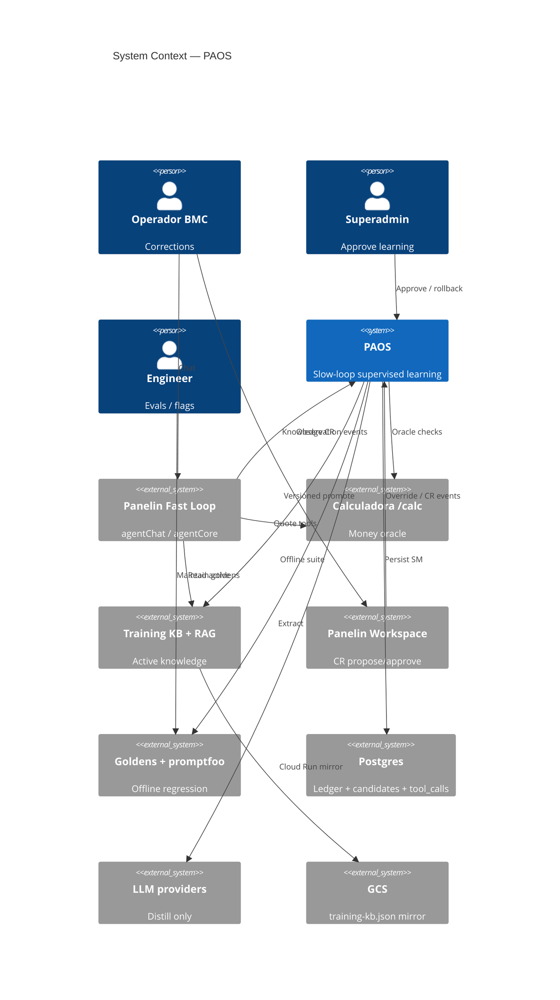
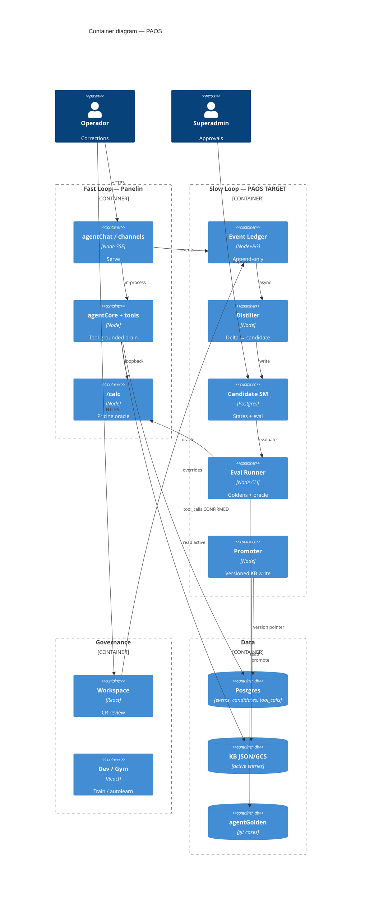
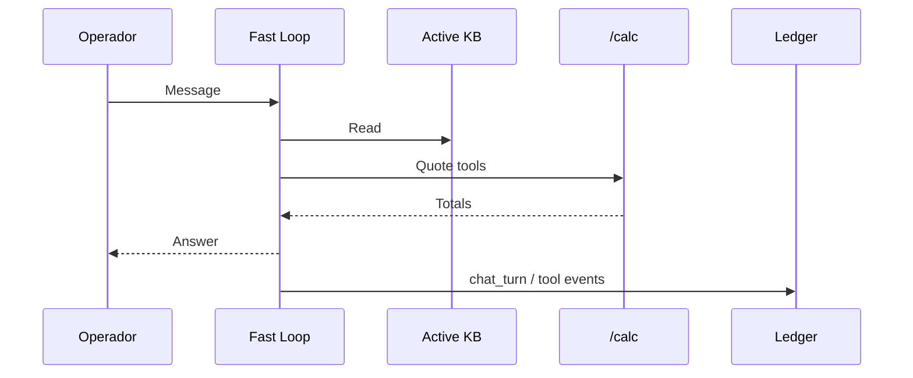
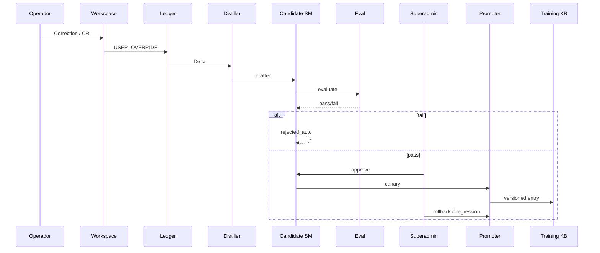
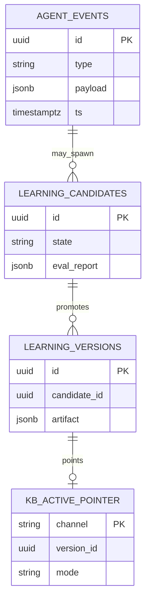
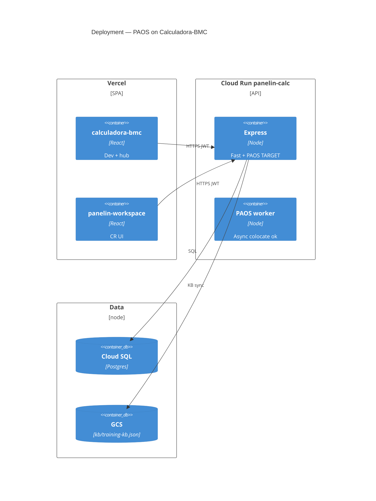

# System Design Document: PAOS

> **PAOS** = Panelin Adaptive Operational System — **supervised** operational learning layer.  
> Tags: **CONFIRMED** | **TARGET** | **INFERRED** | **UNKNOWN**.  
> Parent: [`../panelin-ai-agent-platform/SDD.md`](../panelin-ai-agent-platform/SDD.md).  
> Evidence: [`evidence/as-built-learning-surfaces.md`](evidence/as-built-learning-surfaces.md) · [`evidence/turn-session-telemetry.md`](evidence/turn-session-telemetry.md) · [`evidence/g2-runtime-as-built.md`](evidence/g2-runtime-as-built.md).  
> **Develop this Spec:** [`SDD-TARGET.md`](SDD-TARGET.md) · [`IMPLEMENTATION-GUIDE.md`](IMPLEMENTATION-GUIDE.md) · [`DEVELOPMENT-GLORY.md`](DEVELOPMENT-GLORY.md) · [`ARCHITECT-FINAL.md`](ARCHITECT-FINAL.md).  
> **Audit:** composite **98** PASS (`audit/SCORECARD.json`, re-scored 2026-07-24).

**Vocabulary:** “Self-evolving agent” is **not** a PAOS technical mode. Learning = **component evolution** (prompt, memory/RAG, skill schema, workflow) under HITL — never autonomous weight mutation.

### Development contract (G2 — binding)

| Rule | Requirement |
|------|-------------|
| Money | Only `/calc` engine; never invent prices in Learning Candidates |
| Loop | Fast Loop **read-only** for org rules; Slow Loop owns all learning writes |
| Promote | Eval fail-closed + superadmin HITL; no `drafted → active` |
| Workspace | With `PAOS_ENABLED=1`, knowledge CR must not silent-active permanent |
| Flags | Default `PAOS_*=0` preserves current prod behavior |
| Scope | IMP-PAOS-01→04→09 first; no fine-tune; no mandatory LangGraph |

## 1. Introduction & Goals

### 1.1 Problem Statement

Panelin serves multi-channel commercial AI for BMC Uruguay with Training KB, autolearn, Workspace CR approve, goldens, and partial telemetry. Missing is a **safe closed loop**: corrections → **Learning Candidates** → **oracle-backed offline eval** → **HITL** → **versioned promote** with **canary + rollback**, without unsafe money or global-knowledge mutation.

### 1.2 Goals

| ID | Goal | Priority | Status |
|----|------|----------|--------|
| G1 | Dual-loop Fast never mutates rules mid-turn | High | TARGET |
| G2 | Promotions versioned, evaluable, reversible | High | TARGET |
| G3 | Money-adjacent via `/calc` oracle + goldens | High | TARGET |
| G4 | Unified Event Ledger | High | TARGET (fragments CONFIRMED) |
| G5 | Learning Candidate SM + HITL | High | TARGET |
| G6 | Canary + 1-click rollback | Medium | TARGET |
| G7 | Reuse Training KB / goldens / Workspace | High | TARGET |
| G8 | Spec-driven G2 implementation | High | Accepted Spec |

### 1.3 Stakeholders

| Role | Team | Interest |
|------|------|----------|
| Operador | BMC | Better answers, safe prices |
| Superadmin | BMC | Approve/reject/rollback |
| Engineering | Panelin | Flags, SM, tests |
| Security | BMC | Privacy, audit |

## 2. Context & Scope (C4 Level 1)



### External interfaces

| Interface | Direction | Protocol | Auth | Description |
|-----------|-----------|----------|------|-------------|
| Fast Loop | ← events | in-process | service | Turn/tool signals |
| Workspace CR | ↔ | HTTPS | JWT superadmin | Knowledge approve CONFIRMED |
| Training KB routes | ↔ | HTTPS | Dev mode | CRUD/autolearn CONFIRMED |
| `/calc/*` | → | HTTP loopback | same process | Money oracle |
| Postgres | ↔ | SQL | DATABASE_URL | TARGET ledger; tool_calls CONFIRMED |
| Goldens | → | CLI | CI | `GOLDEN_REQUIRED=1` CONFIRMED |
| LLM extract | → | HTTPS | API keys | Autolearn |
| GCS | ↔ | HTTPS | ADC | KB mirror |

## 3. Constraints

- Stack: Node ESM, Express 5, React 18, Postgres monorepo.
- Money: calculator sole SoT (ADR-003). No PAOS fine-tune (ADR-001).
- HITL for org-wide active (ADR-004). Fast Loop `user_confirmed` unchanged.
- Secrets: Doppler/GSM names only.
- Privacy: redact PII; retention TARGET 90d ledger / 365d candidates; legal **UNKNOWN**.
- Flags TARGET: `PAOS_ENABLED`, `PAOS_PROMOTE`, `PAOS_CANARY_PCT`, `PAOS_LEDGER_RETENTION_DAYS` default safe/off.
- LangGraph optional pattern only (ADR-006).

## 4. Solution Strategy

- Transversal layer in modular monolith + Workspace UI.
- **Dual-loop (ADR-002):** Fast reads **active** knowledge only; Slow async observe → candidate → eval → HITL → canary → promote → rollback.
- Learning units: KB, prompts, skill notes, workflows — not weights.
- Eval: goldens + `/calc`; LLM judge soft-only.
- Persistence: owned Postgres + JSON/GCS KB (ADR-005).

## 5. Container View (C4 Level 2)



| Container | As-built | Target |
|-----------|----------|--------|
| Training KB | JSON/GCS + routes | + version pointer / canary |
| Autolearn | Extract + pending | Feed Candidate SM |
| Workspace CR | Direct active permanent | Promoter gate when PAOS on |
| Observation | chat_turn JSONL + tool_calls | Unified agent_events |
| Eval | CI goldens | On every promote path |

## 6. AI Architecture — Component View

| Component | Responsibility | Tech | Status |
|-----------|----------------|------|--------|
| Fast Loop brain | Serve; tools; read KB | agentCore / agentChat | CONFIRMED parent |
| Event emitter | Observation | `appendTrainingSessionEvent` + `recordToolCall` CONFIRMED → TARGET ledger | PARTIAL |
| Event Ledger | Append-only | Postgres | TARGET |
| Distiller | Candidate structure | autoLearnExtractor MIN_CONFIDENCE 0.70 CONFIRMED | PARTIAL |
| Candidate SM | States + reports | Postgres | TARGET |
| Eval Runner | Goldens + oracle | agentGolden, /calc | PARTIAL |
| Approval UI | HITL | Workspace + Dev pending | PARTIAL |
| Promoter | Versioned writes | trainingKB | PARTIAL (unsafe path CONFIRMED) |
| Canary / Rollback | Limited roll-out | flags + pointer | TARGET |
| LLM Gateway | Provider chain | parent | CONFIRMED — not money truth |

### LLM strategy
Weights static; distill via existing extract; judge soft-only; money `/calc` only.

### Memory
Episodic: session JSONL CONFIRMED. Semantic: Training KB. Procedural: prompts/goldens. Working: context window.

### Cost model (learning)
Autolearn LLM tokens capped by confidence 0.70 and max pairs; offline eval batched; Fast Loop cost telemetry parent-owned.

## 7. Data Flow

### 7.1 Fast Loop



### 7.2 Slow Loop promote (TARGET)



### 7.3 State machine (TARGET)

```text
detected → drafted → evaluating → pending_approval → canary → active → rolled_back | rejected
```

Illegal: `drafted → active` without eval+approve.

### 7.4 ERD (TARGET)



### 7.5 Admin API sketch (TARGET)

See [`openapi-paos-sketch.yaml`](openapi-paos-sketch.yaml). Paths: `/api/paos/candidates`, approve/reject, `/api/paos/versions/{id}/rollback`, `/api/paos/events`, `/api/paos/metrics`.

## 8. Deployment View



| Concern | Choice | Evidence |
|---------|--------|----------|
| API service | Cloud Run **panelin-calc** us-central1 project chatbot-bmc-live | CONFIRMED OPS / parent SDD |
| Prod API URL | `https://panelin-calc-q74zutv7dq-uc.a.run.app` | CONFIRMED parent SDD |
| Frontend | Vercel calculadora-bmc.vercel.app | CONFIRMED OPS |
| Colocation | Same Express as Fast Loop | TARGET |
| Flags | PAOS_* default 0/safe | TARGET |
| CI | pre-release GOLDEN_REQUIRED=1 | CONFIRMED package.json:106 |

## 9. Crosscutting Concepts

### 9.1 Security
Superadmin promote/rollback; eval fail-closed; no worker auto-activate org-wide; money-adjacent need oracle; PII redaction; retention TARGET 90/365d legal UNKNOWN.

### 9.2 Reliability
Ledger async non-blocking Fast Loop; eval timeout fail-closed; transactional promote.

### 9.3 Performance
Fast Loop unchanged; Slow batch; rate-limit distill.

### 9.4 Observability

| Concern | As-built CONFIRMED | Target |
|---------|-------------------|--------|
| Chat turns | `appendTrainingSessionEvent` chat_turn `agentChat.js:1524-1544` | ledger agent.turn |
| Session JSONL | `trainingKB.js:672-679` data/training-sessions/ | ingest |
| Tools | `recordToolCall` toolStats.js:91 agentTools.js:1410 | ledger agent.tool |
| Train mutations | agentTraining.js train_* events | kb.mutate |
| logAgentTurn.js | **ABSENT** — use table above | do not invent |

### 9.5 Canary SLOs (TARGET)
Golden regression >5% → rollback; override rate +20% vs 7d; any /calc hard fail; min 48h or 50 staff sessions before full.

### 9.6 Cost
Prefer programmatic delta; golden subset on canary; no GPU swarm.

## 10. Architecture Decisions (ADRs)

### ADR-001: No fine-tune in PAOS
**Status**: Accepted  
**Context**: Weight updates forget rules and lack 1-click rollback.  
**Decision**: Application artifacts only.  
**Consequences**: + Reversible. − No RLHF style auto-shift.  
**Alternatives**: Online DPO — rejected v1.

### ADR-002: Dual-loop Fast/Slow
**Status**: Accepted  
**Context**: Mid-turn rule mutation risks mid-quote inconsistency.  
**Decision**: Fast read-only for rules; Slow async learning writes.  
**Consequences**: + Safety. − Not same-turn learning.  
**Alternatives**: Mid-session prompt rewrite — rejected.

### ADR-003: Calc oracle + goldens
**Status**: Accepted  
**Context**: LLM self-judge unreliable for money.  
**Decision**: Money-adjacent need goldens and/or `/calc`; LLM judge never sole.  
**Consequences**: + Trust. − Eval work.  
**Alternatives**: LLM-only judge — rejected.

### ADR-004: HITL for org promote
**Status**: Accepted  
**Context**: Workspace approve writes `status: "active"`, `permanent: true` without eval — `workspace.js:551-558` CONFIRMED.  
**Decision**: Org-wide active requires human after eval; canary staff-only ok.  
**Consequences**: + Governance. − Review load.  
**Alternatives**: Auto-promote high confidence — rejected.

### ADR-005: Owned Postgres ledger/candidates
**Status**: Accepted  
**Context**: Need tombstone/version/audit; already Postgres + tool_calls.  
**Decision**: Own tables; no mandatory memory SaaS v1.  
**Consequences**: + Control. − Build cost.  
**Alternatives**: Letta/Zep SoT — deferred.

### ADR-006: LangGraph pattern not mandate
**Status**: Accepted  
**Context**: Durable multi-day HITL.  
**Decision**: Durable SM in Postgres; LangGraph.js optional.  
**Consequences**: + Avoid lock-in. − Careful SM tests.  
**Alternatives**: Mandate LangGraph — deferred.

## 11. Risks & Technical Debt

| Risk | Impact | Likelihood | Mitigation |
|------|--------|------------|------------|
| Direct active promote as-built | High | High | IMP-PAOS-04 |
| Distill invents prices | High | Medium | Oracle + autolearn rules |
| Fragmented observation | Medium | High | Event Ledger |
| Privacy over-capture | High | Medium | Redaction + retention |
| Spec wipe / empty slug | High | Observed | Structural test in test:core |
| Premature LangGraph | Medium | Medium | ADR-006 |

## 12. Glossary

| Term | Definition |
|------|------------|
| PAOS | Panelin Adaptive Operational System |
| Fast Loop | Live serve; reads active knowledge only |
| Slow Loop | Observe → candidate → eval → HITL → promote |
| Learning Candidate | Proposed artifact + eval + approval state |
| Event Ledger | Append-only observations |
| Calc oracle | Deterministic `/calc` for money |
| Canary | Limited audience new version |
| Component evolution | Prompt/memory/skill/workflow — not weights |
| Goldens | tests/agentGolden cases |
| HITL | Human-in-the-loop |

## Appendix A — Evidence Index
[`evidence/as-built-learning-surfaces.md`](evidence/as-built-learning-surfaces.md) · [`evidence/turn-session-telemetry.md`](evidence/turn-session-telemetry.md)

## Appendix B — Recreation Checklist
[`RECREATION-CHECKLIST.md`](RECREATION-CHECKLIST.md)
