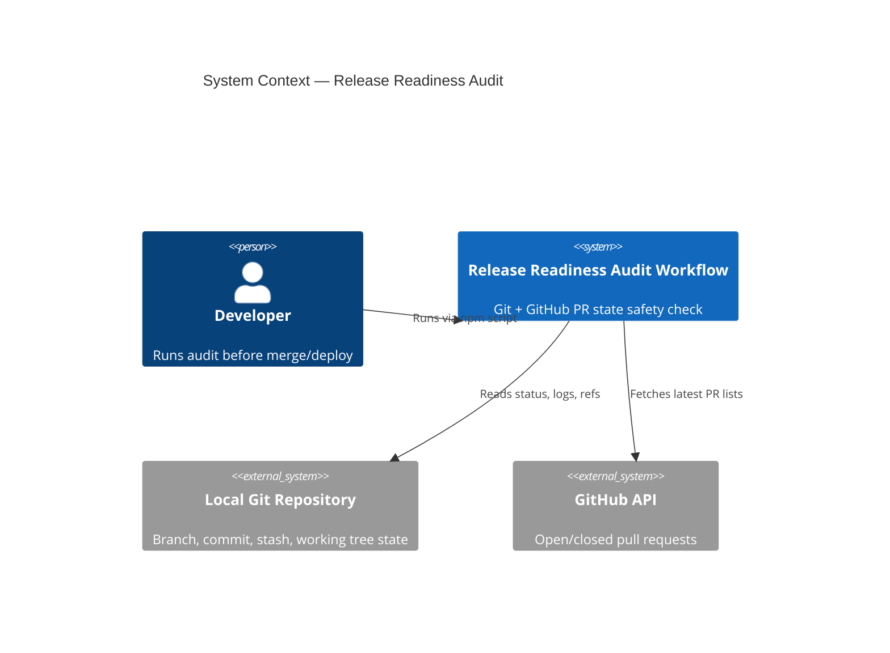
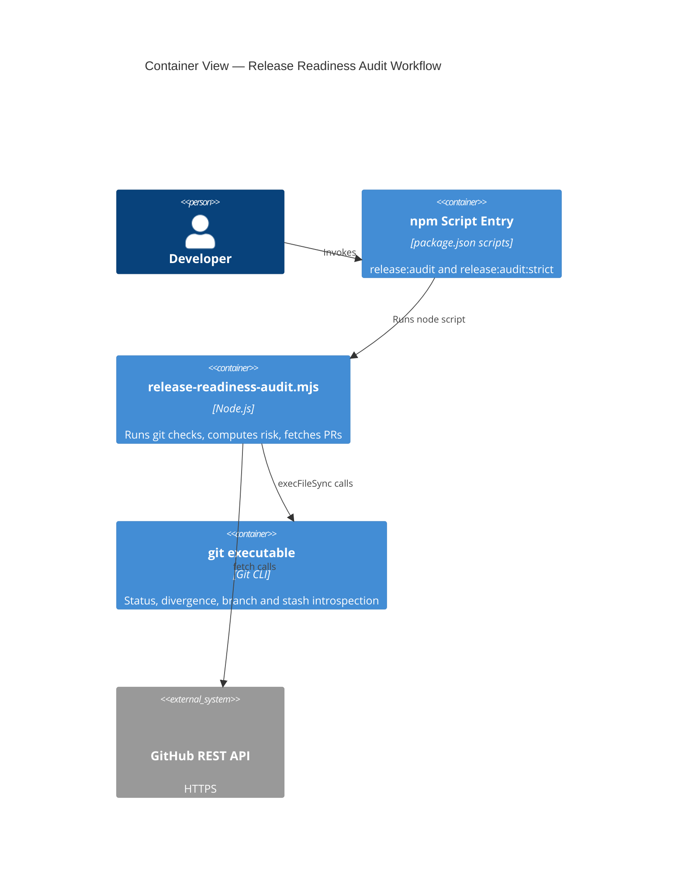
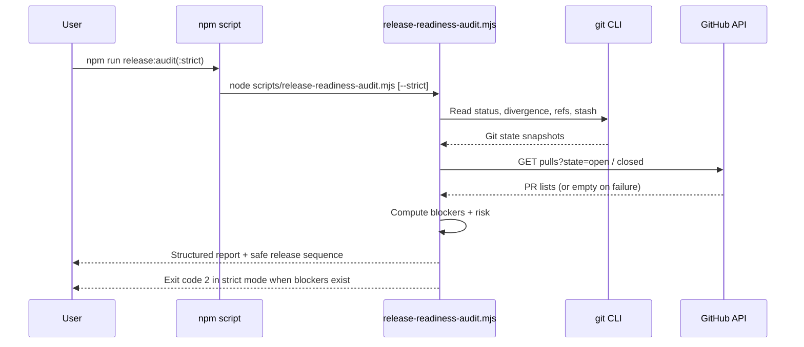

# System Design Document: Release Readiness Audit Workflow

**Evidence tags:** **[CONFIRMED]** implemented in repository today · **[INFERRED]** reasoned from existing behavior.

## 1. Introduction & Goals

### 1.1 Problem Statement

The repository has a high branch and stash volume, open pull requests in parallel, and frequent context switches **[CONFIRMED]** via audit output sections for branch divergence, unmerged branches, and stash entries in `scripts/release-readiness-audit.mjs` [L136-L143]. Releasing without a deterministic pre-merge audit can cause production downgrade, lost local work, or shipping from stale branch state **[INFERRED]**.

This workflow provides one command to expose release blockers: uncommitted files, `origin/main` divergence, unmerged branches, stash pressure, and latest open/closed PR state **[CONFIRMED]** (`scripts/release-readiness-audit.mjs` [L84-L180]).

### 1.2 Goals

- **G1 (P0):** Provide a single repeatable release audit command (`npm run release:audit`).
- **G2 (P0):** Provide strict mode for automation (`npm run release:audit:strict`) with non-zero gate exit on blockers.
- **G3 (P1):** Keep output human-readable and ordered by release risk.
- **G4 (P1):** Include remote PR visibility to avoid merging blind.

### 1.3 Stakeholders

| Role | Team | Interest |
|---|---|---|
| Maintainer | BMC core | Ship latest work safely without overwriting local state |
| Reviewer | BMC team | Validate branch and PR readiness before merge |
| Operator | Release/deploy | Detect blockers fast and prevent risky deploys |

## 2. Context & Scope

### External interfaces

| Interface | Direction | Protocol | Description |
|---|---|---|---|
| `npm run release:audit` | Inbound | npm CLI | Normal audit mode **[CONFIRMED]** `package.json` [L161] |
| `npm run release:audit:strict` | Inbound | npm CLI | Strict gate mode **[CONFIRMED]** `package.json` [L162] |
| `git` executable | Outbound | process exec | Reads branch/state metadata |
| `https://api.github.com/repos/:owner/:repo/pulls` | Outbound | HTTPS | Retrieves latest open/closed PRs **[CONFIRMED]** `fetchPullRequests()` [L40-L57] |

## 3. Constraints

- Must run with repo-local tooling (Node.js + git) and no additional package install **[CONFIRMED]**.
- Must never mutate git history or files; read-only inspection only **[CONFIRMED]** (only `rev-parse`, `fetch`, `status`, `log`, `branch`, `for-each-ref`, `rev-list`, `stash` are called) [L70-L107].
- Must tolerate temporary network errors for GitHub API (degrade with empty PR list) **[CONFIRMED]** (`fetchPullRequests` returns `[]` on non-OK and catches are reported) [L43-L47, L165-L170].
- Must support strict gating for CI-like checks **[CONFIRMED]** (`process.exitCode = 2` when strict + blockers) [L179-L181].

## 4. Solution Strategy

- **Architecture style:** single Node.js script orchestrating deterministic read-only probes.
- **Data sources:** local git plumbing commands + GitHub REST pulls endpoint.
- **Output strategy:** sectioned report with blockers first, then deep branch/PR context.
- **Trade-off:** online PR visibility is best-effort and can be unavailable offline; git safety checks remain primary.

## 5. Container View

## 6. AI Architecture — Component View

**N/A** — this workflow has no LLM, RAG, or agent runtime in its runtime path.  
It is a deterministic operational audit script based on git + HTTP calls **[CONFIRMED]** by implementation content in `scripts/release-readiness-audit.mjs`.

## 7. Data Flow

## 8. Deployment View

| Environment | Host | Runtime | Notes |
|---|---|---|---|
| Local development | macOS/Linux terminal | Node.js 24.x + git | Primary usage; command alias via npm scripts **[CONFIRMED]** |
| CI-like runner | GitHub Actions/self-hosted | Node.js + git + network | Use strict mode as gate (`exit code 2` on blockers) **[CONFIRMED]** [L179-L181] |
| Documentation runtime | Repo command registry | Markdown command | `/release-audit` command documents usage and strict semantics **[CONFIRMED]** `.claude/commands/release-audit.md` [L1-L20] |

No long-lived service is deployed; this is an executable workflow.

## 9. Crosscutting Concepts

### 9.1 Security
- No credentials are printed from env.
- Uses read-only git commands only.
- GitHub API access is unauthenticated in current version (rate-limit risk) **[CONFIRMED]** no auth headers in `fetch` call [L42-L47].

### 9.2 Reliability
- Local git checks are independent from network availability **[CONFIRMED]**.
- PR retrieval failures do not crash audit result **[CONFIRMED]** [L43-L47, L165-L170].
- Strict gate behavior is deterministic: blockers trigger `exitCode=2` **[CONFIRMED]** [L179-L181].

### 9.3 Performance
- Bounded output (`top 20/30`) keeps runtime short in large repos.
- Single fetch for open and closed PR lists.

### 9.4 Observability
- Output sections are explicit and stable for human parsing.
- Strict mode exit code is machine-consumable (`2` on blockers) **[CONFIRMED]** [L179-L181].
- Baseline outputs are persisted for this SDD at:
  - `docs/sdd/release-readiness-audit/evidence/release-audit-baseline.txt`
  - `docs/sdd/release-readiness-audit/evidence/release-audit-strict-baseline.txt`

### 9.5 Cost optimization
- No paid API dependencies.

### 9.6 Sustainability
- Minimal compute footprint; no persistent infrastructure.

## 10. Architecture Decisions

### ADR-001: Separate normal and strict execution paths
**Status:** Accepted  
**Context:** The same audit must support both manual inspection and automation gates.  
**Decision:** Keep one script with `--strict` flag and two npm aliases.  
**Consequences:**  
+ Easy adoption for developers and CI.  
- Requires users to understand strict semantics.
**Alternatives considered:**  
- Two separate scripts (`audit` and `audit-strict`) — rejected to avoid duplicated logic and drift.  
- Strict-by-default only — rejected because humans need non-gating exploratory runs.

### ADR-002: Keep audit read-only with no branch mutation
**Status:** Accepted  
**Context:** Release safety tooling must never risk destructive side effects.  
**Decision:** Use only status/log/ref inspection commands and never run write operations.  
**Consequences:**  
+ Zero mutation risk from audit execution.  
- Audit cannot auto-fix branch state.
**Alternatives considered:**  
- Auto-fix mode with optional stash/branch actions — rejected due to accidental data-loss risk.  
- Full read/write remediation wizard — rejected for now; out of scope for safety-first v1.

## 11. Risks & Technical Debt

| Risk | Impact | Likelihood | Mitigation |
|---|---|---|---|
| GitHub API unauthenticated rate limit | Medium | Medium | Add optional token-based auth headers |
| Very large branch sets increase runtime | Medium | Medium | Add optional `--max-branches` filter |
| Users bypass strict mode before deploy | High | Medium | Add strict mode to release checklists and CI gate |

## 12. Glossary

| Term | Meaning |
|---|---|
| Release audit | Pre-merge/deploy safety report for git/PR state |
| Strict mode | Audit mode that exits non-zero on blockers |
| Blocker | Condition that makes release unsafe (dirty tree, divergence, local-only main commits) |
| Divergence | Ahead/behind distance between current branch and `origin/main` |

## Appendix A — Evidence Index

| Claim | Evidence |
|---|---|
| strict mode exists and is wired in npm | `package.json` [L161-L162] |
| strict sets process exit code 2 on blockers | `scripts/release-readiness-audit.mjs` [L179-L181] |
| divergence is computed vs `origin/main...HEAD` | `scripts/release-readiness-audit.mjs` [L85, L125] |
| PRs are fetched from GitHub API | `scripts/release-readiness-audit.mjs` [L40-L57, L151-L164] |
| command-level usage documented | `.claude/commands/release-audit.md` [L1-L20] |
| baseline outputs captured for comparison | `docs/sdd/release-readiness-audit/evidence/release-audit-baseline.txt`, `docs/sdd/release-readiness-audit/evidence/release-audit-strict-baseline.txt` |

## Appendix B — Recreation Checklist Summary

See `docs/sdd/release-readiness-audit/RECREATION-CHECKLIST.md`.
