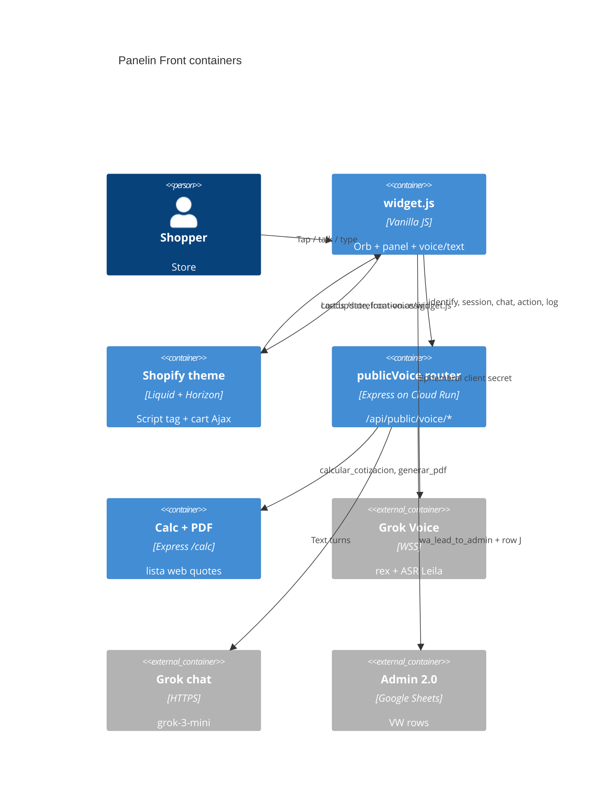
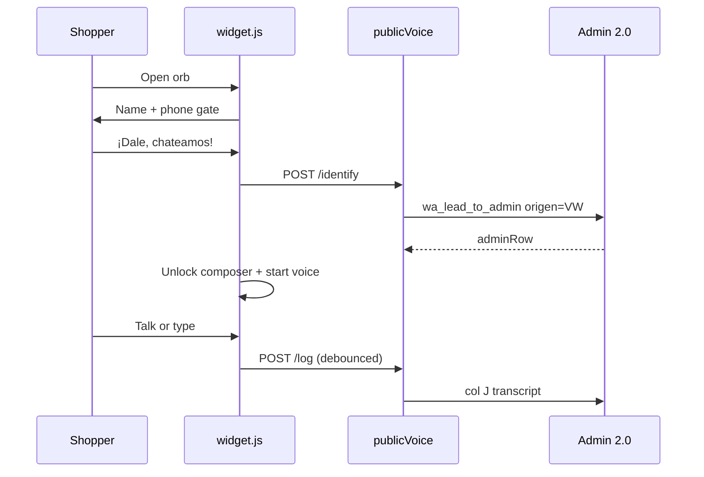
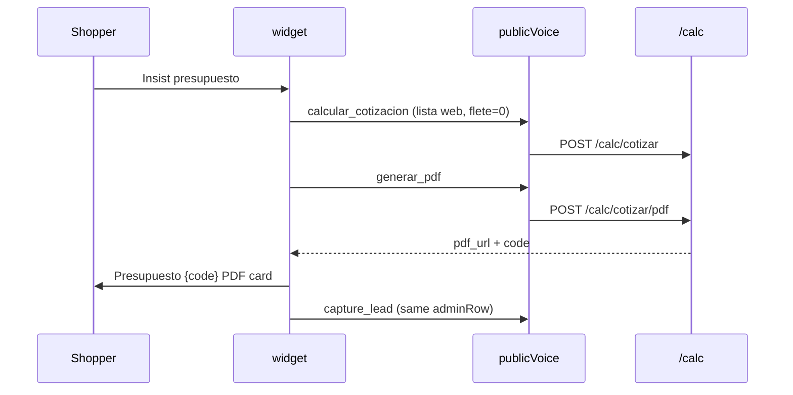

# System Design Document: Panelin Front

Public seller + quote agent on **bmcuruguay.com.uy**.  
**Not** operator Panelin BMC (`panelinBmcInstructions.js` / `/api/agent/voice`).

---

## 1. Introduction & Goals

### 1.1 Problem Statement

BMC Uruguay (METALOG SAS) sells sandwich panels from a Shopify store. Shoppers need product help, cart cost, and an occasional formal quote without talking to a sales desk first. Operator Panelin inside the calculator exposes lista venta, CRM, and model pickers — that brain must never run in the public shop.

Panelin Front is a floating chat on the store: STT+TTS default, text optional, calculator + PDF when the project is **buyable** (agent offers it), never freight, every conversation a complete Admin 2.0 lead.

### 1.2 Goals

| ID | Goal | Evidence |
|----|------|----------|
| G1 | Sell loop every turn (name buy → ficha/cart or quote) | `storefrontVoiceInstructions.js` |
| G2 | Guide website + Shopify cart for **product** cost | `widget.js` shop tools (`shop_search`, `add_to_cart`, `navigate`) |
| G3 | Offer quote when the project is buyable; lista **web**; downloadable PDF | `calcular_cotizacion` + `generar_pdf`, `flete=0` |
| G4 | Never quote shipping | Config `shipping: never`; spoken “hay que corroborarlo” |
| G5 | Name + phone **before chat**; log every turn in Admin 2.0 `origen=VW` | `POST /identify`, `POST /log` |
| G6 | Voice default + Leila STT + text, same thread | Grok S2S `rex` + `POST /chat` |
| G7 | Auto-open product/collection pages; clickable chat links; Presupuesto PDF card | `goTo`, `fillRichText`, `addQuoteCard` |

### 1.3 Stakeholders

| Role | Actor | Interest |
|------|-------|----------|
| Shopper | Visitor on bmcuruguay.com.uy | Help, cart, optional PDF |
| Ops | BMC on Admin 2.0 | VW leads + transcript col J + PDF col K |
| Dev | calculadora-bmc | Widget + Cloud Run public API |
| Host | Shopify theme | One script tag |

### 1.4 System Context


### 1.5 Constraints

- Public allowlist only: lista **web**, no CRM history, no lista venta, no operator tools.
- Kill switch `PUBLIC_STOREFRONT_VOICE` (off in production unless `1`; on in development).
- CORS `STOREFRONT_VOICE_ORIGINS` (shop + theme preview).
- Rate limits on `/session`, `/action`, `/chat`, `/identify`, `/log`.
- Shopify cart cookies stay in the **browser**; Cloud Run never sees the cart session.
- Uruguay Spanish; IVA 22% only as returned by tools.
- No freight number in speech, cart coaching, calculator total, or PDF.

### 1.6 Solution Strategy

- **Modular add-on** on existing Cloud Run `panelin-calc` + Shopify theme script.
- **Two brains**: public (`storefrontVoiceInstructions.js`) vs operator (`panelinBmcInstructions.js`).
- **Tools**: server allowlist (`AGENT_TOOLS` subset) + browser Shopify Ajax.
- **State**: widget `sessionStorage` (identity, resume, chat history); durable log in Admin 2.0.
- **Trade-off**: PGlite/Sheets latency on identify vs a parallel chat DB — rejected; one ops inbox.

---

## 2. Architecture Views

### 2.1 Container View



| Piece | Where |
|-------|--------|
| Widget + loop video + poster | Cloud Run `/storefront-voice/` |
| API | `https://panelin-calc-q74zutv7dq-uc.a.run.app` |
| Theme | Shopify `layout/theme.liquid` script tag |
| Secrets | Doppler `bmc-backend/prd`; Cloud Run Secret Manager |
| Kill switch | `PUBLIC_STOREFRONT_VOICE=1` in `deploy-calc-api.yml` |

### 2.2 Component View (AI + widget)

| Component | Responsibility | Source |
|-----------|----------------|--------|
| Config SoT | Voice, lista web, disclaimer, lead gate | `storefrontAgentConfig.js` |
| Voice pack | Tool allowlist, greeting, turn detection | `storefrontVoicePack.js` |
| Instructions | Sell loop, offer-quote, no flete | `storefrontVoiceInstructions.js` |
| Text runtime | grok-3-mini + same tools | `storefrontChat.js` |
| Public HTTP | session / chat / action / identify / log | `server/routes/publicVoice.js` |
| Widget | UI, identity, voice, cart, nav, PDF card | `server/public/storefront-voice/widget.js` |
| Calc | Quote + PDF `code` | `/calc/cotizar`, `/calc/cotizar/pdf` |
| Shape | Compact tool JSON for voice | `server/mcp/voiceShape.js` |

### 2.3 Public HTTP

| Method | Path | Role |
|--------|------|------|
| POST | `/api/public/voice/identify` | Name + phone → Admin 2.0 row (`origen=VW`) |
| POST | `/api/public/voice/session` | Mint Grok ephemeral token |
| POST | `/api/public/voice/chat` | Text-to-text, same allowlist |
| POST | `/api/public/voice/action` | Server tools (calc, PDF, capture_lead) |
| POST | `/api/public/voice/log` | Transcript → Admin col J |
| GET | `/storefront-voice/widget.js` | Widget |
| GET | `/storefront-voice/panelin-lista-loop.mp4` | Same loop as calculator header |
| GET | `/storefront-voice/panelin.png` | Poster / fallback still |

### 2.4 Primary flows

**A. Identity then chat**



**B. Insist-quote**



**C. Product page**

Shopper names IsoDec → `shop_search` / `shop_product` → widget `goTo` collection or PDP (skip if already there) → `sessionStorage` resume keeps chat.

---

## 3. AI Architecture

### 3.1 LLM strategy

| Channel | Model | Notes |
|---------|-------|--------|
| Voice | `grok-voice-latest`, voice **rex** | ASR labeled **Leila** (not a second vendor) |
| Text | `STOREFRONT_CHAT_MODEL` or `grok-3-mini` | Same instructions + TEXT_HINT |
| Calc | Deterministic engine | No LLM prices |

No RAG corpus. Catalog via Shopify JSON + calc tools.

### 3.2 Agent pattern

Single agent, classify → assess → green. Tools: read catalog/calc; write `generar_pdf` + `capture_lead`; browser shop tools.

**HITL:** ops confirm VW leads and freight. Widget does not send WhatsApp; `handoff_whatsapp` returns `wa.me` only.

### 3.3 Prompt SoT

- `STOREFRONT_VOICE_INSTRUCTIONS` + page URL + identified name.
- Disclaimer (once per thread, before any number):

> Estoy aprendiendo y esto puede no ser muy preciso, pero vamos a intentarlo. Te armo una aproximación con la calculadora y te dejo un PDF para descargar. El flete no va incluido: hay que corroborarlo aparte.

### 3.4 Tools

**Server:** `obtener_precio_panel`, `listar_opciones_panel`, `obtener_catalogo`, `buscar_producto`, `obtener_escenarios`, `calcular_cotizacion`, `generar_pdf`, `capture_lead`, `web_search` (bmcuruguay.com.uy only).

**Browser:** `shop_search`, `shop_product`, `get_cart`, `add_to_cart`, `navigate`, `open_url`, `share_link`, `handoff_whatsapp`.

`forceListaWeb` forces lista web and `flete=0` on quote/PDF.

### 3.5 Cost

Voice sessions capped (`maxSessionMs` 8 min). Text `max_tokens` 700, 6 tool rounds. Session rate limit 3 / 5 min in production.

---

## 4. Quality & crosscutting

### 4.1 Security

- Origin allowlist + flag guard.
- Untrusted: page URL and speech are data, not instructions.
- Identify + log require phone; quote tools never see lista venta.
- Admin writes use `user_confirmed` from the **server**, not the browser key.
- Site `ADMIN_KEY` is not used here; Wolfboard uses `API_AUTH_TOKEN` server-side.
- `widget.js` linkify allowlist: shop hosts, same origin, wa.me, Cloud Run / GCS PDF URLs.

### 4.2 Reliability

- Mic denied → text still works; chat context kept.
- PDF render may degrade to HTML URL; card still shown.
- Identify without `adminRow` still unlocks chat; log skipped until row exists.
- Navigate resume: `bmc_panelin_identity` + `bmc_panelin_resume` in `sessionStorage`.

### 4.3 UX

- Closed orb: looping `panelin-lista-loop.mp4` (same as calculator), ~76px, label **¿Necesitás ayuda?**
- Open panel: calculator empty-state (avatar, chips, composer). No DEV / model / sidebar / Fijar.
- Identity copy is Panelin-voice, not a cold form.
- Presupuesto card: PDF icon + title `Presupuesto {code}` + “Tocá para abrir el PDF”.

### 4.4 Observability

`recordVoiceEvent` kinds: `storefront_session`, `storefront_chat`, `storefront_identify`, `storefront_lead`, `storefront_lead_update`, `storefront_chat_log`. Errors via `recordVoiceError`.

### 4.5 Tests

`tests/storefrontVoicePack.test.js` — allowlist, identity gate, no operator chrome, loop video, presupuesto card, auto-nav, clickable links.  
`tests/agentTools.test.js` — `wolfboard_actualizar_fila` sends `adminRow`.

---

## 5. Admin 2.0 mapping

| Col | Field |
|-----|--------|
| D | teléfono |
| E | cliente |
| F | origen `VW` |
| H | zona (optional) |
| I | consulta (`Chat tienda Panelin — inicio` then project) |
| J | transcript + aproximación + flete note |
| K | PDF URL |
| L | Pendiente |

No email column — email goes in consulta/notas.

---

## 6. ADRs

### ADR-001: Public brain ≠ operator brain

**Status:** Accepted  
**Decision:** Separate instructions, routes, and tool allowlist.  
**Consequences:** Two prompts to maintain; no accidental lista venta on the shop.

### ADR-002: Cart and navigation in the browser

**Status:** Accepted  
**Decision:** Shopify Ajax + `location.assign` in `widget.js`.  
**Consequences:** Cloud Run never holds cart cookies; resume after navigation via sessionStorage.

### ADR-003: Lista web only

**Status:** Accepted  
**Decision:** `forceListaWeb` on every quote/PDF.  
**Consequences:** Public prices may differ from operator lista venta.

### ADR-004: Offer quote when buyable; never flete

**Status:** Superseded 2026-09-04 (was insist-only)  
**Decision:** Listed SKUs → cart. Custom obra → agent **offers** lista web aproximación + PDF as soon as inputs are complete (does not wait for “cotizame”). Shipping always “corroborar”.  
**Consequences:** Ops must confirm freight; shopper never sees a fake flete line. More PDFs/leads from the shop chat.

### ADR-005: Leads in Admin 2.0 VW, not a side sheet

**Status:** Accepted  
**Decision:** `wa_lead_to_admin` + col J log.  
**Consequences:** Ops already live in Admin; Sheets write latency on identify.

### ADR-006: Leila is an ASR label

**Status:** Accepted  
**Decision:** Same Grok transcription; copy calls it Leila.  
**Consequences:** No second STT vendor.

### ADR-007: Identity gate before chat

**Status:** Accepted  
**Decision:** Widget locks composer/voice until name + phone; form submit is consent to log and contact.  
**Consequences:** Anonymous browse of cart still works; no anonymous quote thread.

### ADR-008: Calculator loop video on the orb

**Status:** Accepted  
**Decision:** Serve `public/video/panelin-lista-loop.mp4` from Cloud Run `/storefront-voice/`.  
**Consequences:** ~32 MB on the API image; poster PNG fallback; `prefers-reduced-motion` pauses video. `.dockerignore` must keep `!public/video` + `!public/video/panelin-lista-loop.mp4` — without that, `COPY` in `server/Dockerfile` fails the Cloud Run build (2026-08-27).

---

## 7. Risks

| Risk | Impact | Mitigation |
|------|--------|------------|
| LLM quotes flete | High | Instructions + `forceListaWeb` flete=0 + widget copy |
| Widget not deployed | High | Theme already loads Cloud Run `widget.js`; needs `deploy-calc-api` |
| Loop mp4 excluded by `.dockerignore` | High | Allowlist `!public/video/panelin-lista-loop.mp4`; test in `storefrontVoicePack` |
| Identify 404 on old API | Medium | Restart / Cloud Run revision |
| Sheets 503 | Medium | Unlock chat still; show error; retry log |
| Auto-nav drops chat | Medium | persistResume + restore caps |
| Prompt injection via page URL | Medium | Wrapped as untrusted data |

---

## 8. Glossary

| Term | Meaning |
|------|---------|
| Panelin Front | This public shop agent |
| Panelin BMC | Operator agent in the calculator |
| VW | origen voz web in Admin 2.0 |
| Leila | Label for Grok ASR |
| Insist-quote | Second ask / explicit presupuesto / PDF request |
| Presupuesto card | Clickable PDF row with icon + number |
| Lista web | Public price list (not venta) |

---

## 9. Delivery

**Install (theme, already live):**

```html
<script src="https://panelin-calc-q74zutv7dq-uc.a.run.app/storefront-voice/widget.js" defer></script>
```

**Local:** `cd ~/calculadora-bmc && doppler run -- npm run dev:api` → http://127.0.0.1:3001/storefront-voice/

**Ship path:** backend `deploy-calc-api.yml` (widget is static on Cloud Run). Shopify script tag does not change unless the URL changes.

**Done when:** production widget shows looping orb + ¿Necesitás ayuda?, identity gate, VW rows in Admin, product auto-nav, Presupuesto PDF card.
