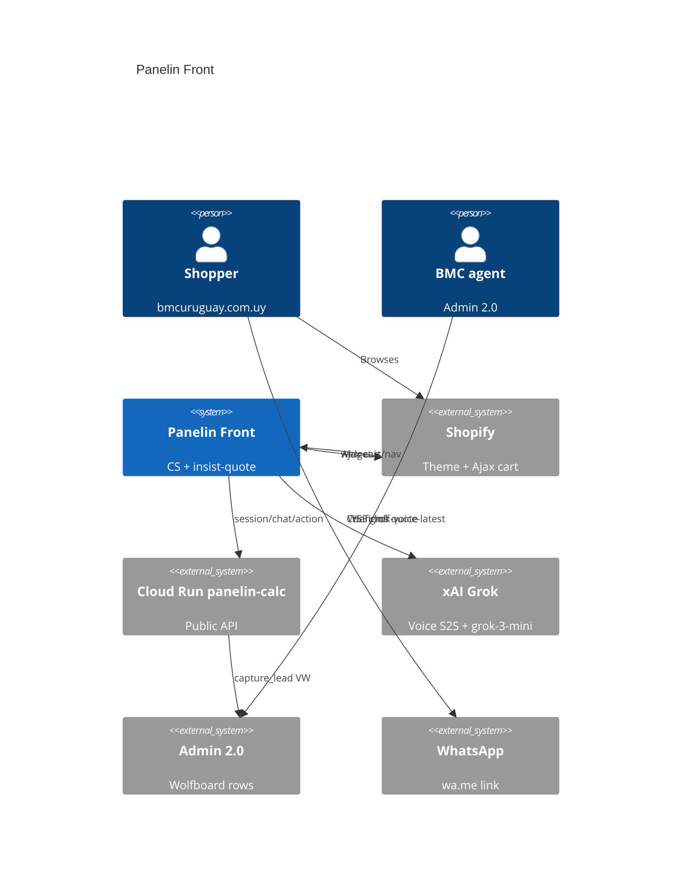

# SDD: Panelin Front

Public customer-support agent on **bmcuruguay.com.uy**. Not operator Panelin BMC (`panelinBmcInstructions.js` / `/api/agent/voice`).

## 1. Goals

1. Classify → assess → green every turn.
2. Website + cart for product cost. Quote **only if they insist**.
3. Internal calculator (`calcular_cotizacion`) lista **web** + downloadable PDF (`generar_pdf`).
4. Never quote shipping.
5. Greened quote ends as a complete Admin 2.0 lead (`origen=VW`).

## 2. Context

## 3. Hosting

| Piece | Where |
|---|---|
| Widget + avatar | Cloud Run `/storefront-voice/` |
| API | `https://panelin-calc-q74zutv7dq-uc.a.run.app` |
| Theme | Shopify live `layout/theme.liquid` |
| Secrets | Doppler `bmc-backend/prd` |
| Kill switch | `PUBLIC_STOREFRONT_VOICE=1` in `deploy-calc-api.yml` |

## 4. Connectors

| Connector | Tool / protocol |
|---|---|
| Voice | Grok `rex`, ASR branded **Leila** in copy (same Grok transcription) |
| Text | `POST /api/public/voice/chat` (`STOREFRONT_CHAT_MODEL` or grok-3-mini) |
| Calculator | `calcular_cotizacion` lista web, `flete=0` |
| PDF | `generar_pdf` lista web, `flete=0` |
| Cart | Shopify Ajax in `widget.js` |
| Admin 2.0 | `capture_lead` → `wa_lead_to_admin` → `row-create` |
| WhatsApp | `handoff_whatsapp` link only |

Admin columns: D teléfono, E cliente, F origen=`VW`, H zona, I consulta, J notas (aproximación + flete no cotizado), K PDF URL, L Pendiente. No email column — email goes in consulta/notas.

## 5. Config SoT

`server/lib/voice/storefrontAgentConfig.js` — voice, intake order, insist-only quote, disclaimer, `shipping: never`.

Env: `PUBLIC_STOREFRONT_VOICE`, `STOREFRONT_VOICE_ORIGINS`, `STOREFRONT_WA_NUMBER`, `STOREFRONT_CHAT_MODEL`.

## 6. ADRs

1. Public brain ≠ operator brain.
2. Cart/nav in the browser (Shopify cookies).
3. Lista web only.
4. Quote insist-only; PDF allowed; never flete.
5. Leads → Admin 2.0 VW, not a parallel sheet.
6. Leila is the STT *label* for this channel’s Grok ASR, not a second vendor.

## 7. Quote disclaimer

> Estoy aprendiendo y esto puede no ser muy preciso, pero vamos a intentarlo. Te armo una aproximación con la calculadora y te dejo un PDF para descargar. El flete no va incluido: hay que corroborarlo aparte.
