# Calculadora BMC — Architecture

Living document. Source of truth for the system shape — actual flows in production today, and (per-flow) the wanted/target version where it differs.

Last inventory sync: 2026-05-13 — derived from 24 server routes, ~55 lib modules, 19 external services, 28 distinct end-to-end flows.

Sibling docs: [`PROJECT-STATE.md`](./PROJECT-STATE.md) (live state, recent changes), [`AGENTS.md`](../../AGENTS.md) (operational catalogue), [`docs/PRICING-ENGINE.md`](../PRICING-ENGINE.md) (pricing model deep-dive).

---

## 1. System Context (C4 Level 1)

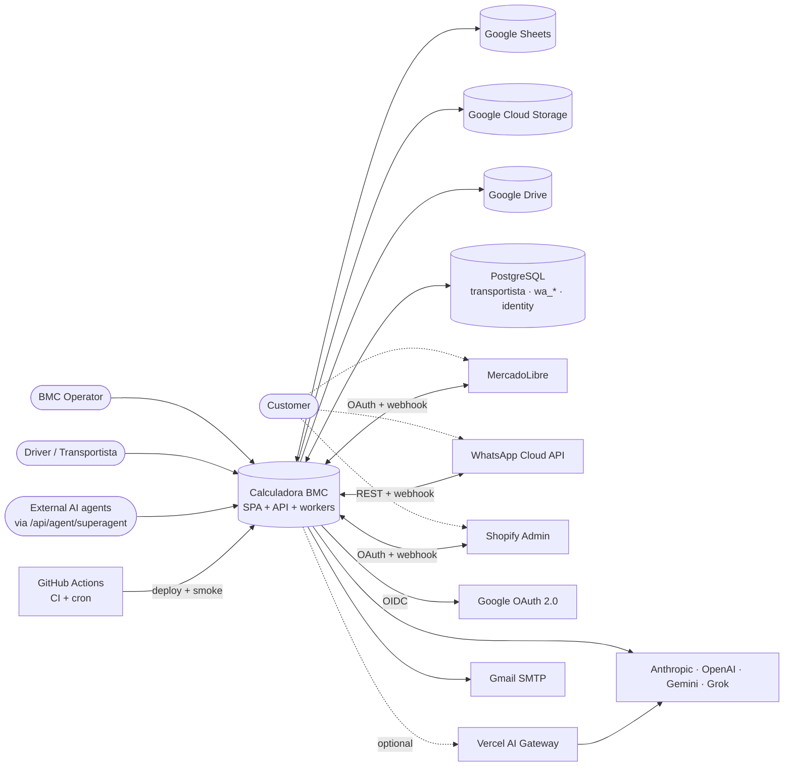

### Actors

| Actor | How they enter | Surfaces touched |
|---|---|---|
| **BMC Operator** | Browser → SPA | `/calculadora`, `/hub/*`, `/inspector`, `/fichas`, `/mi-espacio` |
| **Customer** | WA / ML / Shopify (never opens our SPA directly) | inbound via webhooks |
| **Driver** | PWA token link | `/conductor` |
| **External AI agents** | HTTP POST | `/api/agent/superagent`, `/api/internal/panelin/*` |

### External systems

| Service | Role | Auth | Direction | Critical |
|---|---|---|---|---|
| Google Sheets | CRM, Matriz, Wolfboard, Stock, Ventas | service-account JSON | outbound | Yes |
| Google Cloud Storage | quote PDFs, KB JSON, encrypted ML tokens | service-account / workload identity | outbound | Yes (prod) |
| Google Drive | quote HTML archives | service-account JSON | outbound | Optional |
| PostgreSQL | `transportista`, `wa_*`, `identity` schemas, optional `pgvector` | `DATABASE_URL` | outbound | Per-module |
| MercadoLibre | Q&A, listings, orders, auto-answer | OAuth2 PKCE | both (webhooks in / API out) | Optional |
| WhatsApp Cloud API | inbound/outbound messaging, delivery status | bearer token | both | Optional |
| Shopify Admin | questions, products, draft orders | OAuth2 + HMAC | both | Optional |
| Anthropic Claude | primary chat / parse / suggestion | bearer | outbound | Yes (default) |
| OpenAI | fallback + voice (Realtime) + Whisper | bearer | outbound | Fallback |
| Google Gemini | tertiary fallback | bearer | outbound | Optional |
| xAI Grok | tertiary fallback | bearer | outbound | Optional |
| Vercel AI Gateway | unified provider routing | OIDC or API key | outbound | Optional (rolling out) |
| Gmail SMTP | daily digest + WA magic-link | app password | outbound | Optional |
| Google OAuth 2.0 | identity (comprador phase) | OAuth2 | outbound | Optional |
| GitHub Actions | CI, deploys, scheduled smoke + antenna | — | both | Yes |

---

## 2. Containers (C4 Level 2)

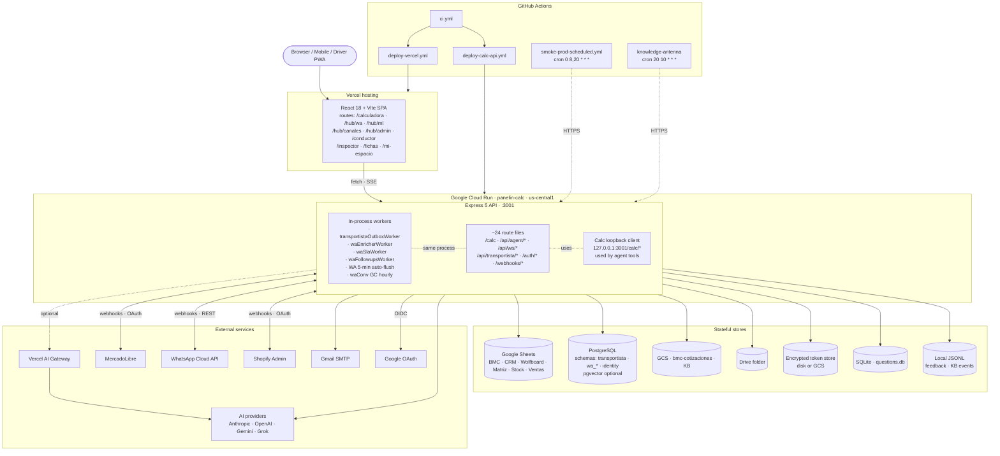

### Background workers (all in-process inside the Cloud Run container)

| Worker | File | Schedule | What it does |
|---|---|---|---|
| `transportistaOutboxWorker` | `server/lib/transportistaOutboxWorker.js` | `setInterval` | Claims up to 20 outbox rows via `SELECT … FOR UPDATE SKIP LOCKED`, sends WA, exponential backoff (max 12 attempts → `failed`) |
| `waEnricherWorker` | `server/lib/waEnricherWorker.js` | self-scheduling `setTimeout` | Classifies intent, generates LLM suggestions, UPSERTs `wa_suggestions`. Governed by `enricher.enabled` flag |
| `waSlaWorker` | `server/lib/waSlaWorker.js` | `setInterval` | Flags conversations exceeding business-hours response SLA → `wa_sla_breaches` |
| `waFollowupsWorker` | `server/lib/waFollowupsWorker.js` | `setInterval` | Auto follow-up scheduling against `wa_messages` |
| WA conversations GC | `server/index.js:573` | `setInterval` 1h | Drops in-memory `waConversations` entries older than 24h |
| WA 5-min auto-flush | `server/index.js:741` | `setInterval` 60s | Flushes inactive WA conversations to CRM via AI parse + autolearn pipeline |

No `node-cron`, no BullMQ. All workers stop on SIGTERM.

---

## 3. CI / Deploy / cron

| Workflow | Trigger | What it does |
|---|---|---|
| `ci.yml` | push/PR to main, develop | validate (`tests/validation.js`) + lint + build + channels_pipeline + voice_health + knowledge_antenna (reusable) |
| `deploy-vercel.yml` | `workflow_run` after green CI / PR / dispatch | Vite build → Vercel (preview per PR, prod after main) |
| `deploy-calc-api.yml` | `workflow_run` after green CI / dispatch | Cloud Run deploy with Secret Manager env mounting |
| `smoke-prod-scheduled.yml` | cron `0 8,20 * * *` + dispatch | twice-daily prod smoke via `smoke-prod-api.mjs` |
| `knowledge-antenna-scheduled.yml` | cron `20 10 * * *` + dispatch | daily antenna corpus refresh |
| `knowledge-antenna-reusable.yml` | `workflow_call` | reusable antenna job invoked by both CI and scheduled |
| `drive-oauth-verify.yml` | dispatch only | validate `VITE_GOOGLE_CLIENT_ID` format |
| `drive-oauth-dist-verify.yml` | dispatch only | confirm Vite baked Google Client ID into `dist/` |

---

## 4. Per-flow sequences

Each flow has an **Actual** sequence (what the code does today) and, where relevant, a **Wanted** sequence (what it should do). Diagrams below are paper-derived from a code-verified trace (file:line refs in step notes). Real DevTools + server-log traces can be layered on top once dev stack is running.

- [4.1 Quote creation (UI → calc → PDF)](#41-quote-creation--ui--calc--pdf) — critical
- [4.2 Agent chat (SSE → tools → calc loopback)](#42-agent-chat--sse--tools--calc-loopback) — critical
- [4.3 WA inbound → 5-min flush → CRM / autolearn](#43-wa-inbound--5min-flush--crm--autolearn) — critical
- [4.4 ML webhook → CRM sync → auto-answer](#44-ml-webhook--crm-sync--auto-answer) — critical

The **wanted** version per flow is added only where the target differs from actual.

### 4.1 Quote creation — UI → calc → PDF

**Actual.** Operator clicks "PDF Cliente" → SPA builds memoized print-ready HTML → POST `/api/pdf/generate` → server-side Playwright/Chromium renders vectorial A4 → returns PDF buffer → SPA triggers download. If the server endpoint fails, `pdfGenerator.js` transparently falls back to client-side `html2pdf.js` (raster, hidden iframe). No external services touched on this path — Chromium is bundled via `@sparticuz/chromium`.

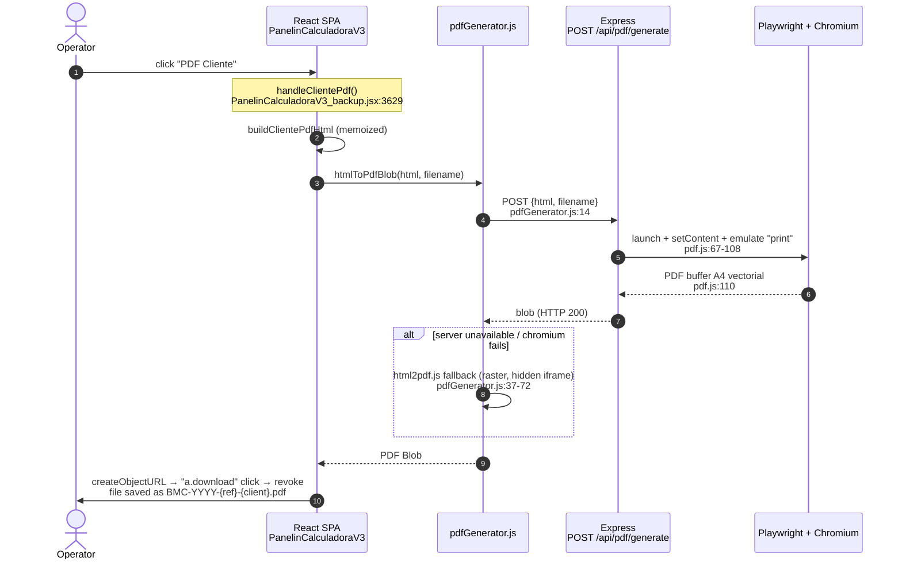

**Wanted.** Server-only PDF (no client fallback). SSE progress events (`received` → `rendering` → `uploaded` → `ready`). Upload to GCS, return signed URL. Auto-persist quote to CRM (`Master_Cotizaciones`) and quote registry. Per-PDF audit log row in Postgres with content hash.

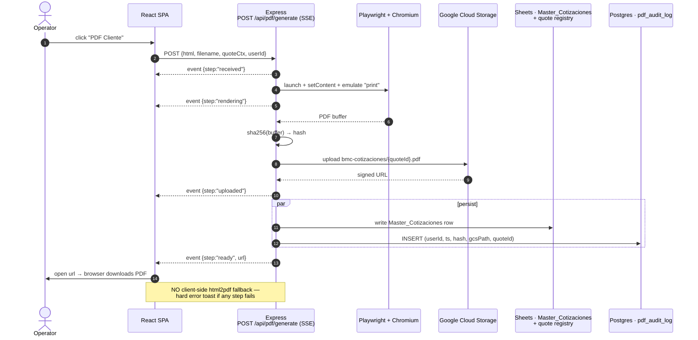

### 4.2 Agent chat — SSE → tools → calc loopback

**Actual.** Operator sends a message via `useChat` → `POST /api/agent/chat` opens an SSE stream → server runs rate-limit/auth/budget, retrieves KB examples and (optionally) RAG context via pgvector, builds the system prompt and compacts history → chooses a provider (Claude default; fallback grok → gemini → openai) → LLM streams text and may emit a `tool_use` block → `executeTool` calls calc via loopback `127.0.0.1:3001/calc/cotizar` (same endpoint the UI uses, ensures one source of truth) → result is fed back as a user message → LLM continues until done. Post-stream the server fires conversation log + autolearn extract (fire-and-forget, ≥4-turn sessions in prod).

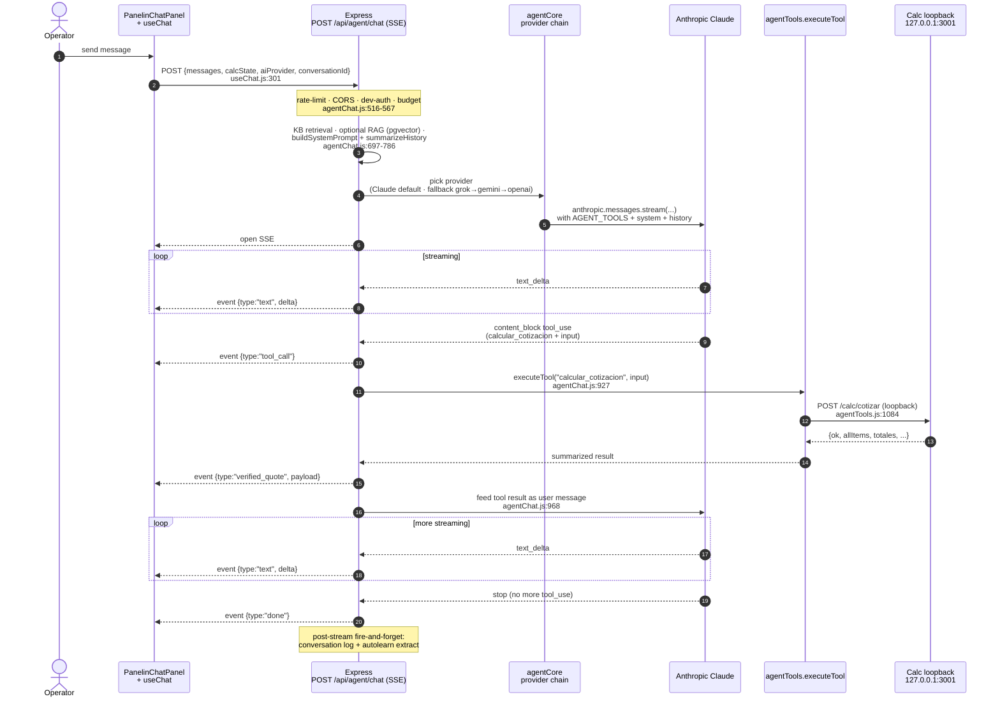

**Wanted.** Vercel AI Gateway is the primary path (4-SDK chain becomes fallback only). Conversation history durable in Postgres (`conv_turns`, `conv_checkpoints`). Auto-summary checkpoint every N turns. Structured tool-use telemetry (`tool_telemetry`) per call: tool name, args hash, latency, outcome.

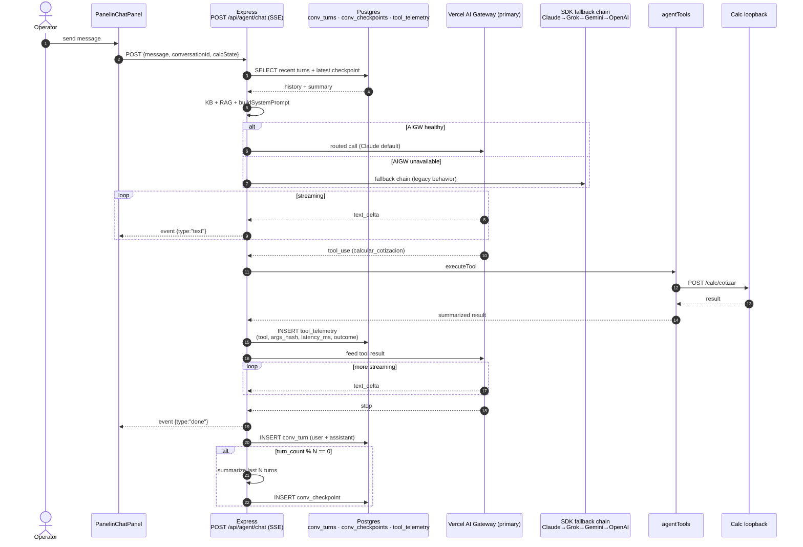

### 4.3 WA inbound → 5-min flush → CRM / autolearn

**Actual.** Two intertwined paths sharing state — the in-memory `waConversations` Map and Postgres `wa_messages` / `wa_conversations` tables. The webhook handler is idempotent (`ON CONFLICT msg_id DO NOTHING`) and responds 200 *before* processing (Meta requires <20s). Every 60s a ticker scans for conversations idle ≥5 min and fires `processWaConversation` once (fire-and-forget). Both the AI parse (CRM extraction) and the autolearn extractor run as separate fire-and-forget chains off the critical path. HMAC verification is configurable; if `WHATSAPP_APP_SECRET` is unset, it's skipped with a warn (except in `appEnv==="test"`).

#### (a) Inbound webhook

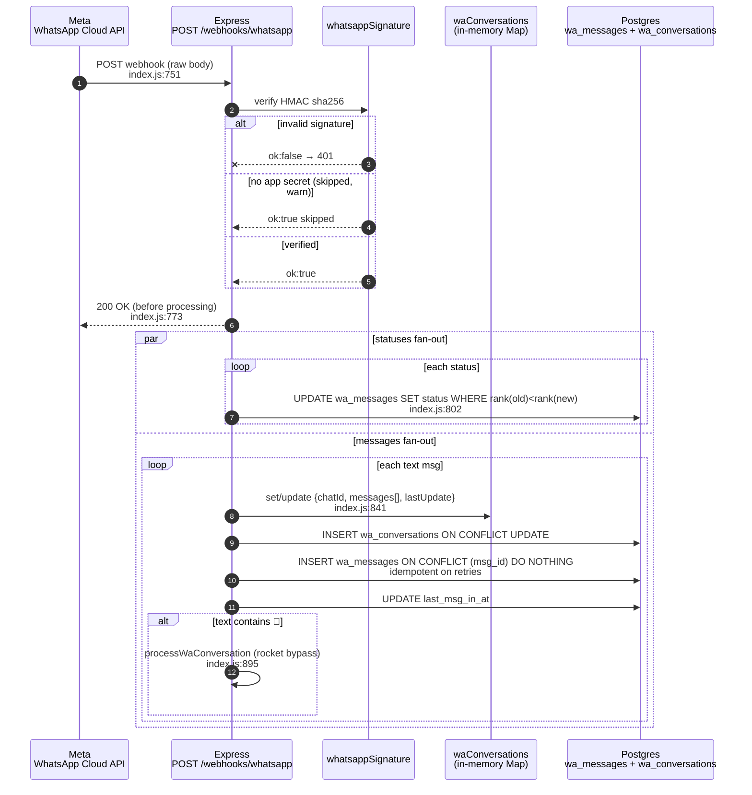

#### (b) 5-min inactivity flush → CRM + autolearn

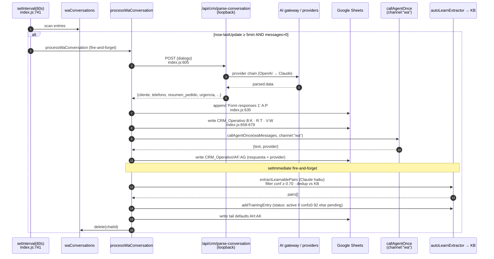

**Wanted.** HMAC mandatory in prod (no skip-with-warn). Inactivity window configurable via `WA_INACTIVITY_MS` (default 180_000 = 3 min). The flush becomes an outbox-based pipeline: ticker enqueues to `wa_outbox_crm` instead of fire-and-forget; `waCrmOutboxWorker` claims rows with `FOR UPDATE SKIP LOCKED`, runs parse+CRM+AI+autolearn, deletes on success, retries with exponential backoff on failure. AI suggestion also written into `wa_messages` (`direction='out_suggested'`) so cockpit shows the full conversation.

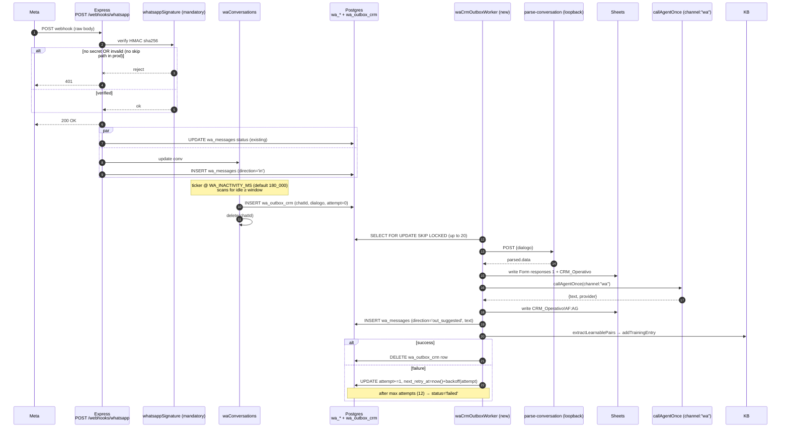

### 4.4 ML webhook → CRM sync → auto-answer

**Actual.** ML POSTs `/webhooks/ml` → **two security layers**: (1) HMAC signature verify via `verifyMLSignature` (`server/lib/mlSignature.js`) with 5-min replay window — skip-with-warn if `ML_CLIENT_SECRET` unset (shipped in PR #106 / commit `9685ef5`); (2) optional `WEBHOOK_VERIFY_TOKEN` defence-in-depth. Event recorded to a 250-entry ring buffer → server responds 200 immediately → fire-and-forget `syncUnansweredQuestions` pulls UNANSWERED questions from ML, enriches with nickname + item title/price, dedupes by Q-id against existing Sheet rows, then writes new rows to `CRM_Operativo` (cols B–AK including a templated suggestion in AF). If `autoMode.fullAuto === true` (`server/.ml-automode.json`), `autoAnswerPipeline` generates an AI answer per row via `callAgentOnce(channel:"ml")` (max 350 chars, no markdown, "Saludos BMC!" closer), POSTs it to ML `/answers`, and stamps `enviadoEl` in AJ.

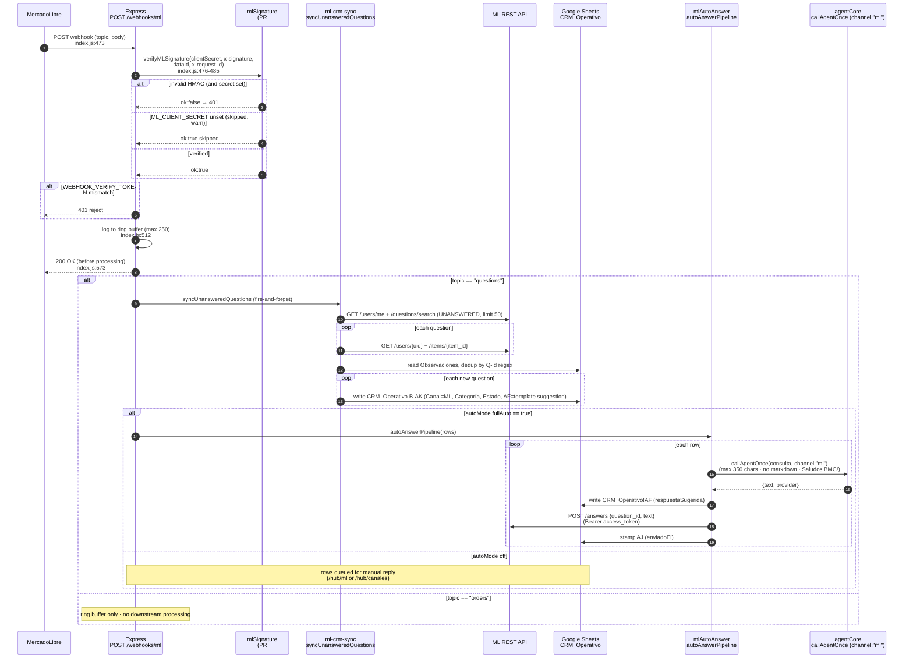

**Wanted.** _HMAC enforcement already shipped in PR #106 / `9685ef5` — removed from this list._ Three remaining deltas: (1) Orders topic processed by a new `ml-orders-sync` handler (CRM row + optional Transportista trip creation); (2) Auto-mode flag persisted in Postgres (`ml_auto_mode` row per seller) instead of local JSON file; (3) Answer posting goes through an outbox worker (`mlAnswerOutboxWorker`) with exponential backoff and dead-letter on max attempts. The "no skip path in prod" toggle (refuse-start if `ML_CLIENT_SECRET` unset) is optional hardening on top.

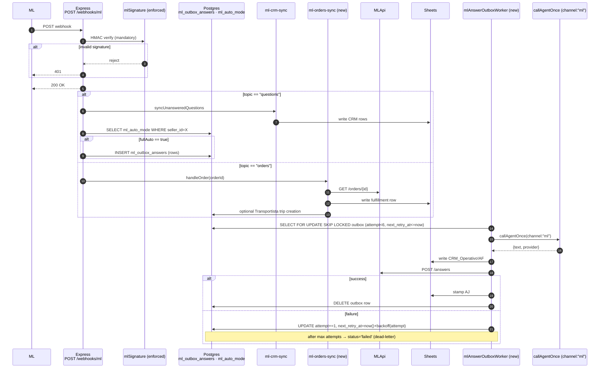

---

## Appendix A — Full flow catalog (28)

Numbered to match the inventory; critical paths are bold.

1. **User opens calculator and produces a quote** — SPA → `POST /calc/cotizar` → `calculations.js` → JSON totals.
2. **User exports quote as PDF** — UI → `POST /api/pdf/generate` → Playwright/Chromium → binary PDF.
3. **User shares quote on WhatsApp** — client-side WA deep link via `helpers.js`; no backend round-trip.
4. **Signed-in user exports a saved quote** — `/mi-espacio` → `GET /api/me/quotes/:id/export.{json,csv,pdf,html}` (requires user JWT).
5. Admin bulk export of quotes — admin UI → `POST /api/admin/export` (role=admin).
6. **Operator chats with Panelin agent** — `/hub/agent-admin` → SSE `POST /api/agent/chat` → tool loop → calc loopback → streamed response.
7. Operator runs a one-shot agent tool — UI → `POST /api/agent/exec-tool`.
8. **SuperAgent single-call quote for external AI** — external POST → `/api/agent/superagent` → calc loopback → return.
9. MercadoLibre OAuth onboarding — `GET /auth/ml/start` → ML → `GET /auth/ml/callback` → token storage.
10. **ML webhook → CRM sync → auto-answer** — `POST /webhooks/ml` → HMAC verify → `syncUnansweredQuestions` → if `autoMode.fullAuto`, `autoAnswerPipeline`.
11. **ML order arrives via webhook** — `POST /webhooks/ml` topic=orders → in-memory ring → downstream sync via `panelsim-ml-crm-sync.js`.
12. **WhatsApp inbound message** — Meta `POST /webhooks/whatsapp` → HMAC verify → `wa_messages` + in-memory map → status updates.
13. **WA conversation auto-flush after 5 min inactivity** — `setInterval` 60s → `processWaConversation` → AI parse → Sheets `Form responses 1` + `CRM_Operativo` + suggested reply (col AF) → autolearn → KB.
14. **Operator sends WA outbound from cockpit** — `/hub/wa` → `POST /api/wa/...` → 24h window + cap enforcement → Meta API.
15. WA enricher background suggestions — `waEnricherWorker` polls → intent + suggestion + (if quote params) `runWaQuote` → `wa_suggestions`.
16. WA SLA breach detection — `waSlaWorker` → `wa_sla_breaches`.
17. **Transportista trip → driver gets WA push** — admin creates trip → outbox row → `transportistaOutboxWorker` → Meta → driver PWA at `/conductor`.
18. **Shopify webhook** — `POST /webhooks/shopify` (raw body for HMAC) → `routes/shopify.js`.
19. Shopify product catalog read — `/hub/canales` → `GET /api/shopify/products`.
20. ML competitor search — agent/UI → `routes/mlSearch.js` (Bearer, 30-min cache, 60 req/min).
21. Price-monitor ETL trigger — operator → `routes/mlEtlRun.js` POST → spawns `scripts/price-monitor-etl.mjs`.
22. **Finanzas dashboard read** — `/finanzas` static UI → `routes/bmcDashboard.js` GETs → Sheets. 503 on Sheets unavailable, 200+empty on no-data, never 500.
23. **CRM suggest-reply & parse-email** — `POST /api/crm/suggest-response` or `/api/crm/parse-email` → AI fallback chain Grok→Claude→OpenAI→Gemini.
24. Follow-up tracker CRUD — `/hub/admin` → `routes/followups.js`.
25. PDF plant-2D preview — `/inspector`, `/fichas` → `routes/pdf.js` server-rendered Chromium → PDF.
26. Daily prod smoke — GitHub Actions cron `0 8,20 * * *` → `smoke-prod-api.mjs`.
27. Daily knowledge antenna ingest — GitHub Actions cron `20 10 * * *` → `knowledge-antenna-run.mjs`.
28. CI gate on push/PR — `ci.yml` → validate + lint + build + channels + voice + antenna; gates both `workflow_run` deploys.
