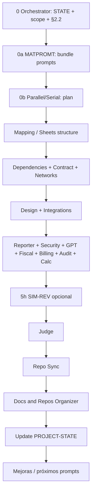

# Exportación técnica — Equipo de desarrollo asistido por IA (BMC / Panelin)

**Repositorio:** Calculadora-BMC (monorepo: API Node, frontend Vite/React, documentación operativa, orquestación multi-agente).  
**Audiencia:** ingeniería senior (revisión de arquitectura de proceso, gobernanza documental y límites de cada rol).  
**Fuente canónica del roster:** [`PROJECT-TEAM-FULL-COVERAGE.md`](./PROJECT-TEAM-FULL-COVERAGE.md) §2 (N = número de filas; no hardcodear).  
**Fecha de snapshot:** 2026-04-05.

**Manual detallado (cada `.cursor/agents/*.md` + taxonomía de 51 skills):** [`AGENT-MANUAL-FULL-SPEC.md`](./AGENT-MANUAL-FULL-SPEC.md).

**Presentación estilo terminal / Matrix (ASCII, para `cat`):** [`AGENT-PRESENTATION-MATRIX.txt`](./AGENT-PRESENTATION-MATRIX.txt).

---

## 1. Resumen ejecutivo

El proyecto opera un **sistema multi-agente documentado**: roles con responsabilidades, skills reutilizables (Markdown en `.cursor/skills/`), definiciones de agente para delegación en Cursor (`.cursor/agents/`), y un **ciclo de run** orquestado (pasos 0–9) con evaluación (Judge), sincronización de estado (`PROJECT-STATE.md`) y matriz de propagación de cambios (quién debe enterarse cuando cambia X).

No es un “framework” ejecutable único: es **convención + artefactos** que humanos y LLMs siguen. Los límites duros de código están en [`AGENTS.md`](../../AGENTS.md) (semántica de errores API, sin IDs de planillas en código, ES modules, etc.).

---

## 2. Arquitectura del sistema de agentes

### 2.1 Capas

| Capa | Qué es | Dónde vive |
|------|--------|------------|
| **Estado compartido** | Qué pasó, qué falta, cambios recientes | [`PROJECT-STATE.md`](./PROJECT-STATE.md) |
| **Roster y propagación** | Quién existe; quién notifica a quién | [`PROJECT-TEAM-FULL-COVERAGE.md`](./PROJECT-TEAM-FULL-COVERAGE.md) §2, §4 |
| **Orquestación** | Orden de pasos, handoffs, scope gate | [`.cursor/agents/bmc-dashboard-team-orchestrator.md`](../../.cursor/agents/bmc-dashboard-team-orchestrator.md), [`FULL-TEAM-RUN-DEFINITION.md`](./FULL-TEAM-RUN-DEFINITION.md) |
| **Instrucciones por rol (prompt engineering)** | Bundle por run, deltas mid-run | Skill `matprompt`, agente `matprompt-agent` |
| **Conocimiento procedimental (skills)** | Workflows reproducibles | `.cursor/skills/<skill>/SKILL.md` |
| **Definiciones de agente (Cursor)** | Perfiles para Task / invocación explícita | `.cursor/agents/*.md` |
| **Evaluación** | Criterios y reportes | [`judge/JUDGE-CRITERIA-POR-AGENTE.md`](./judge/JUDGE-CRITERIA-POR-AGENTE.md), skill `bmc-team-judge` |

### 2.2 Flujo lógico del *Full Team Run* (simplificado)

### 2.3 Dominios del producto (contexto de dependencias)

Resumen de [`PROJECT-TEAM-FULL-COVERAGE.md`](./PROJECT-TEAM-FULL-COVERAGE.md) §1:

| Área | Artefactos / código típico |
|------|----------------------------|
| Sheets / CRM | `docs/google-sheets-module/*`, `server/routes/bmcDashboard.js` |
| Dashboard UI | `docs/bmc-dashboard-modernization/*`, HTML/JS legacy dashboard |
| Calculadora | `src/`, `server/routes/calc.js`, puerto **5173** |
| Infra | Cloud Run, Vercel, VPS, `.env`, puerto **3001** |
| Integraciones | ML, Shopify, Drive, webhooks, `tokenStore` |
| GPT / Actions | OpenAPI, Builder, alineación con runtime |

---

## 3. Roster canónico (§2): rol, objetivos, instrucciones, dependencias

Cada fila es un **miembro numerado** del equipo completo. Las **skills** listadas son rutas lógicas bajo `.cursor/skills/<nombre>/SKILL.md` salvo que se indique otro path.

### 3.1 Tabla maestra

| Rol | Skill(s) principal(es) | Objetivo operativo | Instrucciones / definición | Dependencias clave |
|-----|------------------------|--------------------|----------------------------|---------------------|
| **Mapping** | `bmc-planilla-dashboard-mapper`, `google-sheets-mapping-agent` | Mapa planilla ↔ UI; inventario y variables 1:1 | Skills + hub Sheets | `planilla-inventory`, `MAPPER-PRECISO`, `DASHBOARD-INTERFACE-MAP`; **propaga** a Design, Dependencies |
| **Design** | `bmc-dashboard-design-best-practices` | UX/UI del dashboard; estados y flujo rápido | Skill | Datos mapeados por Mapping; **propaga** a Mapping si pide nuevos campos |
| **Sheets Structure** | `bmc-sheets-structure-editor` | Edición estructural en Google Sheets (tabs, validaciones) | Skill (**solo Matías**) | Tras Mapping cuando hace falta estructura |
| **Networks** | `networks-development-agent` | Hosting, storage, email inbound, migración, discovery | Skill + regla `.mdc` | URLs/CORS/OAuth **propagan** a Mapping, Integrations, Design |
| **Dependencies** | `bmc-dependencies-service-mapper` | Grafo de dependencias y mapa de servicios | Skill | Cruza API, dashboard, integraciones |
| **Integrations** | `shopify-integration-v4`, `browser-agent-orchestration` | OAuth, webhooks, flujos ML/Shopify con verificación navegador | Skills + agente Shopify | **propaga** a Networks (webhooks), Design si hay UI |
| **GPT/Cloud** | `panelin-gpt-cloud-system`, `openai-gpt-builder-integration` | OpenAPI, GPT Builder, cierre de drift prod | Skills | **propaga** a Integrations/Design |
| **Fiscal** | `bmc-dgi-impositivo` | Oversight fiscal/operativo; protocolo PROJECT-STATE | Skill | Billing, Mapping según hallazgo; reporta a Orquestador |
| **Billing** | `billing-error-review` | Control de facturación/cierres desde exports | Skill | Mapping si datos fuente cambian |
| **Audit/Debug** | `bmc-dashboard-audit-runner`, `cloudrun-diagnostics-reporter` | Auditoría profunda y diagnóstico Cloud Run | Skills + agentes homónimos | Design, Networks, Mapping según hallazgo |
| **Reporter** | `bmc-implementation-plan-reporter` | Planes Solution/Coding, riesgos, handoffs | Skill | Consume salidas de Mapping, Design, Dependencies |
| **Orchestrator** | `bmc-dashboard-team-orchestrator`, `ai-interactive-team` | Coordina orden, inclusión §2, diálogo entre agentes | [`.cursor/agents/bmc-dashboard-team-orchestrator.md`](../../.cursor/agents/bmc-dashboard-team-orchestrator.md) | **Lee** `PROJECT-STATE`, `RUN-SCOPE-GATE`, backlog; **escribe** estado al cerrar |
| **MATPROMT** | `matprompt` | Bundle de prompts por rol; deltas mid-run | [`.cursor/agents/matprompt-agent.md`](../../.cursor/agents/matprompt-agent.md) + skill | Alineado a Orquestador y Parallel/Serial |
| **Contract** | `bmc-api-contract-validator` | Validar respuestas API vs contrato canónico | Skill `bmc-api-contract-validator`; Task `bmc-api-contract` | `planilla-inventory`, rutas `server/`; **drift → Mapping** |
| **Calc** | `bmc-calculadora-specialist` | BOM, precios, Drive, PDF, flujo 5173 | Skill; Task `bmc-calc-specialist` | `src/utils/calculations.js`, `constants.js`, tests `tests/validation.js` |
| **Security** | `bmc-security-reviewer` | OAuth, env, CORS, HMAC, secretos | Skill; Task `bmc-security` | Pre-deploy, rutas auth/webhook |
| **Judge** | `bmc-team-judge` | Ranking por run + histórico; criterios por agente | Skill; Task `bmc-judge` | [`JUDGE-CRITERIA-POR-AGENTE.md`](./judge/JUDGE-CRITERIA-POR-AGENTE.md) |
| **Parallel/Serial** | `bmc-parallel-serial-agent` | Paralelizar sin romper dependencias; usar scores | Skill | `JUDGE-REPORT-HISTORICO`, matices de §2 |
| **Repo Sync** | `bmc-repo-sync-agent` | Sincronizar `bmc-dashboard-2.0` y `bmc-development-team` | Skill; Task `bmc-repo-sync-agent` | Artefactos de equipo post-run |
| **Docs & Repos Organizer** | `bmc-docs-and-repos-organizer` | Higiene de `docs/`, índices, handoff a Repo Sync | [`.cursor/agents/bmc-docs-and-repos-organizer.md`](../../.cursor/agents/bmc-docs-and-repos-organizer.md) + skill | No inventa contrato API ni schema Sheets |
| **SIM** | `bmc-project-team-sync`, `bmc-calculadora-specialist` + doc PANELSIM | Asistente único en Cursor: cotización + operación BMC | [`panelsim/AGENT-SIMULATOR-SIM.md`](./panelsim/AGENT-SIMULATOR-SIM.md) | API `/capabilities`, hub Sheets, `AGENTS.md` |
| **SIM-REV** | `bmc-implementation-plan-reporter`, `bmc-team-judge` + doc §4 | Contraste trabajo SIM vs backlog | [`.cursor/agents/sim-reviewer-agent.md`](../../.cursor/agents/sim-reviewer-agent.md) | No sustituye al Judge |

### 3.2 Skills transversales (§2.2)

Deben considerarse en **paso 0** del Orquestador (aplicable / N/A con justificación):

| Skill / protocolo | Ruta |
|-------------------|------|
| AI Interactive Team | `.cursor/skills/ai-interactive-team/SKILL.md` |
| Project Team Sync | `.cursor/skills/bmc-project-team-sync/SKILL.md` |
| BMC Mercado Libre API | `.cursor/skills/bmc-mercadolibre-api/SKILL.md` |
| Chat equipo (si existe) | `.cursor/skills/chat-equipo-interactivo/SKILL.md` |

---

## 4. Especialistas y agentes Cursor adicionales (fuera de §2 o híbridos)

Definiciones en [`.cursor/agents/`](../../.cursor/agents/) que **complementan** el roster (auditorías focalizadas, hosting, Telegram, JSX live, etc.):

| Archivo | Uso típico |
|---------|------------|
| `bmc-roof-2d-viewer-specialist.md` | Visor SVG techo / paso Estructura (`RoofPreview.jsx`, cotas, fijación, geometría) |
| `bmc-dashboard-setup.md`, `bmc-dashboard-automation.md` | Setup y automatización dashboard |
| `bmc-dashboard-audit-runner.md`, `bmc-dashboard-audit-full.md` | Auditoría (runner vs full) |
| `bmc-dashboard-debug-reviewer.md` | Post-audit: extraer issues → informe |
| `bmc-dashboard-ia-reviewer.md` | Revisión IA del dashboard |
| `bmc-capabilities-reviewer.md` | Manifest `/capabilities` vs GPT |
| `bmc-dashboard-netuy-hosting.md` | Deploy dashboard en VPS Netuy |
| `cloudrun-diagnostics-agent.md` | Diagnóstico Cloud Run (`panelin-calc`) |
| `bmc-telegram-architecture-scout.md` | Inteligencia Telegram / roadmap |
| `live-jsx-dev.md` | Entorno live para JSX suelto |
| `mac-performance-agent.md` | Rendimiento macOS |
| `shopify-integration-v4.md` | Perfil agente Shopify (paralelo a skill) |

Estos perfiles se invocan **bajo demanda**; no reemplazan la tabla §2 salvo que se promuevan según §2.3.

---

## 5. Dependencias técnicas del repo (runtime y validación)

### 5.1 Stack local

| Componente | Puerto / comando | Notas |
|------------|------------------|--------|
| API Express | **3001** | `npm run start:api` |
| Frontend Vite | **5173** | `npm run dev`; `predev` ejecuta `disk:precheck` |
| Full stack | — | `npm run dev:full` o `./run_full_stack.sh` |
| Contratos API | — | `npm run test:contracts` (API arriba) |

### 5.2 Gates de calidad (humanos + CI)

| Comando | Propósito |
|---------|-----------|
| `npm run lint` | `src/` tras ediciones |
| `npm test` | Lógica de negocio / tests unitarios |
| `npm run gate:local` | lint + test |
| `npm run gate:local:full` | lint + test + build |
| `npm run pre-deploy` | Checklist antes de deploy |

### 5.3 Variables de entorno (categorías, sin valores)

Credenciales y IDs viven en **`.env`** (no commitear). Categorías típicas: Google Sheets / SA, `API_AUTH_TOKEN`, ML OAuth, Shopify secrets, `PUBLIC_BASE_URL`, MATRIZ, correo/IMAP opcional. Detalle: `.env.example` y skills de setup.

### 5.4 Integración Cursor Task (subagentes BMC)

En entornos Cursor, existe delegación vía **Task** con subagent_types alineados a skills BMC (p. ej. `bmc-orchestrator`, `bmc-calc-specialist`, `bmc-deployment`, `bmc-security`, `bmc-sheets-mapping`, `bmc-panelin-chat`, `cloudrun-diagnostics-agent`, `shopify-integration-v4`, `sim-reviewer-agent`, …). Es un **catálogo de invocación** paralelo al roster §2: útil para enrutar trabajo; la **fuente de verdad del equipo completo** sige siendo §2.

---

## 6. Gobernanza y evolución

- **Alta de rol nuevo:** [`PROJECT-TEAM-FULL-COVERAGE.md`](./PROJECT-TEAM-FULL-COVERAGE.md) §2.3 (tabla §2, criterios Judge, Orquestador, agent/skill, backlog, PROJECT-STATE, repo hermano si aplica).
- **Propagación:** §4 — matriz “si cambia X → notificar Y”.
- **Run Scope Gate:** [`RUN-SCOPE-GATE.md`](./RUN-SCOPE-GATE.md) — evita trabajo ficticio; Profundo / Ligero / N/A por rol.
- **Human gates operativos:** [`HUMAN-GATES-ONE-BY-ONE.md`](./HUMAN-GATES-ONE-BY-ONE.md) (OAuth, Meta, correo, etc.).

---

## 7. Índice de lectura recomendado (onboarding ingeniería)

1. [`AGENTS.md`](../../AGENTS.md) — convenciones de código y comandos npm.  
2. [`PROJECT-TEAM-FULL-COVERAGE.md`](./PROJECT-TEAM-FULL-COVERAGE.md) — §1–§4.  
3. [`.cursor/agents/bmc-dashboard-team-orchestrator.md`](../../.cursor/agents/bmc-dashboard-team-orchestrator.md) — pasos 0–9.  
4. [`judge/JUDGE-CRITERIA-POR-AGENTE.md`](./judge/JUDGE-CRITERIA-POR-AGENTE.md) — definición de “done” por rol.  
5. [`PROJECT-STATE.md`](./PROJECT-STATE.md) — estado vivo.  
6. Hub Sheets: [`docs/google-sheets-module/README.md`](../google-sheets-module/README.md).

---

## 8. Mantenimiento de este export

Regenerar o actualizar este documento cuando:

- cambie el número o la definición de filas en §2;
- se añadan skills transversales §2.2;
- cambie el orden de pasos del Orquestador;
- se incorporen agentes `.cursor/agents/` que alteren responsabilidades globales.

**Autoría:** snapshot generado desde artefactos del repo; no sustituye las fuentes enlazadas.
