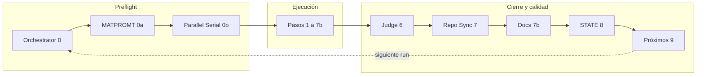

# Full Team Run — Definición canónica (objetivo, loop, evaluación, iteración)

**Estado:** definición vigente para alinear *Invoque full team* con mejores prácticas, **evaluación autónoma** de participación de agentes, **documentación correcta**, **agentes en bucle** alrededor de un **objetivo central**, y **próximas tareas ya evaluadas** para poder **iterar hasta cerrar el trabajo**.

**Documentos relacionados:** [`INVOQUE-FULL-TEAM.md`](./INVOQUE-FULL-TEAM.md) (invocación), [`RUN-SCOPE-GATE.md`](./RUN-SCOPE-GATE.md), [`RUN-MODES-AND-TRIGGERS.md`](./RUN-MODES-AND-TRIGGERS.md) (R1–R4 y §7 mejores prácticas), [`PROJECT-TEAM-FULL-COVERAGE.md`](./PROJECT-TEAM-FULL-COVERAGE.md) §2, [`.cursor/agents/bmc-dashboard-team-orchestrator.md`](../.cursor/agents/bmc-dashboard-team-orchestrator.md).

---

## 1. Qué es un Full Team Run (redefinido)

Un **Full Team Run** no es “veintitantos informes largos siempre”. Es un **ciclo cerrado de orquestación** que:

1. Fija un **objetivo central del run** (ligado al proyecto y, cuando aplica, al programa en `orientation/programs/bmc-panelin-master.json` y a `PROJECT-STATE`).
2. Cubre **toda la tabla §2** con **trazabilidad** (cada rol: Profundo / Ligero / N/A justificado — [`RUN-SCOPE-GATE.md`](./RUN-SCOPE-GATE.md)).
3. Ejecuta el **pipeline 0→9** del Orquestador con **handoffs** explícitos.
4. Aplica **evaluación autónoma** de la participación (Judge + criterios por rol).
5. Exige **documentación alineada** (artefactos, `PROJECT-STATE`, índices/README donde corresponda — paso **7b** Docs & Repos Organizer).
6. Deja **próximas tareas pré-evaluadas** (paso **9**: `PROMPT-FOR-EQUIPO-COMPLETO` + `IMPROVEMENT-BACKLOG-BY-AGENT.md` + brújula `project:compass` / `program:status` cuando aplique).
7. Permite **iterar**: el siguiente run arranca con prompts y prioridades **ya ordenadas**, hasta cumplir **criterios de salida** del objetivo (no “hasta aburrirse”).

**Nombre alternativo interno:** *Full coverage orchestration loop* / **Run §2 con ciclo de cierre**.

---

## 2. Objetivo central (core objective)

| Nivel | Dónde vive | Uso en el run |
|-------|------------|----------------|
| **Programa** | `docs/team/orientation/programs/bmc-panelin-master.json`, `npm run program:status` | Horizonte multi-semana; fases p1–p3. |
| **Run actual** | Primera sección del bundle MATPROMT + Run Scope Matrix | Qué se intenta **cerrar o avanzar** en esta corrida. |
| **Sesión humana** | [`SESSION-WORKSPACE-CRM.md`](./SESSION-WORKSPACE-CRM.md) §1 | Foco del día; no reemplaza el objetivo del run. |

**Regla:** El **paso 0** del Orquestador declara en 1–3 frases el **objetivo central del run**; el **paso 0a (MATPROMT)** lo descompone en instrucciones medibles por rol (entregables, no solo actividad).

---

## 3. Bucle del Full Team Run (agents in the loop)



- **Preflight:** estado, PROMPT, backlog, **matriz de alcance**, plan paralelo/serie.
- **Ejecución:** roles §2 según intensidad acordada.
- **Cierre:** Judge (evaluación), sync repos, higiene documental, **STATE**, **próximos prompts pré-evaluados**.

---

## 4. Evaluación autónoma de participación

**Autónoma** = según **criterios publicados**, sin depender de opiniones implícitas.

| Pieza | Función |
|-------|---------|
| [`judge/JUDGE-CRITERIA-POR-AGENTE.md`](./judge/JUDGE-CRITERIA-POR-AGENTE.md) | Define *qué* juzgar por rol (entregables, ranqueo). |
| **Judge (paso 6)** | Produce `JUDGE-REPORT-RUN-*.md` + histórico; puede marcar roles N/A del run sin penalizar si la **Run Scope Matrix** lo acordó. |
| **Run Scope Matrix** | Contrato de intensidad: el Judge no exige “informe profundo” donde hubo **N/A justificado**. |
| **MATPROMT** | En el bundle, cada rol tiene **criterios de aceptación** explícitos (micro-framework). |

**Mejora continua:** los hallazgos del Judge alimentan el **paso 9** y el **IMPROVEMENT-BACKLOG** (qué desarrollar en el skill/KB del agente).

---

## 5. Documentación correcta y “perfecta” (en el sentido operativo)

**Perfecta** aquí significa: **canónica, enlazada, sin duplicados contradictorios, trazable al código y a AGENTS.md** — no volumen infinito.

| Momento | Responsable / artefacto |
|---------|-------------------------|
| Durante el run | Cada rol deja **rutas concretas** y no inventa contratos. |
| Paso **7b** | **Docs & Repos Organizer**: índices, READMEs, enlaces rotos, handoff a Repo Sync. |
| Paso **8** | **Orchestrator**: `PROJECT-STATE.md` — Cambios recientes + Pendientes. |
| Paso **9** | PROMPT y backlog actualizados para el **siguiente** ciclo. |

---

## 6. Próximas tareas pré-evaluadas e iteración hasta “job done”

| Artefacto | Qué aporta |
|-----------|------------|
| [`PROMPT-FOR-EQUIPO-COMPLETO.md`](./PROMPT-FOR-EQUIPO-COMPLETO.md) | *Próximos prompts* ya priorizados para el siguiente run. |
| [`IMPROVEMENT-BACKLOG-BY-AGENT.md`](./IMPROVEMENT-BACKLOG-BY-AGENT.md) | Madurez por agente; qué cerrar en iteraciones sucesivas. |
| `npm run project:compass` / `program:status` | Cola sugerida a nivel programa (tareas + esfuerzo). |
| **Criterios de salida del objetivo** | Definidos en el propio run (ej. “smoke prod OK”, “gate cm-1 cerrado”, “duplicados MATRIZ = 0”) — sin ellos el loop sigue pero el **objetivo** no se declara cumplido. |

**Iteración:** cada Full Team Run **cierra un ciclo** y **enciende el siguiente**: el paso 9 no es optional fluff; es el **puente** hacia la siguiente vuelta con tareas **ya evaluadas** (qué sigue, por qué, en qué orden).

**Cuándo parar:** cuando el objetivo central alcanza su **Definition of Done** acordada **o** cuando un **human gate** bloquea hasta evidencia ([`HUMAN-GATES-ONE-BY-ONE.md`](./HUMAN-GATES-ONE-BY-ONE.md)) — el run documenta el bloqueo; no inventa éxito.

---

## 7. Alineación con mejores prácticas

Ver [`RUN-MODES-AND-TRIGGERS.md`](./RUN-MODES-AND-TRIGGERS.md) §7 (preflight, DAG, anti-patrones). Esta definición **no** reemplaza R1–R4: un **Full Team Run** en el sentido estricto corresponde a **R1 — Full coverage**; para sync corto o un solo rol usá R2/R4.

---

## 8. Plantilla — declarar el objetivo del próximo run

Copiar al inicio del chat o del bundle MATPROMT:

```text
Full Team Run (R1) — definición FULL-TEAM-RUN-DEFINITION.md

Objetivo central del run: [una frase medible]
Definition of Done: [condiciones de cierre]
Run Scope: Profundo […] / Ligero […] / N/A […]
Próxima iteración: al cerrar paso 9, actualizar PROMPT + backlog + (si aplica) compass
```

---

## Referencias rápidas

| Recurso | Ruta |
|---------|------|
| Invocación | [`INVOQUE-FULL-TEAM.md`](./INVOQUE-FULL-TEAM.md) |
| Mejores prácticas §7 | [`RUN-MODES-AND-TRIGGERS.md`](./RUN-MODES-AND-TRIGGERS.md) |
| Benchmark industria (CrewAI, AutoGen, …) | [`popular-known-ai-teams/`](./popular-known-ai-teams/README.md) |
| Matriz de intensidad | [`RUN-SCOPE-GATE.md`](./RUN-SCOPE-GATE.md) |
| Modos R1–R4 y prácticas | [`RUN-MODES-AND-TRIGGERS.md`](./RUN-MODES-AND-TRIGGERS.md) |
| Cockpit de sesión | [`SESSION-WORKSPACE-CRM.md`](./SESSION-WORKSPACE-CRM.md) |
| Estado repo | [`PROJECT-STATE.md`](./PROJECT-STATE.md) |
