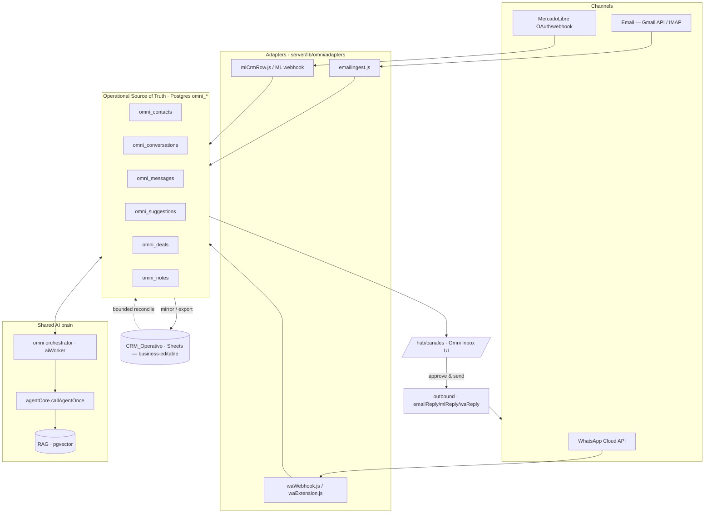
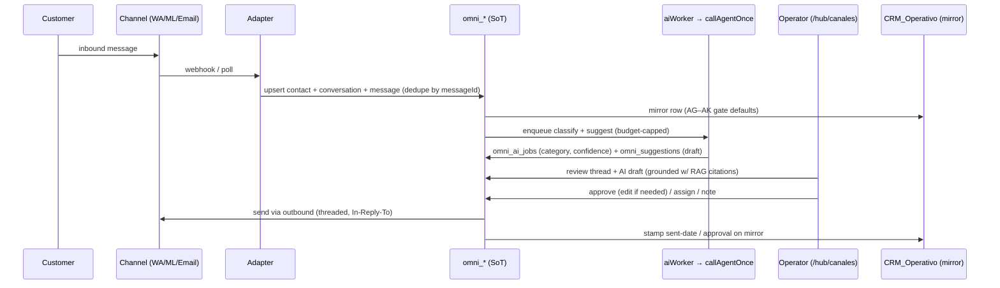

# Inbox AI-First — Blueprint & Consolidation Roadmap

**Status:** Active blueprint. **Supersedes** [`OMNI-HUB-ARCHITECTURE.md`](./OMNI-HUB-ARCHITECTURE.md) (frozen 2026-06-21, now stale vs. prod) and extends [`ARCHITECTURE-CHANNELS-COTIZACIONES.md`](./ARCHITECTURE-CHANNELS-COTIZACIONES.md).
**Last updated:** 2026-06-30
**Decision committed:** Postgres `omni_*` is the **operational source of truth**; Google Sheets `CRM_Operativo` is a **business-editable mirror/export**.
**Scope of this document:** strategy + architecture + phased roadmap. **No code in this revision** — it is the contract the implementation phases execute against.

> **How to read this doc.** It answers the "Company-Knowledge-First" master prompt
> ([`docs/prompts/BMC_EMAIL_PANELSIM_COMPANY_KNOWLEDGE_FIRST_AGENT_PROMPT_V5.md`](../prompts/BMC_EMAIL_PANELSIM_COMPANY_KNOWLEDGE_FIRST_AGENT_PROMPT_V5.md))
> grounded against the live repo at commit `73bf15b`. Every file/endpoint/table named here was verified to exist.
> Anything unverified is tagged **`#ZonaDesconocida`**. The canonical file index is
> [`EMAIL-SOURCE-MAP.md`](./EMAIL-SOURCE-MAP.md).

---

## 1. Executive summary

BMC does **not** need to build an AI-first inbox from scratch — it already has ~80% of one. The
calculator, the AI brain, the omnichannel data model, the email→CRM pipeline, and a Chatwoot-style
inbox UI are all in the repo and largely in production. What's missing is **consolidation**: three
overlapping email/inbox efforts and two sources of truth grew in parallel and now need to converge
on one coherent target.

The "best" system is **one brain, one inbox, one source of truth**, with a human approval gate on
every outbound message:

- **One brain** — every channel's AI (chat, WhatsApp, MercadoLibre, email) routes through the
  single `callAgentOnce()` engine so channel rules, knowledge grounding, provider failover, and
  cost tracking are inherited everywhere instead of re-implemented per channel.
- **One inbox** — `/hub/canales` (the Omni Inbox) is the single operator surface, with feature
  parity across email/WA/ML: triage, AI-drafted reply, approve, assign, note, send, thread.
- **One source of truth** — Postgres `omni_*` is operational truth; `CRM_Operativo` (Sheets) is a
  business-editable mirror. This is the direction the existing shadow-write + migration-strategy
  docs already point at; this blueprint commits to it.

This is sequenced as six low-risk, flag-gated, individually-reversible phases (§6). The OSS
landscape (Chatwoot, Inbox Zero, Mail0/Zero, FreeScout vs. Missive, Front, Intercom Fin, Gmail
Gemini, Superhuman) **validates** BMC's existing choices and supplies the specific patterns still
missing (§5).

---

## 2. Confirmed current state

Verified against the live repo. Status legend: 🟢 live in prod · 🟡 built but partial/dormant · 🔴 missing.

### 2.1 AI brain (the engine) — 🟢 reusable today

| Capability | Where | Status |
|---|---|---|
| Single AI entry point across channels | `server/lib/agentCore.js` → `callAgentOnce(messages, {channel, calcState, provider, taskKey})` | 🟢 |
| Provider failover + per-call cost tracking | `server/lib/aiProviderConfig.js` (chain claude→grok→gemini→openai, model allowlist, cost table) | 🟢 |
| 65 channel-aware tools (calc, CRM, PDF, WA, RAG, follow-ups) with write-confirmation gates | `server/lib/agentTools.js` | 🟢 |
| Streaming chat + conversation logging + intent-gated writes | `server/routes/agentChat.js` (SSE) | 🟢 |
| Omni AI orchestrator (async classify/suggest/extract jobs, budget cap) | `server/lib/omni/orchestrator/{aiRegistry,aiWorker,automationEngine,suggestions}.js`; tables `omni_ai_jobs`, `omni_prompt_registry`, `omni_model_registry` | 🟡 gated `OMNI_AI_ORCHESTRATOR_ENABLED` (default off) |
| RAG over historical quotes (pgvector) | `server/lib/rag.js` + `server/lib/embeddings.js` | 🟡 gated `RAG_ENABLED` (default off) |
| Auto-learn KB from conversations | `server/lib/autoLearnExtractor.js` + `server/lib/trainingKB.js` | 🟢 |

### 2.2 Omnichannel data model + inbox — 🟢/🟡 mostly built

| Capability | Where | Status |
|---|---|---|
| Unified schema: contacts/conversations/messages/suggestions/deals/automation | `server/migrations/omni/001..008` | 🟢 |
| Multi-account email, teams, assignment, FRT, snooze columns | `server/migrations/omni/009_email_manager_multi.sql` (`omni_teams`, `omni_team_members`, `omni_email_accounts`; `omni_conversations.{receiving_account_id, assigned_to_user_id, assigned_at, team_id, snoozed_until, first_agent_reply_at}`) | 🟢 schema; 🟡 partially wired in UI |
| Internal notes | `server/migrations/omni/010_omni_notes.sql` (`omni_notes`) | 🟢 schema; 🟡 UI wiring |
| 25-endpoint Omni API (list/patch/messages/suggestions/contacts/merge/assist) | `server/routes/omni.js`; `PATCH /api/omni/conversations/:id` | 🟢 |
| Channel adapters (inbound) | `server/lib/omni/adapters/{emailIngest,mlCrmRow,waExtension,waWebhook,mlOutboundMirror}.js` | 🟡 email/WA wired; ML inbound partial |
| Channel outbound (unified reply) | `server/lib/omni/outbound/{emailReply,mlReply,waReply}.js` | 🟢 |
| Chatwoot-style inbox UI (status tabs, rich rows, composer, quick replies, status/tags) | `src/components/hub/canales/{CanalesModule,OmniInboxPanel,OmniThreadPanel,OmniContactSidebar,OmniDealsKanban,UnifiedContactsPanel,OmniAdminCockpit}.jsx`, hook `src/hooks/useOmniConversations.js` | 🟢 Fases 1+2 behind `VITE_OMNI_INBOX=1` |
| Full-desk tier: assignment / notes / delivery ticks / real-time SSE | same components + 009/010 schema | 🟡 in progress |

### 2.3 Email → CRM pipeline — 🟢 live in prod

| Capability | Where | Status |
|---|---|---|
| Server-side Gmail polling on cron (every 30 min, business hrs) | `POST /api/email/poll-gmail` (`server/routes/bmcDashboard.js`), `server/lib/gmailPoll.js`, `.github/workflows/email-ingest-scheduled.yml` | 🟢 |
| Idempotent ingest (dedupe by `messageId`) | `server/lib/emailIngestDb.js`, `supabase/migrations/20260625000001_email_ingest_log.sql` (`public.email_ingest_log`) | 🟢 |
| 12-field AI lead extraction (Zod schema, 4-provider fallback) | `server/lib/emailLeadIngest.js`; `POST /api/crm/{parse,ingest}-email` | 🟢 |
| CRM write with AG–AK human gate | `server/lib/crmOperativoLayout.js` `defaultTailAGAK_Email()` → `["", "", "No", "", "No"]` (AG provider · AH link · AI approve · AJ sent-date · AK block-auto) | 🟢 |
| Machine auth (503 if unconfigured, 401 if bad token) | `server/lib/emailIngestAuth.js` (`EMAIL_INGEST_TOKEN`, fallback `API_AUTH_TOKEN`) | 🟢 |
| Threaded outbound reply behind human approval | `server/lib/emailReply.js` (Gmail API preferred, per-casilla SMTP fallback, In-Reply-To); `handleCrmCockpitSendApproved` for `origen=Email` | 🟢 |
| Shadow-write linking CRM rows → Omni | flag `OMNI_EMAIL_SHADOW_WRITE` | 🟡 |

### 2.4 The third surface — Chatwoot shared inbox + in-app Email Agent — 🟡 dormant

Shipped behind flags (PR #450): `server/lib/chatwootClient.js`, `server/routes/chatwoot.js`
(`POST /api/chatwoot/webhook`), `server/lib/emailAgentTools.js` (11 `email_*` tools),
`server/routes/emailAgentChat.js` (SSE), `src/components/EmailAgentPanel.jsx`
(flag `VITE_FEATURE_EMAIL_AGENT`, default off). Reuses `emailLeadIngest.js`. Infra not yet stood up
(runbook [`runbooks/chatwoot-email-agent-setup.md`](./runbooks/chatwoot-email-agent-setup.md)).

### 2.5 Gaps / aspirational

- 🔴 **ML webhook body processing** — `server/routes/webhooks.js` verifies signature but does not yet
  ingest ML questions into Omni (TODO).
- 🔴 **No SLA/FRT tracking surfaced** — `first_agent_reply_at` column exists; no breach tracking/alerts.
- 🔴 **No confidence-scored staged review** — `omni_ai_jobs.confidence` is captured but not used to gate.
- 🔴 **No real-time** — polling only (SSE deferred per PROJECT-STATE 2026-06-25).
- 🔴 **Cross-channel contact dedup service** — `omni_contacts` supports merge; no service running.
- ⚪ **Aspirational in the pasted "Architectural Synthesis" (not in code):** a fully-autonomous
  send loop (sending is human-gated **by design**), a `sendPendingPaymentsUpdate` Mon/Thu/Fri
  "EQUIPOS" scheduler in `marketIntel/alerts/email.js`, and a standalone email-operator role with
  magic-link auth (documented as a deferred phase). Treat these as **future**, not present.

### 2.6 Reconciling the doc contradiction

`OMNI-HUB-ARCHITECTURE.md` (frozen 2026-06-21) says Phase 2/Omni is "blocked / pending." `PROJECT-STATE.md`
(2026-06-25 → 06-29) says the Omni Inbox UX Fases 1+2 shipped and Omni runs in prod behind flags.
**Prod reality wins:** the frozen doc is superseded by this blueprint. The Omni backbone is live (gated);
the remaining work is the full-desk tier, the SoT flip, and the channel gaps — not a green-field build.

---

## 3. Target architecture — one brain, one inbox, one source of truth

### 3.1 Logical topology

### 3.2 Canonical inbound → reply loop (human-gated)

### 3.3 Source-of-truth decision (committed)

- **Operational SoT = Postgres `omni_*`.** All inbound writes land in Omni first; conversation
  status, assignment, notes, suggestions, and deals live there.
- **`CRM_Operativo` (Sheets) = business-editable mirror.** It remains the surface where non-technical
  staff read/annotate, and the export for finance/CRM reporting. The AG–AK gate semantics are
  preserved on the mirror.
- **Reconciliation contract** (detailed in Phase 3):
  - *Forward (Omni → Sheets):* extend the existing `OMNI_EMAIL_SHADOW_WRITE` path into the canonical
    write direction (Omni is written first, Sheets mirrored best-effort; Sheets failure never blocks
    ingest — preserves the repo's "503/empty, never 500" Sheets error contract).
  - *Backward (Sheets → Omni):* business edits in specific columns reconcile back via a **bounded,
    explicit** sync (whitelisted columns only; last-writer-wins with audit). No opaque dual-write.
  - *Idempotency:* keep `public.email_ingest_log` (messageId dedupe) and `omni_ingest_dedup` as the
    guards so re-runs never duplicate.
- **Why this direction:** real-time UX, assignment, SLA, and AI orchestration require relational
  integrity and low-latency queries that Sheets cannot provide; it also matches
  [`docs/transformation/12-migration-strategy.md`](../transformation/12-migration-strategy.md)
  (shadow → backfill → read-flip → write-flip).

---

## 4. Gap analysis

| Gap | Owning code | Gate / mechanism | Phase |
|---|---|---|---|
| Orchestrator not using shared brain everywhere | `omni/orchestrator/aiWorker.js` | converge to `callAgentOnce()`; `OMNI_AI_ORCHESTRATOR_ENABLED` | 1 |
| RAG grounding off | `server/lib/rag.js`, `scripts/training/embedQuotes.js` | `RAG_ENABLED` + backfill | 1 |
| Full-desk UI (assign/notes/delivery/real-time) | `src/components/hub/canales/*`, 009/010 schema | finish wiring | 2 |
| Reply-zero dashboard | new view in `/hub/canales` | derived from `omni_*` | 2 |
| SoT still Sheets-first for some paths | shadow-write, mirror | flip per migration-strategy | 3 |
| ML inbound not ingested | `server/routes/webhooks.js`, `adapters/mlCrmRow.js` | implement body → Omni | 4 |
| Two email ingest paths | `gmailPoll.js` vs `emailSnapshotIngest.js` | Gmail canonical; snapshot → backfill | 4 |
| SLA/FRT + breach alerts | `omni_conversations.first_agent_reply_at` | tracking + predictive alert | 4 |
| Confidence-gated auto-draft tiers | `omni_ai_jobs.confidence` | threshold policy | 5 |
| Real-time | polling → SSE/WebSocket | new transport | 5 |

---

## 5. OSS-informed patterns to adopt (mapped to BMC primitives)

The 2025–2026 landscape converges on **AI-as-copilot with a human approval gate**, not autonomous
send — exactly BMC's existing model. Patterns worth adopting, each mapped to a primitive that
already exists or must be added:

1. **Human-in-the-loop: draft → stage → approve → send.** ✅ already the model (email/WA gate, AG–AK,
   `omni_suggestions.approval_state`). Action: make it *uniform* across all channels in the Omni UI.
2. **Confidence-scored staged review.** `omni_ai_jobs.confidence` is captured → gate: <60% stage for
   human, 60–85% draft+quick-scan, >85% low-risk (product info) eligible for fast approve. Never auto-send.
3. **Async background triage (24/7, no operator present).** ✅ `aiWorker` + `automationEngine`. Action:
   enable in shadow, classify every inbound, pre-draft before the operator opens the inbox.
4. **"Reply-zero" action dashboard.** New `/hub/canales` view: awaiting-reply, AI-drafted/staged,
   overdue SLA, negative-sentiment — single glance "what do I act on now."
5. **SLA / first-response-time tracking + predictive breach.** Use `first_agent_reply_at`; target
   <2h FRT (B2B norm); alert before breach.
6. **Knowledge-grounded replies with citations.** Enable RAG (`rag.js`) + the accumulated brain
   (`brainKB.js`); surface "based on quote X / KB entry Y" so drafts are auditable.
7. **In-thread team notes (not customer-visible).** ✅ `omni_notes` exists → wire into thread UI.
8. **Cross-channel unified contact + full history.** ✅ `omni_contacts` (+ `ml_user_id`/`wa_phone`/
   `email` keys) → run the dedup/merge service so one customer = one record across channels.
9. **Tiered model routing for cost control.** ✅ `FAST_DEFAULT_MODELS` + cost table exist → triage on
   cheap model, drafts on mid, escalation on premium; cap via `OMNI_AI_DAILY_BUDGET_USD`.
10. **Channel feature parity.** A WhatsApp quote request gets the same triage/draft/approve/SLA as email.

**Anti-patterns to avoid:** full auto-send without a gate; brittle keyword rules (use the ML
classifier, not regex); one-size policy across customer tiers (keep high-value accounts on full
approval); flying blind (log every AI draft + approval outcome for accuracy tracking); storing PII
in logs.

---

## 6. Phased roadmap

Each phase is independently shippable, flag-gated, and reversible. Risk: 🟢 low · 🟡 attention · 🔴 high.

### Phase 0 — Reconcile & document · 🟢 (this PR)
- **Goal:** commit the blueprint, the source map, and the master-prompt assets; mark
  `OMNI-HUB-ARCHITECTURE.md` superseded; lock the SoT decision.
- **Files:** this doc, `EMAIL-SOURCE-MAP.md`, `docs/prompts/…V5.md`, `.cursor/rules/…`, PROJECT-STATE line.
- **Rollback:** revert docs. **Acceptance:** `gate:local` green (docs-only, no behavior change).

### Phase 1 — One brain · 🟡
- **Goal:** every channel's AI runs through `callAgentOnce()`; grounded suggestions.
- **Do:** converge `omni/orchestrator/aiWorker.js` onto `callAgentOnce()` (inherit channel rules,
  KB injection, cost tracking); enable `OMNI_AI_ORCHESTRATOR_ENABLED` in shadow; enable `RAG_ENABLED`
  + run `scripts/training/embedQuotes.js` backfill.
- **Risk:** 🟡 (flag-gated, shadow first). **Rollback:** toggle flags off.
- **Acceptance:** orchestrator suggestions show provider/model/cost in `omni_ai_jobs`; RAG citations present.

### Phase 2 — One inbox UI · 🟡
- **Goal:** `/hub/canales` is the single operator surface with email/WA/ML parity.
- **Do:** finish full-desk tier (assignment via `assigned_to_user_id`, notes via `omni_notes`,
  delivery ticks), add the reply-zero dashboard, wire suggestion approve/edit/send uniformly.
- **Risk:** 🟡 (behind `VITE_OMNI_INBOX`). **Rollback:** flag off. **Acceptance:** an operator can
  triage → approve → send an email *and* a WA message from one screen.

### Phase 3 — Source-of-truth flip · 🔴 (highest care)
- **Goal:** Omni is write-first SoT; `CRM_Operativo` becomes the mirror.
- **Do:** follow `12-migration-strategy.md` (shadow → backfill → read-flip → write-flip); implement
  the bounded Sheets→Omni reconcile for whitelisted business-edited columns; preserve AG–AK + the
  Sheets "503/empty never 500" contract.
- **Risk:** 🔴 (data integrity). **Rollback:** revert read/write flip flags; Sheets remains intact
  throughout (mirror, never destroyed). **Acceptance:** dual-run shows zero divergence; second run
  produces no duplicates.

### Phase 4 — Close channel gaps · 🟡
- **Goal:** ML inbound in Omni; one canonical email ingest; SLA visibility.
- **Do:** implement `webhooks.js` ML body → `adapters/mlCrmRow.js` → Omni; make Gmail poll the
  canonical email path and demote `emailSnapshotIngest.js` to backfill; add FRT tracking + breach alert.
- **Risk:** 🟡. **Rollback:** per-feature flags. **Acceptance:** an ML question appears as an Omni
  conversation with an AI draft; FRT shown per conversation.

### Phase 5 — Harden / observe · 🟢
- **Goal:** confidence-tiered drafting, accuracy logging, tiered model routing, real-time.
- **Do:** confidence thresholds on staged review; log approval outcomes for accuracy; tiered routing;
  replace polling with SSE/WebSocket; analytics dashboard.
- **Risk:** 🟢 (additive). **Acceptance:** approval-rate + FRT + cost dashboards; live updates without refresh.

---

## 7. Security & invariants (carry forward into every phase)

- Ingest auth: `EMAIL_INGEST_TOKEN` (or `API_AUTH_TOKEN` fallback); **503** when unconfigured, **401**
  on bad/missing token (`emailIngestAuth.js`). Never weaken to "optional secret" in prod.
- Dedupe inbound by `messageId` (`public.email_ingest_log`) / `omni_ingest_dedup`. Never duplicate leads.
- **Single canonical writer** per destination; do not fork the Sheets writer or dual-write opaquely.
- **Human gate on every outbound.** No autonomous send. If send fails, do not stamp "sent."
- Webhooks (WA/ML/Shopify/Chatwoot) validate HMAC in prod.
- AI spend capped by `OMNI_AI_DAILY_BUDGET_USD`; per-call cost logged.
- Never log tokens, IMAP/SMTP passwords, refresh tokens, or long PII bodies.
- RBAC: inbox actions require `module=canales` grant (`read`/`write`); copilot reads are team-isolated.
- Sheets error contract: 503 = unavailable, 200+empty = no data, **never 500**.

---

## 8. #ZonaDesconocida — verify before implementing (do not assert)

- Is `EMAIL_INGEST_TOKEN` actually set in prod, or is the cron relying on the `API_AUTH_TOKEN` fallback?
- Is the Gmail OAuth poller green in prod (all secrets present), or scaffolded?
- Live state of `VITE_OMNI_INBOX` / `OMNI_*` flags in Cloud Run (docs say live behind flags — confirm).
- Is the sibling repo `conexion-cuentas-email-agentes-bmc` provisioned in the deploy env, or local-only?
- How far is the full-desk tier (009/010) already wired in the UI vs. schema-only?
- Chatwoot vs. native Omni email: is Chatwoot intended as the long-term shared inbox, or is the native
  Omni email channel the target? (Affects whether the Chatwoot surface is consolidated in or retired.)

---

## 9. Risk semaphore & scorecard

**Risks**

| Level | Risk | Mitigation |
|---|---|---|
| 🟢 | Blueprint/docs only this round | No code/CI impact; revert = delete docs |
| 🟡 | Multiple overlapping surfaces confuse contributors | This blueprint + `EMAIL-SOURCE-MAP.md` are the single index; supersede the frozen doc |
| 🟡 | Enabling orchestrator/RAG raises AI spend | Shadow first; `OMNI_AI_DAILY_BUDGET_USD` cap; cost logging |
| 🔴 | SoT flip can corrupt/duplicate CRM data | Shadow→backfill→flip; Sheets kept as mirror throughout; dedupe guards; dual-run divergence check |
| 🔴 | Outbound to real customers | Human gate mandatory; never auto-send; thread + audit |

**Mini-scorecard (this blueprint)**

| Dimension | Score |
|---|---|
| Company-knowledge grounding | 9/10 |
| Fidelity to repo | 9/10 |
| Completeness | 9/10 |
| Security/invariants | 9/10 |
| Actionability (phased, reversible) | 9/10 |
| Production-readiness of plan | 8/10 |

**Decision:** freeze as the active blueprint; execute Phase 1 next when the owner approves implementation.

---

## 10. References

- Repo index for this channel: [`EMAIL-SOURCE-MAP.md`](./EMAIL-SOURCE-MAP.md)
- Master prompt: [`docs/prompts/BMC_EMAIL_PANELSIM_COMPANY_KNOWLEDGE_FIRST_AGENT_PROMPT_V5.md`](../prompts/BMC_EMAIL_PANELSIM_COMPANY_KNOWLEDGE_FIRST_AGENT_PROMPT_V5.md)
- Superseded: [`OMNI-HUB-ARCHITECTURE.md`](./OMNI-HUB-ARCHITECTURE.md) · Extends: [`ARCHITECTURE-CHANNELS-COTIZACIONES.md`](./ARCHITECTURE-CHANNELS-COTIZACIONES.md)
- Migration strategy: [`docs/transformation/12-migration-strategy.md`](../transformation/12-migration-strategy.md) · Channel map: [`docs/discovery/02-channel-map.md`](../discovery/02-channel-map.md)
- Runbooks: [`runbooks/email-ingest-cron.md`](./runbooks/email-ingest-cron.md) · [`runbooks/email-cloud-run-poller.md`](./runbooks/email-cloud-run-poller.md) · [`runbooks/chatwoot-email-agent-setup.md`](./runbooks/chatwoot-email-agent-setup.md)
