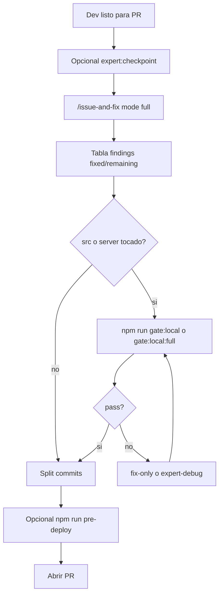

# Procedimiento pre-PR local — Issue-and-Fix + gates + commits

Reemplazo operativo de **Cursor Agent Review → Issue and Fix** cuando falla por `insufficient funds` o cuando quieres revisión + corrección local antes de abrir PR.

**Orden:** Issue-and-Fix → gates → commits separados → (opcional) pre-deploy → PR.

| Recurso | Uso |
|---------|-----|
| Orquestador skill | [`.cursor/skills/issue-and-fix/SKILL.md`](../../.cursor/skills/issue-and-fix/SKILL.md) |
| Fix body | [`.cursor/skills/bmc-issue-fix-reviewer/SKILL.md`](../../.cursor/skills/bmc-issue-fix-reviewer/SKILL.md) |
| Pipeline diagram | [`.cursor/skills/issue-and-fix/reference.md`](../../.cursor/skills/issue-and-fix/reference.md) |
| Gates npm | [`AGENTS.md`](../../AGENTS.md) — `gate:local`, `gate:local:full` |
| Traceability | [`orientation/EXPERT-DEV-TRACEABILITY.md`](./orientation/EXPERT-DEV-TRACEABILITY.md) |
| Estado repo | [`PROJECT-STATE.md`](./PROJECT-STATE.md) |



---

## Paso 0 — Antes de revisar

- [ ] `cd calculadora-bmc` (repo git activo).
- [ ] `git status` — distinguir **commits en rama** vs **staged** vs **untracked** (`??`). Un working tree limpio **no** implica “sin cambios” si la rama diverge de `main`.
- [ ] (Opcional) `npm run expert:checkpoint -- --message="antes de PR …"`.
- [ ] Si Cursor **Agent Review** muestra `Failed to run review: insufficient funds` → usar este procedimiento; **no** reintentar premium Agent Review.

---

## Paso 1 — Issue-and-Fix (revisión + corrección)

### Invocación

| Superficie | Cómo |
|------------|------|
| Cursor | `/calculadora-bmc/issue-and-fix` o chat: `issue and fix` |
| Claude Code | `/issue-and-fix` |
| Solo fix (sin Bugbot) | Agente `bmc-issue-fix-reviewer` o `issue and fix fix-only` |

### Modos

| Modo | Cuándo | Ejemplo |
|------|--------|---------|
| `full` (default) | Pre-PR habitual | `/issue-and-fix` |
| `uncommitted` | Solo WIP local | `/issue-and-fix uncommitted` |
| `fix-only` | Ya revisaste manualmente | `issue and fix fix-only` |
| `security` | Cambios auth / config / env | `/issue-and-fix security` |
| `review-only` | Solo hallazgos, sin editar | `review-only` |

### Qué esperar

Reporte con fases: Bugbot → Issue-Fix → (Security) → (Expert debug) → gate; tabla `Severity | Location | Finding | Status`.

### Criterio de salida

- [ ] 0 hallazgos **critical** / **high** en estado **remaining**, **o** documentados explícitamente en el body del PR.

---

## Paso 2 — Gates locales

Obligatorio si tocaste `src/` o `server/`:

```bash
npm run gate:local          # lint + test + test:api
# Cambios fuertes en UI / bundle:
npm run gate:local:full     # + build
```

- [ ] Gates en verde antes de PR.
- Si fallan: `fix-only` o skill `expert-debug-autonomous`; **no** abrir PR con gates rojos.

---

## Paso 3 — Commits (split recomendado)

| Commit | Contenido | Mensaje tipo |
|--------|-----------|--------------|
| A | `.cursor/`, `.claude/commands/` (tooling agentes) | `chore(cursor): …` |
| B | `src/`, `server/`, `tests/`, `docs/` producto | `feat(…):` / `fix(…):` |

- [ ] No mezclar tooling de agentes con features de producto.
- [ ] No commitear `.env` ni credenciales.
- [ ] Commits desde **terminal local** (hooks de Cursor pueden bloquear `git commit` desde el agente).

---

## Paso 4 — Pre-deploy (opcional, recomendado en merges grandes)

```bash
npm run pre-deploy   # API en :3001 o BMC_API_BASE
npm run smoke:prod   # si el cambio afecta API pública / MATRIZ
```

---

## Paso 5 — PR

- [ ] Body: resumen + tabla findings remaining + resultado gates.
- [ ] Si `PROJECT-STATE.md` cambió → línea en **Cambios recientes**.

---

## Troubleshooting

| Situación | Acción |
|-----------|--------|
| `insufficient funds` (Agent Review) | Usar `/issue-and-fix` |
| Diff vacío | Verificar scope: `branch` vs `uncommitted`; commits en rama sin dirty tree |
| Bugbot path error | Skill en `~/.cursor/skills-cursor/review-bugbot/SKILL.md` |
| Agent no puede `git commit` | Usuario commitea en terminal con mensajes del reporte |
| Reglas duplicadas | `/issue-and-fix` → orchestrator; `fix-only` → `bmc-issue-fix-reviewer` |

---

## Relación con otros procedimientos

- **Canales (WA / ML / correo):** [`PROCEDIMIENTO-CANALES-WA-ML-CORREO.md`](./PROCEDIMIENTO-CANALES-WA-ML-CORREO.md) — después de merge si el PR toca canales.
- **Human gates:** [`HUMAN-GATES-ONE-BY-ONE.md`](./HUMAN-GATES-ONE-BY-ONE.md) — no marcar OAuth/Meta como done sin evidencia.
- **Deploy prod:** skill `bmc-calculadora-deploy-from-cursor`.
