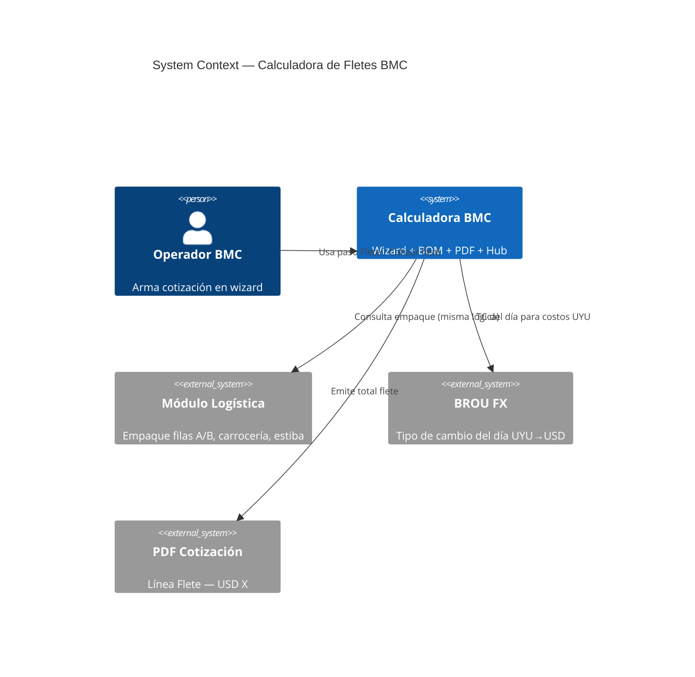
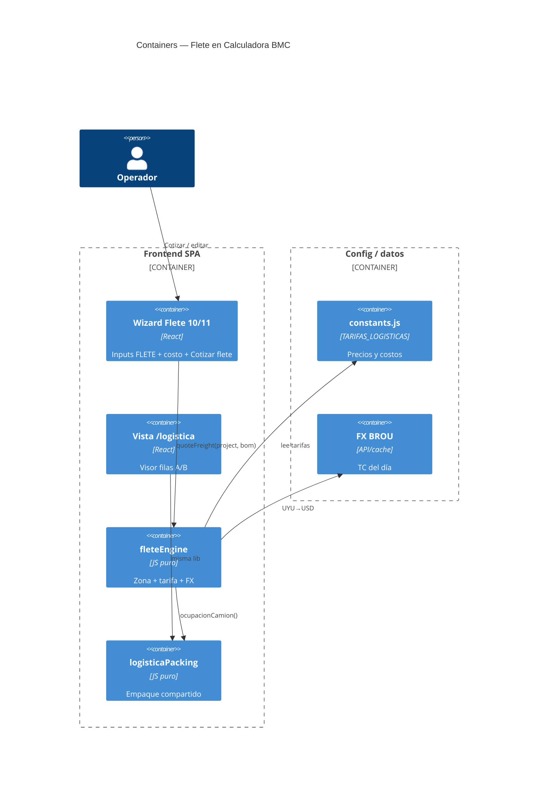
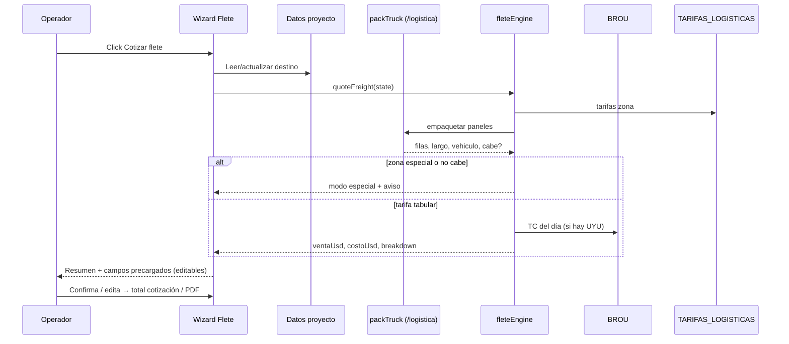

# System Design Document: Calculadora de Fletes BMC

## 1. Introduction & Goals

### 1.1 Problem Statement

Hoy el paso **Flete (10/11)** de Calculadora BMC es un input manual (`FLETE USD` + costo interno opcional). El precio estándar hardcodeado (`SERVICIOS.flete` ≈ USD 240/252) no refleja la lógica comercial real: zona, largo de panel, ocupación de filas del camión, remolque, camión largo, % sobre mercadería, ni el empaque de `/logistica`.

El operador necesita una acción **“Cotizar flete”** que calcule un precio sugerido (y costo interno) a partir del proyecto + BOM de paneles, manteniendo los campos actuales editables y el PDF sin desglose.

### 1.2 Goals

| ID | Goal | Priority |
|----|------|----------|
| G1 | Cotizar flete de **proyectos con paneles** con reglas de zona + vehículo + empaque | P0 |
| G2 | Reutilizar la lógica de empaque de **`/logistica`** (filas A/B, 8 m, altura ≤ 2,4 m) | P0 |
| G3 | Tarifas en **`constants.js`**, bloque identificable y editable | P0 |
| G4 | UX: paso Flete **igual**, + botón **Cotizar flete** con resumen + precarga editable | P0 |
| G5 | PDF cliente: solo línea **“Flete — USD X”** | P0 |
| G6 | Interior lejos / casos no tabulares → modo cotización especial (manual) | P1 |

### 1.3 Stakeholders

| Role | Interest |
|------|----------|
| Operador comercial BMC | Precio rápido, override, margen visible |
| Logística | Empaque real (filas, largo, altura legal) |
| Ingeniería Calculadora | Integración wizard + `/logistica` + constants |
| Cliente final | Ve solo total de flete en USD |

### 1.4 Out of scope (v1)

- Flete puro de accesorios/perfilería sin paneles
- Admin UI / Google Sheet para tarifas (v1 = constants)
- Recargos grúa / espera / fin de semana (no definidos)
- Cotización automática de interior lejos (queda manual)

---

## 2. Context & Scope (C4 Level 1)



### External interfaces

| Interface | Direction | Protocol | Description |
|-----------|-----------|----------|-------------|
| Wizard state (proyecto, BOM paneles) | ← internal | React state | Destino, m², espesores, largos, tipo panel |
| Motor empaque `/logistica` | ← internal | JS module | Filas A/B, largo, altura, paquetes |
| BROU FX | → HTTPS / existing FX helper | Rate UYU→USD | Costos y ventas en UYU |
| PDF / totales | → internal | Quote model | Solo monto final USD entero |

---

## 3. Constraints

- **Stack existente**: React 18 + Vite + Express; sin microservicio nuevo en v1.
- **Moneda cliente**: USD; costos internos frecuentemente en UYU.
- **TC**: BROU del día; redondeo a **USD entero**.
- **Altura legal**: estiba máx. **2,4 m** (hard limit, no recargo).
- **Carrocería estándar**: **8 m**; alternativa **12–14 m** si no entra.
- **Filas**: A y B (ancho partido a la mitad) — “medio camión” = **1 fila**.
- **UI**: no rediseñar el paso; agregar opción **Cotizar flete**.
- **Tarifas**: `constants.js`, bloque bien identificado (listas para modificar).
- **Override**: siempre editable después de cotizar.

---

## 4. Solution Strategy

- **Estilo**: motor puro JS (`calcFlete` / packing) + UI thin en paso 10/11.
- **Empaque**: **misma lógica que `/logistica`** (no duplicar reglas ad-hoc).
- **Flujo**: destino (proyecto o dirección en paso Flete) → clasificar zona → empaquetar paneles → clasificar vehículo/ocupación → aplicar tarifa → precargar + mostrar resumen → operador confirma/edita.
- **Trade-off aceptado**: tarifas en código (deploy para cambiar) a cambio de simplicidad v1.
- **Degradación**: zona no tabular / packing ambiguo → “Cotización especial” + campos manuales (como hoy).

---

## 5. Container View (C4 Level 2)



---

## 6. Component View — Motor de flete

| Component | Responsibility | I/O |
|-----------|----------------|-----|
| `resolveDestino` | Lee datos proyecto o input del paso; sincroniza ambos | → `{ depto, localidad, zonaId }` |
| `classifyZona` | Mapea destino → zona tarifaria | → `retiro \| costa \| mvd \| canelones \| maldonado_corredor \| especial` |
| `buildPanelLoads` | Extrae paneles del BOM (tipo, espesor, largo, cant) | → `PanelLoad[]` |
| `packTruck` (`/logistica`) | Empaque óptimo filas A/B, paquetes, altura ≤ 2,4 m | → `{ filasUsadas, largoMax, vehiculo, cabe }` |
| `selectTarifa` | Aplica tabla + % mercadería + FX | → `{ ventaUsd, costoUsd, breakdown }` |
| `applyQuoteToWizard` | Precarga campos editables + UI resumen | mutates wizard state |

### AI Architecture

**N/A** en v1 (sin LLM). Futuro opcional: sugerir zona desde dirección libre.

---

## 7. Domain Rules (fuente: entrevista)

### 7.1 Retiro en planta

| Condición | Venta | Costo |
|-----------|-------|-------|
| Retiro Colonia Nicolich | **USD 0** | 0 |

### 7.2 Capacidad y empaque

| Regla | Valor |
|-------|-------|
| Carrocería estándar | 8 m |
| Filas | A y B (mitad de ancho cada una) |
| “Medio camión” / 1 fila | Ocupa fila A **o** B; deja la otra libre |
| Camión completo (ancho) | Usa A **y** B → **1 viaje**, no 2× tarifa de 1 fila |
| Altura máx. estiba | **2,4 m** (legal; hard stop) |
| Si aprieta altura | Reorganizar óptimo en espacio disponible |
| Si no cabe en 8 m tras optimizar | Evaluar camión **12–14 m** |
| ISOTECHO / ISOPARED / ISODEC | Altura panel = espesor + **2 cm**; paquetes: 10→8, 15→6, 20→5, 25→4 |
| ISOROOF | Apilado invertido; cada **2** paneles: e1 + e2 + **4 cm** (nervio trapezoidal) |
| Scope carga | Proyectos **con paneles** (accesorios no condicionan v1) |

### 7.3 Zonas

| Zona ID | Cobertura | Notas |
|---------|-----------|-------|
| `retiro` | Planta Colonia Nicolich | USD 0 |
| `ciudad_costa` | Ciudad de la Costa | ~10% más barato que Maldonado (1 fila) |
| `mvd` | Montevideo capital | mín + % |
| `canelones` | Canelones **fuera** de Costa | mín + % |
| `maldonado_corredor` | Maldonado ciudad + **todas** localidades entre MVD y Maldonado | Tarifa tabular principal |
| `especial` | Interior lejos (Salto, Paysandú, Tacuarembó, etc.) | Cotización caso a caso (manual) |

### 7.4 Tarifas — corredor Maldonado / MVD–Maldonado

| Escenario empaque | Costo típico (UYU) | Venta |
|-------------------|--------------------|-------|
| ≤ 8 m, **1 fila** | (implícito / margen) | **USD 280** fijo |
| ≤ 8 m, **2 filas** (camión completo) | **UYU 18.000** | **costo + UYU 3.000** → UYU 21.000 → USD entero vía BROU |
| \> 8 m (remolque) | **UYU 24.000** | **UYU 28.000** → USD entero vía BROU |
| Camión 12–14 m | — | **≈ USD 650** |

Regla general margen camión completo: **+ UYU 3.000 sobre costo**.

### 7.5 Tarifas — Ciudad de la Costa

| Escenario | Venta |
|-----------|-------|
| ≤ 8 m, 1 fila | **USD 252** (= 280 × 0,90) |
| Otros | Misma lógica relativa / TBD al implementar (aplicar −10% o costos propios) |

### 7.6 Tarifas — Montevideo y Canelones

Base mercadería = **toda la cotización sin flete** (sin IVA del flete; subtotal quote excluyendo línea flete).

| Zona | Mínimo USD | % | Regla |
|------|------------|---|-------|
| Montevideo | **150** | **10%** | `venta = max(150, round(0.10 * cotizacionSinFlete))` |
| Canelones (no Costa) | **220** | **10%** | `venta = max(220, round(0.10 * cotizacionSinFlete))` |

### 7.7 FX y redondeo

- TC: **BROU del día**
- Conversiones UYU→USD y resultado final: **entero USD**

### 7.8 UX / PDF

| Tema | Decisión |
|------|----------|
| Paso Flete | Se mantiene como está |
| Nueva acción | **Cotizar flete** |
| Al cotizar | Precarga FLETE + costo interno **y** muestra **resumen** (zona, filas, tipo vehículo) |
| Override | Sí, todo editable |
| Costo interno | Precompletado + editable |
| Destino | Desde Datos del proyecto; si se carga dirección en paso Flete, **también completa** proyecto |
| PDF | Solo **“Flete — USD X”** |

### 7.9 Configuración

Bloque propuesto en `src/data/constants.js` (nombre orientativo):

```js
export const TARIFAS_LOGISTICAS = {
  fxSource: "brou_diario",
  redondeoUsd: "entero",
  alturaMaxEstibaM: 2.4,
  carroceriaEstandarM: 8,
  carroceriaLargaM: { min: 12, max: 14 },
  margenCamionCompletoUyu: 3000,
  apilado: {
    defaultExtraCmPorPanel: 2,
    isoroof: { nervioCm: 4, modo: "invertido_pares" },
    paquetesPorEspesorCm: { 10: 8, 15: 6, 20: 5, 25: 4 },
  },
  zonas: {
    retiro: { ventaUsd: 0 },
    maldonado_corredor: {
      unaFilaUsd: 280,
      camionCompletoCostoUyu: 18000,
      remolqueCostoUyu: 24000,
      remolqueVentaUyu: 28000,
      camionLargoVentaUsd: 650,
    },
    ciudad_costa: {
      unaFilaUsd: 252, // 280 * 0.9
      factorVsMaldonado: 0.9,
    },
    mvd: { minimoUsd: 150, pctSobreCotizacionSinFlete: 0.10 },
    canelones: { minimoUsd: 220, pctSobreCotizacionSinFlete: 0.10 },
    especial: { modo: "manual" },
  },
};
```

---

## 8. Data Flow — “Cotizar flete”



---

## 9. Quality attributes

### 9.1 Security
- Sin secretos nuevos; FX vía integración existente.
- Override manual no bypassa auth del hub (mismos grants que cotización).

### 9.2 Reliability
- Si BROU falla: no bloquear cotización; aviso + permitir carga manual (venta/costo).
- Si packing falla: degradar a especial/manual.

### 9.3 Performance
- Cálculo local síncrono; FX cacheable (TTL corto, ej. 1h o sesión).

### 9.4 Observability
- Log opcional (dev): zona, filas, vehículo, venta, costo, TC usado (sin PII de cliente en prod logs).

### 9.5 Cost
- Sin LLM; costo = mantenimiento de tarifas + 1 call FX/día.

---

## 10. Architecture Decision Records

### ADR-001: Empaque compartido con `/logistica`

**Status**: Accepted  
**Context**: “Medio camión” = 1 fila A/B; altura y paquetes ya modelados en logística.  
**Decision**: Cotizar flete llama la **misma** lib de empaque.  
**Consequences**: + Una sola fuente de verdad; − Acopla release de flete a calidad del packer.

### ADR-002: Tarifas en `constants.js` (`TARIFAS_LOGISTICAS`)

**Status**: Accepted  
**Context**: Operador quiere listas claras y editables en repo.  
**Decision**: v1 en constants, bloque dedicado.  
**Consequences**: + Simple; − Cambio de precio requiere deploy/PR.

### ADR-003: UI = paso actual + “Cotizar flete” + resumen

**Status**: Accepted  
**Context**: No rediseñar el paso 10/11.  
**Decision**: Mantener inputs; botón calcula, precarga y muestra breakdown interno.  
**Consequences**: + Bajo riesgo UX; − Resumen debe ser compacto.

### ADR-004: PDF sin desglose

**Status**: Accepted  
**Decision**: Cliente ve solo `Flete — USD X`.  
**Consequences**: Breakdown solo interno/operador.

### ADR-005: Interior = manual

**Status**: Accepted  
**Decision**: Zonas no tabulares → cotización especial caso a caso.  
**Consequences**: Motor no inventa precio; obliga override.

### ADR-006: FX BROU + redondeo entero

**Status**: Accepted  
**Decision**: Costos/ventas en UYU se convierten con BROU del día a USD entero.  
**Consequences**: Precios varían día a día en escenarios UYU.

---

## 11. Risks & Technical Debt

| Risk | Impact | Likelihood | Mitigation |
|------|--------|------------|------------|
| Lista incompleta de localidades corredor MVD–Maldonado | Precio wrong zone | Medium | Empezar por depto/heurística + override; refinar mapa |
| Packing `/logistica` incompleto para ISOROOF | Estiba incorrecta | Medium | Tests unitarios de apilado invertido |
| BROU down | No auto-costo | Low | Fallback manual |
| Camión 12–14 m solo ≈650 a Maldonado | Otras zonas sin tarifa | Medium | Forzar especial fuera de corredor |
| % sobre cotización circular (flete entra en total) | Bug | Medium | Base = total **sin** línea flete |

---

## 12. Delivery plan (sugerido)

| Phase | Entregable |
|-------|------------|
| P0 | `TARIFAS_LOGISTICAS` + `fleteEngine` unit tests (casos entrevista) |
| P1 | Wire “Cotizar flete” en paso 10/11 + resumen + sync destino↔proyecto |
| P2 | Integrar `packTruck` real de `/logistica` (ISOROOF + paquetes) |
| P3 | FX BROU + costo interno prefill |
| P4 | Documentar en PROJECT-STATE + ejemplos operador |

### Definition of Done (v1)

- [ ] Retiro = 0
- [ ] Maldonado 1 fila ≤8 m → 280; Costa → 252
- [ ] 2 filas ≤8 m → costo+3000 UYU → USD entero
- [ ] \>8 m → venta UYU 28000 → USD entero
- [ ] 12–14 m corredor → ~650 USD
- [ ] MVD / Canelones = max(mín, 10% cotización sin flete)
- [ ] Especial → no auto-precio
- [ ] Override + PDF solo total
- [ ] Empaque alineado a `/logistica`

---

## 13. Glossary

| Term | Meaning |
|------|---------|
| Fila A/B | Mitad del ancho de la caja del camión |
| Medio camión | Ocupación de **una** fila |
| Remolque | Vehículo para paneles **> 8 m** |
| Cotización sin flete | Subtotal de la quote excluyendo la línea de flete |
| Cotización especial | Precio manual caso a caso |
| BROU del día | Tipo de cambio usado para UYU→USD |

---

## 14. Open questions (post-v1)

1. Ciudad de la Costa: ¿−10% también en camión completo / remolque / 12–14 m?
2. Mapa canónico de localidades → zona (lista exhaustiva).
3. Costo UYU del camión 12–14 m (hoy solo venta ≈650).
4. ¿Integrar cotización especial con request a fletero (WhatsApp/Sheets) más adelante?

---

## Changelog

| Ver | Date | Notes |
|-----|------|-------|
| 0.1 | 2026-07-17 | Header Phase 0 |
| 0.2 | 2026-07-17 | Reglas completas entrevista casos 1–32; ADR; plan entrega |
| 0.3 | 2026-07-17 | Implementation: TARIFAS_LOGISTICAS, fleteEngine, cargoPacking (2.4 m), Cotizar flete UI, tests |
