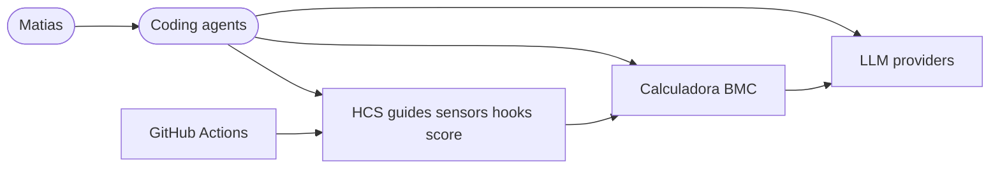

# System Design Document: BMC Harness Control System (HCS)

## 1. Introduction & Goals

### 1.1 Problem statement

LLMs are non-deterministic and lack organizational memory. Calculadora BMC already has rich gates, goldens, multi-agent docs, and a product control plane — but they were **fragmented**. Without a named control system, agents re-fail the same classes of mistakes, release paths silently skip goldens, and humans over-supervise.

### 1.2 Goals

1. **Unify** product (Layer A) and coding (Layer B) harness under one HCS map and scorecard.  
2. **Enforce** safety and taste invariants with hooks and release sensors, not hope.  
3. **Close the flywheel**: traces → feedback → evals → permanent ratchet.  
4. Reach **expert-complete** quality: composite score ≥ 90 and DoD D1–D12 green.  
5. Preserve **human gates** for OAuth, finanzas, and confirmed writes.

### 1.3 Non-goals

- Full unattended autonomy on channels or finance.  
- Replacing Claude Code / Cursor with a custom agent product.  
- LangGraph migration as a prerequisite.

### 1.4 Stakeholders

| Role | Interest |
|------|----------|
| Matias | Steer quality, approve human gates |
| Coding agents | Load guides, hit sensors, self-correct |
| Operators | Trust Panelin / channel AI outputs |
| Future reviewers | Audit HCS via scorecard + map |

### 1.5 Solution strategy

**Agent = Model + Harness.** Six planes (intent, product runtime, coding outer, sensors, flywheel, governance). Prefer computational sensors quality-left; inferential evals on release/weekly; failure-earned guides only.

---

## 2. Current → Target

| | Baseline (pre-HCS) | Target (expert complete) |
|--|-------------------:|-------------------------:|
| Composite (top-level bar) | ~54 | ≥90 |
| Hooks | SessionStart only | Pre + Post tool hooks |
| agentGolden cases | 5 | ≥15 |
| Release goldens | skip-friendly only | `pre-release` + GOLDEN_REQUIRED |
| Cost telemetry | ad-hoc console TODO | `costTelemetry` module |
| Inventory | implicit | HARNESS-MAP + score |

---

## 3. Architecture

### 3.1 Dual layer

```
Layer B Coding outer → implements/verifies → Layer A Product agents → serves → SPA/Hub/Channels
```

### 3.2 Planes

See `docs/team/harness/HARNESS-MAP.md` and `docs/team/harness/README.md`.

### 3.3 Loops

- **A** Product request: control plane → tools/RAG → sensors → human confirm on write → cost log  
- **B** Coding change: guides → plan → execute → post-edit sensors → gate:local → CI → smoke  
- **C** Flywheel: failure → sensor/guide → score  
- **D** PEV long-horizon: Plan → Execute → Verify → handoff reset  

### 3.4 Context diagram



---

## 4. Layer A — Product agent harness

| Component | Role |
|-----------|------|
| `assistantRegistry` | Assistants, health, fallback to seam |
| `requireAssistantEnabled` | ASSISTANTS_ACTIVE gate |
| `agentCore` + tools + RAG | Runtime brain |
| `costTelemetry` | Structured cost/usage events |
| agentGolden | Trajectory behaviour sensors |
| catalog golden-cases | Commercial taste invariants |
| promptfoo / eval:agent | Inferential rubrics |

---

## 5. Layer B — Coding outer harness

| Component | Role |
|-----------|------|
| AGENTS.md + CLAUDE.md | Pilot checklist + architecture |
| RULE-PROVENANCE / SKILL-INDEX | Failure-earned + progressive load |
| PreToolUse / PostToolUse hooks | Deny destructive; quality inject |
| gate:local / pre-release / harness:score | Computational sensors |
| harness-ratchet skill | Flywheel actuator |
| ship / live-fix / closeout | Operational loops |

---

## 6. Quality & security

- **Security:** deny-list hooks; no secrets in src (fitness); human gates retained.  
- **Reliability:** provider failover in agentCore; release goldens fail closed when required.  
- **Observability:** costTelemetry JSON events.  
- **Cost:** cache_read metrics for Anthropic; score dimension observability_cost.  

---

## 7. ADRs

### ADR-H1: Dual harness under one HCS  
**Decision:** One SDD + map for Layer A and B.  
**Consequence:** Shared scorecard; clearer ownership.

### ADR-H2: Taste invariants hard-fail release  
**Decision:** `pre-release` runs catalog goldens + GOLDEN_REQUIRED agent goldens.  
**Consequence:** Release needs keys/API for agent goldens; catalog goldens always offline.

### ADR-H3: Hooks over prose for safety  
**Decision:** PreToolUse deny force-push / DROP / catastrophic rm.  
**Consequence:** Platform-specific wiring; scripts are repo source of truth.

### ADR-H4: Failure-earned rules only  
**Decision:** RULE-PROVENANCE required for AGENTS growth; ≤80 lines.  
**Consequence:** Less context rot.

### ADR-H5: Human gates intentional  
**Decision:** Presence of gates is score PASS (D12).  
**Consequence:** No “full autonomy” marketing for finance/channels.

### ADR-H6: Defer LangGraph  
**Decision:** Doc + git + score until ≥90 without new orchestrator engine.  
**Consequence:** Faster path to expert complete.

### ADR-H7: Flywheel is first-class  
**Decision:** harness-ratchet + SCORECARD + RATCHET-EXAMPLE.  
**Consequence:** Continuous improvement after go-live.

### ADR-H8: Goldens optional on every PR, required on release  
**Decision:** unit CI keeps skip-friendly agent goldens; pre-release requires them.  
**Consequence:** Cost control without silent release.

---

## 8. DoD D1–D12

| ID | Criterion |
|----|-----------|
| D1 | HARNESS-MAP |
| D2 | RULE-PROVENANCE + AGENTS |
| D3 | Pre + Post hooks |
| D4 | architecture-fitness tests |
| D5 | pre-release + catalog goldens |
| D6 | eval:agent |
| D7 | harness-ratchet skill |
| D8 | assistant control plane tests + registry |
| D9 | costTelemetry wired |
| D10 | harness:score ≥ 90 |
| D11 | PEV in harness README |
| D12 | Human gates documented + present |

Automated in `scripts/harness-score.mjs` → `docs/team/harness/SCORECARD.json`.

---

## 9. Risks

| Risk | Mitigation |
|------|------------|
| Score gaming | Sensors must be runnable; fitness checks gates still present |
| Hook platform drift | Bash scripts + package.json sensors portable |
| Golden flake | Offline catalog always; agent goldens release-only required |

---

## 10. Glossary

| Term | Meaning |
|------|---------|
| HCS | Harness Control System |
| Guide | Feedforward control |
| Sensor | Feedback control |
| PEV | Plan–Execute–Verify |
| Taste invariant | Hard commercial/code rule that fails release |
| Ratchet | Permanent harness upgrade from a failure |
