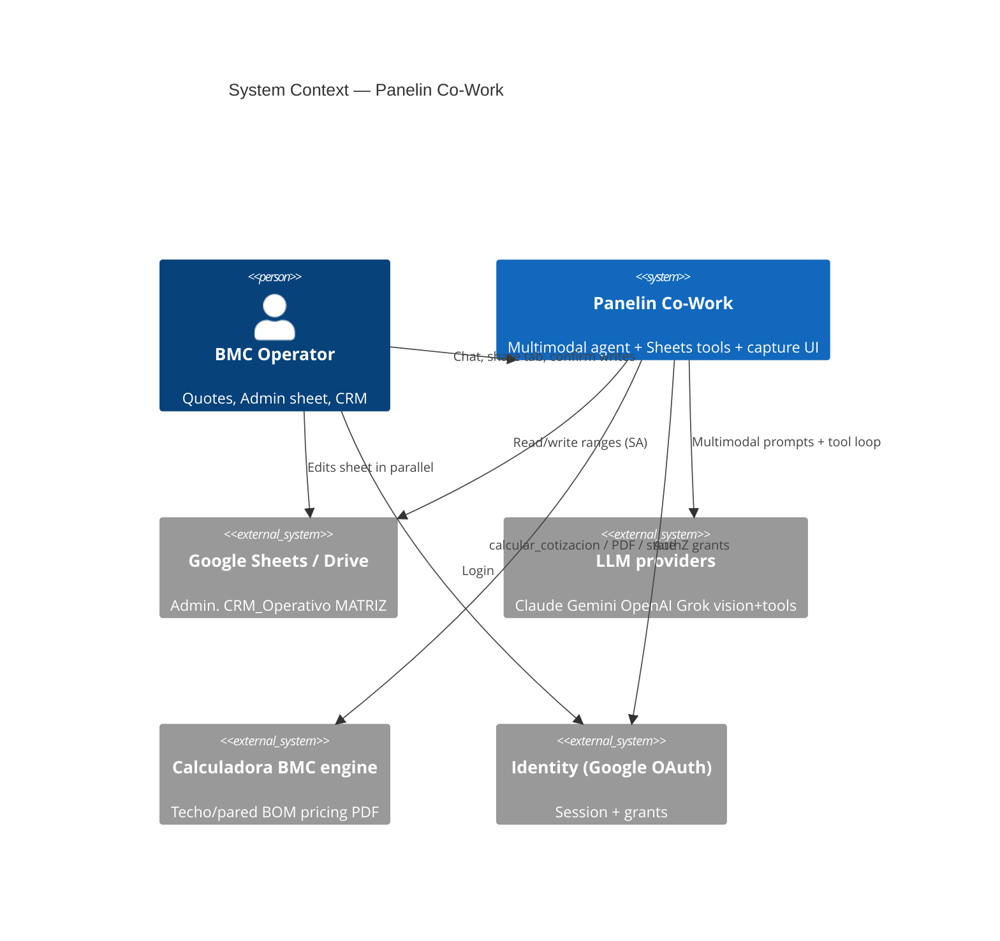
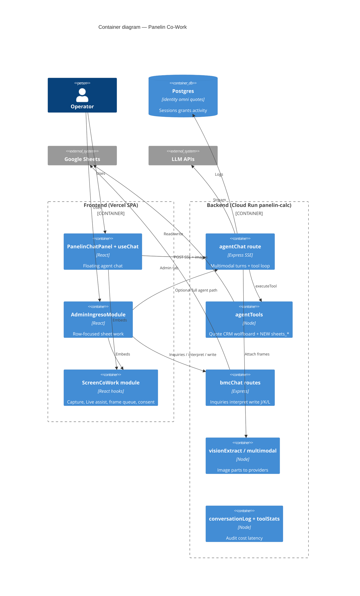
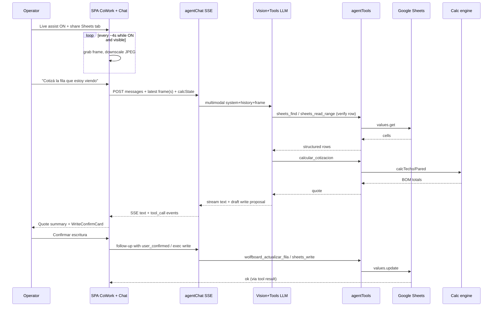
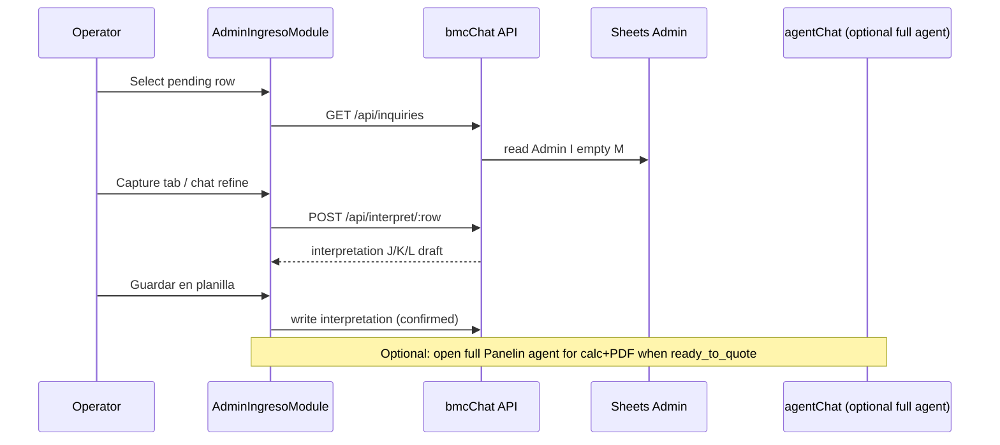
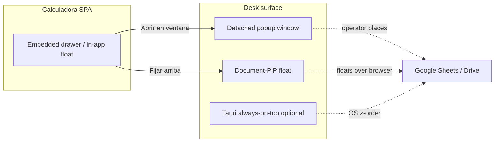
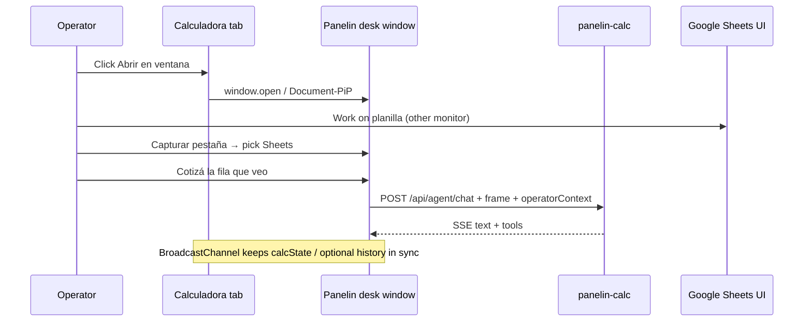

# System Design Document: Panelin Co-Work

**Subtitle:** Real-time operator co-pilot — screen awareness + Google Sheets read/write + quote tools  
**Stack host:** Calculadora BMC / `panelin-calc` (Cloud Run) + Vercel SPA  
**Maturity:** Additive capability on existing agent (not greenfield)

---

## 0. Project context (discovery)

| Field | Value |
|-------|--------|
| **System name** | Panelin Co-Work |
| **Purpose** | Let operators work *with* Panelin while looking at Drive Sheets / calculator — agent sees context, picks data, quotes, writes cells with confirmation |
| **Type** | Multimodal operator agent (SSE chat + tools + vision frames + Sheets API) |
| **AI** | Multi-provider LLM agents (Claude / Gemini / OpenAI / Grok), tool-calling, optional RAG/Training KB, vision |
| **Users** | BMC operators / admin (Matias, Ramiro, team) — **not** public calculator visitors |
| **Scale** | Small team (≤15 concurrent operators); low RPS, high value per session |
| **Environment** | GCP (`chatbot-bmc-live`) Cloud Run + Vercel + Google Sheets/Drive + Doppler secrets |
| **Maturity** | Extend existing Panelin agent + Admin Ingreso + Sheets stack |
| **Stakeholders** | Matias (owner), operators, implementer agents, future auditors |
| **Output** | This SDD → `docs/team/SDD-PANELIN-COWORK.md` after approve |

### Locked product decisions (session 2026-07-17)

| # | Decision |
|---|----------|
| D1 | **Hybrid** architecture: Sheets API = source of truth for numbers; vision frames = situational awareness |
| D2 | **Both surfaces** v1: Panelin floating chat **and** `/hub/admin-ingreso` |
| D3 | **Live assist frames** in v1 (periodic ~4s) **plus** one-shot capture / paste |
| D4 | Writes always require **explicit human confirm** (`user_confirmed` server gate) |
| D5 | Prefer **current browser tab** capture over full desktop |
| D6 | Primary workbooks: **Admin.** + **CRM_Operativo** (MATRIZ read-only later) |
| D7 | **Independent window** for Co-Work Panelin: can leave the calculator shell, sit over Google Sheets / other apps, multi-monitor desk placement (see §10.4) |

---

## 1. Introduction & Goals

### 1.1 Problem statement

BMC operators live in Google Sheets (Admin inquiries, CRM_Operativo) and the calculator at the same time. Panelin can already quote, generate PDFs, and write CRM/Admin rows via tools — but it is **blind** to *what the operator is looking at*. Operators must retype row numbers, paste cell values, and describe UI state. That breaks flow during high-volume cotización days and causes wrong-row mistakes.

Meanwhile, true continuous “Zoom-style” screen share into an LLM is costly and imprecise for cell values. The system must give **“he can see what I’m doing”** without sacrificing **exact sheet data** and without silent destructive writes.

A second UX gap: if Panelin only lives **inside** the calculadora window, the operator cannot park the chat **next to / on top of** Sheets while working on another monitor. Co-Work needs a **desk-native window** so Panelin can sit beside the planilla like a colleague.

### 1.2 Goals

| Priority | Goal | Measurable success |
|----------|------|-------------------|
| P0 | Operator can share the Sheets tab (one-shot or Live assist) so Panelin describes visible context | Capture → assistant references visible rows/tabs within 1 turn |
| P0 | Agent reads exact Admin/CRM data via API before quoting | Quote totals match Sheets API data, not OCR alone |
| P0 | Agent writes J/K/L, CRM, or wolfboard fields only after confirm | Zero unconfirmed writes in audit log |
| P0 | Same co-work UX on floating Panelin **and** Admin Ingreso | Shared client module + shared backend contracts |
| P0 | **Independent / desk window** — open Panelin outside the calculadora frame and place it over Sheets or on another monitor | One click “Abrir en ventana” → movable OS window; Co-Work tools still work |
| P1 | Live assist (~4s frames) while toggle ON | Frames stop when toggle OFF / panel closed / tab hidden |
| P1 | **Always-on-top / PiP-style** desk companion where browser APIs allow | Document-PiP or equivalent floats over browser while editing Sheets |
| P2 | Selection-aware context (active range) without pixels | Phase 2: extension or Sheets sidebar |
| P2 | True desktop always-on-top (Tauri / native) if web APIs insufficient | Optional desktop shell later |

### 1.3 Non-goals (v1)

- Continuous WebRTC video streaming to the model  
- Agent controlling mouse/keyboard  
- **Automating WhatsApp Web** (open chats, click, type, add contacts) — Co-Work is JPEG context only; WA actions use Cloud API / Omni  
- Public anonymous screen share  
- Reading personal Drive files outside BMC service-account workbooks  
- Unattended bulk sheet rewrites  
- Replacing Admin Ingreso / bmc-chat Cloud Run entirely (compose, don’t fork)

### 1.4 Stakeholders

| Role | Interest |
|------|----------|
| Owner (Matias) | Throughput, correctness of quotes/CRM, privacy |
| Operators | Speed, “just work with me”, clear confirm UX |
| Implementers | Clear APIs, reuse paths, test plan |
| Security / ops | Auth, PII in frames, cost caps, audit |

---

## 2. Constraints

| Type | Constraint |
|------|------------|
| **Stack** | React 18 + Vite SPA (Vercel); Express 5 API on Cloud Run `panelin-calc`; Google Sheets v4 via service account |
| **Agent** | Existing `POST /api/agent/chat` SSE + `AGENT_TOOLS` + `agentCore` / multi-provider |
| **Auth** | Google OAuth identity + grants; write tools need Bearer / operator token (`TOOLS_REQUIRING_AUTH`) |
| **Secrets** | Doppler `bmc-frontend/prd` + `bmc-backend/prd`; Cloud Run Secret Manager |
| **Privacy** | Frames contain client PII (names, phones) — opt-in capture only; default **no long-term frame storage** |
| **Cost** | Vision tokens dominate if Live assist is careless — hard rate limits required |
| **Browser** | Capture requires secure context (HTTPS/localhost) + user gesture for `getDisplayMedia` |
| **Locale** | Operator UX in Spanish (rioplatense) |
| **Human gate** | Protocol: no silent production writes; `user_confirmed` pattern already law for CRM/wolfboard |

---

## 3. Solution strategy

### 3.1 Architecture style

**Modular monolith extension** inside `calculadora-bmc`:

- New **Co-Work client module** (shared React hooks/components)
- New **multimodal + sheets tools** on existing Express agent
- No new microservice for v1

### 3.2 Core design principle

> **Vision proposes; Sheets API verifies; human confirms; tools execute.**

```
┌─────────────────────────────────────────────────────────┐
│  OPERATOR BRAIN LOOP                                    │
│  see (frames) → understand (LLM) → verify (Sheets API)  │
│       → quote (calc tools) → propose write → CONFIRM    │
└─────────────────────────────────────────────────────────┘
```

### 3.3 Key technology choices

| Choice | Why |
|--------|-----|
| `getDisplayMedia` / prefer current tab | Native, no install, tab-scoped privacy |
| Periodic JPEG frames (not video) | Works with existing multimodal APIs; controllable cost |
| Extend `content` to multimodal parts on chat | Minimal API surface change vs parallel upload service |
| Reuse `visionExtract` + provider vision models | Already multi-provider |
| Expand `AGENT_TOOLS` for sheets ranges | Same tool-loop as quote/CRM |
| Shared `useScreenCoWork` hook | One implementation for Panelin + Admin Ingreso |

### 3.4 Trade-offs accepted

| Accept | Reject |
|--------|--------|
| Frame OCR can be wrong → always verify via API | Vision-only writes |
| Live assist costs tokens when ON | Always-on silent desktop recording |
| Confirm step adds one click | Fire-and-forget sheet mutations |
| Service-account sheets only in v1 | Full user OAuth Drive file picker |

---

## 4. System context (C4 Level 1)



### External interfaces

| Interface | Direction | Protocol | Description |
|-----------|-----------|----------|-------------|
| Browser ↔ SPA | ↔ | HTTPS | UI + capture |
| SPA ↔ `panelin-calc` | → | HTTPS SSE/JSON | `/api/agent/chat`, sheets tools, bmcChat routes |
| API ↔ Sheets | → | Google Sheets API v4 | Service account |
| API ↔ LLM | → | Provider HTTPS | Multimodal + tools |
| Operator ↔ Google Drive UI | ↔ | Browser | Parallel human editing |

---

## 5. Container view (C4 Level 2)



---

## 6. Component view (C4 Level 3)

### 6.1 Frontend — ScreenCoWork module

| Component | Responsibility |
|-----------|----------------|
| `useScreenCapture` | `getDisplayMedia`, track lifecycle, stop on unmount/visibility |
| `useLiveAssist` | Interval (default 4000ms), capture frame → downscale → JPEG quality, enqueue |
| `framePipeline` | Max width 1280, quality ~0.7, drop if > maxBytes, debounce while streaming |
| `CoWorkToolbar` | Buttons: Capturar · Live assist ON/OFF · consent badge · last frame thumbnail |
| `WriteConfirmCard` | Shows proposed cell edits / tool input; Confirm / Cancel posts `user_confirmed` |
| `useChat` extension | Messages support `attachments: [{mime, dataBase64, source, ts}]` |

**Surfaces integration:**

| Surface | Integration |
|---------|-------------|
| `PanelinChatPanel` | Toolbar under header; frames attach to next send or auto-send on Live “context tick” |
| `AdminIngresoModule` | Same toolbar; inject `operator_context.row` from selected inquiry; prefer bmcChat write path for J/K/L |

### 6.2 Backend — Agent co-work

| Component | Responsibility |
|-----------|----------------|
| Multimodal message normalizer | Accept `content` string **or** parts `[{type:text},{type:image,mime,data}]` |
| Provider adapters | Claude / Gemini / OpenAI / Grok image blocks (extend existing branches in `agentChat.js`) |
| Co-work system prompt block | Rules: frames=hint; verify via sheets tools; never write without confirm |
| `sheets_*` tools | List tabs, read range, find, get pending, propose write, confirmed write |
| Budget / rate limiter | Per-session frame tokens; reject Live floods |
| Audit | Log capture_session_start/stop, frame_count, tool calls, write diffs |

### 6.3 Sheets domain

| Workbook | Tab | Access | Notes |
|----------|-----|--------|-------|
| Wolfboard Admin (`WOLFB_ADMIN_SHEET_ID`) | `Admin.` | R/W confirmed | Inquiries I, J/K/L, M |
| Same | `_BMC_ChatState` | R/W | Conversation state (existing) |
| CRM workbook | `CRM_Operativo` | R/W confirmed | Existing `guardar_en_crm` |
| MATRIZ | price tabs | R only v1 | Optional later |

Reuse: `bmcChatSheets.js`, CRM mappers, `wolfboard_*` tools, `sanitizeCellValue`.

---

## 7. Data flows

### 7.1 Primary flow — Live assist + quote + write Admin



### 7.2 Admin Ingreso specialized flow



### 7.3 Frame lifecycle

```
[User gesture] getDisplayMedia
      → MediaStream track
      → canvas.drawImage (video frame)
      → toBlob image/jpeg q=0.7 maxW=1280
      → base64 in memory only
      → attach to chat request
      → discard after send (unless debug flag)
[Stop] track.stop + clear interval + UI badge OFF
```

**Never** upload frames to GCS by default. Optional `COWORK_FRAME_DEBUG=1` local only.

---

## 8. API contracts

### 8.1 Extend `POST /api/agent/chat`

Existing body:

```json
{
  "messages": [{ "role": "user|assistant", "content": "string" }],
  "calcState": {},
  "aiProvider": "auto|claude|...",
  "aiModel": "...",
  "conversationId": "...",
  "surface": "panelin_chat",
  "devMode": false
}
```

**Additive fields:**

```json
{
  "messages": [
    {
      "role": "user",
      "content": "Cotizá esta fila",
      "attachments": [
        {
          "type": "image",
          "mime": "image/jpeg",
          "data": "<base64 no data-url prefix>",
          "source": "live_assist|oneshot|paste",
          "capturedAt": "2026-07-17T12:00:00.000Z"
        }
      ]
    }
  ],
  "operatorContext": {
    "surface": "panelin_chat|admin_ingreso",
    "selectedRow": 14,
    "workbook": "admin|crm",
    "liveAssist": true
  },
  "cowork": {
    "sessionId": "uuid",
    "frameIndex": 3
  }
}
```

**Limits (server-enforced):**

| Limit | Value |
|-------|--------|
| Max attachments / request | 2 |
| Max decoded image bytes | 1.5 MB each |
| Max Live assist sends / min / session | 20 |
| Max concurrent Live sessions / user | 1 |
| Allowed mime | `image/jpeg`, `image/png`, `image/webp` |

### 8.2 New agent tools

| Tool | Auth | Confirm | Description |
|------|------|---------|-------------|
| `sheets_list_tabs` | read grant | no | List tabs for known workbook ids |
| `sheets_read_range` | read grant | no | `spreadsheet` + A1 range → values + headers |
| `sheets_find` | read grant | no | Search column text, return row hits |
| `sheets_get_pending_admin` | read grant | no | Wrap existing pending inquiries |
| `sheets_propose_write` | read grant | no | Returns dry-run diff only (no write) |
| `sheets_write_range` | write grant | **yes** | `user_confirmed=true` + exact values |
| *(existing)* `wolfboard_actualizar_fila` | write | **yes** | Prefer for Admin J/K/L/M |
| *(existing)* `guardar_en_crm` | write | **yes** | CRM row |
| *(existing)* `calcular_cotizacion` / `generar_pdf` | mix | per tool | Quote path |

All write tools remain in `TOOLS_REQUIRING_AUTH` + `user_confirmed` validation in `executeTool`.

### 8.3 SSE events (additive)

| Event | Payload |
|-------|---------|
| `tool_call` | existing |
| `tool_result` | existing |
| `write_proposal` | `{ tool, input, diffPreview }` for UI confirm card |
| `cowork_ack` | `{ framesAccepted, framesDropped, reason? }` |
| `text` / `done` / `error` | existing |

---

## 9. AI architecture deep dive

### 9.1 LLM strategy

| Role | Preferred models | Notes |
|------|------------------|-------|
| Multimodal + tools | Claude (primary chain), Gemini Flash (cost), GPT-4o | Must support image + tool_use |
| Vision-only extraction (planos) | existing `visionExtract` preference | Reuse for offline extract if needed |
| Fallback | Provider chain already in `aiProviderConfig` | If vision fails, strip images and continue text+tools with warning |

**Routing rule:**

- If `attachments.length > 0` → force vision-capable model (skip non-vision)  
- If Live assist only (no user text) → optional **context tick**: short system-side summary, not full tool spam (v1.1)

### 9.2 Agent pattern

**Pattern:** ReAct tool loop (existing) + **human-in-the-loop** on writes.

| Agent | Role | Tools |
|-------|------|-------|
| Panelin Co-Work | Single operator agent | All `AGENT_TOOLS` + new `sheets_*` + calc + PDF |

No multi-agent debate in v1.

### 9.3 Prompt strategy

Add stable block in `chatPrompts.js` static prefix (cache-friendly):

```
## Co-Work / visión
- Las capturas de pantalla son CONTEXTO, no fuente de verdad de números.
- Antes de cotizar o escribir: verificá filas/celdas con tools sheets_*.
- Nunca inventes un rowNum: si no está claro, preguntá o usá sheets_find.
- Escrituras: siempre proponé diff y esperá confirmación explícita del operador.
- Live assist activo: no repitas el mismo resumen en cada frame; solo actuá si el usuario pide o si hay cambio relevante.
```

Dynamic tail: `operatorContext`, `calcState`, last frame meta (source, ts) — not full base64 in system (images go in user message parts).

### 9.4 RAG / KB

Existing Training KB + quote RAG remains. Frames do **not** enter vector store in v1.

### 9.5 Cost model (order-of-magnitude)

Assumptions: 5 operators × 2h Live assist/day × 15 frames/min effective throttled to 1 multimodal turn/15s with user message or “context tick” every 30s.

| Item | Est. |
|------|------|
| One-shot capture turns | ~50/day × ~1–2k image tokens → low |
| Live assist turns | ~5 × 240 ticks/day × ~1.5k tokens → **dominant** |
| Mitigation | 4s capture local, **send only on user message** in v1.0; optional “context tick every 30s” in v1.1 behind flag |

**v1.0 cost control decision (ADR-003):** Live assist **buffers latest frame locally**; only attaches on **user send** (and optional manual “Enviar contexto”). Continuous auto-send is **flagged** (`VITE_COWORK_LIVE_AUTOSEND=0` default).

This still delivers “he can see what I’m doing” (always freshest frame on each message) without burning tokens every 4s.

---

## 10. UX specification (both surfaces)

### 10.1 Panelin floating chat

- Header actions (next to existing controls):  
  - **Capturar pestaña** (one-shot)  
  - **Live assist** toggle (red pulse when ON)  
  - Thumbnail of last buffered frame  
- Consent strip first time: “Panelin verá la pestaña que elijas. No se graba al disco. Podés cortar cuando quieras.”  
- Chat bubbles: small paperclip / frame thumb on user messages that included capture  
- On `write_proposal` SSE → sticky **Confirm write** card  

### 10.2 Admin Ingreso

- Same CoWork toolbar in chat column  
- Pre-bind `selectedRow` into `operatorContext`  
- Prefer interpret/write via existing bmcChat endpoints when task is J/K/L only  
- Escalate to full agent when operator asks to cotizar / PDF  

### 10.3 States

| State | UI |
|-------|-----|
| Idle | Buttons muted |
| Sharing | Badge “Compartiendo pestaña” |
| Live ON | Pulse + “Live · frame buffer” |
| Streaming | Disable re-capture spam |
| Denied permission | Toast + help link |
| Write pending confirm | Card blocks accidental second send |
| Detached / desk window | Compact chrome; “Volver a calculadora”; window title “Panelin Co-Work” |

### 10.4 Independent / desk window (pop-out)

**Problem.** Operators need Panelin **visible while looking at Google Sheets** (often full-screen or on a second monitor). An in-SPA drawer/sidebar is hidden behind or beside the wrong app.

**Goal.** Panelin Co-Work can live as an **independent OS-level window** the operator can:

- Drag **outside** the calculadora browser tab  
- Place **over** a Google Sheets tab/window  
- Park on **another monitor** (“on the desk”)  
- Keep using **Capturar pestaña / Live assist / chat / sheets tools** without reopening the full SPA chrome  

#### 10.4.1 Presentation modes (ladder)

| Mode | Where it lives | Always over Sheets? | Implementation basis (repo) | Priority |
|------|----------------|---------------------|-----------------------------|----------|
| **A. Embedded drawer** | Inside calculadora SPA (sidebar / in-app floating panel) | No | `PanelinChatPanel` + `panelinChatLayoutStorage` (`sidebar` \| `floating`) | Exists |
| **B. Detached popup** | Separate browser window (`window.open`) | Yes — user places over Sheets / other apps | Existing `openDetachedChatWindow` (`?chat=1&panelinDetached=1`, name `panelin-chat-detached`) | **P0** polish for Co-Work |
| **C. Document Picture-in-Picture** | Small always-floating browser window (Chrome) | Over browser content; limited vs native | Pattern from `src/components/panelin-live/detach.js` + TraKtiMe `detach.js` | **P1** |
| **D. Dedicated route shell** | Minimal chrome SPA route e.g. `/panelin/cowork?floating=1` | Same as B/C hosts | New thin route reusing chat + CoWorkToolbar (like `PanelinLivePage`) | **P0/P1** |
| **E. Native always-on-top** | Tauri / desktop companion | True OS always-on-top | Optional; repo already has Tauri scripts | **P2** |



#### 10.4.2 UX contract

| Control | Behavior |
|---------|----------|
| **Abrir en ventana** / pop-out | Opens independent window; parent may collapse drawer or show “Panelin está en ventana” chip |
| **Fijar arriba** (PiP) | When `documentPictureInPicture` available — small floating panel; else disable or fall back to popup |
| **Volver a calculadora** | Focus parent window / re-open drawer; optional close detached |
| **Window size** | Default ~420×720 for companion; resizable; remember last rect in `localStorage` |
| **Title bar** | “Panelin · Co-Work” + Live badge when capture ON |
| **Multi-instance** | Prefer **one** named window (`panelin-chat-detached` / `panelin-cowork`) — reopen focuses existing |
| **Capture in detached** | `getDisplayMedia` works in the detached window; operator can share the Sheets tab while Panelin sits beside it |

#### 10.4.3 State & session architecture

Detached window must **not** fork a silent second brain with divergent history.

| Concern | Approach |
|---------|----------|
| **Auth** | Same origin cookies / Bearer as parent SPA; no second login |
| **Conversation** | Same `conversationId` + `panelin-chat-history` storage keys **or** BroadcastChannel sync |
| **calcState** | Parent posts latest calculator state via `BroadcastChannel('panelin-cowork')` or query bootstrap + periodic push |
| **Co-Work buffer** | Live frames live **in the window that owns the MediaStream** (usually the desk window) |
| **Write confirm** | Confirm UI always in the desk window that initiated the tool turn |
| **Close parent** | Detached stays usable for chat + sheets tools; `calcState` freezes at last snapshot until parent reopens |



#### 10.4.4 Implementation map (desk window)

| Piece | Path / action |
|-------|----------------|
| Existing popup entry | `PanelinCalculadoraV3_backup.jsx` → `openDetachedChatWindow` |
| In-app float layout | `src/utils/panelinChatLayoutStorage.js` |
| PiP helper (reuse) | `src/components/panelin-live/detach.js` (generalize → `src/utils/openDeskWindow.js`) |
| Co-Work shell route (recommended) | New `src/components/PanelinCoWorkPage.jsx` + route `/panelin/cowork` — **minimal chrome**, full `useChat` + `useScreenCoWork` + toolbar |
| Query flags | `panelinDetached=1`, `chat=1`, `floating=1`, optional `cowork=1` |
| Sync bus | `BroadcastChannel('bmc-panelin-cowork-v1')` messages: `{ type: 'calcState', payload }`, `{ type: 'focus' }`, `{ type: 'close' }` |

#### 10.4.5 Non-goals (desk window)

- Injecting Panelin **into** the Google Sheets DOM (that’s Sheets sidebar / Phase 4)  
- Guaranteeing always-on-top on macOS for plain browser popups (OS-dependent; use PiP / Tauri for stronger z-order)  
- Multiple independent Co-Work sessions per operator by default  

---

## 11. Security (Well-Architected)

| Concern | Control |
|---------|---------|
| AuthN | Google OAuth session / existing cockpit auth |
| AuthZ | Grants: `admin` for Admin Ingreso; agent write tools require API/operator token |
| Capture consent | Browser picker + in-app first-run consent stored in `localStorage` |
| Detached window | Same-origin only; no secrets in querystring; named window; refuse open from untrusted opener |
| PII in frames | No default persistence; TLS in transit; providers per existing DPA |
| Prompt injection via sheet cells | Sanitize tool outputs; treat sheet text as untrusted data |
| Prompt injection via screenshot OCR | Same; never execute free-text from OCR as code |
| Write safety | Server rejects write tools without `user_confirmed===true` |
| Scope | Service account only on BMC sheets; deny arbitrary spreadsheetId unless allowlisted |
| CORS / origin | Existing calc API rules |
| Rate limit | Existing agent rateLimit + cowork frame limits |
| Audit | `conversationLog` + `toolStats` + cowork session events |

**Allowlist:**

```js
SHEETS_ALLOWLIST = {
  admin: config.wolfbAdminSheetId,
  crm: config.crmSheetId, // existing config key
}
```

Reject any tool call with spreadsheetId outside allowlist.

---

## 12. Reliability & performance

| Metric | Target |
|--------|--------|
| One-shot capture → first SSE token | p95 < 8s (vision model dependent) |
| Sheets read tool | p95 < 2s |
| Confirmed write | p95 < 3s |
| Live buffer CPU | < 3% on M-series Mac while idle interval |
| Availability | Same as `panelin-calc` (existing Cloud Run) |
| Degradation | If vision fails: drop images, warn “sin visión, sigo con planilla” |

**Reliability patterns:**

- Abort capture track on `visibilitychange` hidden (optional pause)  
- Exponential backoff on Sheets 429  
- Tool loop max iterations (existing)  
- Circuit: if >N vision errors / 5min, disable vision for session  

---

## 13. Observability

| Concern | Implementation |
|---------|----------------|
| Metrics | `cowork.frames_attached`, `cowork.frames_dropped`, `cowork.live_sessions`, tool stats |
| Logs | structured: sessionId, userId hash, source, bytes, provider |
| Cost | existing `estimateCostUSD` + flag vision tokens |
| UX errors | toast + `voiceErrorLog`-style optional |
| Alerting | cost spike daily vision budget (ops later) |

---

## 14. ADRs

### ADR-001: Hybrid vision + Sheets API (not vision-only, not API-only)

**Status:** Accepted  
**Context:** Operators want “see my screen” and accurate quotes/writes.  
**Decision:** Frames for context; Sheets API for truth; human confirm for writes.  
**Consequences:** + accuracy + UX; − dual path complexity.

### ADR-002: Both surfaces share one CoWork module

**Status:** Accepted  
**Context:** Floating chat + Admin Ingreso both need capture.  
**Decision:** Shared hooks/components; surface-specific wiring only.  
**Consequences:** + DRY; − first PR slightly larger.

### ADR-003: Live assist buffers frames; send on user message (default)

**Status:** Accepted  
**Context:** User wants Live assist in v1; cost of 4s multimodal is high.  
**Decision:** Capture every ~4s into **local buffer**; attach **latest** frame on send. Autosend ticks behind flag off by default.  
**Consequences:** + cost control + still “sees current sheet”; − agent won’t interrupt proactively mid-edit unless autosend on.

### ADR-004: No frame persistence by default

**Status:** Accepted  
**Decision:** Memory-only base64 in request path.  
**Consequences:** + privacy; − harder offline debug (opt-in debug only).

### ADR-005: Spreadsheet ID allowlist

**Status:** Accepted  
**Decision:** Tools only touch configured BMC workbooks.  
**Consequences:** + security; − cannot open arbitrary customer sheets without future OAuth.

### ADR-006: Defer WebRTC continuous stream and Sheets sidebar

**Status:** Accepted (defer)  
**Phase 2+ candidates:** selection push via extension/sidebar; continuous stream only if still needed.

### ADR-007: Independent desk window via browser popup + Document-PiP (not Sheets embed first)

**Status:** Accepted  
**Context:** Operators need Panelin beside/over Google Sheets and on a second monitor; in-SPA drawer is not enough.  
**Decision:**  
1. **P0:** Detached **popup** window + optional dedicated `/panelin/cowork` minimal shell (reuse existing `panelinDetached` pattern).  
2. **P1:** **Document Picture-in-Picture** using the same helper pattern as Panelin Live / TraKtiMe for “always floating” over the browser.  
3. **P2:** Native Tauri always-on-top only if web z-order remains insufficient.  
**Consequences:**  
  + Works today on multi-monitor desks without installing anything  
  + Reuses battle-tested detach code  
  − Browser popups can be blocked; user must allow pop-ups once  
  − True always-on-top over *all* apps is OS-limited for web  
**Alternatives considered:**  
  - Sheets Workspace Add-on sidebar only — better for selection, worse for calculator+PDF tools  
  - Only in-app float — rejected for multi-monitor Co-Work  

---

## 15. Risks

| Risk | Impact | Likelihood | Mitigation |
|------|--------|------------|------------|
| OCR misreads row → wrong quote | High | Medium | Mandatory sheets_read before quote |
| Operator forgets Live OFF → battery/cost | Medium | High | Auto-stop on panel close / 15min idle |
| Provider vision outage | Medium | Low | Fallback text-only + tools |
| Accidental write | High | Low | Confirm UI + server gate |
| PII to model providers | High | Certain when sharing | Consent + policy + no public surface |
| getDisplayMedia unsupported | Medium | Low | Paste/upload fallback |
| Token budget blowup if autosend on | High | Medium | Flag off; rate limits |
| Popup blocked by browser | Medium | Medium | Clear prompt “permití ventanas emergentes”; PiP fallback |
| Divergent chat history parent vs desk | Medium | Medium | Shared storage + BroadcastChannel; single named window |
| calcState stale in desk window | Medium | Medium | Parent pushes state; badge “calc desactualizada” if parent closed |

---

## 16. Delivery plan

### Phase 1 — Foundation (MVP shippable)

1. SDD merged to `docs/team/SDD-PANELIN-COWORK.md`  
2. Multimodal attachments on `/api/agent/chat` (all providers that support images)  
3. `sheets_read_range`, `sheets_find`, `sheets_get_pending_admin` + allowlist  
4. `useScreenCapture` + one-shot + Live buffer (no autosend)  
5. Wire **PanelinChatPanel** + **AdminIngresoModule** toolbar  
6. System prompt co-work block  
7. Tests: tool allowlist, confirm gate, attachment size limits, frame pipeline unit tests  
8. Manual UAT script  

### Phase 2 — Write proposals UX

1. `sheets_propose_write` + SSE `write_proposal`  
2. `WriteConfirmCard` → confirmed `sheets_write_range` / wolfboard tools  
3. Audit events  

### Phase 2b — Independent desk window (P0/P1)

1. Polish **Abrir en ventana** on Co-Work toolbar (named popup, remember size/position)  
2. Dedicated route **`/panelin/cowork`** minimal shell: chat + CoWorkToolbar + compact header  
3. `BroadcastChannel` sync for `calcState` + focus/close  
4. Document-PiP **Fijar arriba** (reuse `panelin-live/detach.js` → shared `openDeskWindow`)  
5. UAT: multi-monitor — Panelin on monitor 2, Sheets full-screen on monitor 1  

### Phase 3 — Live autosend (optional)

1. Flag `VITE_COWORK_LIVE_AUTOSEND` + server throttle 30s  
2. Cost dashboard  

### Phase 4 — Selection-aware (optional)

1. Chrome extension or Sheets sidebar posting `activeRange`  
2. Stronger “cotizá esto” without vision  

### Phase 5 — Native desk shell (optional)

1. Tauri always-on-top companion if web PiP/popup insufficient for operators  

### Suggested PR breakdown

| PR | Scope |
|----|--------|
| PR-A | SDD + prompt block + feature flags |
| PR-B | Backend multimodal + limits |
| PR-C | sheets_* read tools + allowlist |
| PR-D | Frontend capture module + Panelin wire |
| PR-E | Admin Ingreso wire + polish confirm UX |
| PR-F | Write proposal path + tests + PROJECT-STATE |
| PR-G | Desk window: `/panelin/cowork` + pop-out polish + BroadcastChannel | **Done** 2026-07-22 — route + named window `panelin-cowork` + `bmc-panelin-cowork-v1` calcState/action bus |
| PR-H | Document-PiP “Fijar arriba” shared helper |

---

## 17. Test plan

| Layer | Cases |
|-------|-------|
| Unit | JPEG resize bounds; allowlist reject; `user_confirmed` false → 403; message normalizer parts |
| Integration | Mock Sheets values.get/update; multimodal request accepted |
| E2E manual | Share Admin tab → ask fila → verify tool read → quote → confirm write → cell updates in Drive |
| E2E desk window | Pop-out → move over Sheets → capture → chat; history/calcState coherent with parent |
| E2E PiP | Fijar arriba (Chrome) → still send message + capture |
| Regression | Existing agent chat without attachments unchanged |
| Cost | Live buffer does not hit API until send |

---

## 18. Configuration

| Env / flag | Default | Meaning |
|------------|---------|---------|
| `COWORK_VISION_ENABLED` | `true` | Server accepts attachments |
| `COWORK_MAX_IMAGE_BYTES` | `1572864` | 1.5MB |
| `COWORK_MAX_ATTACHMENTS` | `2` | per request |
| `COWORK_LIVE_AUTOSEND` | `false` | server accept unsolicited ticks |
| `VITE_COWORK_LIVE_INTERVAL_MS` | `4000` | local buffer interval |
| `VITE_COWORK_LIVE_AUTOSEND` | `0` | client autosend |
| `VITE_COWORK_DESK_DEFAULT_W` | `420` | detached window width |
| `VITE_COWORK_DESK_DEFAULT_H` | `720` | detached window height |
| `SHEETS_ALLOWLIST` | from config ids | implicit |

---

## 19. Glossary

| Term | Definition |
|------|------------|
| **Panelin** | BMC operator/customer-facing AI agent persona |
| **Co-Work** | This feature: shared situational awareness + collaborative sheet/quote work |
| **Live assist** | Periodic local frame capture while toggle ON |
| **Frame buffer** | Latest capture kept in memory until user sends a message |
| **Write proposal** | Dry-run of cell edits shown before confirm |
| **Desk window / independent window** | OS-level or Document-PiP window hosting Panelin outside the calculadora chrome |
| **Detached popup** | `window.open` companion window (multi-monitor placeable) |
| **Document-PiP** | Browser Picture-in-Picture for a document surface (floats over browser) |
| **Admin.** | Wolfboard Admin tab of inbound consultas |
| **CRM_Operativo** | Operational CRM spreadsheet tab |
| **user_confirmed** | Server-side boolean required for mutating tools |
| **Allowlist** | Set of spreadsheet IDs tools may touch |

---

## 20. Acceptance criteria (definition of done)

1. Operator on production SPA can **Capturar pestaña** of Google Sheets and get a relevant description from Panelin.  
2. With Live assist ON, the **next** chat message includes a fresh frame automatically.  
3. “Cotizá la fila 14” triggers **sheets read** (or pending tool) before inventing dimensions.  
4. Write to Admin/CRM requires UI confirm **and** server `user_confirmed`.  
5. Same capture toolbar works in **Panelin floating chat** and **Admin Ingreso**.  
6. Closing the panel or turning Live OFF stops the media track (no orphan camera/tab share).  
7. Requests without auth cannot call write tools.  
8. Non-allowlisted spreadsheet IDs are rejected.  
9. Docs: SDD in `docs/team/`, PROJECT-STATE entry, short operator FAQ.  
10. `gate:local` green for touched code.  
11. **Desk window:** operator can open **Abrir en ventana**, drag Panelin outside the calculadora tab, place it over Sheets (or second monitor), and complete a capture + chat turn without the full SPA chrome.  
12. Reopening pop-out focuses the **same named window** (no stack of duplicates).  
13. (P1) **Fijar arriba** uses Document-PiP when available; graceful fallback to popup when not.

---

## 21. Implementation map (files likely touched)

| Area | Paths |
|------|-------|
| SDD | `docs/team/SDD-PANELIN-COWORK.md` |
| Chat hook | `src/hooks/useChat.js` |
| UI | `src/components/PanelinChatPanel.jsx`, `src/components/AdminIngresoModule.jsx`, `src/components/cowork/*` (new) |
| Desk shell | `src/components/PanelinCoWorkPage.jsx` (new), route in `App.jsx` |
| Detach helpers | `src/components/panelin-live/detach.js` → generalize `src/utils/openDeskWindow.js` |
| Existing popup | `PanelinCalculadoraV3_backup.jsx` `openDetachedChatWindow` |
| Layout storage | `src/utils/panelinChatLayoutStorage.js` |
| Agent route | `server/routes/agentChat.js` |
| Tools | `server/lib/agentTools.js` |
| Prompts | `server/lib/chatPrompts.js` |
| Vision | `server/lib/visionExtract.js` (reuse), `server/lib/coworkFrames.js` |
| Sheets | `server/lib/bmcChatSheets.js`, `server/lib/coworkSheets.js` |
| Config | `server/config.js` |
| Tests | `tests/cowork*.test.js` |

---

## 22. Open items (non-blocking for SDD approval)

- Exact config key names for CRM sheet id (verify in `config.js` during impl)  
- Whether Admin Ingreso full-agent path uses same SSE or only bmcChat interpret  
- Operator FAQ language final copy  
- Phase 4 extension ownership  
- Whether desk window should hide parent drawer automatically or keep dual view  
- macOS Chrome popup vs PiP preference as default for “Fijar arriba” 

---

## Checklist (SDD quality)

- [x] Problem, goals, non-goals  
- [x] C4 context + container + components  
- [x] Sequences for main flows  
- [x] AI / agent / cost / prompts  
- [x] Security, reliability, observability  
- [x] ADRs including Live buffer decision  
- [x] Delivery PRs + acceptance criteria  
- [x] Grounded in existing BMC files  
- [ ] Written to repo path after human approve  

---

**Next step after you approve this plan:**  
1) Persist SDD to `~/calculadora-bmc/docs/team/SDD-PANELIN-COWORK.md`  
2) Start PR-A/B (backend multimodal + sheets read tools) or full Phase 1 per your preference.
