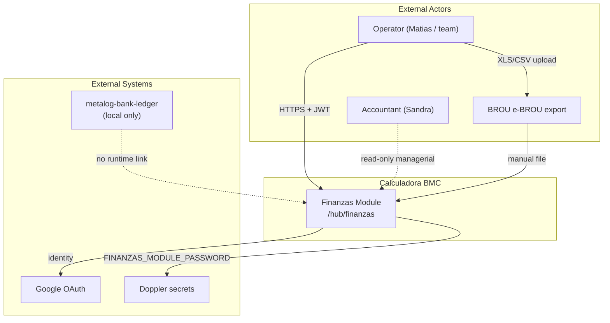
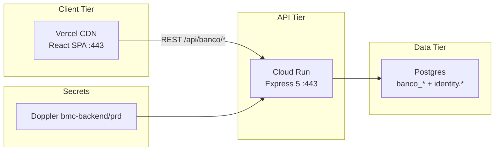
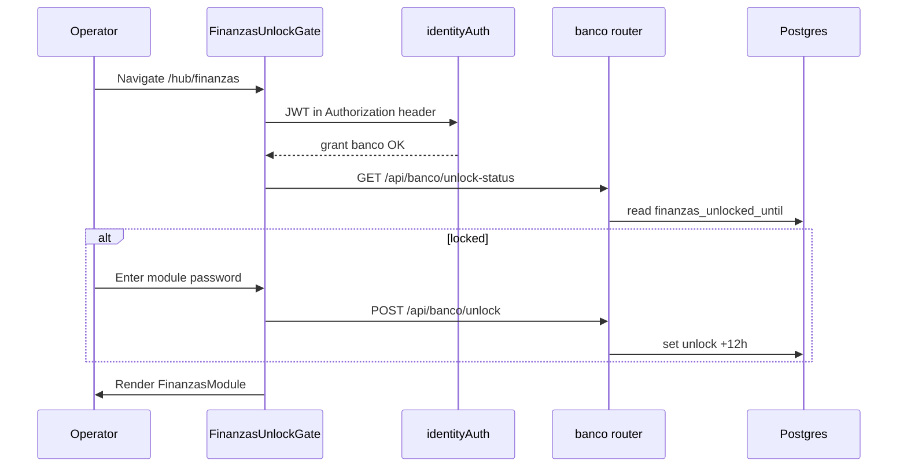
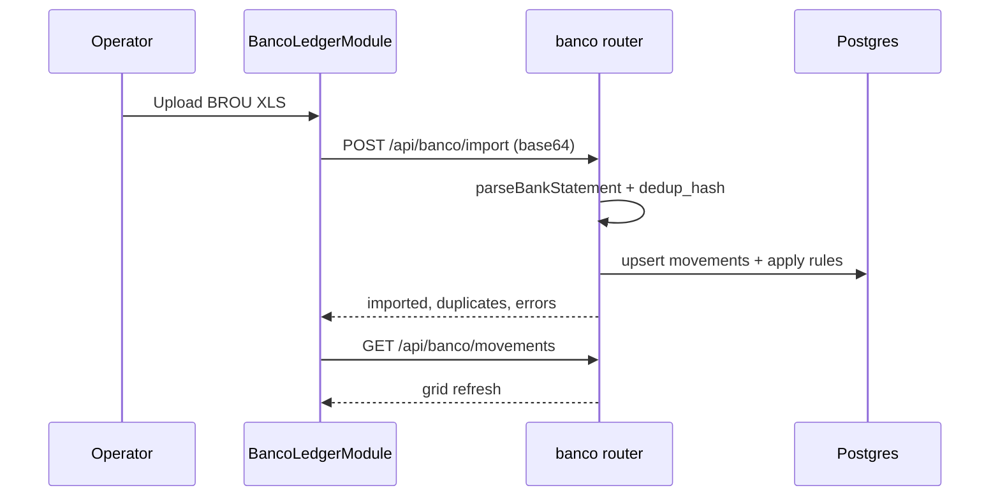
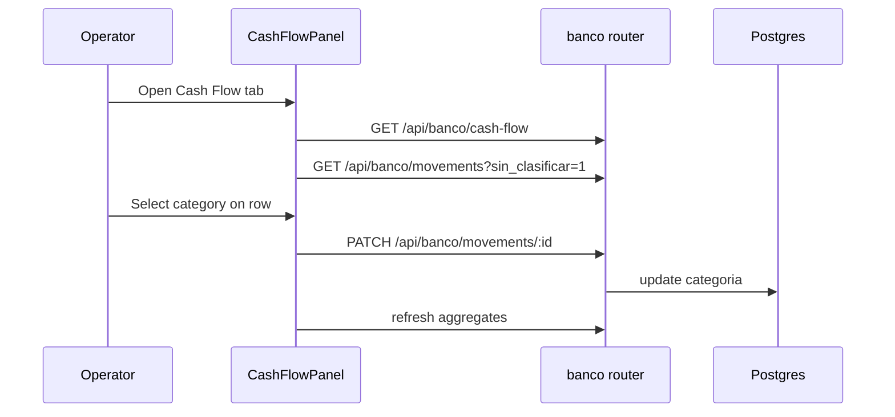

# System Design Document: BMC Finanzas Module

## Document map (arc42 alignment)

| § | arc42 section | Content |
|---|---------------|---------|
| 1 | Introduction & Goals | Problem, goals, stakeholders |
| 2 | Constraints & Strategy | Guardrails, solution approach |
| 3 | System Context (C4 L1) | External actors, interfaces |
| 4 | Container View (C4 L2) | Deploy topology |
| 5 | Component View (C4 L3) | Finanzas module decomposition |
| 6 | Domain & Data | Tables, taxonomy, aggregates |
| 7 | API Specification | Full `/api/banco/*` contract |
| 8 | UX Specification | Nav, tabs, screens |
| 9 | Runtime Flows | Sequence diagrams |
| 10 | Security & Auth | Three-layer access model |
| 11 | Quality Attributes | Reliability, performance, ops |
| 12 | Deployment & Ops | Vercel, Cloud Run, Doppler, migrations |
| 13 | Testing | Contract + parser coverage |
| 14 | AI Architecture | N/A v1; future options |
| 15 | ADRs | Architecture decisions |
| 16 | Risks & Roadmap | Known risks, phased backlog |
| 17 | Glossary | Domain terms |

---

## 1. Introduction & Goals

### 1.1 Problem Statement

Metalog SAS (BMC Uruguay) reconciles fiscal and operational reality across three columns: **DGI billing ↔ internal sales ↔ bank movements** (see [`DGI-CLAUDE-INGESTA.md`](./fiscal/DGI-CLAUDE-INGESTA.md)). Bank data already lives in Calculadora BMC Postgres via BROU imports, but until 2026-07:

1. The ledger UI lived at `/hub/banco` **without top-nav visibility**.
2. Categories were **free text**, blocking reliable cash-flow grouping.
3. There was **no Cash Flow surface** to drive classification and managerial reporting.
4. Bank data is **audit-sensitive**; Google OAuth + module grant alone was insufficient for operator request.

The **Finanzas module** is the first-class hub entry (parity with TraKtiMe / Market Intel) combining **Banco** (ledger) and **Cash Flow** (analysis + classify queue) under one shell, with a **second-factor module password** in production.

Classification remains **managerial inference**, not DGI filing authority. The private Python ledger (`~/Projects/metalog-bank-ledger`) stays local; this module reads/writes the shared BMC `banco_*` Postgres schema only.

### 1.2 Goals

| ID | Priority | Goal | Status |
|----|----------|------|--------|
| G1 | P0 | Top-nav **Finanzas** → `/hub/finanzas` | Shipped (PR #692) |
| G2 | P0 | Internal tabs **Banco** \| **Cash Flow** | Shipped |
| G3 | P0 | Fixed cash-flow taxonomy (`<select>`, not free text) | Shipped |
| G4 | P0 | Cash Flow: KPIs + unclassified queue + monthly/category aggregates | Shipped |
| G5 | P0 | Server-enforced **module password** (12h session unlock) | Shipped (PR #694) |
| G6 | P1 | Redirect `/hub/banco` → `/hub/finanzas/banco` | Shipped |
| G7 | P1 | Wolfboard Finanzas CTA → `/hub/finanzas` | Shipped |
| G8 | P2 | Align `banco_rules` patterns to taxonomy keys | Backlog |
| G9 | P2 | Resumen tab (Wolfboard KPIs inline) | Backlog |
| G10 | P3 | Optional LLM category suggestions | Out of scope v1 |

### 1.3 Stakeholders

| Role | Interest | SDD usage |
|------|----------|-----------|
| Matias (operator / admin) | Daily classify, cash-flow visibility, import | Primary user |
| Sandra / accountant | Managerial reports; must not treat UI as DGI truth | Compliance reader |
| BMC admins | Grant `banco`, module password rotation | Ops / identity |
| Future agents | Code + SDD as contract | Implementation source |

### 1.4 Success metrics (managerial, not fiscal)

- **Unclassified rate:** `unclassified_count / total movements` in selected period → target trending down.
- **Classification throughput:** movements classified per week via Cash Flow queue.
- **Import freshness:** days since last successful BROU import per account.
- **Access hygiene:** no bank API access without OAuth + grant + module unlock in prod.

---

## 2. Constraints & Strategy

### 2.1 Hard constraints

| Constraint | Rationale |
|------------|-----------|
| **No metalog-bank-ledger on Vercel** | Private gitignored bank data; AGENTS.md guardrail |
| **Grant slug stays `banco`** | Avoid identity migration; UI label is Finanzas |
| **No FX unification in Calculadora v1** | DGI interbancaria (comprador, día hábil anterior) lives in local metalog pipeline only |
| **Native currency per account** | UYU and USD accounts; mixed "Todas" requires explicit `account_id` for cash-flow aggregates |
| **Stack locked** | React 18 + Vite SPA, Express 5 API, Postgres |
| **503 not 500** for DB/infra failures | Project-wide banco router convention |
| **Password in Doppler only** | `FINANZAS_MODULE_PASSWORD` — never in git, SDD examples, or test fixtures |

### 2.2 Solution strategy

- **Style:** Feature module inside Calculadora BMC modular monolith.
- **Reuse:** `BancoLedgerModule.jsx`, `server/routes/banco.js`, `banco_*` tables.
- **New shell:** `FinanzasModule` (TraKtiMe tab pattern) + `CashFlowPanel` + shared taxonomy.
- **Security layering:** Google OAuth → RBAC grant `banco` → shared module password (prod) → API `finLocked` middleware.
- **Accepted trade-off:** Dual-currency panels instead of unified UYU control chart in prod (unified view = local metalog dashboard).

---

## 3. System Context (C4 Level 1)



### 3.1 External interfaces

| Interface | Direction | Protocol | Auth | Description |
|-----------|-----------|----------|------|-------------|
| Browser → SPA | → | HTTPS | — | Vite React app on Vercel |
| SPA → `/api/banco/*` | → | HTTPS/JSON | Bearer JWT + cookie refresh | Express on Cloud Run |
| SPA → `/auth/*` | → | HTTPS | OAuth | Google login, session mint |
| Operator → BROU | ← | Manual XLS/CSV | — | Bank statement export |
| API → Postgres | ↔ | TCP/TLS | `DATABASE_URL` | `banco_*` + `identity.sessions` |
| metalog-bank-ledger | ⊥ | — | — | Parallel local system; not wired |

---

## 4. Container View (C4 Level 2)



| Container | Technology | Responsibility |
|-----------|------------|----------------|
| **Web SPA** | Vite 7 + React 18 | Finanzas UI, `RequireGrant`, `FinanzasUnlockGate`, tabs |
| **Calculator API** | Express 5 + Node 24 | `createBancoRouter`, identity auth, unlock middleware |
| **Postgres** | Supabase-compatible | Movements, accounts, rules, session unlock timestamps |
| **Secrets** | Doppler → GCP SM | JWT, DB URL, module password |

**Prod URLs**

- Frontend: `https://calculadora-bmc.vercel.app/hub/finanzas`
- API: Cloud Run service (mirrored in `VITE_API_BASE` on Vercel)

---

## 5. Component View (C4 Level 3)

### 5.1 Frontend components

| Component | File | Responsibility |
|-----------|------|----------------|
| **BmcModuleNav** | `src/components/BmcModuleNav.jsx` | Top pill **Finanzas**; active on `/hub/finanzas*` and legacy `/hub/banco*` |
| **RequireGrant** | `src/components/auth/RequireGrant.jsx` | Route guard: `module="banco" minLevel="read"` |
| **FinanzasUnlockGate** | `src/components/hub/finanzas/FinanzasUnlockGate.jsx` | Module password form; `unlock-status` / `unlock` API |
| **FinanzasModule** | `src/components/hub/finanzas/FinanzasModule.jsx` | Shell, header, tab bar, nested routes |
| **BancoLedgerModule** | `src/components/hub/banco/BancoLedgerModule.jsx` | Import, filters, grid, PATCH classify (`embedded` prop hides duplicate title) |
| **CashFlowPanel** | `src/components/hub/finanzas/CashFlowPanel.jsx` | KPIs, classify queue (cap 50), monthly + by-category tables |
| **cashFlowTaxonomy** | `src/components/hub/finanzas/cashFlowTaxonomy.js` | Shared taxonomy keys, labels, kinds, select options |
| **OperatorOverview** | `src/components/hub/OperatorOverview.jsx` | Wolfboard card CTA → `/hub/finanzas` |

**Route wiring** (`src/App.jsx`):

```
/hub/finanzas/* → Shell → RequireGrant(banco) → FinanzasUnlockGate → FinanzasModule
/hub/banco*     → redirect → /hub/finanzas/banco
```

### 5.2 Backend components

| Component | File | Responsibility |
|-----------|------|----------------|
| **banco router** | `server/routes/banco.js` | All `/api/banco/*` routes |
| **finanzasUnlock** | `server/lib/finanzasUnlock.js` | Password verify, session unlock, `requireFinanzasUnlock` middleware |
| **bancoStatementParser** | `server/lib/bancoStatementParser.js` | BROU XLS/CSV parse, dedup hash, rule match |
| **bancoDb** | `server/lib/bancoDb.js` | Postgres pool for `banco_*` (same `DATABASE_URL` as identity) |
| **identityAuth** | `server/lib/identityAuth.js` | `requireUser`, JWT, `sessionId` on `req.user` |
| **config** | `server/config.js` | `finanzasModulePassword`, `finanzasUnlockTtlHours` |

---

## 6. Domain & Data Model

### 6.1 Postgres schemas

**Ledger (`banco_*`)** — migrations via `banco-package/migrations/`, `npm run banco:migrate`

| Table | Purpose |
|-------|---------|
| `banco_accounts` | Bank accounts: `account_id`, `name`, `currency` (UYU/USD), `account_number`, … |
| `banco_movements` | Movements: `fecha`, `descripcion`, `debito`, `credito`, **`categoria`**, **`entidad`**, `dedup_hash`, … |
| `banco_import_batches` | Import audit trail |
| `banco_rules` | Pattern → `categoria` / `entidad` (priority ordered) |

**Identity (unlock gate)**

| Table / column | Purpose |
|----------------|---------|
| `identity.sessions.finanzas_unlocked_until` | Timestamptz; module unlocked until this instant (migration `20260717000001_finanzas_session_unlock.sql`) |

### 6.2 Cash-flow taxonomy (fixed select)

Shared constant in `cashFlowTaxonomy.js` and `CASH_FLOW_TAXONOMY` in `banco.js`.

| Key | Label (ES) | Kind |
|-----|------------|------|
| `ingreso_venta` | Ingreso venta | inflow |
| `ingreso_otro` | Otro ingreso | inflow |
| `aporte_socio` | Aporte socio | inflow |
| `egreso_proveedor` | Proveedores | outflow |
| `egreso_sueldo` | Sueldos | outflow |
| `egreso_operativo` | Operativo | outflow |
| `egreso_financiero` | Financiero | outflow |
| `egreso_impuesto` | Impuestos | outflow |
| `transferencia_interna` | Transferencia interna | neutral |
| `retiro_socio` | Retiro socio | outflow |
| *(null)* | Sin clasificar | unknown |

**Orthogonal dimension:** `entidad` ∈ `bmc | expreso_este | personal | mixta` — independent of cash-flow category.

**Legacy values:** Pre-taxonomy free-text `categoria` values may appear in DB; UI shows them as "(legacy)" option in Banco select; charts bucket unknown keys with raw label.

### 6.3 Aggregate definitions

For filtered movement set:

| Metric | SQL semantics |
|--------|---------------|
| **inflow** | `sum(credito)` |
| **outflow** | `sum(debito)` |
| **net** | inflow − outflow |
| **unclassified** | `categoria IS NULL` |
| **sin_clasificar filter** | `categoria IS NULL AND entidad IS NULL` (classify queue) |
| **cumulative net** | Running sum of monthly net (client-side fold in API) |

**Multi-currency:** If query spans multiple currencies without `account_id`, `GET /cash-flow` returns **400** `account_id_required`.

---

## 7. API Specification

Base path: `/api/banco/*` on Calculator API.  
Auth stack for **data routes:** `requireUser(...)` → `requireFinanzasUnlock` → `requireDb`.

### 7.1 Public / health

| Method | Path | Auth | Response |
|--------|------|------|----------|
| GET | `/api/banco/health` | None | 200 `{ ok: true }` or 503 |

### 7.2 Module unlock (no `finLocked`)

| Method | Path | Auth | Body | Response |
|--------|------|------|------|----------|
| GET | `/api/banco/unlock-status` | `banco` read | — | `{ ok, unlocked, configured?, expires_at?, bypass? }` |
| POST | `/api/banco/unlock` | `banco` read | `{ password }` | `{ ok, unlocked, expires_at }` or 403 `invalid_password` |
| POST | `/api/banco/lock` | `banco` read | — | Clears `finanzas_unlocked_until` for session |

**Bypass rules (no password required):**

- `appEnv === "development"` (local API)
- `req.user.role === "superadmin"`
- Frontend local dev: `isLocalDevApp()` skips `FinanzasUnlockGate`

**Production fail-closed:** If `FINANZAS_MODULE_PASSWORD` unset, unlock always fails; data routes return **403** `finanzas_locked`.

### 7.3 Accounts & import

| Method | Path | Auth | Notes |
|--------|------|------|-------|
| GET | `/api/banco/accounts` | `banco` read + unlock | Includes movement counts, date range |
| POST | `/api/banco/accounts` | admin + unlock | Create account |
| PATCH | `/api/banco/accounts/:id` | admin + unlock | Rename / archive |
| POST | `/api/banco/import` | admin + unlock | `{ file_base64 \| csv, filename?, account_id?, dry_run? }`; max 2 MB; idempotent dedup |

### 7.4 Movements & summary

| Method | Path | Auth | Query / body |
|--------|------|------|--------------|
| GET | `/api/banco/movements` | `banco` + unlock | `account_id, from, to, q, categoria, entidad, tipo, sin_clasificar=1, limit≤500, offset` |
| PATCH | `/api/banco/movements/:id` | admin + unlock | `{ categoria, entidad, notas }` |
| GET | `/api/banco/summary` | `banco` + unlock | `group=mes\|categoria\|entidad` + movement filters |

### 7.5 Cash flow

**GET `/api/banco/cash-flow`**

Query: same filters as movements (`account_id`, `from`, `to`, …).

```json
{
  "ok": true,
  "currency": "UYU",
  "totals": { "inflow": 0, "outflow": 0, "net": 0 },
  "unclassified_count": 0,
  "monthly": [
    { "month": "2026-01", "inflow": 0, "outflow": 0, "net": 0, "cumulative": 0 }
  ],
  "by_category": [
    { "category": "ingreso_venta", "label": "Ingreso venta", "total": 0, "kind": "inflow" }
  ]
}
```

Errors: **400** `account_id_required` when mixed currencies without account filter.

### 7.6 Classification rules

| Method | Path | Auth |
|--------|------|------|
| GET | `/api/banco/rules` | `banco` + unlock |
| POST | `/api/banco/rules` | admin + unlock |
| PATCH | `/api/banco/rules/:id` | admin + unlock |
| POST | `/api/banco/rules/apply` | admin + unlock |

### 7.7 Error semantics

| HTTP | Error code | Meaning |
|------|------------|---------|
| 401 | `missing_credentials` | No valid JWT |
| 403 | `forbidden` | Missing grant / role (opaque in prod) |
| 403 | `finanzas_locked` | Module password not satisfied |
| 403 | `invalid_password` | Wrong module password |
| 400 | `account_id_required` | Mixed-currency cash-flow |
| 503 | `DATABASE_URL not configured` | No DB pool |

---

## 8. UX Specification

### 8.1 Top navigation

- **Label:** Finanzas
- **Route:** `/hub/finanzas` (default sub-route: `/hub/finanzas/banco`)
- **Placement:** After Market Intel, before Tareas
- **Visibility:** Shown to all authenticated hub users; grant + password gate on entry

### 8.2 Internal tabs (TraKtiMe pattern)

| Tab | Route | Content |
|-----|-------|---------|
| Banco | `/hub/finanzas/banco` | Ledger: import, filters, grid, monthly summary toggle |
| Cash Flow | `/hub/finanzas/cash-flow` | KPIs, classify queue, monthly + category tables |

**Header disclaimer:** *"Libro bancario y cash flow managerial — no es declaración fiscal."*

### 8.3 Module password gate (prod)

1. User passes `RequireGrant` (`banco` read).
2. `FinanzasUnlockGate` calls `GET /api/banco/unlock-status`.
3. If locked → password form → `POST /api/banco/unlock`.
4. On success → render `FinanzasModule` children.
5. Unlock valid **12 hours** (configurable via `FINANZAS_UNLOCK_TTL_HOURS`).

### 8.4 Cash Flow screen

1. Filters: account (required if multi-currency), date range
2. KPI row: Ingresos · Egresos · Neto · Sin clasificar
3. Classify queue (max 50): date, description, amounts, category `<select>`, entidad `<select>`, PATCH on change
4. Link to Banco with `?sin_clasificar=1` for full list
5. Monthly table: inflow / outflow / net / cumulative
6. By-category breakdown with signed totals

### 8.5 Banco tab (embedded)

- Category: taxonomy `<select>` (legacy free-text shown as extra option)
- Import BROU XLS (recommended) or CSV
- Filters, pagination (100/page), inline PATCH for admin

---

## 9. Runtime Flows

### 9.1 Access flow (production)



### 9.2 Import extract



### 9.3 Classify for cash flow



---

## 10. Security & Auth

### 10.1 Three-layer model

| Layer | Mechanism | Enforced where |
|-------|-----------|----------------|
| **L1 Identity** | Google OAuth + JWT (`Authorization: Bearer`) + httpOnly refresh cookie | All `/api/banco/*` except `/health` |
| **L2 RBAC** | Module grant `banco` (read/write/admin); admin for import/PATCH/rules | `RequireGrant` (SPA), `requireUser({ module: "banco" })` (API) |
| **L3 Module secret** | Shared password → `identity.sessions.finanzas_unlocked_until` | `requireFinanzasUnlock` on data routes; `FinanzasUnlockGate` (SPA) |

**Password handling:**

- Env: `FINANZAS_MODULE_PASSWORD` (Doppler `bmc-backend/prd`)
- Compare: SHA-256 digest + `crypto.timingSafeEqual` (`server/lib/finanzasUnlock.js`)
- TTL: `FINANZAS_UNLOCK_TTL_HOURS` (default 12, max 72)
- Never log password or full statement bodies to client analytics

### 10.2 Threat considerations

| Threat | Mitigation |
|--------|------------|
| API bypass of UI gate | Server `finLocked` on all data routes |
| JWT without grant | 403 before unlock check |
| Brute-force password | Generic errors; rate limiting backlog (v1.1) |
| Bank data in git | `data/` gitignored; uploads only in DB |
| Fiscal misinterpretation | UI disclaimer + SDD + BANCO-LEDGER.md |
| Prompt injection | N/A (no LLM in v1) |

### 10.3 Compliance context (Uruguay)

- Finanzas supports **managerial reconciliation**, not DGI CFE submission.
- Sandra / external accountant must cross-check against official DGI records.
- Active audit context: treat movement descriptions and amounts as confidential.

---

## 11. Quality Attributes

### 11.1 Reliability

| Concern | Target | Implementation |
|---------|--------|----------------|
| Import idempotency | 100% dedup on re-import | `dedup_hash` unique per account |
| API infra errors | 503, never 500 | `isDbConnectionError` pattern |
| Unlock expiry | Graceful re-prompt | 12h TTL; status endpoint |
| Session revocation | Unlock invalidated on revoke | Column on `identity.sessions` row |

### 11.2 Performance

| Concern | Target | Notes |
|---------|--------|-------|
| Movement list | Paginated 100/page | Existing Banco pattern |
| Cash-flow aggregate | Single SQL pass | Same filter builder as `/movements` |
| Classify queue | Cap 50 rows | Full list via Banco deep link |
| Frontend bundle | Lazy routes | `FinanzasModule` code-split |

### 11.3 Observability

- **Logging:** pino on API; `[banco]` prefixed warnings
- **Metrics:** No dedicated Finanzas dashboard v1; reuse Cloud Run + Vercel analytics
- **LLM observability:** N/A

### 11.4 Cost

- **LLM:** $0 (no AI in v1)
- **Infra:** Marginal increment on existing Cloud Run + Postgres
- **Ops time:** BROU manual export + classify labor (dominant cost)

### 11.5 Sustainability

- No GPU / LLM inference
- Client-side tables preferred over heavy chart libraries until needed

---

## 12. Deployment & Operations

### 12.1 Deploy surfaces

| Artifact | Platform | Trigger |
|----------|----------|---------|
| Frontend SPA | Vercel (`calculadora-bmc.vercel.app`) | Push to `main` / `vercel deploy --prod` |
| Calculator API | GCP Cloud Run | GitHub Actions deploy workflow |
| DB migrations | Postgres | `supabase/migrations/` + `npm run banco:migrate` |

### 12.2 Required secrets (Doppler `bmc-backend/prd`)

| Variable | Purpose |
|----------|---------|
| `DATABASE_URL` | Postgres connection |
| `IDENTITY_JWT_SECRET` | JWT signing |
| `GOOGLE_OAUTH_CLIENT_ID` | Login |
| `FINANZAS_MODULE_PASSWORD` | Module gate (prod) |
| `FINANZAS_UNLOCK_TTL_HOURS` | Optional; default 12 |

**Deploy order for password gate:** (1) apply identity migration, (2) set Doppler secret, (3) redeploy Cloud Run API, (4) redeploy Vercel frontend with `FinanzasUnlockGate`.

### 12.3 Local development

```bash
cd ~/calculadora-bmc
doppler run -- npm run dev:full   # API :3001 + Vite :5173
```

- `RequireGrant` and Finanzas gate **bypassed** on localhost / Vite DEV
- Set `FINANZAS_MODULE_PASSWORD` locally only to test gate behavior

### 12.4 Related documentation

- [`BANCO-LEDGER.md`](./fiscal/BANCO-LEDGER.md) — parser, dedup, legacy `/hub/banco` doc (update nav to Finanzas)
- [`AGENTS.md`](../../AGENTS.md) — repo guardrails
- Notion spec/plan (Clasificador) — product source hierarchy

---

## 13. Testing

| Suite | File | Coverage |
|-------|------|----------|
| Parser offline | `tests/banco-parser.test.js` | 46 asserts — XLS/CSV, dedup, rules |
| Route contract | `tests/banco-routes.test.js` | 401 without auth; 503 health without DB |
| Unlock unit | `server/lib/finanzasUnlock.js` | Password verify, gate enabled logic (extend tests) |

**Gate commands:**

```bash
npm run lint
node tests/banco-routes.test.js
node tests/banco-parser.test.js
npm run build
# or full: npm run gate:local:full
```

**Manual prod smoke:**

1. `/hub/finanzas` → password gate → unlock → Banco + Cash Flow load
2. `curl` movements with JWT but no unlock → 403 `finanzas_locked`

---

## 14. AI Architecture

### 14.1 v1 status

**Not applicable.** No LLM, RAG, or agents in Finanzas v1. Classification is human + deterministic rules (`banco_rules`).

### 14.2 Future options (P3+)

| Option | Pattern | Trade-off |
|--------|---------|-----------|
| Category suggestion | LLM + movement description | Cost + hallucination risk; human confirm required |
| Rule generation | LLM proposes `banco_rules` patterns | Admin approve before insert |
| Anomaly flags | Classic stats on net/monthly | No LLM needed |

If added, follow Calculadora Panelin guardrails: no auto-PATCH without operator confirm; log prompts/responses; no bank data in public repos.

---

## 15. Architecture Decision Records

### ADR-001: Finanzas shell, grant slug `banco`

**Status:** Accepted  
**Decision:** UI label Finanzas; auth module remains `banco`.  
**Consequences:** + no identity migration; − admin UI shows `banco` not `finanzas`.

### ADR-002: No FX unification in Calculadora v1

**Status:** Accepted  
**Decision:** Cash Flow native per account currency; unified UYU only in local metalog ledger.  
**Consequences:** + simpler/safer; − no single consolidated UYU chart in prod.

### ADR-003: Fixed taxonomy over free text

**Status:** Accepted  
**Decision:** Shared `<select>` keys for `categoria`.  
**Consequences:** + reliable aggregates; − legacy values need remap or "(legacy)" bucket.

### ADR-004: No metalog-bank-ledger on Vercel

**Status:** Accepted  
**Decision:** Rebuild Cash Flow UX against `/api/banco` in Calculadora.  
**Consequences:** + one auth/deploy surface; − feature parity with local dashboard may lag.

### ADR-005: Shared module password (second factor)

**Status:** Accepted (2026-07-17)  
**Context:** Bank data audit-sensitive; OAuth + grant insufficient per operator.  
**Decision:** Shared team password in Doppler; 12h unlock on `identity.sessions`; server-enforced on all data APIs.  
**Consequences:** + defense in depth; − shared secret rotation discipline required; − no per-user passwords in v1.  
**Alternatives rejected:** Per-user password DB (complexity); UI-only gate (insecure).

### ADR-006: Mixed currency requires account filter

**Status:** Accepted  
**Decision:** `GET /cash-flow` returns 400 `account_id_required` when multiple currencies in scope.  
**Consequences:** + correct totals; − operator must pick account for consolidated org view.

---

## 16. Risks & Roadmap

### 16.1 Risk register

| Risk | Impact | Likelihood | Mitigation |
|------|--------|------------|------------|
| Legacy free-text categorias | Medium | High | Legacy select option; remap script (backlog) |
| Mixed UYU+USD without filter | Medium | Medium | 400 + UI hint |
| UI treated as fiscal truth | High | Medium | Disclaimers; BANCO-LEDGER; Sandra review |
| Shared password leak | High | Low | Doppler only; rotate; lock endpoint |
| Password gate UI not deployed | Medium | Low | Shipped PR #694; rotate password via Doppler if leaked |
| Migration not applied in prod | High | Low | Checklist in deploy §12.2 |

### 16.2 Roadmap

| Phase | Scope |
|-------|-------|
| **v1.0 (shipped)** | Finanzas hub: nav, Banco + Cash Flow tabs, taxonomy, `/api/banco/cash-flow`, redirects (PR #692) |
| **v1.1 (shipped)** | Module password gate UI + Doppler + migration + tests (PR #694) |
| **v1.2** | Resumen tab (Wolfboard KPIs inline); unclassified count on Wolfboard card |
| **v2** | Rules aligned to taxonomy keys; legacy categoria remap tool |
| **v3** | Optional LLM suggest (human-in-the-loop); still no auto fiscal export |
| **Parallel** | metalog-bank-ledger local FX + Canvas — no runtime coupling |

---

## 17. Glossary

| Term | Definition |
|------|------------|
| **Finanzas** | Top-level BMC hub module (nav label) at `/hub/finanzas` |
| **Banco** | Sub-tab: bank ledger (import, grid, filters) |
| **Cash Flow** | Sub-tab: managerial inflow/outflow analysis driven by `categoria` |
| **categoria** | Managerial cash-flow class (taxonomy key on movement) |
| **entidad** | Business line: BMC, Expreso Este, Personal, Mixta |
| **sin_clasificar** | Missing category and/or entidad; blocks clean attribution |
| **finanzas_locked** | API error: module password not satisfied for session |
| **banco grant** | RBAC module slug for Finanzas access (read/write/admin) |
| **metalog-bank-ledger** | Private local Python pipeline + dashboard (parallel system) |
| **BROU / e-BROU** | Banco República export channel for XLS statements |
| **DGI interbancaria** | Official FX convention (local metalog only): comprador, día hábil anterior |

---

## Appendix A — File index

| Path | Role |
|------|------|
| `src/components/hub/finanzas/FinanzasModule.jsx` | Shell + tabs |
| `src/components/hub/finanzas/FinanzasUnlockGate.jsx` | Password gate UI |
| `src/components/hub/finanzas/CashFlowPanel.jsx` | Cash Flow tab |
| `src/components/hub/finanzas/cashFlowTaxonomy.js` | Taxonomy constants |
| `src/components/hub/banco/BancoLedgerModule.jsx` | Ledger UI |
| `src/components/BmcModuleNav.jsx` | Top nav Finanzas link |
| `src/App.jsx` | Routes + guards |
| `server/routes/banco.js` | API router |
| `server/lib/finanzasUnlock.js` | Unlock middleware |
| `server/lib/bancoStatementParser.js` | Import parser |
| `supabase/migrations/20260717000001_finanzas_session_unlock.sql` | Session unlock column |
| `tests/banco-parser.test.js` | Parser tests |
| `tests/banco-routes.test.js` | Route contract tests |
| `docs/team/fiscal/BANCO-LEDGER.md` | Operator-facing ledger doc |

---

---

## Appendix B — Plan delivery checklist (2026-07-16 spec)

| # | Item | Status |
|---|------|--------|
| 1 | SDD at `docs/team/SDD-finanzas-hub.md` | Done (v1.0) |
| 2 | `BmcModuleNav` — Finanzas link (after Market Intel, before Tareas; Wolfboard inactive on `/hub/finanzas*`) | Done |
| 3 | `FinanzasModule` + nested routes in `App.jsx` | Done |
| 4 | Redirect `/hub/banco` → `/hub/finanzas/banco` | Done |
| 5 | `cashFlowTaxonomy.js` + Banco category `<select>` | Done |
| 6 | `GET /api/banco/cash-flow` + `CashFlowPanel` | Done |
| 7 | `OperatorOverview` CTA → `/hub/finanzas` | Done |
| 8 | Build + `tests/banco-routes.test.js` smoke | Done |

---

*End of SDD — BMC Finanzas Module v1.0*
