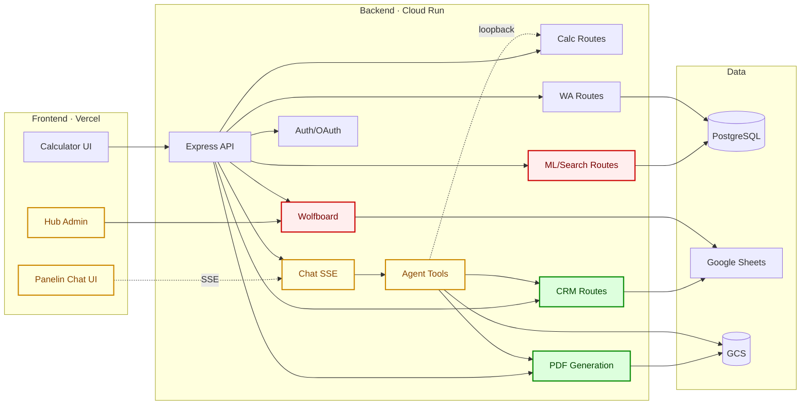

# System map + trabajo pendiente — Calculadora BMC / Panelin

> **Generado**: 2026-05-13 · **Snapshot post-cleanup**: 55 branches remotas, 46 PRs abiertos, 26 tags `archive/*`
> **Backup ref**: `backup/pre-cleanup-20260512-2131` → `origin/main` previo al cleanup
> **Re-generar**: usar la skill `bmc-branch-cleanup` para refrescar el estado + corre `gh pr list --state open --json number,headRefName,title,mergeable,reviewDecision,additions,deletions,changedFiles` y actualizar las cards de la sección 5.

Este documento responde tres preguntas en simultáneo:

1. **¿Cómo está construido el sistema?** — diagrama 1 + tabla de módulos
2. **¿Dónde vive cada pieza de trabajo en vuelo?** — diagrama 2 (overlay) + cards por PR
3. **¿Qué pasa si mergeo a main?** — simulación de impacto + secuencia recomendada

---

## 1. Arquitectura — System overview

```mermaid
flowchart LR
  subgraph FE [Frontend · Vercel]
    SPA[SPA Router<br/>App.jsx]
    CALC_UI[Calculator UI<br/>PanelinCalculadoraV3]
    HUB_WA[Hub WA]
    HUB_ML[Hub ML]
    HUB_CANALES[Hub Canales]
    HUB_ADMIN[Hub Admin]
    CHAT_UI[Panelin Chat UI]
  end

  subgraph BE [Backend · Cloud Run :3001]
    API[Express API]
    CALC[/calc/*<br/>Calculator Engine/]
    CRM[/api/crm/*]
    WA[/api/wa/*]
    ML[/api/ml/*]
    CHAT[/api/agent/chat SSE/]
    TOOLS[Agent Tools<br/>28 funciones]
    WOLF[/api/wolfboard/*]
    PDF[/api/pdf/generate/]
    TRANS[/api/transportista/*]
    AUTH[/auth/*/]
  end

  subgraph DATA [Data Layer]
    PG[(PostgreSQL<br/>wa_* / transportista / pgvector)]
    SHEETS[Google Sheets<br/>CRM_Operativo + MATRIZ]
    GCS[(GCS<br/>quotes bucket + PDFs)]
  end

  subgraph EXT [External]
    WACLOUD[WA Cloud API]
    MLOA[MercadoLibre OAuth]
    GOA[Google OAuth]
    IMAP[IMAP snapshot bridge]
  end

  SPA --> CALC_UI & HUB_WA & HUB_ML & HUB_CANALES & HUB_ADMIN & CHAT_UI

  CALC_UI -->|HTTP| API
  HUB_WA -->|HTTP| WA
  HUB_ML -->|HTTP| ML
  HUB_CANALES -->|HTTP| API
  HUB_ADMIN -->|HTTP| WOLF
  CHAT_UI -.->|SSE| CHAT

  API --> CALC & CRM & WA & ML & CHAT & WOLF & PDF & TRANS & AUTH

  CHAT --> TOOLS
  TOOLS -.->|loopback HTTP| CALC
  TOOLS --> CRM
  TOOLS --> WA
  TOOLS --> PDF

  CRM --> SHEETS
  WOLF --> SHEETS
  WA --> PG
  ML --> PG
  TRANS --> PG
  TOOLS --> GCS
  PDF --> GCS

  WA -.->|webhook| WACLOUD
  AUTH --> GOA
  AUTH --> MLOA
  CRM -.-> IMAP
```

---

## 2. Tabla de módulos

| Módulo | Propósito | Archivos clave | Datos / deps | Actividad |
|---|---|---|---|---|
| **Calculator Engine** | Cotización core (techo/pared/BOM) | `src/utils/calculations.js`, `src/data/constants.js` | — | Estable (hotspot) |
| **Calculator UI** | SPA del cotizador | `src/components/PanelinCalculadoraV3_backup.jsx` (377KB canonical) | — | Activo |
| **Hub: WA Cockpit** | Operador WhatsApp, SLA, follow-ups | `src/components/BmcWaCockpit.jsx` (49KB) | `/api/wa/*` | Activo |
| **Hub: ML Operativo** | Búsqueda + respuestas ML | `src/components/BmcMlOperativoModule.jsx` | `/api/ml/*`, pgvector | Activo |
| **Hub: Admin (Cotizaciones + KB)** | Batch quotes, training KB | `src/components/BmcAdminCotizacionesModule.jsx` (29KB), `AgentAdminModule.jsx` | `/api/wolfboard/*`, `/api/kb/*` | **Activo (PRs #190 #187)** |
| **Hub: Canales Unificados** | Vista multi-canal | `src/components/BmcCanalesUnificadosModule.jsx` | `/api/channels/*` | Activo |
| **Panelin Chat (Agent)** | Chat SSE con 28 tools | `src/components/PanelinChatPanel.jsx` | `/api/agent/chat` | **Activo (PR #197)** |
| **Express API** | Router + auth + webhooks | `server/index.js`, `server/config.js` | — | Estable |
| **Calculator Routes** | `/calc/*` + loopback para agents | `server/routes/calc.js`, `server/lib/calcLoopbackClient.js` | GCS provenance | Estable |
| **CRM Routes** | `/api/crm/*` Sheets sync | `server/routes/bmcDashboard.js` | Google Sheets | **Activo (PR #146)** |
| **WhatsApp Routes** | `/api/wa/*` Postgres-backed | `server/routes/wa.js`, `server/lib/wa*.js` | PostgreSQL | Estable |
| **ML/Search Routes** | `/api/ml/*` RAG con pgvector | `server/routes/mlSearch.js`, `server/lib/rag.js` | pgvector | **Activo (PRs #190 #187 — KB Multicanal)** |
| **Chat + Tools** | `/api/agent/chat` SSE + tool registry | `server/routes/agentChat.js`, `server/lib/agentTools.js`, `quoteRegistry.js` | GCS | **Activo (PR #142)** |
| **Wolfboard** | Batch quotes + admin sync | `server/routes/wolfboard.js` | Sheets | Activo |
| **PDF Generation** | HTML → Chromium → PDF | `server/routes/pdf.js`, `src/pdf-templates/` | GCS | **Activo (PR #177)** |
| **Transportista** | Logística + órdenes | `server/routes/transportista.js`, `server/lib/transportistaDb.js` | PostgreSQL | Estable |
| **Auth/OAuth** | Google + ML OAuth | `server/routes/authGoogle.js`, `identityMe.js` | JWT, OAuth | Estable |
| **MCP External** | `/api/internal/panelin` para agents externos | `server/routes/panelinInternal.js` | Calc loopback | Activo |
| **Deployment** | Vercel FE + Cloud Run BE | `vercel.json`, `scripts/deploy-cloud-run.sh` | — | Estable |

---

## 3. Arquitectura — overlay de trabajo pendiente

Mismo grafo, coloreando los módulos donde hay PRs abiertos no-draft:



**Leyenda**:
- 🔴 **Rojo** (KB Multicanal, Wolfboard): PRs **#190 + #187** con conflicts entre ellos sobre `trainingKB.js` / `agentTraining.js`
- 🟡 **Amarillo** (Hub Admin, Panelin Chat, Agent Tools): PRs **#197 + #142** con checks failing
- 🟢 **Verde** (CRM, PDF Generation): PRs **#146 + #177 + #176** ready, esperan review
- Gris (sin color): módulos sin trabajo pendiente

---

## 4. PR cards — los 8 no-draft

Ordenadas por módulo, no por número. Listadas: 8 PRs no-draft + 2 branches activas sin PR.

### 🔴 KB Multicanal — conflicts a resolver

#### PR #187 — `feat/kb-multicanal-f32-remaining`
- **Módulo**: ML/Search Routes + Agent Chat + KB Surface + AI Gateway
- **Tamaño**: 13 archivos · +888 / -26 líneas · 4 archivos de test (126 asserts)
- **Estado**: 🔴 CONFLICTING con #190 · `REVIEW_REQUIRED`
- **Qué hace**: implementa F2 (multi-canal surface wiring), F3.1 (KB injection en CRM), F3.2 (Vercel AI Gateway migration con OIDC + fallback chain)
- **Si mergeo**: KB multicanal end-to-end activo, AI Gateway pasa a ser el router de modelos (Vercel toma rol primario)
- **Riesgo**: **ALTO** — fundación de F4 y F5, AI Gateway cambia el plano de routing

#### PR #190 — `feat/kb-multicanal-f4-analytics`
- **Módulo**: ML/Search Routes (analytics) + Hub Admin (dashboard)
- **Tamaño**: 5 archivos · +507 / -1 líneas · 92 test asserts
- **Estado**: 🔴 CONFLICTING con #187 · `REVIEW_REQUIRED`
- **Qué hace**: añade endpoint analytics (`getSurfaceCoverage`, `getRetrievalTrend`, `getTopQueries`) + métricas por surface
- **Si mergeo**: dashboard de KB analytics live (después de #187)
- **Riesgo**: **ALTO** — entrelazado con #187, mismo set de archivos modificado

### 🟡 Agent Tools / Quote Registry — checks failing

#### PR #142 — `claude/integrate-bmc-calculator-FLjeh`
- **Módulo**: Agent Tools + Quote Registry + MCP External
- **Tamaño**: 5 archivos · +47 / -37 líneas
- **Estado**: 🟡 FAILING_CHECKS · `REVIEW_REQUIRED`
- **Qué hace**: expande tool surface de 5 a 28 herramientas + quote registry archival (GCS-backed) + habilita orquestación MCP externa
- **Si mergeo**: Panelin chat (in-app + externo MCP) gana 23 tools nuevas; toda escritura va a registry GCS
- **Riesgo**: **MEDIO-ALTO** — sin tests visibles para la nueva surface, cambio arquitectónico mayor

### 🟡 Dev Mode Auth — checks failing

#### PR #197 — `cursor/fix-dev-mode-api-token-trim-8025`
- **Módulo**: Panelin Chat UI + Chat (SSE) + Dev Mode hooks
- **Tamaño**: 14 archivos · +156 / -97 líneas
- **Estado**: 🟡 FAILING_CHECKS · `REVIEW_REQUIRED`
- **Qué hace**: centraliza dev-mode auth bypass vía `PANELIN_RELAX_DEV_AUTH=1` flag; remueve token prompt en modo relajado; sincroniza counts (30 tools, 9 guarded)
- **Si mergeo**: UX de dev mode más limpia, menos fricción para desarrolladores internos
- **Riesgo**: **MEDIO** — refactor del path de auth, depende del cambio de tool count en #142 (idealmente mergear #142 primero)

### 🟢 PDF Export — listo para review

#### PR #177 — `cursor/drive-use-selected-pdf-template-8025`
- **Módulo**: PDF Generation + Calculator UI (Drive panel)
- **Tamaño**: 2 archivos · +84 / -62 líneas (net **−62**)
- **Estado**: 🟢 `REVIEW_REQUIRED` (mergeable: UNKNOWN, no conflicts conocidos)
- **Qué hace**: alinea exports a Google Drive con el pipeline del PDF Cliente; expone layout selector compartido (calculator, mobile, Drive)
- **Si mergeo**: usuarios ven el mismo template al guardar en Drive que al imprimir PDF
- **Riesgo**: **BAJO** — feature UI focal, simplifica código (net negativo en líneas)

### 🟢 Quotation BOM — fix visible inmediato

#### PR #176 — `cursor/fix-quotation-panel-line-dup-8025`
- **Módulo**: Calculator UI (Quotation HTML / BOM)
- **Tamaño**: 1 archivo · +2 / -4 líneas
- **Estado**: 🟢 `REVIEW_REQUIRED`
- **Qué hace**: remueve línea duplicada de subtítulo de panel en filas BOM del quote print
- **Si mergeo**: el quote impreso/copy-paste deja de tener texto duplicado `"…m4 paneles…"`
- **Riesgo**: **BAJO** — mínimo, 1 archivo

### 🟢 Security hardening

#### PR #146 — `fix/pr110-security-followup`
- **Módulo**: CRM Routes + Quote Registry + User Intent + CSV Security
- **Tamaño**: 13 archivos · +340 / -198 líneas
- **Estado**: 🟢 `REVIEW_REQUIRED`
- **Qué hace**: filtros server-side en quote registry, acceso directo registry/PDF, prevención CSV injection (sanitiza nombres de cliente), mejora búsqueda RUT en CRM, fix de lógica de negación
- **Si mergeo**: CRM y quote registry más seguros vs injection; búsqueda RUT más precisa
- **Riesgo**: **MEDIO** — security-critical, mergear ANTES de #142 (que depende del registry)

### 🟡 Docs only — changes requested

#### PR #126 — `docs/openai-key-rotator`
- **Módulo**: Docs (Operations)
- **Tamaño**: 1 archivo · +12 / -0 líneas
- **Estado**: 🟡 FAILING_CHECKS · `CHANGES_REQUESTED`
- **Qué hace**: documenta rotación de OpenAI key + scripts de audit + endpoint `/api/agent/voice/health`
- **Si mergeo**: equipo tiene la doc de rotación de keys
- **Riesgo**: **MUY BAJO** — solo docs, atender las changes requested + mergear

### 🔖 Branches sin PR (activas)

#### `feat/kb-multicanal-f5-admin-ui` (6 commits, 4 días)
- **Módulo**: Hub Admin + KB Multicanal
- **Tamaño**: ~1160 inserciones (incluye screenshots de smoke)
- **Qué hace**: añade WhatsApp override generation, KB health metrics, Drive client helpers para el admin de KB
- **Si abro PR**: depende de que #187 y #190 estén mergeados (es F5, encima de F3.2 y F4)
- **Riesgo**: **MEDIO** — pendiente del orden de merge KB

#### `docs/kb-e2e-status-2026-05-08` (1 commit, 4 días)
- **Módulo**: Docs
- **Tamaño**: 1 archivo · +25 / -1 líneas en `KB-MULTICANAL-E2E-RUN.md`
- **Qué hace**: snapshot de estado E2E del KB multicanal
- **Si abro PR**: docs only, mergeable inmediatamente
- **Riesgo**: **MUY BAJO**

### 38 PRs en estado DRAFT
No analizados — están en desarrollo y no están listos para merge. Listado completo con `gh pr list --state open --draft`.

---

## 5. Simulación — "si mergeo los 8 hoy, sin orden"

### ❌ Lo que rompe
- **Conflicts directos** entre #190 ↔ #187 sobre `trainingKB.js` y `agentTraining.js` — uno tiene que rebasear al otro
- **CI failing** en #197 (dev-mode-token-trim), #142 (integrate-bmc-calculator), #126 (docs)
- **Dependencias cruzadas** entre #146 (hardenizes quote registry) y #142 (expande tool surface que usa registry) — orden importa

### ✅ Lo que desbloquea
- KB Multicanal end-to-end live (F2 → F3.1 → F3.2 → F4 analytics → F5 admin UI tras crear PR)
- Dashboard de analytics KB visible para el equipo (Hub Admin)
- CRM y quote registry hardenizados contra CSV injection y RUT misses
- Panelin Chat agent con 28 tools + archivo en GCS por cotización
- UX de dev mode más limpia (menos prompts de token)
- PDF Drive + PDF Cliente unificados (templates idénticos)
- BOM print sin línea duplicada (fix visible inmediato a usuarios)
- Doc de rotación de OpenAI key disponible para ops

### ⚠️ Riesgo mayor
**Tool surface explosion de #142** (5 → 28 tools) sin tests visibles, combinada con **conflict no resuelto #187/#190** y **dependencia silenciosa #142 ↔ #146** (registry hardening debe preceder a registry expansion). Mergear sin orden: silent regressions en KB match resolution, CRM search, y agent confirmation flows.

---

## 6. Secuencia de merge recomendada

Orden derivado de dependencias e independencia. Cada paso es un PR cerrable en horas (no días).

| # | PR | Módulo | Por qué este orden |
|---|---|---|---|
| 1 | **#176** | Quote BOM | 1 archivo, 2+/-4, sin deps. Win UX inmediato. |
| 2 | **#177** | PDF / Drive | Independiente, net negativo en líneas. Win UX. |
| 3 | **#146** | Security | Hardening previo a expansión del registry. |
| 4 | **#187** | KB Multicanal F32 | Base de F4 + F5. Resolver conflict con #190 (ambas tocan los mismos archivos; rebase F4 sobre F32). |
| 5 | **#190** | KB Multicanal F4 | Tras rebase sobre F32 ya mergeado. |
| 6 | **#142** | Agent Tools | Después de #146 (depende de quote registry hardening). |
| 7 | **#197** | Dev Mode | Depende del refactor de tool surface en #142. |
| 8 | **#126** | Docs | Sin riesgo, último, atender los CHANGES_REQUESTED primero. |
| 9 | Abrir PR de **`feat/kb-multicanal-f5-admin-ui`** | KB Admin UI | Una vez #187 + #190 estén en main. |

### Notas para Matías
- Pasos 1-3 cierran en una mañana si los reviewers están disponibles
- Paso 4-5 requieren resolución de conflict — alocar tiempo dedicado de quien sepa de KB multicanal
- Paso 6 requiere validar la tool surface (probar in-app + via MCP externo)
- Paso 7 es low-risk si paso 6 quedó verde

---

## Referencias

- Cleanup ejecutado: `docs/team/housekeeping/cleanup-2026-05-12.md` (199 → 55 branches)
- Backup pre-cleanup: tag `backup/pre-cleanup-20260512-2131` → `origin/main`
- Skill de housekeeping: `~/.claude/skills/bmc-branch-cleanup/SKILL.md`
- Script mensual: `scripts/branch-housekeeping-monthly.sh`
- Branch protection draft: `docs/team/housekeeping/branch-protection.json` (NO aplicado todavía)
