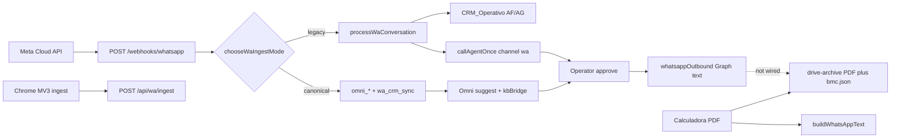

# WhatsApp Drive connector — Blueprint

**Status:** Knowledge + as-built. **Does not ship a connector.**  
**Last updated:** 2026-08-17  
**Grounding map:** [`SOURCE-MAP.md`](./SOURCE-MAP.md)

This document answers: what exists, what a Drive-aware WhatsApp connector **should** reuse, and what must stay out of scope until product decides.

---

## 1. Executive summary

BMC already has:

- A production WhatsApp inbound path (Meta Cloud API → webhook → CRM/Omni suggestion).
- A production WhatsApp **text** outbound path (one Graph helper).
- Operator surfaces (`/hub/wa`, `/hub/canales`).
- An AI brain (`callAgentOnce`) with WA channel rules and Training KB.
- Google Drive as **quote archive** (PDF + `.bmc.json`) under `drive.file`.

It does **not** have a system that treats Drive files as the WhatsApp knowledge corpus. Context for WA today is Training KB + optional RAG + this markdown pack (file-read).

Target for a future connector, if built: **one brain, human send gate, Drive as on-demand quote store** (load `.bmc.json` / share PDF URL), **GCS for chat media**. Not “index My Drive into the prompt.”

---

## 2. As-built topology

---

## 3. Decisions (committed in existing code)

| Decision | Where | Do not reverse casually |
|----------|--------|-------------------------|
| Human gate on customer send | tools + CRM send-approved | No autonomous webhook reply |
| Inbound WA = no tools | `processWaConversation`, enricher, Omni suggest | Tools only on Panelin chat/MCP |
| Drive scope `drive.file` | GIS + `driveUpload.js` + setup docs | Full `drive` is a security/product change |
| Server does not store per-user Drive tokens | `driveConfig` stores folderId only | |
| WA media in private GCS | G7/G8/G9 | Not Drive |
| Omni `omni_*` operational SoT for inbox | Email blueprint + WA flip | Sheets remain business mirror |
| Prices USD ex-IVA | calc engine | IVA 22% once at total |

---

## 4. Intended connector (when product asks for code)

Reuse, do not fork:

1. **Send:** `postWhatsAppMessage` only.
2. **Inbound persist:** Omni adapters + `wa_*` mirror.
3. **Suggest:** `callAgentOnce({ channel: "wa" })` + `kbBridge`.
4. **Quote file:** `saveQuotationBundleToDrive` / `loadProjectFromDriveFolder` with **server** OAuth for company archive.
5. **Context files:** this pack’s `MANIFEST.json` layers (`CONTEXT-RECIPE.md`).

Do **not**:

- List arbitrary Drive trees with `drive.file`.
- Mix GIS user tokens into the webhook process (no browser on Cloud Run).
- Pipe WA media into Drive “for knowledge.”
- Inject this pack into `data/knowledge/` (global chat dump).

Phased path if implementation is approved later:

- **P0** — this pack + skill (done). Agents ground correctly.
- **P1** — optional `loadWaDriveKnowledge({ layer })` used only by WA enricher/Omni (flag-gated), still no Drive API.
- **P2** — on quote-code intent, `loadProjectFromDriveFolder` into the suggest prompt (structured JSON, truncated).
- **P3** — dedicated app-created folder + scheduled text extract → Training KB (human approve). Scope stays `drive.file`.

---

## 5. `#ZonaDesconocida` (verify, do not invent)

- Live Cloud Run values of `OMNI_WA_CANONICAL`, `WHATSAPP_*`, `DRIVE_QUOTE_FOLDER_ID`.
- Whether company archive folder is shared with customers (usually **not**).
- Whether `saveRemitoToDrive` exists as an export (dashboard dynamic import vs `driveUpload.js`).
- Cockpit README phase table vs shipped enricher/media (trust code + SOURCE-MAP).

---

## 6. Complements

- Email company-knowledge-first: `docs/team/EMAIL-SOURCE-MAP.md` (same index pattern).
- Meta E2E: `docs/team/WHATSAPP-META-E2E.md`.
- Drive GIS SOP: `.cursor/skills/bmc-google-drive-oauth/SKILL.md`.
- Human gates: `.cursor/rules/human-gates-bmc.mdc`.
