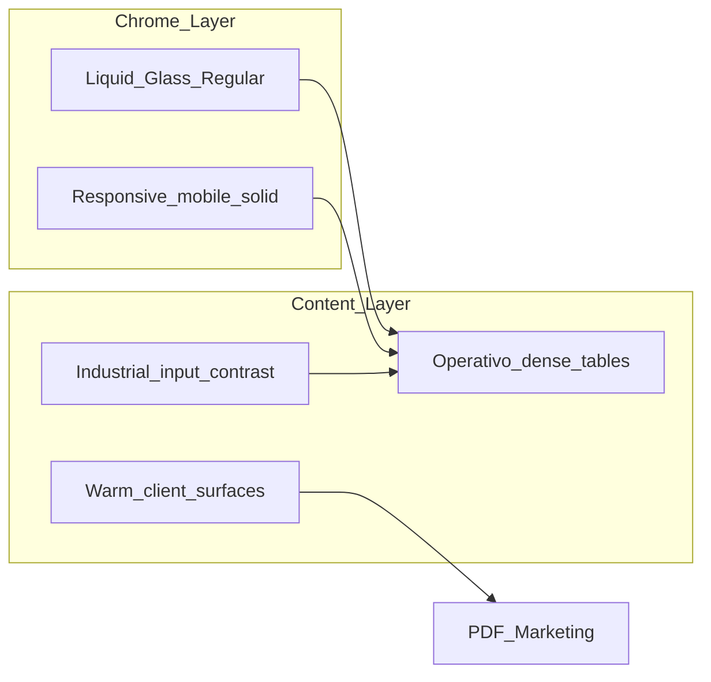

# Jury Recommendation — BMC Design Competition 2026

**Date:** 2026-06-26  
**Jury weights:** Operator speed 40% · Mobile/tablet/desktop fit 30% · BMC brand 20% · Trend novelty 10%

---

## Scores (0–100)

| Studio | Ops speed | Responsive fit | Brand | Novelty | **Weighted total** |
|--------|-----------|----------------|-------|---------|-------------------|
| **1. Studio Tahoe** | 82 | 88 | 90 | 95 | **86.4** |
| 2. Operativo Dense | **92** | 78 | 85 | 70 | 83.6 |
| 3. Warm Commerce | 75 | 80 | 78 | 72 | 76.8 |
| 4. Field Industrial | 85 | **90** | 82 | 68 | 83.4 |
| 5. Responsive Systems Lab | 80 | **92** | 83 | 80 | 84.8 |

---

## Winner: **Studio Tahoe** (86.4)

**Rationale (hecho confirmado from mockup review + token alignment):**

1. **Implementability:** `--ac-glass`, `--ac-blur`, `saturate(180%)` already exist in [`src/components/admin-cotizaciones/styles.css`](../../src/components/admin-cotizaciones/styles.css) under skin `macos`. [CONFIRMED: codebase]
2. **Brand:** `#1A3A5C` + `#0071E3` match [`src/data/constants.js`](../../src/data/constants.js) `C.brand` / `C.primary`. [CONFIRMED]
3. **Glass discipline:** Mockups apply blur only to `.chrome-glass` headers — wizard/BOM remain opaque, matching Apple HIG and prior Liquid Glass research. [CONFIRMED: TREND-RESEARCH-2026.md]
4. **Trend alignment:** Direct mapping to Apple Liquid Glass Regular (2025–2026). [CONFIRMED: developer.apple.com]

**Runner-up for hybrid elements:**

- **Operativo Dense** — KPI strip + dense hub tables (L3) should adopt Operativo patterns inside Tahoe chrome.
- **Responsive Systems Lab** — mobile nav solid, desktop glass; adopt `@media (min-width: 1024px)` rule from studio-5 mockups.
- **Field Industrial** — dimension inputs and warning chips on tablet (834px) should use higher contrast borders.
- **Warm Commerce** — reserve for `/hub/marketing` and client PDF HTML previews only.

---

## Hybrid proposal (100% design-system goal)

### Phase 0 — Docs + premium previews (complete)

- [x] `docs/team/design-competition/` — 60 mockups + research + this jury doc
- [x] `docs/team/design-competition/premium-previews/` — 18 premium pages (6 studios × 3 breakpoints) + day/night
- [x] [`docs/bmc-dashboard-modernization/DESIGN-SYSTEM.md`](../bmc-dashboard-modernization/DESIGN-SYSTEM.md) — Liquid Glass + `--g-*` + `--ac-*` blur matrix
- [x] [`LIQUID-GLASS-WEB-GUIDE.md`](../bmc-dashboard-modernization/LIQUID-GLASS-WEB-GUIDE.md)
- [x] [`IMPLEMENTATION-AUDIT.md`](./IMPLEMENTATION-AUDIT.md) — backdrop-filter audit

### Phase 1 — Token layer (complete)

- [x] `src/styles/bmc-glass.css` — `--g-*`, `.glass`, day/night, a11y
- [x] Bridge `[data-appearance] .adminCot { --ac-glass; --ac-blur }`
- [x] `@media (prefers-reduced-transparency: reduce)` fallback

### Phase 2 — Hub modules (complete — chrome)

- [x] `BmcModuleNav` — `.chrome-glass` + appearance toggle
- [x] `App.jsx` Shell — `var(--g-bg-page)` + `GlassFilterSvg`
- [x] Cotizaciones topbar — bridged via `--ac-*` (existing `.adminCot__topbar`)

### Phase 3 — Calculator

Keep wizard on `C` tokens — **no blur**. Import Operativo footer layout (sticky Siguiente) + Industrial input borders on tablet breakpoint via `bmc-mobile.css`.

### Phase 4 — Cursor rule (complete)

- [x] `.cursor/rules/bmc-visual-style.mdc` pointing to DESIGN-SYSTEM + LIQUID-GLASS-WEB-GUIDE

### Phase 5 — Showcase route (complete)

- [x] `/hub/design-system/glass` — admin-only token playground (`GlassDesignShowcase.jsx`)

---

## Success metrics (post-integration)

| Metric | Target |
|--------|--------|
| Hub nav uses `--ac-glass` consistently | 100% hub routes |
| Calculator wizard body with `backdrop-filter` | 0 instances |
| Mobile touch targets ≥44px | Audit pass on L1/L3 mockups |
| `prefers-reduced-transparency` fallback | All `.chrome-glass` selectors |

---

## Decision for stakeholder (watch-only default applied)

No user input required. Proceed with **Tahoe + Operativo hybrid** as canonical design direction unless Matias overrides brand toward Warm-only client mode.

**Open:** [ASSUMPTION: jury weights as stated | adjust if stakeholder prioritizes field/tablet over trend]
