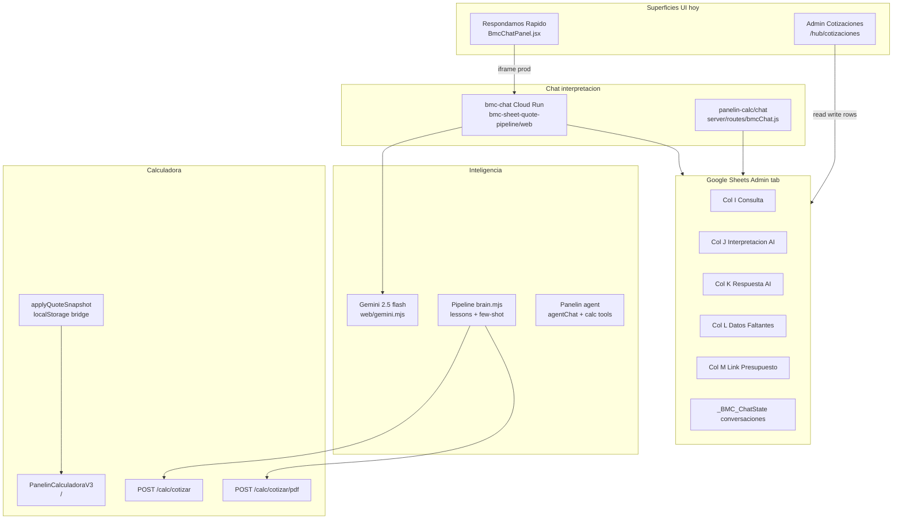
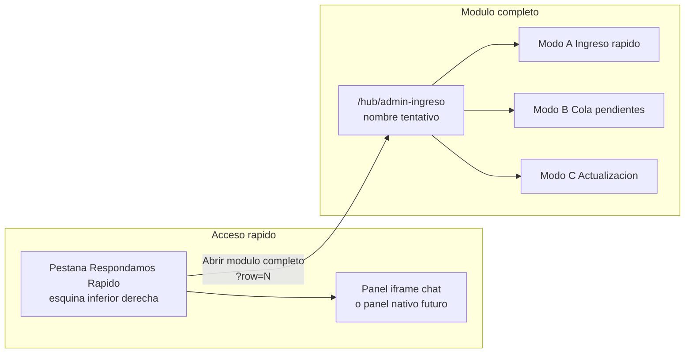
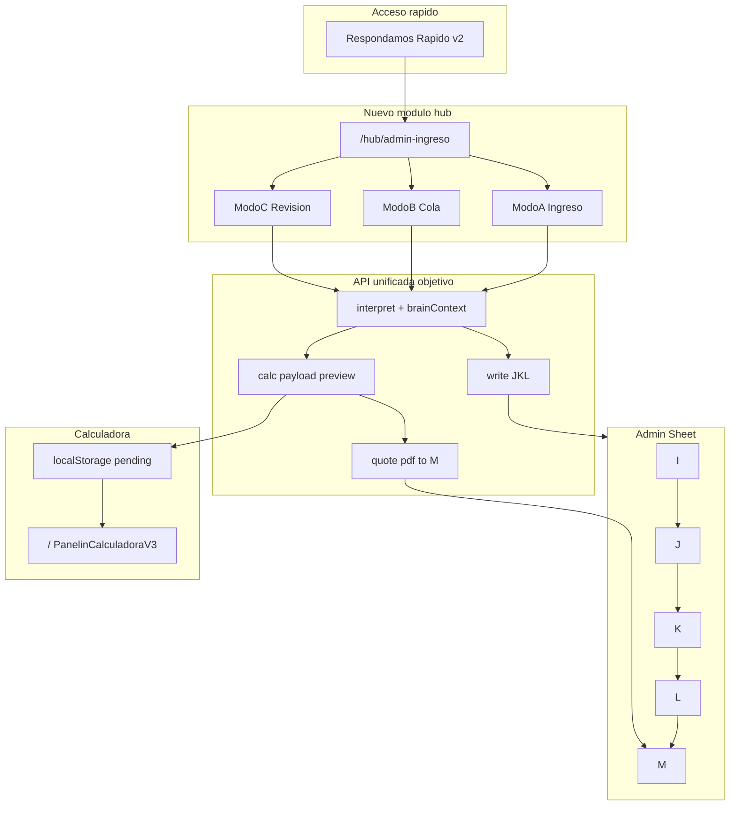

# Design Brief — Ingreso y actualización Admin

**Versión:** 1.0  
**Fecha:** 2026-07-04  
**Audiencia:** Agente de diseño de producto/UX (Claude u otro)  
**Idioma:** Español (copy operador); referencias técnicas en inglés donde corresponda  
**Estado del sistema base:** Verificado en producción (jul-2026)

---

## 0. Resumen ejecutivo

**Ingreso y actualización Admin** es una nueva capacidad del dashboard BMC que permite trabajar **consulta por consulta** sobre la pestaña **Admin.** de Google Sheets: interpretar texto crudo del cliente con IA, completar las columnas J/K/L de forma óptima para que la calculadora pueda ingerir el caso, conversar en modo chat hasta que el caso sea cotizable, y luego **solicitar la creación de la cotización** o **abrir la calculadora precargada** para ajustes manuales.

**Decisión de superficie (aprobada):** enfoque **híbrido**

1. **Módulo dedicado** en `/hub` (cockpit de trabajo)
2. **Acceso rápido** desde la pestaña flotante **Respondamos Rapido** (evolución de `BmcChatPanel.jsx`)

Este documento **no implementa código**. Es el brief exportable para que un agente de diseño produzca wireframes, flujos, componentes y criterios de aceptación detallados.

---

## 1. Problema que resuelve

Hoy el equipo BMC recibe consultas de clientes (WhatsApp, email, ML, etc.) que llegan a la planilla Admin. Para cotizar necesitan:

1. Entender la consulta en lenguaje natural
2. Traducirla a parámetros del motor de calculadora (escenario, familia, espesor, zonas, completo/flete, etc.)
3. Registrar esa interpretación en columnas J/K/L
4. Generar el presupuesto y dejar el link en columna M

Existen **tres piezas parciales** que no forman un flujo unificado:

| Pieza | Qué hace | Qué falta |
|-------|----------|-----------|
| **Respondamos Rapido** | Chat iframe por consulta pendiente | Sin abrir calculadora, sin ingreso de consulta nueva, desconectado del hub |
| **Admin de Cotizaciones** (`/hub/cotizaciones`) | Tabla, drawer, batch IA, aprobar/enviar | Interpretación conversacional limitada; no precarga calculadora |
| **bmc-sheet-quote-pipeline** | Interpretación + brain + cotizar + Drive (CLI/watch) | Sin UI integrada en el dashboard |

La feature unifica el **trabajo consulta-a-consulta** con salidas claras hacia **planilla** y **calculadora**.

---

## 2. Estado actual verificado (jul-2026)

### 2.1 Servicios en producción

| Superficie | URL / ruta | Estado (curl 2026-07-04) |
|------------|------------|--------------------------|
| BMC Chat Cloud Run | `https://bmc-chat-642127786762.us-central1.run.app` | `GET /` → 200 HTML |
| API consultas | `GET …/api/inquiries` | 200 — **11 filas** pendientes (I llena, M vacía) |
| API interpretación | `POST …/api/interpret/:row` | 200 — JSON estructurado vía Gemini |
| Express fallback | `https://panelin-calc-642127786762.us-central1.run.app/chat` | 200 HTML |
| SPA Vercel | `https://calculadora-bmc.vercel.app` | 200 |

### 2.2 Proyecto y despliegue Cloud Run

- **Proyecto GCP:** `chatbot-bmc-live`
- **Región:** `us-central1`
- **Servicio:** `bmc-chat`
- **Min instances:** 1 (siempre encendido)
- **Secrets:** `GEMINI_API_KEY`, `GOOGLE_SHEETS_CREDENTIALS` (Secret Manager)
- **Código fuente del servicio:** `~/bmc-sheet-quote-pipeline/web/` (`server.mjs`, `sheets.mjs`, `gemini.mjs`, `index.html`)

### 2.3 Pendiente humano (no bloquea diseño)

Desde merge PR #447 (2026-06-26): **UAT en Vercel** — login → pestaña Respondamos Rapido → iframe carga consultas → seleccionar fila → chat → "Escribir en la planilla". Backend verificado; falta click-through operador en prod.

---

## 3. Arquitectura existente



### 3.1 Resolución de URL del chat (frontend)

Archivo: [`src/components/BmcChatPanel.jsx`](../../src/components/BmcChatPanel.jsx)

| Entorno | Destino del iframe |
|---------|-------------------|
| Producción (Vercel) | `https://bmc-chat-642127786762.us-central1.run.app` |
| Dev (`import.meta.env.DEV`) | `http://localhost:3000` (launchd `com.bmc.chat-web`) |
| Opt-in local Express | `VITE_BMC_CHAT_LOCAL=1` → `{API_BASE}/chat` |
| Override | `VITE_BMC_CHAT_URL` |

Health check del panel: `GET {chatBase}/api/inquiries` cada 15s → dot verde/amarillo/rojo.

### 3.2 API del chat web (Cloud Run)

Base: `https://bmc-chat-642127786762.us-central1.run.app`

| Método | Ruta | Descripción |
|--------|------|-------------|
| GET | `/` | UI HTML estática |
| GET | `/api/inquiries` | Filas pendientes: I no vacío, M vacío |
| GET | `/api/conversation/:row` | Historial guardado |
| POST | `/api/conversation/:row` | Persistir conversación |
| DELETE | `/api/conversation/:row` | Limpiar conversación |
| POST | `/api/interpret/:row` | Interpretar con Gemini (+ post-passes) |
| POST | `/api/write/:row` | Escribir J/K/L en batch |

Implementación: [`~/bmc-sheet-quote-pipeline/web/server.mjs`](file:///Users/matias/bmc-sheet-quote-pipeline/web/server.mjs)

### 3.3 Espejo en panelin-calc (Express)

- Ruta: `/chat` montada en [`server/index.js`](../../server/index.js)
- Router: [`server/routes/bmcChat.js`](../../server/routes/bmcChat.js)
- Helpers Sheets: [`server/lib/bmcChatSheets.js`](../../server/lib/bmcChatSheets.js)
- Helpers Gemini: [`server/lib/bmcChatGemini.js`](../../server/lib/bmcChatGemini.js)
- UI estática: [`server/static/bmc-chat/index.html`](../../server/static/bmc-chat/index.html)

Uso: fallback local o cuando `VITE_BMC_CHAT_LOCAL=1`. En prod el iframe default apunta a Cloud Run, no a Express.

### 3.4 Pipeline batch (repositorio hermano)

Repositorio: `~/bmc-sheet-quote-pipeline`

| Componente | Archivo | Rol |
|------------|---------|-----|
| Interpretación LLM | `interpret.mjs` | Schema JSON, reglas de geometría, `toCalcPayload()` |
| Brain / aprendizaje | `brain.mjs`, `knowledge/lessons.json` | Lecciones de correcciones humanas |
| Cliente calculadora | `calc.mjs` | `POST /calc/cotizar`, `POST /calc/cotizar/pdf` |
| Orquestación | `pipeline.mjs`, `watch.mjs` | Batch y loop conversacional en columna L |
| Spec chat | `docs/GEMINI-SHEETS-CHAT-SPEC.md` | Contrato columnas y flujo sidebar |

### 3.5 Admin de Cotizaciones (hub existente)

- Ruta: `/hub/cotizaciones`
- Módulo: [`src/components/AdminCotizacionesModule.jsx`](../../src/components/AdminCotizacionesModule.jsx)
- Hook datos: [`src/hooks/useAdminCotizaciones.js`](../../src/hooks/useAdminCotizaciones.js)
- Drawer detalle: [`src/components/admin-cotizaciones/DetailDrawer.jsx`](../../src/components/admin-cotizaciones/DetailDrawer.jsx)
- Batch IA: `POST /api/wolfboard/quote-batch` (ver [`docs/architecture/quote-batch-pipeline.md`](../../docs/architecture/quote-batch-pipeline.md))
- Walkthrough UX: [`docs/walkthrough/admin-cot/README.md`](../../docs/walkthrough/admin-cot/README.md)

---

## 4. Contrato de datos — pestaña Admin.

### 4.1 Columnas del flujo IA (1-indexed, como en Sheets API)

| Col | Letra | Índice 0 | Campo | Contenido |
|-----|-------|----------|-------|-----------|
| 9 | I | 8 | **Consulta** | Texto crudo del cliente (input principal) |
| 10 | J | 9 | **Interpretación AI** | Interpretación estructurada en términos de calculadora; campos inferidos con `[inferido]` |
| 11 | K | 10 | **Respuesta AI** | Una pregunta clarificadora al cliente |
| 12 | L | 11 | **Datos faltantes** | Lista de gaps; en watch mode el cliente/operador responde aquí |
| 13 | M | 12 | **Link presupuesto** | URL Drive/PDF; si está llena la fila sale de la cola pendiente |

**Gating de cola pendiente (actual):** `consulta.trim() !== ""` AND `linkM.trim() === ""`

**Fila de encabezado:** fila 1; datos desde fila 2.

### 4.2 Persistencia de conversaciones

Tab oculta: `_BMC_ChatState` (columnas A=key, B=JSON)

- Clave: `BMC_CHAT_{rowIndex}`
- Mismo patrón en Express (`bmcChatSheets.js`) y Cloud Run (`sheets.mjs`)

### 4.3 Schema JSON de interpretación

Respuesta de `POST /api/interpret/:row` (campos principales):

```json
{
  "quotable": true,
  "accessory_only": false,
  "escenario": "solo_techo",
  "techo": {
    "familia": "ISODEC_EPS",
    "espesor": 100,
    "zonas": [{ "largo": 5, "ancho": 4 }]
  },
  "pared": null,
  "camara": null,
  "espesor_variants": [],
  "ready_to_quote": false,
  "interpretation_J": "TECHO ISODEC_EPS 100mm ...",
  "question_K": "¿Cuántos paneles de qué largo?",
  "missing_L": "geometría",
  "completo": "no_mencionado",
  "flete": "no_mencionado",
  "measures_external": false
}
```

**Reglas de negocio críticas** (de `interpret.mjs` — el diseñador debe reflejarlas en UI):

- `ready_to_quote=true` solo si escenario + familia + espesor + geometría están **conocidos** (no defaulteados)
- "N paneles de L m" → zona `{ largo: L, ancho: N × ancho_útil }` (ISOROOF ≈ 1.0 m, ISODEC ≈ 1.12 m)
- "A × B m" sin cantidad de paneles → geometría incompleta → preguntar en K
- Solo accesorios por unidad sin área de panel → `quotable=false`, `accessory_only=true`
- Varios espesores misma familia → `espesor_variants` → **múltiples cotizaciones** posibles
- Producto fuera de catálogo (Hiansa, etc.) → nota en `missing_L`, no bloquear si hay panel BMC

### 4.4 Ejemplo real (prod, row 3, 2026-07-04)

Consulta: *"Actualizando presupuesto 23042026 // va a mandar planos..."*

```json
{
  "quotable": true,
  "accessory_only": false,
  "escenario": "no_definido",
  "ready_to_quote": false,
  "interpretation_J": "El cliente solicita actualizar un presupuesto existente. Se necesita más información sobre los paneles o accesorios a cotizar.",
  "question_K": "¿Podría indicarme qué paneles o accesorios necesita cotizar y sus respectivas cantidades o medidas para actualizar su presupuesto?",
  "missing_L": ["familia", "espesor", "geometría"]
}
```

### 4.5 Puente a la calculadora (existe, sin UI de Admin)

Función pipeline: `toCalcPayload(interp)` en `interpret.mjs`

```js
// Entrada: interpretación con ready_to_quote + geometría válida
// Salida: { escenario, lista, techo|pared|camara } validado contra motor
```

Aplicación en SPA: [`src/utils/applyQuoteSnapshot.js`](../../src/utils/applyQuoteSnapshot.js)

Patrón existente para otro módulo (planos):

1. Guardar payload en `localStorage` (ej. `bmc_pending_plan_import`)
2. Navegar a `/`
3. `PanelinCalculadoraV3_backup.jsx` lee y aplica con `applyQuoteSnapshot`, luego borra la key

**Gap:** no existe `bmc_pending_admin_import` ni botón "Abrir en calculadora" desde el chat Admin.

---

## 5. Feature objetivo — Ingreso y actualización Admin

### 5.1 Visión

Un **cockpit de trabajo** donde el operador:

1. **Ingresa** consultas crudas (nuevas o existentes)
2. **Interpreta** con IA y revisa J/K/L antes de guardar
3. **Conversa** fila por fila hasta `ready_to_quote`
4. **Escribe** en la planilla con confirmación explícita
5. **Cotiza** (automático a Drive) o **abre la calculadora precargada** para afinar

### 5.2 Superficie híbrida (decisión de producto)



#### Módulo principal `/hub/admin-ingreso` (nombre tentativo)

**Modo A — Ingreso rápido**

| Elemento | Comportamiento |
|----------|----------------|
| Textarea consulta cruda | Pegar texto de WhatsApp/email/llamada |
| Selector de fila | Nueva fila / fila existente sin I / sobrescribir I |
| Metadatos opcionales | Cliente, origen, teléfono (columnas A–H si aplica) |
| Preview interpretación | J, K, L + tags visuales (Cotizable, Faltan datos, Listo) |
| CTA primario | "Guardar en Admin" — **nunca automático** |
| CTA secundario | "Interpretar de nuevo" / "Limpiar" |

**Modo B — Recorrido interactivo (cola pendientes)**

| Elemento | Comportamiento |
|----------|----------------|
| Lista lateral | Misma lógica que `/api/inquiries` (11 pendientes hoy) |
| Panel chat | Burbujas AI/usuario; input habilitado hasta `ready_to_quote` |
| Badge por fila | Estado: sin interpretar / en conversación / listo / cotizado |
| Acciones | Guardar J/K/L · Solicitar cotización · Abrir en calculadora · Siguiente |
| Persistencia | Conversación por fila (`_BMC_ChatState`) |

**Modo C — Actualización / revisión**

| Elemento | Comportamiento |
|----------|----------------|
| Filtro | Filas con J/K/L ya escritos pero M vacío, o filas con ⚠ en batch |
| Diff | Interpretación anterior vs nueva tras re-chat |
| Edición manual | Campos J/K/L editables (como drawer Admin Cotizaciones) |
| Enlace | Abrir misma fila en `/hub/cotizaciones` drawer para Estado/Responsable |

#### Evolución Respondamos Rapido (acceso rápido)

Mantener pestaña fija; agregar:

- Link **"Abrir módulo completo"** → `/hub/admin-ingreso?row={N}`
- Sincronización de fila seleccionada (query param + `postMessage` `bmc-chat-auth` existente)
- CTAs contextuales cuando `ready_to_quote`: **Abrir en calculadora**, **Generar cotización**
- Consideración de diseño: migrar de iframe puro a **panel nativo React** para acciones calc/Drive sin limitaciones cross-origin

### 5.3 Acciones de salida

| Acción | UX esperada | Backend existente |
|--------|-------------|-------------------|
| **Guardar interpretación** | Confirmación modal; toast éxito/error | `POST /api/write/:row` o `writeBmcChatInterpretation` |
| **Solicitar cotización** | Preview BOM + total USD; confirmar; escribe M | `toCalcPayload` → `POST /calc/cotizar/pdf` → Drive URL |
| **Abrir en calculadora** | Nueva pestaña o misma SPA → `/` precargado | `toCalcPayload` → `localStorage` → `applyQuoteSnapshot` |
| **Preview sin cotizar** | Modal con área, paneles, subtotal | `POST /calc/cotizar` (solo JSON) |
| **Siguiente consulta** | Avanza en cola sin perder guardado | Estado local + refresh inquiries |

### 5.4 Flujo conversacional (referencia)

```
1. Cargar cola pendiente (GET /api/inquiries)
2. Operador selecciona fila N
3. Cargar conversación previa (GET /api/conversation/N) o interpretar primera vez
4. POST /api/interpret/N con consulta + historial + mensaje nuevo
5. UI muestra interpretation_J, question_K, missing_L, tags
6. Loop hasta ready_to_quote=true AND quotable=true
7. Operador confirma "Guardar en planilla" → POST /api/write/N
8. Opcional: "Solicitar cotización" o "Abrir en calculadora"
9. Si M se llena → fila desaparece de cola
```

---

## 6. User journeys (para wireframes)

### Journey 1 — WhatsApp urgente → calculadora

1. Operador recibe audio/texto por WhatsApp
2. Abre pestaña **Respondamos Rapido** o `/hub/admin-ingreso`
3. **Modo A:** pega consulta en textarea
4. IA interpreta → operador ve que falta espesor → responde en chat "100mm"
5. `ready_to_quote=true` → **Abrir en calculadora**
6. Ajusta zonas en `/` → genera PDF desde calculadora
7. Link manual o automático a columna M
8. Marca enviado desde Admin Cotizaciones

**Estados vacíos:** sin consulta → deshabilitar Interpretar  
**Errores:** Sheets 503 → "Planilla no disponible, reintentar"  
**CTA principal:** Abrir en calculadora (operador quiere control fino)

### Journey 2 — Cola de pendientes del día

1. Operador abre **Modo B** — ve 11 consultas
2. Toma la primera → chat hasta completar datos
3. **Guardar en planilla** → pasa a la siguiente
4. En fila con `espesor_variants` [100, 150] → UI ofrece **dos cotizaciones** o elegir una
5. **Solicitar cotización** en la variante elegida → M se llena
6. Fin del turno: KPI "X interpretadas, Y cotizadas"

### Journey 3 — Corregir interpretación errónea

1. Operador ve ⚠ en `/hub/cotizaciones` (respuesta batch dudosa)
2. Abre **Modo C** o drawer → "Re-interpretar con chat"
3. Chat incorpora corrección → nuevo J/K/L
4. Diff visible → Guardar
5. Opcional: Sync CRM (ya existe en wolfboard)

### Journey 4 — Acceso rápido → módulo completo

1. Operador en calculadora (`/`) ve consulta urgente
2. Clic pestaña Respondamos → chat rápido en iframe
3. Necesita más espacio → **Abrir módulo completo** (misma fila N)
4. Continúa en split-pane → Generar cotización
5. Vuelve a calculadora si hace falta ajuste fino

---

## 7. Gaps actuales vs feature objetivo

| # | Gap | Impacto | Prioridad diseño |
|---|-----|---------|------------------|
| 1 | Chat Cloud Run sin brain/few-shot del pipeline | Repite errores ya corregidos | Alta — unificar interpreter |
| 2 | Sin "pegar consulta nueva" en UI | Solo filas existentes en I | Alta — Modo A |
| 3 | Sin puente UI → calculadora | Copy-paste manual de dimensiones | **Crítica** |
| 4 | Respondamos y Admin Cotizaciones desconectados | Context switching | Alta — híbrido |
| 5 | iframe cross-origin limita CTAs nativos | No puede navegar SPA fácilmente | Media — panel React |
| 6 | `espesor_variants` sin UI multi-cotización | Casos multi-espesor confusos | Media |
| 7 | UAT humano pendiente en Vercel | Confianza operativa | Baja para diseño |
| 8 | Auth iframe `postMessage` sin validación server | Seguridad menor | Baja — documentar grants |

---

## 8. Restricciones de diseño (no negociables)

1. **Google Sheets Admin. sigue siendo source of truth** — no mover la verdad solo a Postgres
2. **Escritura confirmada** — nunca auto-write J/K/L sin click explícito (patrón "Escribir en la planilla")
3. **Semántica HTTP:** `503` = Sheets no disponible; no confundir con fallo de IA
4. **Copy operador en español**; montos en **USD sin IVA** (IVA 22% una vez al total en calculadora)
5. **RBAC:** reutilizar grants (`cotizaciones:read/write`) o definir `admin-ingreso:write`
6. **Prod:** chat debe funcionar sin Mac local (Cloud Run `bmc-chat`)
7. **Accesibilidad:** drawer/modal con Escape, focus trap, labels en español
8. **Mobile:** pestaña Respondamos ya es fixed bottom-right — validar en viewport estrecho

---

## 9. Decisiones de diseño pendientes (para el agente)

| # | Pregunta | Opciones | Recomendación técnica |
|---|----------|----------|----------------------|
| 1 | Layout del módulo | Split-pane (lista+chat) vs wizard paso a paso | Split-pane (paridad con chat actual) |
| 2 | Modo A — fila nueva | ¿Crear fila en Admin o solo llenar I en vacía? | Alinear con flujo intake actual (ver columna A ID) |
| 3 | Chat UI | ¿Mantener iframe Cloud Run o React nativo? | **React nativo** para CTAs calc/Drive y menos cross-origin |
| 4 | Preview BOM | ¿Modal completo o resumen una línea? | Modal con área, paneles, total USD antes de Drive |
| 5 | Multi `espesor_variants` | Tabs / dropdown / cotizaciones separadas | Tabs por espesor con label "100mm" / "150mm" |
| 6 | Relación con batch IA | ¿Complementa o reemplaza quote-batch? | **Complementa** — batch para volumen; este módulo para precisión |
| 7 | Nombre de ruta | `/hub/admin-ingreso` vs `/hub/admin/ingreso` | Definir con convención hub existente |
| 8 | localStorage key | `bmc_pending_admin_import` vs reutilizar plan import | Key dedicada con metadata `{ adminRow, consulta }` |

---

## 10. Criterios de aceptación (borrador QA)

### Funcional

- [ ] Operador puede pegar consulta cruda y ver interpretación **antes** de guardar
- [ ] Recorrer N consultas pendientes sin perder conversación por fila
- [ ] "Guardar en Admin" escribe J, K, L en un solo batch
- [ ] "Abrir en calculadora" precarga escenario, familia, espesor, zonas **editables**
- [ ] "Solicitar cotización" muestra preview y escribe link en M tras confirmación
- [ ] Pestaña Respondamos abre misma fila en módulo completo (`?row=N`)
- [ ] Fila con M llena desaparece de cola pendiente
- [ ] `ready_to_quote=false` mantiene input de chat habilitado

### Errores y estados

- [ ] Sheets down → mensaje claro + reintentar (no spinner infinito)
- [ ] Gemini down → fallback mensaje + opción editar J manualmente
- [ ] Calc payload inválido → explicar qué falta en `missing_L`
- [ ] Sin permisos grant → ocultar CTAs de escritura

### No regresión

- [ ] `/hub/cotizaciones` sigue funcionando (drawer, aprobar, enviados)
- [ ] Cloud Run `bmc-chat` sigue respondiendo si iframe legacy se mantiene
- [ ] `npm run smoke:prod` no se rompe

---

## 11. Inventario de archivos reutilizables

### Frontend (calculadora-bmc)

| Archivo | Reutilizar para |
|---------|-----------------|
| `src/components/BmcChatPanel.jsx` | Launcher híbrido, health dot, postMessage auth |
| `src/components/AdminCotizacionesModule.jsx` | Patrones tabla, drawer, busy states |
| `src/components/admin-cotizaciones/DetailDrawer.jsx` | Edición J, link M, sugerir IA |
| `src/utils/applyQuoteSnapshot.js` | Precarga calculadora |
| `src/components/PanelinCalculadoraV3_backup.jsx` | Consumer de localStorage pending import |
| `src/hooks/useAdminCotizaciones.js` | Lectura/escritura filas Admin |

### Backend API (calculadora-bmc)

| Archivo | Reutilizar para |
|---------|-----------------|
| `server/routes/bmcChat.js` | Rutas /chat API (si se consolida en panelin-calc) |
| `server/lib/bmcChatSheets.js` | getInquiries, writeInterpretation, conversación |
| `server/lib/bmcChatGemini.js` | interpretBmcChatInquiry |
| `server/routes/wolfboard.js` | quote-batch, sync CRM, row save |
| `server/routes/calc.js` | `/calc/cotizar`, `/calc/cotizar/pdf` |

### Pipeline (bmc-sheet-quote-pipeline)

| Archivo | Reutilizar para |
|---------|-----------------|
| `interpret.mjs` | Schema, reglas, `toCalcPayload`, `toCalcPayloads` |
| `brain.mjs` | Contexto aprendido (debe integrarse al chat web) |
| `calc.mjs` | Cliente HTTP calculadora |
| `web/server.mjs` | Referencia API Cloud Run |
| `web/gemini.mjs` | Post-passes Gemini |
| `docs/GEMINI-SHEETS-CHAT-SPEC.md` | Spec sidebar original |

### Documentación relacionada

| Documento | Contenido |
|-----------|-----------|
| `docs/team/HANDOFF-2026-06-25-0744.md` | Deploy Cloud Run bmc-chat |
| `docs/team/PROJECT-STATE.md` | PR #447, Respondamos Rapido 2026-06-30 |
| `docs/google-sheets-module/INTEGRACION-ADMIN-COTIZACIONES.md` | Columnas Admin origen |
| `docs/architecture/quote-batch-pipeline.md` | Batch IA wolfboard |
| `docs/cad/SPEC.md` §7.2 | Patrón `bmc_pending_plan_import` |
| `~/.claude/skills/bmc-chat-web/SKILL.md` | Ops launchd puerto 3000 |

---

## 12. Arquitectura objetivo (to-be)



**Nota implementación futura (fuera de alcance de este brief):** la API unificada podría vivir en `panelin-calc` (montar brain del pipeline) o seguir en `bmc-chat` Cloud Run con sync de `brain.mjs`.

---

## 13. Referencia visual — UI actual Respondamos Rapido

La pestaña fija inferior-derecha muestra:

- Dot de estado (verde = `/api/inquiries` OK)
- Panel 400×560px con iframe del chat
- Header "Respondamos Rapido" + cerrar
- Estados: Conectando / Error con "Abrir en pestaña" / iframe activo

El chat HTML (Cloud Run) muestra:

- Header azul "BMC Chat"
- Lista "Consultas pendientes" (scroll)
- Empty state: "Seleccioná una consulta..."
- Botón verde "✓ Escribir en la planilla" cuando `ready_to_quote`

---

## 14. Glosario

| Término | Significado |
|---------|-------------|
| **Consulta** | Texto crudo del cliente (columna I) |
| **Interpretación** | Traducción a términos de calculadora (columna J) |
| **Cotizable** | `quotable=true` — el motor puede intentar precio |
| **Listo para cotizar** | `ready_to_quote=true` — geometría y producto completos |
| **Ingerible** | Interpretación convertible a `toCalcPayload()` válido |
| **Brain** | Memoria de correcciones humanas del pipeline |
| **Respondamos Rapido** | Nombre UX actual de `BmcChatPanel` |

---

## 15. Prompt sugerido para el agente de diseño (Claude)

Copiar y pegar:

```
Sos un diseñador de producto para BMC Uruguay (paneles aislantes, cotizaciones en USD).

Leé el design brief completo en:
docs/team/features/INGRESO-ACTUALIZACION-ADMIN-DESIGN-BRIEF.md

Entregables:
1. Wireframes de baja fidelidad (módulo /hub/admin-ingreso — Modos A, B, C)
2. Evolución de la pestaña Respondamos Rapido (acceso híbrido)
3. Flujo de estados por fila (pendiente → conversando → listo → cotizado)
4. Spec de componentes React (lista consultas, chat, preview interpretación, CTAs)
5. Manejo de errores (Sheets 503, IA caída, payload inválido)
6. Decisión documentada: iframe vs chat nativo
7. Criterios de aceptación refinados para QA

Restricciones: Sheets Admin. es source of truth; escritura siempre confirmada; español operador; no auto-guardar.

Referencias de código citadas en el brief. No inventar columnas fuera de I–M sin consultar.
```

---

## 16. Observación prod — cierre 2026-07-04

Verificación automatizada (curl, sin browser UAT):

| Check | Resultado |
|-------|-----------|
| `GET bmc-chat/` | 200 |
| `GET bmc-chat/api/inquiries` | 200 — **11 consultas** (rows 3–13) |
| `GET panelin-calc/chat` | 200 |
| `GET calculadora-bmc.vercel.app` | 200 (SPA; strings de chat en chunk lazy — no en HTML inicial) |
| `POST bmc-chat/api/interpret/3` | 200 — Gemini JSON válido |
| Local `localhost:3000` (launchd) | Up — mismas 11 consultas |

**UAT humano pendiente:** click-through en Vercel — pestaña Respondamos Rapido → iframe → seleccionar fila → chat → Escribir en la planilla.

**Entregables de diseño:**

- Este brief (contexto + contratos)
- **[`INGRESO-ACTUALIZACION-ADMIN-UX-SPEC.md`](./INGRESO-ACTUALIZACION-ADMIN-UX-SPEC.md)** — wireframes, componentes, estados, fases P0–P4

---

## 17. Historial del documento

| Fecha | Cambio |
|-------|--------|
| 2026-07-04 | v1.0 — Brief inicial exportado desde plan de diseño; verificación prod bmc-chat |
| 2026-07-04 | v1.1 — Sección observación prod y cierre |
| 2026-07-04 | v1.2 — Link a UX spec producido |

---

*Fin del design brief.*