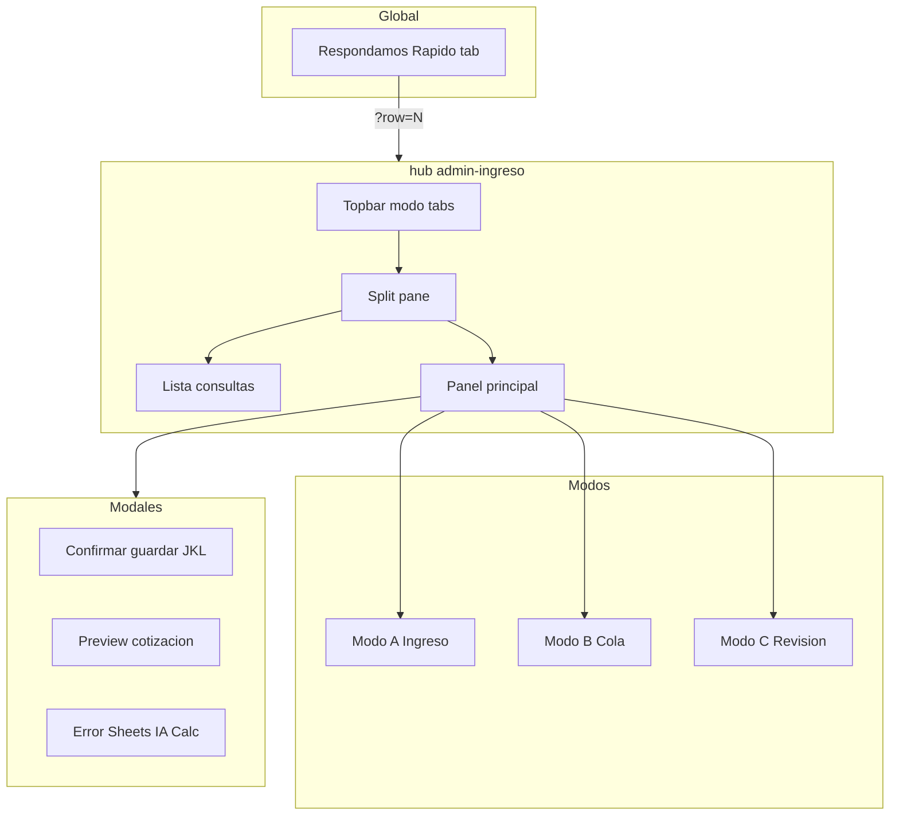
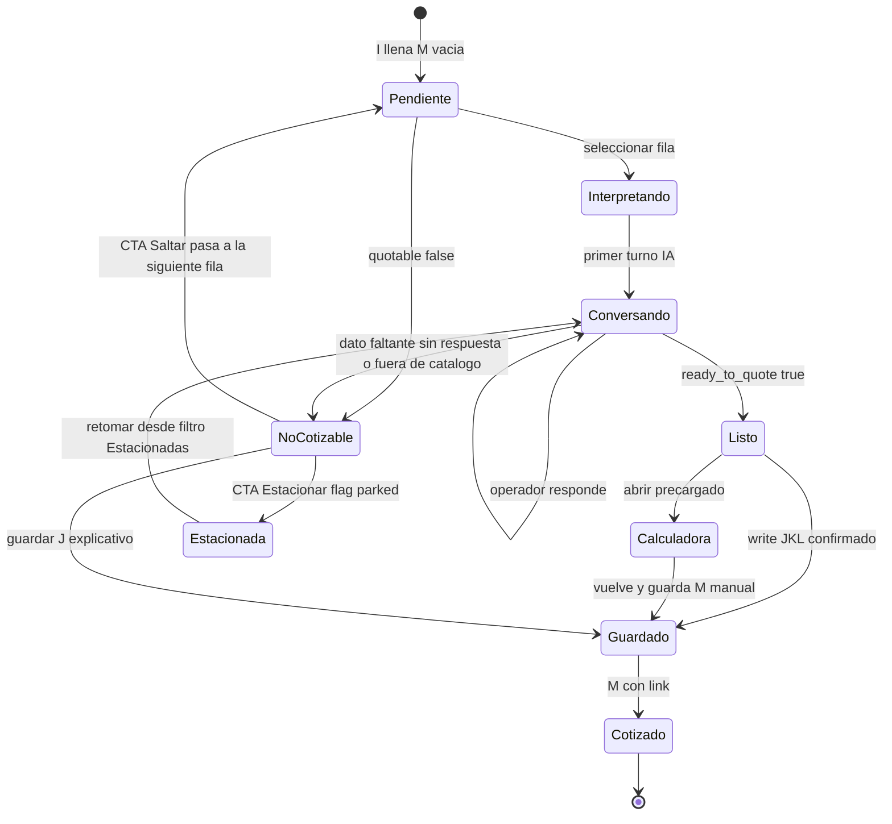
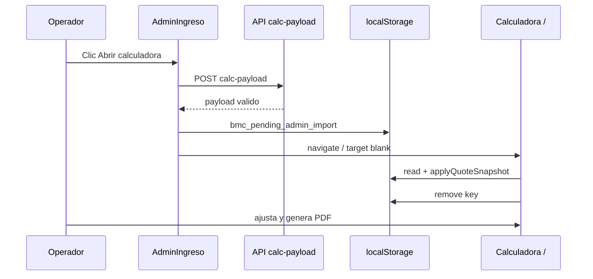

# UX Spec — Ingreso y actualización Admin

**Versión:** 1.1  
**Fecha:** 2026-07-04  
**Basado en:** [`INGRESO-ACTUALIZACION-ADMIN-DESIGN-BRIEF.md`](./INGRESO-ACTUALIZACION-ADMIN-DESIGN-BRIEF.md)  
**Audiencia:** Implementadores frontend + revisión operador BMC

---

## 1. Decisiones de diseño (resueltas)

| # | Decisión | Elección | Motivo |
|---|----------|----------|--------|
| 1 | Layout módulo | **Split-pane** 320px lista + panel principal | Paridad con chat actual; operador ve cola y contexto |
| 2 | Chat UI | **React nativo** (no iframe en módulo hub) | CTAs calculadora/Drive sin cross-origin; reutiliza API bmc-chat. **Implementado P0** — al ganar el nativo, la auth postMessage del iframe queda legacy: no diseñar grants para ella |
| 3 | Respondamos Rapido | **Launcher compacto** → deep-link al hub | iframe solo fase 1; v2 abre `/hub/admin-ingreso?row=N` |
| 4 | Ruta | **`/hub/admin-ingreso`** | Convención hub plana (`/hub/cotizaciones`, `/hub/canales`) |
| 5 | Preview cotización | **Modal** con resumen BOM antes de Drive | Evita sorpresas en M |
| 6 | Multi espesor | **Tabs** por variante (`100mm`, `150mm`) | Clara separación de cotizaciones |
| 7 | localStorage | **`bmc_pending_admin_import`** | Metadata `{ adminRow, consulta, savedAt }` |
| 8 | Grant RBAC | **`role:"admin"`** | Como quedó implementado en P0 (`RequireGrant role="admin"` + `useCockpitOperatorAuth({ role: "admin" })`) y como exige el backend `requireWolfboard*`. Granularidad por módulo = evolución opcional, no requisito |
| 9 | Tokens visuales | **Reutilizar `--ac-*`** de Admin Cotizaciones | Coherencia hub |

---

## 2. Mapa de pantallas



---

## 3. Wireframe — Módulo `/hub/admin-ingreso` (desktop ≥1024px)

```
┌─────────────────────────────────────────────────────────────────────────────┐
│ ← Hub    Ingreso y actualización Admin          [Cola 11]  🟢 Sheets  👤   │
├─────────────────────────────────────────────────────────────────────────────┤
│ [ Cola pendientes ] [ Ingreso rápido ] [ Revisión ]     🔍 Buscar consulta │
├──────────────────┬──────────────────────────────────────────────────────────┤
│ CONSULTAS (11)   │  Fila 8 · WBK-… · Cliente García                        │
│                  │  ─────────────────────────────────────────────────────── │
│ ● 8  Chapa Armco │  Consulta (I) — solo lectura                             │
│   6  Plegado esp │  ┌────────────────────────────────────────────────────┐  │
│   7  Completas…  │  │ Chapa Armco Cal 24 6.25m x 16 uds + cumbrera…     │  │
│ ▶ 3  Actualiz…  │  └────────────────────────────────────────────────────┘  │
│   4  Visita obr… │                                                          │
│   …              │  Tags: [Cotizable] [Faltan datos] [Techo]               │
│                  │                                                          │
│                  │  ┌─ Interpretación (J) ──────────────────────────────┐  │
│                  │  │ TECHO ISOROOF_FOIL 50mm [inferido] · 2 zonas…    │  │
│                  │  └───────────────────────────────────────────────────┘  │
│                  │  ❓ ¿Color definitivo Blanco o Gris?                     │
│                  │  Faltan: color                                          │
│                  │                                                          │
│                  │  CHAT                                                    │
│                  │  ┌────────────────────────────────────────────────────┐  │
│                  │  │ AI  Interpretación inicial…                        │  │
│                  │  │ TÚ  Color indiferente                              │  │
│                  │  │ AI  Actualizado — listo para cotizar               │  │
│                  │  └────────────────────────────────────────────────────┘  │
│                  │  [ Escribí la respuesta del cliente…          ] [Enviar]│
│                  │                                                          │
│                  │  [ Guardar en Admin ]  [ Abrir calculadora ]  [ Cotizar]│
│                  │  [ Abrir en Cotizaciones ↗ ]  [ Siguiente → ]          │
└──────────────────┴──────────────────────────────────────────────────────────┘
```

**Proporciones:** lista 300–340px fija; panel flexible min 480px.

---

## 4. Wireframe — Modo A Ingreso rápido

```
┌─────────────────────────────────────────────────────────────────────────────┐
│ [ Cola pendientes ] [▶ Ingreso rápido ] [ Revisión ]                        │
├──────────────────┬──────────────────────────────────────────────────────────┤
│ (lista oculta    │  Nueva consulta                                          │
│  o minimizada)   │                                                          │
│                  │  Destino: (•) Nueva fila  ( ) Fila existente [▼ row 12]  │
│                  │                                                          │
│                  │  Consulta del cliente (I)                                │
│                  │  ┌────────────────────────────────────────────────────┐  │
│                  │  │ Pegá acá el texto de WhatsApp, email o nota…       │  │
│                  │  │                                                    │  │
│                  │  │                                                    │  │
│                  │  └────────────────────────────────────────────────────┘  │
│                  │                                                          │
│                  │  [ Interpretar ]                                         │
│                  │                                                          │
│                  │  ── Preview (no guardado aún) ──                         │
│                  │  J / K / L + tags                                        │
│                  │  [ Editar J manualmente ]                                │
│                  │                                                          │
│                  │  [ Guardar en Admin ]   [ Abrir calculadora ]            │
└──────────────────┴──────────────────────────────────────────────────────────┘
```

**Regla:** `Guardar en Admin` deshabilitado hasta que exista preview (post-interpretar).

**Decisión de producto pendiente (no de diseño):** el destino **"Nueva fila"** (append en Admin.) vs **"Fila existente"** debe resolverse a nivel producto antes de P2. La UI soporta ambos destinos tal como está wireframeada; el default y el flujo de IDs (columna A) se definen con esa decisión.

---

## 5. Wireframe — Respondamos Rapido v2 (launcher)

```
                                    ┌──────────────────────────────┐
                                    │ ● Respondamos Rapido      × │
                                    ├──────────────────────────────┤
                                    │ 3 consultas pendientes       │
                                    │                              │
                                    │ • Actualizando presupuesto…  │
                                    │ • Visita a obra…             │
                                    │ • Plegado especiales…        │
                                    │                              │
                                    │ [ Abrir módulo completo ↗ ]  │
                                    └──────────────────────────────┘
┌─────────────────────────────────────────────────────────────────┐
│ ● Respondamos Rapido                                            │  ← tab fija
└─────────────────────────────────────────────────────────────────┘
```

**Fase 1 (ship rápido):** mantener iframe actual + botón "Abrir módulo completo".  
**Fase 2:** reemplazar iframe por lista nativa + link al hub (misma API).

---

## 6. Wireframe — Modal preview cotización

```
┌─────────────────────────────────────────────────────────┐
│  Confirmar cotización                              [×]  │
├─────────────────────────────────────────────────────────┤
│  Fila 8 · ISOROOF_FOIL 50mm · Techo                     │
│                                                         │
│  Área        384 m²                                     │
│  Paneles     24                                         │
│  Subtotal    USD 17,141 (sin IVA)                       │
│  IVA 22%     USD 3,771                                    │
│  Total       USD 20,912                                   │
│                                                         │
│  [Tabs: 100mm | 150mm ]  ← si espesor_variants          │
│                                                         │
│  ⚠ Se subirá PDF a Drive y se escribirá col M           │
│                                                         │
│         [ Cancelar ]    [ Generar y guardar link ]      │
└─────────────────────────────────────────────────────────┘
```

**Regla (escritura confirmada):** el click **«Generar y guardar link»** es **LA confirmación explícita** que escribe columna M — ninguna otra acción escribe M y nunca ocurre en automático. Es el mismo acto que el "Generar PDF" del Journey 1 del brief.

---

## 7. Estados por fila (máquina de estados)



### Badges en lista lateral

| Badge | Color token | Condición |
|-------|-------------|-----------|
| Sin interpretar | `--ac-text-3` | J vacío |
| En chat | `--ac-accent` | conversación activa, !ready |
| Listo | `--ac-success` | `ready_to_quote` |
| No cotizable | `--ac-warn` | `quotable=false` |
| Cotizado | `--ac-text-2` + ✓ | M llena (no aparece en cola) |
| Estacionada | `--ac-yellow` | flag `parked` en la conversación (`_BMC_ChatState`) — fuera de la cola activa, visible en filtro "Estacionadas" |

**Persistencia de Estacionada:** flag `parked: true` dentro del JSON de conversación (`POST /api/conversation/:row` guarda el body verbatim) — cero cambio de backend. **Regla de cola:** Saltar/Estacionar están siempre disponibles en filas problemáticas; la cola nunca queda bloqueada por una fila no cotizable.

---

## 8. Componentes React (spec implementación)

### 8.1 Árbol de componentes

```
AdminIngresoModule.jsx          ← ruta /hub/admin-ingreso, RequireGrant cotizaciones
├── SkinProvider                ← reutilizar de admin-cotizaciones
├── AdminIngresoTopbar.jsx      ← breadcrumb, modo tabs, health Sheets, contador cola
├── AdminIngresoSplit.jsx       ← layout split-pane
│   ├── InquirySidebar.jsx      ← lista + badges + búsqueda
│   └── InquiryWorkspace.jsx    ← panel según modo
│       ├── IngresoRapidoPanel.jsx     (Modo A)
│       ├── ColaChatPanel.jsx          (Modo B) ★ core
│       └── RevisionPanel.jsx          (Modo C)
├── InterpretationCard.jsx      ← J + tags + missing_L
├── InquiryChat.jsx             ← burbujas + input + loading
├── InquiryActionBar.jsx        ← CTAs footer
├── QuotePreviewModal.jsx
├── SaveConfirmModal.jsx
└── hooks/
    ├── useAdminIngresoInquiries.js   ← GET /api/inquiries (proxy o direct)
    ├── useInquiryConversation.js   ← GET/POST/DELETE conversation
    ├── useInquiryInterpret.js      ← POST interpret
    └── useInquiryActions.js        ← write, quote, openCalc
```

### 8.2 Props clave — `ColaChatPanel`

```ts
// Tipos conceptuales (implementar en JSDoc)
type Inquiry = { row: number; consulta: string; cliente?: string; id?: string };
type Interpretation = {
  quotable: boolean;
  ready_to_quote: boolean;
  interpretation_J: string;
  question_K: string;
  missing_L: string | string[];
  escenario?: string;
  techo?: object;
  pared?: object;
  espesor_variants?: number[];
};
```

| Prop / estado | Tipo | Notas |
|---------------|------|-------|
| `selectedRow` | `number \| null` | Sync con `?row=` URL |
| `interpretation` | `Interpretation \| null` | Última del turno activo |
| `conversation` | `{ role, content }[]` | Persistida server-side |
| `busy` | `"interpret" \| "write" \| "quote" \| null` | Deshabilita CTAs |
| `sheetsStatus` | `"up" \| "down" \| "checking"` | Dot en topbar |

### 8.3 `InquiryActionBar` — visibilidad CTAs

| CTA | Visible cuando | Grant |
|-----|----------------|-------|
| Guardar en Admin | Siempre que hay interpretation | `write` |
| Abrir calculadora | `toCalcPayload` válido | `write` |
| Cotizar (Drive) | `ready_to_quote && quotable` | `write` |
| Siguiente | Modo B + hay más en cola | `read` |
| Saltar | `quotable=false` o dato faltante sin respuesta | `read` — avanza sin escribir nada |
| Estacionar | `quotable=false` o dato faltante sin respuesta | `write` — persiste `parked` en `_BMC_ChatState` |
| Abrir en Cotizaciones | Siempre | `read` → `/hub/cotizaciones?row=N` |

### 8.4 API — estrategia v1

**Opción recomendada:** proxy en `panelin-calc` bajo `/api/admin-ingreso/*` que reutiliza `bmcChatSheets` + `bmcChatGemini` + integra `brainContext` del pipeline en fase 2.

| Endpoint | Método | Body | Respuesta |
|----------|--------|------|-----------|
| `/api/admin-ingreso/inquiries` | GET | — | `{ inquiries: Inquiry[] }` |
| `/api/admin-ingreso/:row/conversation` | GET/POST/DELETE | conv JSON | igual bmc-chat |
| `/api/admin-ingreso/:row/interpret` | POST | `{ consulta, conversation, newUserMessage }` | Interpretation |
| `/api/admin-ingreso/:row/write` | POST | `{ interpretation }` | `{ success }` |
| `/api/admin-ingreso/:row/quote` | POST | `{ interpretation, variant? }` | `{ drive_url, resumen }` |
| `/api/admin-ingreso/:row/calc-payload` | POST | `{ interpretation, variant? }` | `{ payload, valid }` |

v1 alternativa sin backend nuevo: llamar directo a Cloud Run `bmc-chat` desde SPA (CORS ya `*`).

---

## 9. Flujo — Abrir en calculadora



**Payload localStorage:**

```json
{
  "adminRow": 8,
  "consulta": "Chapa Armco…",
  "savedAt": "2026-07-04T12:00:00Z",
  "payload": {
    "scenario": "solo_techo",
    "listaPrecios": "venta",
    "techo": { "familia": "ISOROOF_FOIL", "espesor": "50", "zonas": [{ "largo": 20, "ancho": 12 }] }
  }
}
```

---

## 10. Copy UI (español operador)

| Contexto | Texto |
|----------|-------|
| Título módulo | Ingreso y actualización Admin |
| Tab modo B | Cola pendientes |
| Tab modo A | Ingreso rápido |
| Tab modo C | Revisión |
| CTA guardar | Guardar en Admin |
| CTA calc | Abrir en calculadora |
| CTA quote | Generar cotización |
| Confirm guardar | ¿Escribir interpretación en fila {N}? Se actualizarán columnas J, K y L. |
| Sheets down | No pudimos conectar con la planilla. Reintentá en unos segundos. |
| IA down | El interpretador no respondió. Podés editar J manualmente o reintentar. |
| No cotizable | Esta consulta no es de paneles — guardá la interpretación y derivá a Manager. |
| CTA saltar | Saltar → siguiente |
| CTA estacionar | Estacionar consulta |
| Toast estacionada | Consulta estacionada — la encontrás en el filtro Estacionadas. |
| Empty cola | No hay consultas pendientes. Usá Ingreso rápido para cargar una nueva. |

---

## 11. Responsive

| Breakpoint | Comportamiento |
|------------|----------------|
| ≥1024px | Split-pane lista + workspace |
| 768–1023px | Lista colapsable (drawer izquierdo); workspace full width |
| <768px | Solo workspace; selector de fila como dropdown top; Respondamos Rapido sigue siendo entry point |

---

## 12. Accesibilidad

- `role="dialog"` en modales; Escape cierra
- Lista consultas: `aria-selected` en fila activa
- Chat: `aria-live="polite"` en último mensaje AI
- CTAs deshabilitados: `aria-disabled` + tooltip motivo
- Focus trap en modales confirmación y preview

---

## 13. Fases de implementación sugeridas

| Fase | Alcance | Esfuerzo relativo |
|------|---------|------------------|
| **P0** | Ruta `/hub/admin-ingreso` Modo B (cola + chat nativo + guardar JKL) | M |
| **P1** | Abrir calculadora + modal preview cotización | M |
| **P2** | Modo A ingreso rápido + Modo C revisión | S |
| **P3** | Respondamos v2 (lista nativa + deep link) | S |
| **P4** | Integrar brain/few-shot del pipeline en interpret | M |

**Prerequisito para `espesor_variants` (P1+):** sincronizar los guards `repairFamilyEspesor` y la tabla `TECHO_FAMILIAS`/`PARED_FAMILIAS` de `server/lib/bmcChatGemini.js` con `src/data/constants.js` **antes** de exponer los tabs de variantes en UI (discrepancia vigente: ISOWALL_PIR `[50,80,100]` en Gemini vs `[50,80]` en catálogo).

---

## 14. Criterios de aceptación UX (refinados)

- [ ] Operador completa fila 8 en Modo B sin salir del hub (< 3 min con datos completos)
- [ ] Modo A: pegar → interpretar → guardar sin escribir en sheet antes de confirmar
- [ ] Abrir calculadora deja zonas editables y muestra toast "Precargado desde fila N"
- [ ] Modal cotización muestra total USD con y sin IVA antes de Drive
- [ ] `?row=8` en URL preselecciona fila al abrir desde Respondamos
- [ ] Error Sheets no bloquea lectura de conversación cacheada (solo escritura)
- [ ] Buscar en sidebar filtra por texto de consulta client-side
- [ ] Fila no cotizable se puede Saltar/Estacionar sin escribir en la planilla; la cola avanza a la siguiente
- [ ] Columna M solo se escribe con el click "Generar y guardar link" — no hay escritura automática de M

---

## 15. Referencias

- Design brief: [`INGRESO-ACTUALIZACION-ADMIN-DESIGN-BRIEF.md`](./INGRESO-ACTUALIZACION-ADMIN-DESIGN-BRIEF.md)
- Patrones visuales: [`src/components/admin-cotizaciones/styles.css`](../../../src/components/admin-cotizaciones/styles.css)
- Launcher actual: [`src/components/BmcChatPanel.jsx`](../../../src/components/BmcChatPanel.jsx)
- Precarga calc: [`src/utils/applyQuoteSnapshot.js`](../../../src/utils/applyQuoteSnapshot.js)

---

*Fin del UX spec v1.1 — review "aprobable con ajustes" aplicado (2026-07-04)*