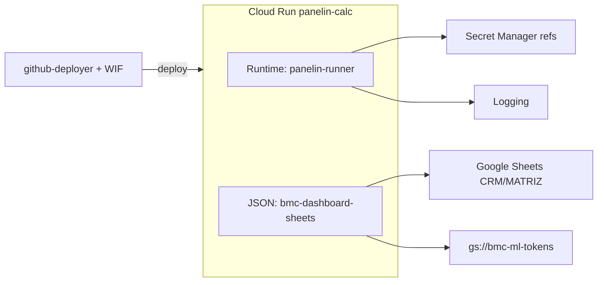

# GCP Service Accounts — Referencia de sesión (Calculadora BMC)

**Propósito:** Documento único para consultar sin re-cargar el chat. Resume investigación, plan, ejecución Phase 0 y próximos pasos del proyecto GCP `chatbot-bmc-live`.

**Última verificación live:** 2026-06-02 · revisión prod `panelin-calc-00427-mc7` · key Sheets activa `489cffaa…` (1 sola)

**Relacionado:** [`CHECKLIST-DEPLOY-PANELIN-CALC-BMC.md`](../../procedimientos/CHECKLIST-DEPLOY-PANELIN-CALC-BMC.md) · [`PLANILLA-PRINCIPAL-DASHBOARD.md`](../../google-sheets-module/PLANILLA-PRINCIPAL-DASHBOARD.md) · `.github/workflows/deploy-calc-api.yml` · `scripts/provision-secrets.sh` · `run_ml_cloud_run_setup.sh`

---

## 1. Resumen ejecutivo (5 bullets)

1. **Dos identidades distintas en prod:** runtime Cloud Run = `panelin-runner@…`; identidad Sheets/GCS ML = `bmc-dashboard-sheets@…` vía JSON montado (`panelin-service-account` → `/run/secrets/service-account.json`).
2. **Phase 0 aplicada:** 6 secretos sensibles pasaron de env literal → Secret Manager; key Sheets rotada (1 key); `roles/editor` quitado de `github-deployer`.
3. **Prod sano post-Phase 0/1:** `/health` OK, MATRIZ CSV OK, `npm run smoke:prod` OK; revisión **`panelin-calc-00427-mc7`** con 14 env→GSM refs.
4. **Riesgo residual:** `SMTP_PASS` / `WA_JWT_SECRET` siguen como literales `-` (placeholders); migrar con `cloud-run-env-to-secret.sh` cuando haya valores reales. Key JSON legacy en `github-deployer` (G4).
5. **Legacy:** `642127786762-compute@…` sigue en servicios viejos (`chatbot-*`, `panelin-calc-web`); Wolf/Firebase/Vertex son paralelos, no core Panelin calc.

---

## 2. Arquitectura (modelo operativo)



| Capa | Email | Rol |
|------|-------|-----|
| **Runtime Cloud Run** | `panelin-runner@chatbot-bmc-live.iam.gserviceaccount.com` | Identidad del contenedor; `secretAccessor`, logs, GCS viewer a nivel proyecto |
| **Credencial montada** | `bmc-dashboard-sheets@chatbot-bmc-live.iam.gserviceaccount.com` | Dentro de secret `panelin-service-account`; `GOOGLE_APPLICATION_CREDENTIALS=/run/secrets/service-account.json` |
| **Deploy CI** | `github-deployer@chatbot-bmc-live.iam.gserviceaccount.com` | WIF desde GitHub; `run.admin`, `artifactregistry.writer`, `iam.serviceAccountUser` (sin `editor` tras P0-3) |

**Regla de oro:** compartir planillas Google con **`bmc-dashboard-sheets@…`**, no con `panelin-runner@…`.

---

## 3. Constantes del proyecto

| Qué | Valor |
|-----|--------|
| Proyecto GCP | `chatbot-bmc-live` |
| Región | `us-central1` |
| Servicio API | `panelin-calc` |
| URL canónica API | `https://panelin-calc-q74zutv7dq-uc.a.run.app` |
| Runtime SA | `panelin-runner@chatbot-bmc-live.iam.gserviceaccount.com` |
| Secret Sheets JSON | `panelin-service-account` → mount `/run/secrets/service-account.json` |
| Bucket tokens ML | `bmc-ml-tokens` (objeto default `ml-tokens.enc`) |
| CRM workbook | `1N-4kyT_uSPSVnu5tMIc6VzFIaga8FHDDEDGcclafRWg` (`BMC_SHEET_ID`) |
| MATRIZ | `1oDMkBgWxX7cu7TpSvuO30tCTUWl68IBDhC4cQTP79Xo` |

---

## 4. Las 8 service accounts (tabla maestra)

| Email | Nombre | Uso en BMC | Estado |
|-------|--------|------------|--------|
| `bmc-dashboard-sheets@…` | bmc-dashboard-sheets | Sheets + GCS ML (JSON montado) | **Activa — canónica datos Google** |
| `panelin-runner@…` | Panelin Cloud Run | Runtime `panelin-calc`, `panelin-api` | **Activa — canónica runtime** |
| `github-deployer@…` | GitHub Actions Deployer | CI deploy vía WIF | **Activa — sin Editor** |
| `642127786762-compute@…` | Default compute | `chatbot-*`, `panelin-calc-web`, legacy | Legacy — no usar en Panelin nuevo |
| `vertex-express@…` | Vertex AI | Gemini/Vertex | Paralelo — fuera core calc |
| `firebase-adminsdk-fbsvc@…` | firebase-adminsdk | Firebase Admin | Paralelo — confirmar si aún se usa |
| `wolf-498@…` | wolf | Stack Wolf deprecado | Legacy |
| `wolf-us-c1@…` | wolf-us-c1 | Deploy Wolf us-central1 | Legacy |

---

## 5. Cronología de la sesión

| Paso | Qué pasó |
|------|----------|
| 1 | Usuario compartió captura GCP (8 SAs) → `/set-goal` generó master prompt de auditoría |
| 2 | Análisis live: dual SA, key sprawl, env literals sensibles, `github-deployer` con Editor |
| 3 | Plan de mejora Phase 0–3 (doc en chat; no persistido como archivo separado) |
| 4 | **Phase 0 ejecutada** en foreground (subagent falló por API limit) |

---

## 6. Phase 0 — qué se hizo (2026-06-01)

### P0-1 — Secretos → Secret Manager

**Problema:** Cloud Run rechaza cambiar tipo env→secret en un solo paso (`Cannot update environment variable … to the given type`).

**Patrón que funcionó:**
1. `--remove-env-vars=API_AUTH_TOKEN,ML_CLIENT_SECRET,…`
2. `--update-secrets=API_AUTH_TOKEN=API_AUTH_TOKEN:latest,…`

**Migrados a GSM (env ref, no literal):**
- `API_AUTH_TOKEN`, `ML_CLIENT_SECRET`, `ANTHROPIC_API_KEY`, `GEMINI_API_KEY`, `GROK_API_KEY`, `TOKEN_ENCRYPTION_KEY`

**Revisión post-migración:** `panelin-calc-00424-jmd` (luego nuevas revisiones por P0-2).

### P0-2 — Rotación key Sheets

- Nueva key user-managed: `489cffaab33b04157694742424312485cd344cb5`
- Secret `panelin-service-account` versión **2**
- Keys viejas revocadas (4 → **1 key** activa)
- Smoke: `/health` `hasSheets=true`, MATRIZ CSV OK

### P0-3 — IAM github-deployer

- Removido: `roles/editor` (requiere `--condition=None` en policies con condiciones)
- Quedan: `roles/run.admin`, `roles/artifactregistry.writer`, `roles/iam.serviceAccountUser`

### Rollback (pre-Phase 0)

```bash
gcloud run services update-traffic panelin-calc \
  --to-revisions=panelin-calc-00421-nr9=100 \
  --region=us-central1 --project=chatbot-bmc-live
```

---

## 7. Cómo usar en el proyecto

### Local dev

```bash
# .env
GOOGLE_APPLICATION_CREDENTIALS=docs/bmc-dashboard-modernization/service-account.json
# JSON debe tener client_email = bmc-dashboard-sheets@chatbot-bmc-live.iam.gserviceaccount.com
```

Compartir workbooks con **`bmc-dashboard-sheets@…`** (Editor/Lector según endpoint).

### Cloud Run prod

| Variable / mount | Valor |
|------------------|--------|
| `--service-account` | `panelin-runner@chatbot-bmc-live.iam.gserviceaccount.com` |
| Volume secret | `panelin-service-account:latest` → `/run/secrets/service-account.json` |
| `GOOGLE_APPLICATION_CREDENTIALS` | `/run/secrets/service-account.json` |
| Sensibles | refs GSM (`API_AUTH_TOKEN`, `ML_CLIENT_SECRET`, claves IA, etc.) |

### CI (GitHub Actions)

- WIF: `GCP_WIF_PROVIDER`, `GCP_DEPLOY_SA_EMAIL` → `github-deployer@…`
- Runtime en deploy: `GCP_RUNTIME_SA_EMAIL` → `panelin-runner@…`
- **P1-1 (2026-06-02):** `deploy-calc-api.yml` monta sensibles vía `--set-secrets` (API/ML/IA + identity/DB). `SMTP_PASS` / `WA_JWT_SECRET` siguen en `env_vars` hasta valores reales en Cloud Run (hoy `-`) → migrar con `scripts/cloud-run-env-to-secret.sh`.

### Scripts útiles

| Script | Uso |
|--------|-----|
| `scripts/provision-secrets.sh` | `.env` → GSM + grant `secretAccessor` a runtime SA |
| `scripts/cloud-run-env-to-secret.sh` | Migración two-step literal → GSM (SMTP/WA, etc.) |
| `run_ml_cloud_run_setup.sh panelin-calc` | Sync env + auto-migrate sensibles si existen en GSM |
| `scripts/cloud-run-matriz-sheets-secret.sh` | Mount `panelin-service-account` → `/run/secrets/service-account.json` + `BMC_MATRIZ_SHEET_ID` |

---

## 8. Verificación rápida (copy-paste)

```bash
# Revisión + runtime SA
gcloud run services describe panelin-calc \
  --region=us-central1 --project=chatbot-bmc-live \
  --format='value(status.latestReadyRevisionName,spec.template.spec.serviceAccountName)'

# Keys Sheets (esperado: 1)
gcloud iam service-accounts keys list \
  --iam-account=bmc-dashboard-sheets@chatbot-bmc-live.iam.gserviceaccount.com \
  --project=chatbot-bmc-live --managed-by=user

# Roles github-deployer (no debe incluir roles/editor)
gcloud projects get-iam-policy chatbot-bmc-live \
  --flatten="bindings[].members" \
  --filter="bindings.members:github-deployer@chatbot-bmc-live.iam.gserviceaccount.com" \
  --format='value(bindings.role)'

# Health + MATRIZ
curl -sS "https://panelin-calc-q74zutv7dq-uc.a.run.app/health"
curl -sS "https://panelin-calc-q74zutv7dq-uc.a.run.app/api/actualizar-precios-calculadora" | head -c 200

# Smoke completo
cd ~/calculadora-bmc && npm run smoke:prod
```

**Auditar literals vs secrets (sin imprimir valores):**

```bash
gcloud run services describe panelin-calc --region=us-central1 --project=chatbot-bmc-live --format=json \
| node -e "
const d=JSON.parse(require('fs').readFileSync(0,'utf8'));
const env=d.spec?.template?.spec?.containers?.[0]?.env||[];
const lit=env.filter(e=>e.value&&!e.valueFrom).map(e=>e.name);
const sec=env.filter(e=>e.valueFrom?.secretKeyRef).map(e=>e.name);
console.log('literals:', lit.length, lit.join(', '));
console.log('secrets:', sec.length, sec.join(', '));
"
```

---

## 9. Plan pendiente (Phase 1+)

### Phase 1 — Hardening (1–2 semanas)

| ID | Acción | Estado |
|----|--------|--------|
| P1-1 | Alinear `deploy-calc-api.yml`: sensibles en `--set-secrets`, no `env_vars` | **Hecho en repo** (2026-06-02); prod remontó GSM en `panelin-calc-00427-mc7`; `SMTP_PASS`/`WA_JWT_SECRET` pendientes (placeholder `-`) |
| P1-2 | Actualizar `cloud-run-matriz-sheets-secret.sh` → `panelin-runner` + `/run/secrets/service-account.json` | **Hecho** |
| P1-3 | Eliminar keys legacy `github-deployer` / `panelin-runner` si WIF-only | **Parcial:** `panelin-runner` sin keys user; `github-deployer` tiene 1 key (`4fc9699a…`, 2026-01-13) — requiere gate G4 |
| P1-4 | Revisar IAM `gs://bmc-ml-tokens` (compute + bmc-dashboard-sheets `objectAdmin`) | **Auditado:** OK para arquitectura actual (Sheets SA escribe tokens); compute legacy — evaluar quitar en Phase 2 |
| P1-5 | Docs: unificar nombre bucket (`bmc-ml-tokens`, no `panelin-calc-ml-tokens`) | **En curso** (ML-OAUTH-SETUP + checklist) |

### Phase 2 — Consolidación (~1 mes)

- Inventario Cloud Run: servicio → runtime SA → deprecar/apagar
- Wolf / chatbot legacy: Logging 90d → disable SA o documentar
- Migrar `panelin-calc-web` off compute default

### Phase 3 — Ongoing

- Post-deploy: smoke + grep describe sin literales sensibles
- Auditoría trimestral SA + keys
- Script opcional `scripts/gcp-sa-audit-snapshot.sh` → `.runtime/` (gitignored)

---

## 10. Anti-patterns (no repetir)

- Compartir planillas con `panelin-runner@…` (no llama Sheets).
- Crear keys JSON “por las dudas” en `bmc-dashboard-sheets`.
- Cambiar env literal → secret en **un solo** `gcloud run update` (falla por tipo).
- Asumir que el workflow CI limpia literales añadidos manualmente en Console.
- Mezclar OAuth Web client (`642127786762-hbkkonaqp9vvfk2qa9sv5go4bd8u4sj3`) con service accounts.

---

## 11. Gates de aprobación humana

| Gate | Acción |
|------|--------|
| G1 | Migración env → GSM (por lote) |
| G2 | Rotación / revocación keys Sheets |
| G3 | Quitar roles IAM deployer |
| G4 | Borrar keys JSON legacy |
| G5 | Cambiar IAM bucket ML |
| G6 | Apagar SAs Wolf / servicios legacy |

---

## 12. Cómo retomar en un chat nuevo

Pegar al agente:

```
Leé docs/team/infrastructure/GCP-SERVICE-ACCOUNTS-SESSION-REFERENCE.md.
Continuá desde Phase 1 (P1-1: alinear deploy-calc-api.yml) o verificá estado live con los comandos §8.
Proyecto: chatbot-bmc-live, servicio panelin-calc.
```

---

## 13. Inventario Cloud Run (runtime SA por servicio)

| Servicio | Runtime SA |
|----------|------------|
| `panelin-calc` | `panelin-runner@…` |
| `panelin-api` | `panelin-runner@…` |
| `panelin-calc-web` | `642127786762-compute@…` |
| `panelin-v3-api` | `642127786762-compute@…` |
| `bmc-chatbot-api`, `chatbot-backend`, `chatbot-engine`, `chatbot-service` | `642127786762-compute@…` |

*(Re-verificar con `gcloud run services list` si hubo deploys nuevos.)*

---

## 14. Checklist sharing Sheets

Compartir con **`bmc-dashboard-sheets@chatbot-bmc-live.iam.gserviceaccount.com`**:

| Workbook | Env var | ID |
|----------|---------|-----|
| CRM principal | `BMC_SHEET_ID` | `1N-4kyT_uSPSVnu5tMIc6VzFIaga8FHDDEDGcclafRWg` |
| MATRIZ | `BMC_MATRIZ_SHEET_ID` | `1oDMkBgWxX7cu7TpSvuO30tCTUWl68IBDhC4cQTP79Xo` |
| Pagos | `BMC_PAGOS_SHEET_ID` | `1AzHhalsZKGis_oJ6J06zQeOb6uMQCsliR82VrSKUUsI` |
| Ventas | `BMC_VENTAS_SHEET_ID` | `1KFNKWLQmBHj_v8BZJDzLklUtUPbNssbYEsWcmc0KPQA` |
| Stock | `BMC_STOCK_SHEET_ID` | `1egtKJAGaATLmmsJkaa2LlCv3Ah4lmNoGMNm4l0rXJQw` |
| Calendario | `BMC_CALENDARIO_SHEET_ID` | `1bvnbYq7MTJRpa6xEHE5m-5JcGNI9oCFke3lsJj99tdk` |

---

*Generado para liberar contexto de chat. No incluye secretos ni JSON de keys.*
