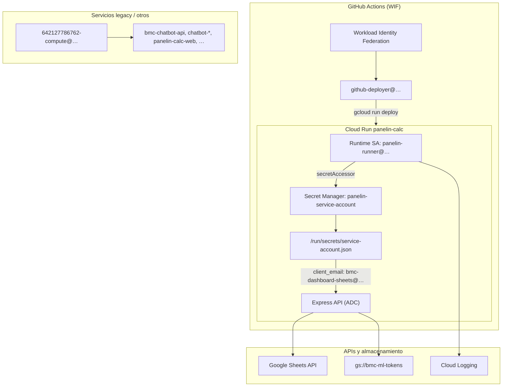

# Mapa de uso de Service Accounts — GCP `chatbot-bmc-live`

**Proyecto GCP:** `chatbot-bmc-live`  
**Producto:** Calculadora BMC / Panelin  
**Última auditoría:** 2026-05-31 (gcloud + curl en producción)  
**Documento canónico:** reemplaza hipótesis dispersas en docs, scripts y goal prompts.

---

## Resumen ejecutivo

- **Dos identidades en producción:** Cloud Run usa `panelin-runner@…` como SA de plataforma (Secret Manager, logging, deploy); la API de Sheets y el almacén ML OAuth usan **`bmc-dashboard-sheets@…`** vía JSON montado en `/run/secrets/service-account.json` (`GOOGLE_APPLICATION_CREDENTIALS`). **hecho confirmado**
- **`panelin-calc` está sano:** `GET /health` → `hasSheets=true`, `mlTokenStoreOk=true`, `hasTokens=true`; MATRIZ CSV responde. La clave activa en prod es la **más antigua** (`ff8190cb…`, Mar 2025) de 4 keys en `bmc-dashboard-sheets`. **hecho confirmado**
- **Riesgo crítico (P0):** la revisión actual de Cloud Run expone **múltiples secretos como variables de entorno literales** visibles en `gcloud run services describe` — contradice el patrón Secret Manager del workflow de deploy. **hecho confirmado**
- **Deriva documental:** scripts y docs históricos asumen runtime `642127786762-compute@…`, secret `GOOGLE_APPLICATION_CREDENTIALS` en `/secrets/sa-key.json`, y bucket `panelin-calc-ml-tokens`; prod usa `panelin-runner`, `panelin-service-account` → `/run/secrets/service-account.json`, y bucket **`bmc-ml-tokens`**. **hecho confirmado**
- **Higiene de keys pendiente:** 4 keys en `bmc-dashboard-sheets`, 4 en compute default, 2 en `github-deployer`, 1 innecesaria en `panelin-runner`; `github-deployer` tiene `roles/editor` (demasiado amplio). **hecho confirmado + recomendación**

---

## Alcance y metodología

### Qué se revisó

| Área | Herramienta / fuente | Fecha |
|------|----------------------|-------|
| Inventario de 8 service accounts + keys | `gcloud iam service-accounts list/keys list` | 2026-05-31 |
| Cloud Run `panelin-calc` (runtime SA, secrets, env) | `gcloud run services describe` | 2026-05-31 |
| Salud API prod | `curl GET /health`, MATRIZ CSV | 2026-05-31 |
| IAM bucket ML tokens | `gsutil iam get gs://bmc-ml-tokens` | 2026-05-31 |
| Contrato deploy CI | `.github/workflows/deploy-calc-api.yml` | repo HEAD |
| Scripts ops | `scripts/cloud-run-matriz-sheets-secret.sh` | repo HEAD |
| Workbooks Sheets | `docs/google-sheets-module/planilla-inventory.md`, `.env.example` | repo HEAD |

### Qué NO se incluyó

- Contenido de secretos, private keys, API keys o tokens (solo metadatos: `client_email`, `private_key_id` prefix, fechas).
- Mutaciones en GCP (solo recomendaciones para ejecución humana).
- OAuth Web client GIS (`642127786762-hbkkonaqp9vvfk2qa9sv5go4bd8u4sj3`) — identidad distinta; mencionado solo donde se confunde con SAs.

### Etiquetas epistémicas usadas en todo el documento

| Etiqueta | Significado |
|----------|-------------|
| **hecho confirmado** | Evidencia directa gcloud/curl/repo en la fecha indicada |
| **inferencia** | Conclusión razonable sin evidencia live completa |
| **duda abierta** | Requiere verificación adicional antes de actuar |

---

## Arquitectura — runtime vs identidad Sheets

**Modelo operativo:** `panelin-runner` **no** llama a Sheets directamente; monta el JSON y la app Node usa ADC apuntando al email **`bmc-dashboard-sheets@chatbot-bmc-live.iam.gserviceaccount.com`**. **hecho confirmado**

---

## Tabla maestra — 8 service accounts

| # | Email | Display name | Status | Uso real | Usado por | Evidencia | Confianza | Recomendación |
|---|-------|--------------|--------|----------|-----------|-----------|-----------|---------------|
| 1 | `vertex-express@chatbot-bmc-live.iam.gserviceaccount.com` | Vertex AI Service Account | Activo (Vertex) | Vertex AI / Gemini backend del proyecto | Vertex AI APIs (no Sheets core) | SA listada; sin user keys | **inferencia** | Mantener; no compartir workbooks; auditar bindings IAM si se activan features Gemini |
| 2 | `bmc-dashboard-sheets@chatbot-bmc-live.iam.gserviceaccount.com` | bmc-dashboard-sheets | **Activo — identidad Sheets/GCS ML** | Sheets API (CRM, MATRIZ, 5 workbooks), GCS `bmc-ml-tokens` | Local `.env`, Cloud Run ADC, scripts Sheets | Secret `panelin-service-account` → `client_email`; `/health hasSheets=true`; IAM bucket | **hecho confirmado** | **Canónica para Sheets.** Rotar a key más reciente (`3a7d8534`, May 2025); eliminar 3 keys obsoletas tras validar prod |
| 3 | `642127786762-compute@developer.gserviceaccount.com` | Default compute SA | Activo (legacy + otros servicios) | Runtime de 6 servicios Cloud Run no-Panelin-calc; IAM `storage.objectAdmin` en `bmc-ml-tokens` | `bmc-chatbot-api`, `chatbot-backend`, `chatbot-engine`, `chatbot-service`, `panelin-calc-web`, `panelin-v3-api` | Cloud Run describe; gsutil IAM | **hecho confirmado** | No usar para `panelin-calc` nuevo; reducir keys (4→1); evaluar migrar servicios legacy a SAs dedicadas |
| 4 | `firebase-adminsdk-fbsvc@chatbot-bmc-live.iam.gserviceaccount.com` | firebase-adminsdk | Activo (Firebase) | Firebase Admin SDK | Apps Firebase vinculadas al proyecto | SA listada; sin user keys en auditoría | **inferencia** | Documentar apps Firebase que la usan; no mezclar con Calculadora core |
| 5 | `github-deployer@chatbot-bmc-live.iam.gserviceaccount.com` | GitHub Actions Deployer | **Activo — CI deploy** | WIF → deploy Cloud Run, push Artifact Registry | GitHub Actions `deploy-calc-api.yml` (`GCP_DEPLOY_SA_EMAIL`) | WIF bound a repos Calculadora-BMC + GPT-PANELIN-Final; roles editor/run.admin | **hecho confirmado** | Reducir `roles/editor` → roles mínimos (run.admin, artifactregistry.writer, iam.serviceAccountUser); eliminar key JSON `4fc9699a` si WIF es único path |
| 6 | `panelin-runner@chatbot-bmc-live.iam.gserviceaccount.com` | Panelin Cloud Run | **Activo — runtime Panelin** | Runtime SA `panelin-calc` + `panelin-api`; secretAccessor, logging | Cloud Run prod, workflow `--service-account=${{ secrets.GCP_RUNTIME_SA_EMAIL }}` | `gcloud run describe panelin-calc`; roles listados | **hecho confirmado** | Mantener como runtime; **eliminar user-managed key** (May 5); no necesita JSON key si usa WIF+mount only |
| 7 | `wolf-498@chatbot-bmc-live.iam.gserviceaccount.com` | wolf | Legacy | Stack Wolf / wolfboard histórico | **inferencia:** servicios Wolf deprecados | Nombre + repo `wolfboard.js` | **inferencia** | Inventariar bindings IAM; deshabilitar si sin uso 90d |
| 8 | `wolf-us-c1@chatbot-bmc-live.iam.gserviceaccount.com` | wolf-us-c1 | Legacy | Deploy Wolf us-central1 | **inferencia:** CI/deploy Wolf antiguo | Nombre + región us-central1 | **inferencia** | Igual que wolf-498; candidata a archivo |

---

## Modelo operativo

### Desarrollo local

| Elemento | Valor recomendado | Notas |
|----------|-------------------|-------|
| Variable | `GOOGLE_APPLICATION_CREDENTIALS` | Ruta al JSON local (gitignored) |
| Path típico (`.env.example`) | `docs/bmc-dashboard-modernization/service-account.json` | Debe ser JSON de **`bmc-dashboard-sheets@…`**, no otro SA |
| Workbooks | Ver checklist § siguiente | Compartir **Editor** (escritura CRM) o **Lector** (solo lectura) según operación |
| API local | `:3001` | `npm run start:api` o `npm run dev:full` |
| Verificación | `curl localhost:3001/health` | `hasSheets=true` confirma JSON + sharing OK |

**Regla:** local y prod deben usar la **misma identidad Sheets** (`bmc-dashboard-sheets@…`) para evitar “funciona en mi máquina” por sharing distinto. **hecho confirmado** (docs + prod)

### Cloud Run producción (`panelin-calc`)

| Elemento | Valor live (2026-05-31) | Fuente |
|----------|-------------------------|--------|
| Servicio | `panelin-calc`, región `us-central1` | gcloud |
| Runtime SA | `panelin-runner@chatbot-bmc-live.iam.gserviceaccount.com` | gcloud describe |
| Secret montado | `panelin-service-account:latest` → `/run/secrets/service-account.json` | gcloud describe + workflow |
| `GOOGLE_APPLICATION_CREDENTIALS` | `/run/secrets/service-account.json` | env revision |
| `client_email` dentro del JSON | `bmc-dashboard-sheets@chatbot-bmc-live.iam.gserviceaccount.com` | parse redacted del secret |
| Key activa en prod | `private_key_id` prefix `ff8190cb…` (Mar 14, 2025) | secret metadata + keys list |
| ML tokens bucket | `ML_TOKEN_GCS_BUCKET=bmc-ml-tokens` | env revision |
| Health | `hasSheets=true`, `mlTokenStoreOk=true`, `hasTokens=true` | curl `/health` |

**Roles de `panelin-runner` (confirmados):** `secretmanager.secretAccessor`, `logging.logWriter`, `storage.objectViewer`, `run.admin`, `artifactregistry.writer`, `iam.serviceAccountUser`. **hecho confirmado**

**Anti-patrón detectado:** además de secrets montados (`IDENTITY_JWT_SECRET`, `DATABASE_URL`, etc.), la revisión incluye **valores sensibles como env vars literales** (API keys, ML client secret, SMTP, etc.) visibles en describe. **hecho confirmado — P0**

### CI deploy (GitHub Actions)

| Elemento | Valor | Confianza |
|----------|-------|-----------|
| Workflow | `.github/workflows/deploy-calc-api.yml` | hecho confirmado |
| Auth | Workload Identity Federation (`GCP_WIF_PROVIDER`) | hecho confirmado |
| Deploy SA | `secrets.GCP_DEPLOY_SA_EMAIL` → **`github-deployer@…`** | inferencia fuerte (WIF binding + nombre) |
| Runtime SA | `secrets.GCP_RUNTIME_SA_EMAIL` → **`panelin-runner@…`** | hecho confirmado (live describe) |
| Secret Sheets JSON | `--set-secrets=/run/secrets/service-account.json=panelin-service-account:latest` | hecho confirmado |
| Repos WIF | Calculadora-BMC, GPT-PANELIN-Final | hecho confirmado |

**Flujo:** CI autentica como `github-deployer` → build/push imagen → deploy con `--service-account=panelin-runner` → monta `panelin-service-account` para ADC Sheets. **hecho confirmado**

---

## Checklist de sharing en Google Sheets

Compartir con **`bmc-dashboard-sheets@chatbot-bmc-live.iam.gserviceaccount.com`** (no con `panelin-runner` ni compute default).

| Workbook | Env var | ID | Permiso mínimo | Uso API |
|----------|---------|-----|----------------|---------|
| BMC crm_automatizado | `BMC_SHEET_ID` | `1N-4kyT_uSPSVnu5tMIc6VzFIaga8FHDDEDGcclafRWg` | **Editor** (escritura CRM) | Cotizaciones, entregas, audit, agent tools CRM |
| MATRIZ COSTOS y VENTAS 2026 | `BMC_MATRIZ_SHEET_ID` | `1oDMkBgWxX7cu7TpSvuO30tCTUWl68IBDhC4cQTP79Xo` | **Lector** (solo lectura precios) | `GET /api/actualizar-precios-calculadora` |
| Pagos Pendientes 2026 | `BMC_PAGOS_SHEET_ID` | `1AzHhalsZKGis_oJ6J06zQeOb6uMQCsliR82VrSKUUsI` | Lector (KPI) / Editor si API escribe | KPI financiero, pagos |
| 2.0 - Ventas | `BMC_VENTAS_SHEET_ID` | `1KFNKWLQmBHj_v8BZJDzLklUtUPbNssbYEsWcmc0KPQA` | Lector / Editor según endpoint | Ventas, logística |
| Stock E-Commerce | `BMC_STOCK_SHEET_ID` | `1egtKJAGaATLmmsJkaa2LlCv3Ah4lmNoGMNm4l0rXJQw` | Lector / Editor según sync | Stock KPI |
| Calendario vencimientos | `BMC_CALENDARIO_SHEET_ID` | `1bvnbYq7MTJRpa6xEHE5m-5JcGNI9oCFke3lsJj99tdk` | Lector | Calendario |
| 2.0 - Administrador de Cotizaciones | `WOLFB_ADMIN_SHEET_ID` | `1Ie0KCpgWhrGaAKGAS1giLo7xpqblOUOIHEg1QbOQuu0` | Lector mínimo | Integración Admin_Cotizaciones, wolfboard |
| TraKtiMe mirror (opcional) | `TRAKTIME_SHEET_ID` | *(vacío en `.env.example` — configurar en prod si mirror activo)* | Editor en workbook destino | Mirror nocturno TraKtiMe |

**Verificación rápida:** `npm run panelsim:env` o `node scripts/verify-sheets-tabs.js` (requiere JSON local).

---

## Higiene de keys (sin material secreto)

### `bmc-dashboard-sheets@…` — **canónica Sheets**

| Key ID (prefix) | Creada | En prod | Recomendación |
|-----------------|--------|---------|---------------|
| `ff8190cb…` | 2025-03-14 | **Sí** (montada en Secret Manager) | Rotar → reemplazar por key más nueva; luego **eliminar** |
| `66f05bca…` | 2025-03-25 | No | **Eliminar** tras rotación exitosa |
| `477aed6f…` | 2025-03-25 | No | **Eliminar** tras rotación exitosa |
| `3a7d8534…` | 2025-05-05 (expira 2028) | No | **Promover a canónica** en Secret Manager; actualizar `panelin-service-account` |

### `642127786762-compute@…` — default compute

| Key ID (prefix) | Creada | Recomendación |
|-----------------|--------|---------------|
| `0bf4e702…` | 2025-12 | Evaluar uso en servicios legacy; **eliminar** si sin dependencia |
| `c31373d7…` | 2026-02 | Idem |
| `f0aad5db…` | 2026-05-20 (corta) | Posible rotación automática; **eliminar** si expirada |
| `d8ace590…` | 2026-05-29 (corta) | Idem |

### `github-deployer@…`

| Key ID (prefix) | Creada | Recomendación |
|-----------------|--------|---------------|
| `4fc9699a…` | 2026-01-13 | **Eliminar** si deploy 100% WIF (sin JSON en GitHub) |
| `cf02f9f2…` | 2025-05-05 | **Eliminar** tras confirmar WIF |

### `panelin-runner@…`

| Key ID (prefix) | Creada | Recomendación |
|-----------------|--------|---------------|
| *(1 key)* May 2025 | 2025-05-05 | **Eliminar** — runtime no debería necesitar user key; usa SA identity + WIF |

### Sin user keys listadas

`vertex-express@…`, `firebase-adminsdk-fbsvc@…`, `wolf-498@…`, `wolf-us-c1@…` — mantener sin keys; preferir workload identity / ADC.

---

## Inventario Cloud Run — servicio → runtime SA

| Servicio Cloud Run | Runtime SA | Stack | Confianza |
|--------------------|------------|-------|-----------|
| `panelin-calc` | `panelin-runner@…` | **Calculadora BMC API (prod)** | hecho confirmado |
| `panelin-api` | `panelin-runner@…` | Panelin API hermano | hecho confirmado |
| `bmc-chatbot-api` | `642127786762-compute@…` | Legacy chatbot | hecho confirmado |
| `chatbot-backend` | `642127786762-compute@…` | Legacy chatbot | hecho confirmado |
| `chatbot-engine` | `642127786762-compute@…` | Legacy chatbot | hecho confirmado |
| `chatbot-service` | `642127786762-compute@…` | Legacy chatbot | hecho confirmado |
| `panelin-calc-web` | `642127786762-compute@…` | Frontend/host alternativo | hecho confirmado |
| `panelin-v3-api` | `642127786762-compute@…` | API v3 legacy | hecho confirmado |

---

## Hallazgos de seguridad y plan de acción

### P0 — Crítico (esta semana)

| ID | Hallazgo | Acción |
|----|----------|--------|
| P0-1 | Secretos en **plain env vars** en revisión Cloud Run (API keys, ML secret, SMTP, etc.) | Migrar a `--set-secrets` / Secret Manager; redeploy; verificar describe sin literales |
| P0-2 | Prod usa key **más antigua** de `bmc-dashboard-sheets` | Crear nueva key → actualizar secret `panelin-service-account` → smoke MATRIZ + `/health` → revocar keys viejas |
| P0-3 | `github-deployer` con **`roles/editor`** | Sustituir por roles mínimos de deploy; documentar en checklist |

### P1 — Alto (próximas 2 semanas)

| ID | Hallazgo | Acción |
|----|----------|--------|
| P1-1 | 4 keys en `bmc-dashboard-sheets`, 3 obsoletas | Eliminar tras P0-2 |
| P1-2 | User key en `panelin-runner` innecesaria | Eliminar key May 2025 |
| P1-3 | Bucket doc `panelin-calc-ml-tokens` vs prod `bmc-ml-tokens` | Actualizar `ML-OAUTH-SETUP.md`, `PROJECT-STATE`, scripts diagnóstico |
| P1-4 | Compute default con `storage.objectAdmin` en `bmc-ml-tokens` | Confirmar si legacy services aún necesitan; preferir solo `bmc-dashboard-sheets` |

### P2 — Medio

| ID | Hallazgo | Acción |
|----|----------|--------|
| P2-1 | Script `cloud-run-matriz-sheets-secret.sh` asume compute default + path `/secrets/sa-key.json` | Actualizar defaults: `panelin-runner`, secret `panelin-service-account`, path `/run/secrets/service-account.json` |
| P2-2 | 6 servicios en compute default SA | Plan migración a SAs dedicadas por producto |
| P2-3 | Keys JSON en `github-deployer` con WIF activo | Eliminar keys legacy |

### P3 — Bajo / inventario

| ID | Hallazgo | Acción |
|----|----------|--------|
| P3-1 | `wolf-498@…`, `wolf-us-c1@…` sin uso claro | Cloud Asset / Logging 90d → disable o documentar |
| P3-2 | `vertex-express@…`, `firebase-adminsdk@…` | Mantener; mapear a productos que las consumen |
| P3-3 | Docs duplicados (`docs 2/ML-OAUTH-SETUP.md`) | Consolidar o marcar obsoleto |

---

## Deriva vs documentación del repo

| Artefacto | Dice (histórico) | Live prod (2026-05-31) | Acción doc |
|-----------|------------------|------------------------|------------|
| `scripts/cloud-run-matriz-sheets-secret.sh` | Runtime = compute default; secret `GOOGLE_APPLICATION_CREDENTIALS`; mount `/secrets/sa-key.json` | `panelin-runner`; `panelin-service-account`; `/run/secrets/service-account.json` | Actualizar script defaults + comentarios |
| `docs/ML-OAUTH-SETUP.md` | Bucket `panelin-calc-ml-tokens` | `bmc-ml-tokens` | Corregir nombre bucket canónico |
| `PROJECT-STATE.md` (2026-03-27) | IAM en `panelin-calc-ml-tokens` | IAM en `bmc-ml-tokens` | Nota de migración bucket |
| `goal-prompt-gcp-service-accounts-audit-usage.md` | Bucket `panelin-calc-ml-tokens` | `bmc-ml-tokens` | Header EXECUTED → este doc |
| `CHECKLIST-DEPLOY-PANELIN-CALC-BMC.md` | Fase 2b parcialmente compute-centric | Runtime `panelin-runner` | Alinear Fase 1/2b |
| `.github/workflows/deploy-calc-api.yml` | Patrón correcto (secrets mount) | Coexiste con env literals en revisión | Workflow OK; revisión manual necesita sync |

---

## Items abiertos / supuestos

| Item | Estado | Cómo cerrar |
|------|--------|-------------|
| Valor exacto de `GCP_DEPLOY_SA_EMAIL` en GitHub | **inferencia** = `github-deployer@…` | `gh secret list` + WIF provider binding en Console |
| Uso activo de `wolf-498@…` / `wolf-us-c1@…` | **duda abierta** | Logging `principalEmail` 90d; listar Cloud Run jobs |
| `TRAKTIME_SHEET_ID` en prod | **duda abierta** | `gcloud run services describe` env; confirmar mirror activo |
| ¿Algún servicio legacy aún escribe ML tokens vía compute SA? | **duda abierta** | Revisar `chatbot-*` env `ML_TOKEN_GCS_BUCKET` |
| Rotación de key sin downtime | **inferencia** | Dual-key window: montar nueva key en secret → smoke → revocar vieja |

---

## Handoff para Matias — pasos click-by-click

> **Regla:** no pegar secretos en chat, commits ni tickets. Ejecutar en orden; validar con smoke tras cada paso.

### A. Ver estado actual (5 min)

1. [Cloud Run panelin-calc](https://console.cloud.google.com/run/detail/us-central1/panelin-calc?project=chatbot-bmc-live) → pestaña **Revisión activa** → anotar **Service account** (= `panelin-runner@…`).
2. Misma pantalla → **Variables y secretos** → confirmar mount `/run/secrets/service-account.json` ← `panelin-service-account`.
3. Terminal: `curl -sS "https://panelin-calc-q74zutv7dq-uc.a.run.app/health" | jq '.hasSheets, .mlTokenStoreOk'`
4. Terminal: `curl -sS "https://panelin-calc-q74zutv7dq-uc.a.run.app/api/actualizar-precios-calculadora" | head -c 200`

### B. P0 — Migrar literales a Secret Manager (prioridad máxima)

1. Console → Cloud Run → `panelin-calc` → **EDITAR Y DESPLEGAR NUEVA REVISIÓN**.
2. Por cada env var sensible visible (ML_*, OPENAI_*, SMTP_*, etc.): crear secret en [Secret Manager](https://console.cloud.google.com/security/secret-manager?project=chatbot-bmc-live) si no existe.
3. Reemplazar valor literal por **referencia a secret** (mismo patrón que `IDENTITY_JWT_SECRET`).
4. Deploy → repetir paso A.3 y A.4.
5. `gcloud run services describe panelin-calc --region=us-central1 --format=yaml | grep -E 'ML_CLIENT|OPENAI|SMTP'` — no debe mostrar valores en claro.

### C. P0 — Rotación key Sheets (ventana controlada)

1. [IAM → Service Accounts → bmc-dashboard-sheets](https://console.cloud.google.com/iam-admin/serviceaccounts?project=chatbot-bmc-live) → **Keys** → **Add key** (o usar key `3a7d8534…` existente si válida).
2. [Secret Manager → panelin-service-account](https://console.cloud.google.com/security/secret-manager?project=chatbot-bmc-live) → **New version** → pegar JSON completo (**solo en Console**, no en repo).
3. Cloud Run → nueva revisión (o esperar redeploy) → smoke A.3 + A.4.
4. Eliminar keys antiguas `ff8190cb…`, `66f05bca…`, `477aed6f…` **solo tras smoke OK**.

### D. P1 — Reducir privilegios CI

1. [IAM → github-deployer](https://console.cloud.google.com/iam-admin/iam?project=chatbot-bmc-live) → quitar `Editor` → agregar solo: `Cloud Run Admin`, `Artifact Registry Writer`, `Service Account User` (sobre `panelin-runner`).
2. Keys → eliminar JSON keys si WIF funciona (`gh run list --workflow "Deploy Calculator API"` tras push a main).

### E. P1 — Eliminar key innecesaria panelin-runner

1. Service Accounts → `panelin-runner` → Keys → eliminar user-managed key (May 2025).
2. Confirmar deploy CI sigue OK (no usa esa key).

### F. Sharing Sheets (si falla hasSheets)

1. Abrir cada workbook del checklist § anterior → **Compartir** → agregar `bmc-dashboard-sheets@chatbot-bmc-live.iam.gserviceaccount.com`.
2. `npm run smoke:prod` desde repo local.

---

## Referencias cruzadas

- [PLANILLA-PRINCIPAL-DASHBOARD.md](../../google-sheets-module/PLANILLA-PRINCIPAL-DASHBOARD.md)
- [planilla-inventory.md](../../google-sheets-module/planilla-inventory.md)
- [CHECKLIST-DEPLOY-PANELIN-CALC-BMC.md](../../procedimientos/CHECKLIST-DEPLOY-PANELIN-CALC-BMC.md)
- [deploy-calc-api.yml](../../../.github/workflows/deploy-calc-api.yml)
- [cloud-run-matriz-sheets-secret.sh](../../../scripts/cloud-run-matriz-sheets-secret.sh)
- [ML-CM1-VERIFICATION-CHECKLIST.md](../ML-CM1-VERIFICATION-CHECKLIST.md)

---

*Generado como entrega del goal prompt `goal-prompt-gcp-service-accounts-audit-usage.md`. Sin material secreto en este documento.*
