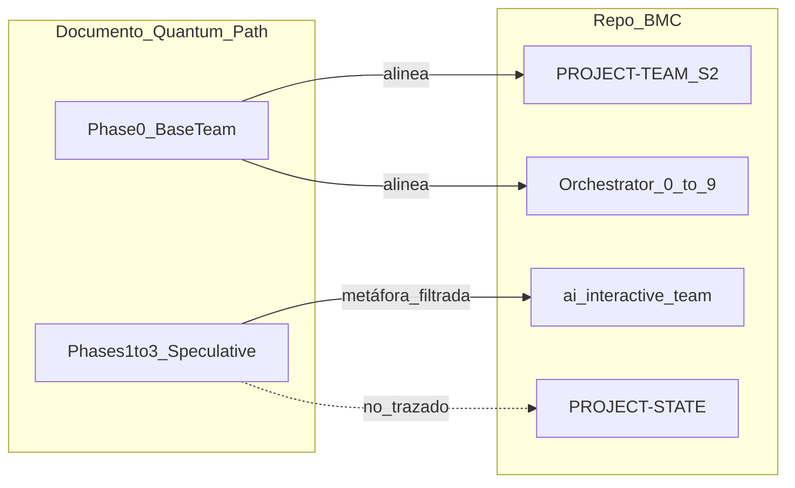

# Team interaction instance — Cross-learn: Quantum Evolution Path v∞ — 2026-03-20

**Tipo:** instancia documentada de intercambio (sin implementación de stack cuántico ni cambios de código).  
**Protocolo alineado:** [`.cursor/skills/ai-interactive-team/SKILL.md`](../../../.cursor/skills/ai-interactive-team/SKILL.md) — visibilidad compartida, consenso donde aplica, escalación al usuario ante disenso fuerte.

---

## 0. Contexto

- **Fuente analizada:** documento externo «BMC/Panelin Team — Quantum Evolution Path v∞» (Phase 0 base team; Phases 1–3 K8s/Grok, LangGraph, Qiskit QAOA/VQE/VQC, «quantum swarm», script ficticio `quantum-fusion.sh`, «Auto-approved 5.0/5», estado final narrativo).
- **Objetivo del round:** extraer prácticas válidas (metáforas anclables al repo), rechazar ruido sin evidencia, y registrar aprendizaje cruzado por rol §2 de [PROJECT-TEAM-FULL-COVERAGE.md](../PROJECT-TEAM-FULL-COVERAGE.md).
- **Facilita:** Orchestrator (marco del run) | MATPROMT (bundle / delta si se repite el ejercicio en paso 0a).

### Lectura crítica breve (consenso del round)

- **Phase 0** del documento **alinea** con el equipo real: PROJECT-STATE, Judge, Parallel/Serial, full runs, §2 y propagación.
- **Phases 1–3** mezclan APIs reales (Qiskit) con **metáfora no trazada** al stack BMC: no hay Qiskit/QAOA ni `quantum-fusion.sh` en el repositorio; «ejecutado» y «5.0/5 auto» son **narrativa**, no artefactos de Judge ni commits.
- **Valor retirable:** grafos de pasos (Orquestador 0–9), heurística de orden (Parallel/Serial), mejora por capas (paso 9 + IMPROVEMENT-BACKLOG), «mitigación de error» → contract/tests/audit/Fiscal; «swarm» → ai-interactive-team.

### Diagrama (documento vs stack BMC)

---

## 1. Hallazgos por rol (formato unificado — tabla canónica §2)

Cada rol: **Takeaway** | **Skepticism** | **Borrow** (acción concreta alineada al skill, sin código nuevo en este round).

| Rol | Takeaway | Skepticism | Borrow |
|-----|----------|------------|--------|
| **Mapping** | Los mapas planilla ↔ UI deben seguir siendo la fuente de verdad frente a documentos que suenan a «todo embebido». | No asumo que existan tabs/endpoints «v44» sin fila en planilla-inventory o diff en API. | En el próximo mapping, etiquetar insumos externos como *narrativa* vs *contrato verificable*. |
| **Design** | «Capas» de mejora encajan con iteración UX sin reescribir el dashboard entero. | Rechazo diseñar para un «Grok core» o swarm cuántico sin brief de usuario ni DASHBOARD-INTERFACE-MAP. | Si un input usa hype, traducir a 1 pantalla o 1 flujo con criterio de aceptación medible. |
| **Sheets Structure** | Estructura real de tabs/validaciones sigue siendo responsabilidad explícita (Matias); el doc no cambia permisos ni proceso. | Ninguna «fusión cuántica» reemplaza checklist de impacto en CRM/Master. | Solo actuar con ticket explícito del usuario; registrar en PROJECT-STATE si hay cambio estructural. |
| **Networks** | HPA/autoscaling es **idea real** en Cloud Run/K8s genérico, útil solo si hay problema de carga medido. | «10× throughput» sin métricas ni dueño en §2 es ruido. | Documentar SLO y opciones (min instances, concurrencia) cuando el usuario pida escala; no adoptar Grok como core. |
| **Dependencies** | El grafo de servicios ya cumple el papel de «estado del sistema» mejor que un swarm ficticio. | No enlazo nodos nuevos a tecnologías no presentes en repo sin entrada en service-map. | Añadir nota en dependencies cuando un doc externo proponga stack ajeno: *out of scope hasta ADR*. |
| **Integrations** | «Consenso antes de integrar» refuerza OAuth/webhooks y revisión cruzada con Design/Networks. | Nuevo «hybrid core» sin OpenAPI ni env documentado = no implementable. | Checklist: redirect URLs, scopes, hoja afectada — alineado a shopify/browser skills. |
| **GPT/Cloud** | LangGraph como metáfora = flujos explícitos (pasos, handoffs), ya cercanos al Orquestador. | QAOA no es estrategia de routing GPT/Cloud Run sin diseño formal. | En drift reviews, separar *story* de *operationId* y despliegue real. |
| **Fiscal** | «Mitigación de error» traduce a costo/beneficio/riesgo de adoptar herramientas nuevas. | No fiscalizo afirmaciones «auto-approved» sin trazabilidad en PROJECT-STATE. | Exigir dueño §2 y criterio de salida antes de aprobar experimentos caros. |
| **Billing** | Mejora continua por capas aplica a controles de cierre y duplicados, no a física cuántica. | Datos de facturación no se «entrelazan» con QML en este dominio sin pedido explícito. | Mantener foco en CSV/export y reglas de negocio; flaggear inputs mágicos en auditorías de proceso. |
| **Audit/Debug** | El documento es caso de **drift semántico** (suena implementado, no lo está). | No reporto PASS global por narrativa; solo por logs, endpoints y tests. | Plantilla de hallazgo: *claimed vs observed* para futuros estudios externos. |
| **Reporter** | «Embed upgrades en COVERAGE» se traduce a checklist §2.3 + propagación §4, no a volúmenes infinitos. | No prometo planes Solution/Coding sobre QPU sin alcance firmado. | Handoff: tabla *in scope / out of scope / evidencia requerida* en REPORT-SOLUTION-CODING cuando el insumo sea especulativo. |
| **Orchestrator** | Los runs deben anclarse a PROMPT, BACKLOG, MATPROMT y §2 dinámico, no a versiones «v∞». | No ejecuto «scripts cuánticos» ni declaro equipo completo sin leer la tabla actual. | Paso 0: clasificar inputs externos en *operativo* / *estudio* / *ficción útil como metáfora*. |
| **MATPROMT** | Los bundles por rol son los «edges» del grafo de trabajo del equipo. | No inflo prompts con jerga cuántica sin glosario operativo para BMC. | En 0a, si el usuario trae un doc hype: añadir línea *delta* «traducir metáfora a paso Orquestador X». |
| **Contract** | Contrato API ancla la realidad frente a documentos que afirman integraciones inexistentes. | «Todos los upgrades embebidos» no pasan sin `npm run test:contracts` / rutas reales. | Marcar en revisiones de contrato cualquier claim no respaldado por `bmcDashboard.js` / OpenAPI. |
| **Calc** | Mejora incremental (paso 9) encaja con BOM/pricing por entregas pequeñas verificadas. | VQC/quantum RL no entran al cotizador sin problema de negocio definido. | Cualquier «optimización global» de precios sigue siendo MATRIZ + tests `validation.js`. |
| **Security** | Todo «nuevo core» (Grok, cluster, terceros) es superficie de tokens y datos. | No asumo despliegue seguro de componentes no listados en threat model del repo. | Checklist rápida: secretos, CORS, alcance de datos — skill bmc-security-reviewer. |
| **Judge** | El documento entrena **higiene epistémica**: premiar evidencia, flaggear auto-aprobación ficticia. | No existen calificaciones 5.0/5 sin JUDGE-REPORT-RUN y criterios por agente. | En runs futuros, criterio explícito: *¿hay artefacto o solo storytelling?* |
| **Parallel/Serial** | «Optimización combinatoria» aquí = heurística humana + scores históricos + dependencias, no QAOA. | No paralelizo roles §2 basándome en throughput fantasma. | Mantener `PARALLEL-SERIAL-PLAN-*.md` con riesgos y supuestos visibles. |
| **Repo Sync** | Sincronizar «equipo» entre repos es procedural; no requiere «swarm» ni estados infinitos. | No copio a bmc-development-team narrativas no validadas como si fueran código. | Listar en reporte de sync qué docs son *opinión/estudio* vs *canónico*. |

---

## 2. Diálogo cruzado (mínimo 2 intercambios)

### 2.1 Parallel/Serial ↔ Judge — optimización vs evidencia

- **Parallel/Serial:** Propongo maximizar paralelismo cuando el objetivo es tiempo wall-clock y las dependencias lo permiten; el documento «quantum» sugiere optimización global, pero sin DAG real es fantasía.
- **Judge:** Acepto paralelismo **solo** si cada hilo deja entregable verificable (archivo, test, log). Si el plan promete 10× sin métricas base, la **forma de trabajo** baja puntaje aunque el relato sea ambicioso.
- **Acuerdo:** Paralelo agresivo + criterio Judge de evidencia por sub-resultado; disenso → escalación a usuario (ai-interactive-team).

### 2.2 Security ↔ Networks — «nuevo core» / infra

- **Networks:** HPA o más instancias pueden ser respuesta a latencia real; el doc mezcla eso con «Grok core», que implica nuevo proveedor y flujo de datos.
- **Security:** Cualquier core nuevo exige modelo de datos, retención, tokens y CORS; hasta que no haya ADR y §2.3, queda **rechazado para implementación**.
- **Acuerdo:** Infra escalable = backlog con métricas; «core LLM alternativo» = fase de descubrimiento separada con Fiscal + GPT/Cloud, no mezclado con quantum doc.

---

## 3. Síntesis (Orchestrator + MATPROMT)

| Categoría | Contenido |
|-----------|-----------|
| **Adoptar como metáfora operativa** | Pasos grafados (0–9), mejora por capas (paso 9 + backlog), mitigación de error = tests/contrato/audit/Fiscal, consenso multi-agente antes de cambios transversales. |
| **Rechazar hasta diseño formal** | Qiskit/QAOA/VQE/VQC como orquestación de agentes; `quantum-fusion.sh`; auto-aprobación Judge; «swarm infinito» como estado de producción. |
| **Investigar en backlog con criterio de salida** | Autoscaling medido (Cloud Run/concurrencia) si aparece cuello de botella; flujos tipo grafo **solo** si el usuario pide explícitamente tooling adicional y hay owner §2. |

---

## 4. Cierre Judge (criterio)

- **¿El round mejoró disciplina epistémica del equipo?** **Sí.**  
- **Nota:** Se dejó constancia explícita de *claimed vs observed*, se amarró el documento especulativo a artefactos BMC reales, y se evitó contaminar COVERAGE/STATE con versiones mágicas. Siguiente mejora: repetir el formato para otros estudios externos (misma plantilla bajo `docs/team/interactions/`).

---

## 5. Propagación (PROJECT-TEAM-FULL-COVERAGE §4)

Quién debe **leer esta instancia** en el próximo **Invoque full team** o sync relevante:

| Rol / agente | Motivo |
|--------------|--------|
| **Orchestrator, MATPROMT** | Paso 0 / 0a: clasificación de insumos externos; delta prompts. |
| **Judge** | Criterio de evidencia vs narrativa en futuros reportes. |
| **Parallel/Serial** | Alineación planes reales vs «optimización global» sin DAG. |
| **Fiscal** | Costo/riesgo de adopción de stack ajenos al repo. |
| **Contract, Audit/Debug** | Drift semántico y anclaje a contrato/logs. |
| **Reporter** | Handoffs *in scope / out of scope* para estudios externos. |
| **Dependencies, Repo Sync** | Qué es canónico vs estudio al actualizar service-map y repos hermanos. |
| **Resto §2** | Lectura opcional de §1 de este archivo (tabla por rol) en un solo pase para cross-learn. |

**Filas §4 aplicables:** *Hallazgos del Juez* (si el Judge incorpora el criterio epistémico en un run); *Crecimiento o modificación del dominio* (si en el futuro se formaliza carpeta `interactions/` como patrón de equipo); *Plan de ejecución paralelo/serie* (Parallel/Serial ↔ evidencia).

---

## Referencias cruzadas

- [INVOQUE-FULL-TEAM.md](../INVOQUE-FULL-TEAM.md) — pasos 0–9.  
- [PROJECT-TEAM-FULL-COVERAGE.md](../PROJECT-TEAM-FULL-COVERAGE.md) — §2, §4.  
- [PROJECT-STATE.md](../PROJECT-STATE.md) — entrada 2026-03-20 (interacción documentada).  
- Plan de análisis (solo referencia conceptual; no editar): análisis «Quantum Evolution Path» aprobado para materialización en este archivo.
