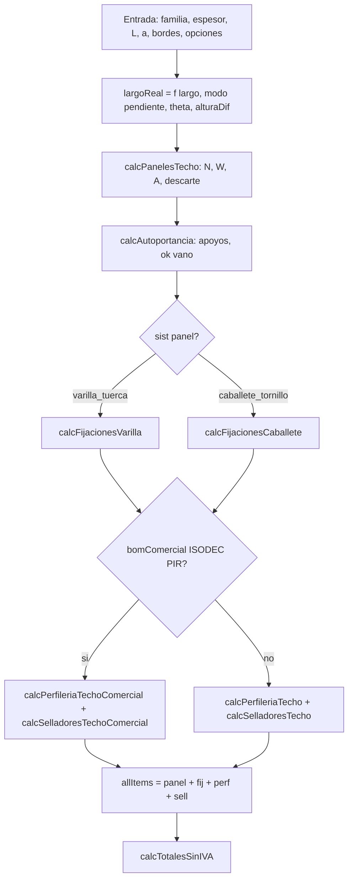

# Motor matemático de la Calculadora BMC — especificación y prompt

**Objetivo:** describir de forma **completa y auditable** las proporciones, reglas y **fórmulas** del motor (`src/utils/calculations.js` y dependencias), con **variables alineadas al código**, para poder **evaluar**, **modificar** o **reimplementar** cualquier línea de cotización sin ambigüedad.

**Fuente de verdad (implementación):**

| Área | Archivo principal |
|------|-------------------|
| Motor puro | `src/utils/calculations.js` |
| Parámetros ajustables (fórmulas) | `src/utils/dimensioningFormulas.js`, `dimensioningFormulasOverrides.js` |
| Precio unitario según lista | `src/data/constants.js` → `p()`, `LISTA_ACTIVA` |
| Catálogo en runtime | `src/data/pricing.js` → `getPricing()` |
| IVA y prefs UI | `src/utils/calculatorConfig.js` → `getIVA()` |

**Documentos relacionados:** [`Calc.md`](./Calc.md) (criterios comerciales N vs N+1, IVA en propuestas), [`MATRIZ-CALCULADORA.md`](./MATRIZ-CALCULADORA.md) (cadena de precios).

---

## Cómo usar esto como *prompt* (copiar y pegar)

Instrucciones para un agente o desarrollador que deba **cambiar o validar** el motor:

1. **No inventar fórmulas:** toda regla nueva debe expresarse como función de las variables del glosario y ubicarse en la sección correcta (techo, pared, merge, totales).
2. **Mantener coherencia de unidades:** metros (m), m², grados (°), USD **sin IVA** en `p()` salvo donde el ítem sea explícito; IVA **una vez** al final vía `calcTotalesSinIVA`.
3. **Redondeo:** salvo indicación, montos en USD con **2 decimales** (`toFixed(2)`); longitudes frecuentemente **3** decimales; factor de pendiente **4** decimales.
4. **Decisiones binarias** (sistema de fijación, BOM comercial, modo pendiente): seguir el diagrama de decisión y actualizar este doc si cambia la rama.
5. **Tras cambiar `calculations.js`:** ejecutar `npm run lint`, `npm test`, y ampliar `tests/validation.js` con un caso que fije la nueva fórmula.

---

## Glosario de variables (símbolos ↔ código)

| Símbolo | Significado | Origen típico |
|---------|-------------|----------------|
| \(a\) | Ancho solicitado de la cubierta (m) | input `ancho` |
| \(L\) | Largo en planta / proyección horizontal (m) | input `largo` |
| \(L_{\mathrm{real}}\) | Largo usado en área y BOM longitudinal | `largoReal` = `calcLargoRealFromModo(...)` |
| \(\theta\) | Pendiente (grados) | `pendiente` |
| \(f_p\) | Factor por pendiente | `calcFactorPendiente` → \(\approx 1/\cos(\theta)\) |
| \(a_u\) | Ancho útil del panel (m) | `panel.au` |
| \(N\) | Cantidad de paneles en ancho | `cantPaneles` |
| \(W\) | Ancho total cubierto | `anchoTotal` = \(N \cdot a_u\) |
| \(A\) | Área de chapa techo (m²) | `areaTotal` |
| \(P_{m2}\) | Precio USD/m² lista activa | `p(espData)` |
| \(C_{\mathrm{panel}}\) | Costo línea paneles | `costoPaneles` |
| \(d_w, d_A\) | Descarte ancho (m) y área (m²) | `descarte` |
| \(N_a\) | Apoyos (líneas) por autoportancia | `apoyos` |
| \(L_{\max}\) | Vano máximo entre apoyos (m) | `espData.ap` |
| \(r_{\mathrm{IVA}}\) | Tasa IVA | `getIVA()` (default 0,22) |

**Semántica de panel (techo):** `lmin`, `lmax` = rango comercial de **largo de paquete**; `ap` = **autoportancia** (vano máximo entre apoyos). No intercambiar.

---

## Vista global: flujo de decisión (techo)

---

## 1. Pendiente y largo real

**Modos** (`pendienteModo`):

- `incluye_pendiente`: \(L_{\mathrm{real}} = L\) (redondeo a 3 decimales).
- `calcular_altura` con \(h > 0\): \(L_{\mathrm{real}} = \sqrt{L^2 + h^2}\) (pitágoras).
- Por defecto `calcular_pendiente`: \(L_{\mathrm{real}} = L \cdot f_p(\theta)\).

**Factor pendiente** (ángulo \(\theta\) en grados, clamp \(|\theta| \le 89\)):

\[
f_p(\theta) = \mathrm{round}_4\bigl(1 / \cos(\theta \cdot \pi / 180)\bigr)
\]

**Largo real (modo pendiente estándar):**

\[
L_{\mathrm{real}} = \mathrm{round}_3\bigl(L \cdot f_p(\theta)\bigr)
\]

Implementación: `calcFactorPendiente`, `calcLargoReal`, `calcLargoRealFromModo`.

---

## 2. Techo — paneles, ancho cubierto, área, descarte

**Cantidad de paneles en ancho** (cubre todo el ancho solicitado; **siempre hacia arriba**):

\[
N = \max\bigl(1,\ \lceil a / a_u \rceil\bigr)
\]

**Ancho total cubierto y área de chapa:**

\[
W = N \cdot a_u,\quad
A = \mathrm{round}_2(N \cdot L_{\mathrm{real}} \cdot a_u)
\]

**Precio y costo de paneles** (lista `venta`/`web` según `p()`):

\[
C_{\mathrm{panel}} = \mathrm{round}_2(P_{m2} \cdot A)
\]

**Descarte** (material extra por ancho):

\[
d_w = \mathrm{round}_2(W - a),\quad
d_A = \mathrm{round}_2(d_w \cdot L_{\mathrm{real}}),\quad
\%_{\mathrm{desc}} = a>0\ ?\ \mathrm{round}_1\bigl(100 \cdot d_w / a\bigr)\ :\ 0
\]

**Normalizar medida** (`normalizarMedida`): modo `paneles` fija \(N=\max(1,\lceil\text{valor}\rceil)\) y \(a = \mathrm{round}_2(N \cdot a_u)\).

**Decisión de negocio (no forzada en UI):** si \(a\) no es múltiplo de \(a_u\), existe alternativa **N vs N−1** en términos de ancho cubierto; el motor elige **mínimo N que cubre \(a\)**. Ver [`Calc.md`](./Calc.md) sección «Cantidad de paneles en ancho».

---

## 3. Autoportancia (vanos, no largo fabricable)

Para espesor con `ap` definido:

\[
L_{\max} = \texttt{espData.ap},\quad
N_a = \left\lceil \frac{L}{L_{\max}} + 1 \right\rceil
\]

`ok = (L <= L_max)`; advertencias si largo de cubierta supera vano. **No** reemplaza validación `lmin`–`lmax` del panel.

---

## 4. Fijaciones techo

### 4.1 Varilla / tuerca (`sist === "varilla_tuerca"`)

**Puntos de fijación** dependen de `tipoEst` y opciones:

- **Combinada:** suma de enteros `floor(pts*)` por soporte.
- **Override** (`overridePuntosFijacion`): `round(override)`.
- **Automático:**
  \[
  P_{\mathrm{fij}} = \left\lceil N \cdot N_a \cdot 2 + \frac{2 L_{\mathrm{real}}}{e_{\mathrm{per}}} \right\rceil
  \]
  con \(e_{\mathrm{per}}\) = `FIJACIONES_VARILLA.espaciado_perimetro` (default 2,5 m).

Luego: tuercas según reparto metal/hormigón/madera; varillas = \(\lceil P_{\mathrm{fij}} / v_{pp}\rceil\) con \(v_{pp}\) = varillas por punto; tacos en hormigón; arandelas = \(P_{\mathrm{fij}}\). Todo en USD `toFixed(2)`.

### 4.2 Caballete (`calcFijacionesCaballete`)

\[
K = \left\lceil N \cdot 3 \cdot \left(\frac{L_{\mathrm{real}}}{f_L} + 1\right) + \frac{2 L_{\mathrm{real}}}{f_a} \right\rceil
\]

\(f_L\) = `FIJACIONES_CABALETE.factor_largo` (default 2,9), \(f_a\) = `factor_ancho` (default 0,3). Tornillos aguja = \(2K\).

---

## 5. Perfilería techo

- Barras por lado: piezas = \(\lceil \mathrm{dim} / \ell_{\mathrm{barra}} \rceil\) con `resolveSKU_techo` y precio `p(resolved)`.
- Canalón frontal: piezas canalón = \(\lceil W / \ell_{\mathrm{canalón}} \rceil\); soportes por ML = \((N+1) \cdot m_{\mathrm{sop}}\), barras = \(\lceil \mathrm{ML} / \ell_{\mathrm{soporte}} \rceil\).
- Gotero superior opcional: \(\lceil W / \ell_{\mathrm{gotero}} \rceil\).
- **Tornillos T1** de fijación de perfilería: si `totalML > 0`, \(N_{T1} = \lceil \mathrm{totalML} / e_{\mathrm{fij}} \rceil` con \(e_{\mathrm{fij}}\) = `PERFILERIA.espaciado_fijacion_ml` (default 0,30 m).

---

## 6. Selladores techo (modo ingeniería)

Metros lineales de silicona **antes** de pasar a unidades:

1. Juntas longitudinales: si \(N>1\), \(\mathrm{ml} \mathrel{+}= (N-1) \cdot L_{\mathrm{real}}\).
2. Solapes: \(\mathrm{ml} \mathrel{+}= 2 \cdot a_u \cdot N\).
3. Babetas adosar/empotrar: por cada lado con babeta, sumar perímetro correspondiente; **×2** cordones.
4. Canalón: si hay empalmes de barras, \((p_{\mathrm{can}}-1) \cdot e_{\mathrm{emp}} \cdot 2\) (empalme ML parametrizado).

Unidades: `siliconas = ceil(ml_silicona / ml_por_unidad)`; `cintas = ceil(N / paneles_por_rollo)` (ver `SELLADORES_TECHO.*` en `dimensioningFormulas.js`).

---

## 7. BOM comercial ISODEC PIR

**Condición:** `bomComercial === true` y familia `ISODEC_PIR` y `sist === "varilla_tuerca"`.

- Perfilería fija: 2 goteros frontales + 6 babetas empotrar (largos desde SKU) + T1 según ML total.
- Selladores: kit fijo parametrizado (`comercial_siliconas`, `comercial_membranas`, `comercial_espumas`).
- Fijación: puntos = override default (`puntos_comercial_default`, ej. 22).

---

## 8. Totales e IVA

Para ítems \(i\) con total en USD s/IVA:

\[
S = \mathrm{round}_2\Bigl(\sum_i \mathrm{total}_i\Bigr),\quad
I = \mathrm{round}_2(S \cdot r_{\mathrm{IVA}}),\quad
T = \mathrm{round}_2(S + I)
\]

**Importante:** el IVA se aplica al **subtotal agregado**, no línea a línea. Config: `getIVA()` (localStorage / default 0,22).

---

## 9. Fusión multi-zona (`mergeZonaResults`)

Para varias zonas del mismo tipo de resultado:

- Suma **cantPaneles**, **areaTotal**, **anchoTotal**, **costoPaneles** (con `toFixed(2)` donde aplica).
- **Descarte:** suma de anchos y áreas de descarte; porcentaje **recalculado** respecto al ancho solicitado implícito \(W - d_w\) combinado.
- **Ítems por SKU:** mismos SKU suman `cant` y `total`.
- **Totales:** `calcTotalesSinIVA` sobre `allItems` reconstruidos.

---

## 10. Pared — paneles y áreas

**Cantidad de paneles** en perímetro:

\[
N = \left\lceil \frac{P}{a_u} \right\rceil
\]

con \(P\) = perímetro horizontal (m).

**Áreas:**

\[
A_{\mathrm{bruta}} = \mathrm{round}_2(N \cdot H \cdot a_u),\quad
A_{\mathrm{aberturas}} = \mathrm{round}_2\Bigl(\sum_j w_j h_j c_j\Bigr),\quad
A_{\mathrm{neta}} = \mathrm{round}_2\bigl(\max(A_{\mathrm{bruta}} - A_{\mathrm{aberturas}}, 0)\bigr)
\]

**Costo paneles:** \(C = \mathrm{round}_2(P_{m2} \cdot A_{\mathrm{neta}})\).

**Perfiles U:** \( \lceil P / \ell_{\mathrm{barra}} \rceil\) base + coronación (dos líneas).

**Esquineros:** por tipo, piezas = \(\lceil H / \ell \rceil \cdot \mathrm{cantidad\_esquinas}\).

---

## 11. Fijaciones pared

Con \(W_{\mathrm{tot}} = N \cdot a_u\):

- Anclajes: \(\lceil W_{\mathrm{tot}} / e_{\mathrm{anc}} \rceil\) (default 0,30 m).
- Tornillos T2 (metal/mixto/combinada/madera): \(\lceil A_{\mathrm{bruta\_linea}} \cdot \rho_{T2} \rceil\) con \(\rho_{T2}\) = tornillos/m² (default 5,5) y área \(N \cdot H \cdot a_u\).
- Remaches: \(\lceil N \cdot r_p \rceil\) (default \(r_p=2\)).

---

## 12. Selladores pared

\[
J_v = N - 1,\quad
\mathrm{ml}_{\mathrm{juntas}} = \mathrm{round}_2(J_v \cdot H + 2 P)
\]

Siliconas: \(\lceil \mathrm{ml}_{\mathrm{juntas}} / \mathrm{ml}_{\mathrm{por\_unid}} \rceil\). Opcional cinta butilo y silicona 300 ml con mismas ML de referencia. Membrana: rollos = \(\lceil P / \mathrm{ml}_{\mathrm{rollo}} \rceil\); espumas ligadas a rollos de membrana.

---

## 13. Presupuesto libre

Líneas manuales desde catálogo `FIJACIONES` / `HERRAMIENTAS`: \(\mathrm{total} = \mathrm{round}_2(\mathrm{cant} \cdot p(\mathrm{sku}))\); mismos totales IVA que arriba.

---

## Tabla de parámetros dimensioning (defaults)

Los paths completos y valores por defecto están en `dimensioningFormulas.js` (`FORMULA_FACTORS` + paneles por `au`, `lmin`, `lmax`, `ap`). Cualquier override persiste vía `getDimensioningParam(path, default)`.

**Uso:** cambiar política (espaciados, ML por unidad de silicona, kit comercial) **sin** tocar la estructura de las fórmulas principales.

---

## Lista de precios `p(item)`

- `LISTA_ACTIVA === "venta"` → `item.venta || item.web || 0`
- Si no → `item.web || item.venta || 0`

Precios en datos **s/IVA** para el motor; IVA al final.

---

## Checklist de modificación segura

- [ ] ¿La fórmula está en esta spec o se añade una subsección nueva?
- [ ] ¿Unidades (m, m², unid) coherentes?
- [ ] ¿Redondeo intermedio vs final documentado?
- [ ] ¿Nueva rama de decisión? Actualizar diagrama Mermaid.
- [ ] Tests en `tests/validation.js` + `npm run gate:local`.

---

*Documento generado para alinear ingeniería, agentes y producto. Mantener actualizado cuando cambie `calculations.js` o contratos de inputs del componente de calculadora.*
