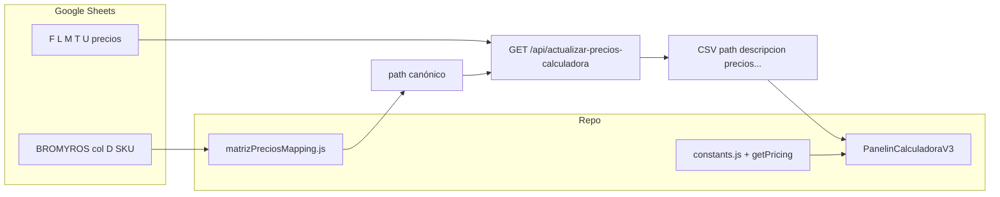

# Knowledge — MATRIZ ↔ Calculadora (precios y paths)

Rol: **Calc + Mapping** (y cualquier agente que toque precios). Complementa [`Calc.md`](./Calc.md) con el **puente planilla → código**.

---

## 1. Objetivo (por qué existe esta lógica)

- **Negocio:** Los precios y SKUs viven en la **MATRIZ de COSTOS y VENTAS** (Google Sheets). La calculadora en el navegador debe mostrar **los mismos importes y la misma grilla de productos** que esa planilla, sin copiar a mano fila por fila.
- **Técnico:** Cada fila útil de la planilla aporta un **SKU (col D)** que se traduce a un **`path` estable** (`PANELS_TECHO…`, `PANELS_PARED…`, etc.) igual al que usa `constants.js` / `getPricing()`. Si el SKU no mapea, **esa fila no entra al CSV** aunque exista en la hoja.
- **Riesgo que se evita:** Dos verdades (planilla vs código) o **paths duplicados** en el CSV → la calculadora o el reconcile marcan error y no se puede confiar en listas web/local.

En una frase: **la MATRIZ es la fuente operativa; `matrizPreciosMapping.js` es el contrato SKU→path; la calculadora consume `path` como en el catálogo.**

---

## 2. Cadena de datos (orden mental)

1. **Sheets:** pestaña aprobada (p. ej. BROMYROS), columnas según [`MATRIZ-PRECIOS-CALCULADORA.md`](../../google-sheets-module/MATRIZ-PRECIOS-CALCULADORA.md).
2. **Mapeo:** `getPathForMatrizSku(sku)` en `src/data/matrizPreciosMapping.js` (`MATRIZ_SKU_TO_PATH` + `normalizeSku`).
3. **Servidor:** `buildPlanillaDesdeMatriz` en `server/routes/bmcDashboard.js` lee filas, arma CSV (sin transformar F/L/M/T/U: **tal cual** celda).
4. **Cliente:** import CSV / “cargar desde MATRIZ”; precios aplicados vía flujo de pricing existente.

---

## 3. Archivos y responsabilidades

| Artefacto | Función |
| --------- | ------- |
| [`docs/google-sheets-module/MATRIZ-PRECIOS-CALCULADORA.md`](../../google-sheets-module/MATRIZ-PRECIOS-CALCULADORA.md) | Columnas F/L/M/T/U, IVA, flujo HTTP, config env. |
| `src/data/matrizPreciosMapping.js` | **SKU → path**; comentarios operativos (aliases, ISOPANEL vs ISODEC pared). |
| `server/routes/bmcDashboard.js` | `MATRIZ_TAB_COLUMNS`, `buildPlanillaDesdeMatriz`, `GET /api/actualizar-precios-calculadora`, `pushMatrizPricingOverrides`. |
| `src/data/constants.js` | Familias y objetos `PANELS_TECHO` / `PANELS_PARED` — estructura de la UI; **no** reemplaza el mapping SKU. |
| `scripts/reconcile-matriz-csv.mjs` | Comprobar **paths duplicados** en CSV (`npm run matriz:reconcile`). |
| `src/App.jsx` | Monta **`PanelinCalculadoraV3.jsx`** (calculadora canónica). |

**No buscar** literales `PANELS_PARED.ISOPANEL_EPS` en `server/` como prueba del flujo: el CSV **genera** esos paths vía mapping, no como strings fijos en `calc.js`.

---

## 4. Tres familias que suelen confundirse

| En la planilla (intención) | SKU ejemplo | `path` típico |
| -------------------------- | ----------- | -------------- |
| Panel **techo** ISODEC EPS | `ISDEC100`, `ISD100EPS` | `PANELS_TECHO.ISODEC_EPS.esp.100` |
| Panel **fachada** ISOPANEL EPS | `ISP100EPSF`, … | `PANELS_PARED.ISOPANEL_EPS.esp.100` |
| Panel **pared** lista ISODEC (precio distinto a ISOPANEL) | `ISDEC100P`, … | `PANELS_PARED.ISODEC_EPS_PARED.esp.100` |

Techo y pared no comparten el mismo `path` aunque el nombre comercial diga “ISODEC” en ambos lados.

---

## 5. Reglas operativas

- **Un SKU en col D** debe corresponder a **una** entrada en `MATRIZ_SKU_TO_PATH` (tras normalización). Si inventás texto en col D sin actualizar el mapping, **no habrá línea** en el CSV.
- **Un `path` no debe repetirse** en dos filas distintas del CSV exportado; si pasa, `matriz:reconcile` reporta duplicados — corregir planilla o mapping.
- **Overrides** desde la calculadora hacia Sheets: `POST /api/matriz/push-pricing-overrides` escribe **F, L, T** tal cual; **no** escribe U (ni M según doc de columnas).

---

## 6. APIs y comandos útiles

| Acción | Dónde |
| ------ | ----- |
| CSV precios desde MATRIZ | `GET /api/actualizar-precios-calculadora` (misma base que Cloud Run si usás origen único). |
| Duplicados en CSV | `curl -s BASE/api/actualizar-precios-calculadora \| node scripts/reconcile-matriz-csv.mjs - --json` |
| Encabezados BROMYROS | `npm run matriz:rename-headers` (ver doc MATRIZ-PRECIOS). |

---

## 7. Checklist cuando “no aparece un precio” o “falla reconcile”

1. ¿La fila tiene **SKU** en col D reconocido por `matrizPreciosMapping.js`?
2. ¿Hay **otra fila** con el mismo `path` (duplicado)?
3. ¿Las columnas de precio pedidas (F/L/T) están vacías en la planilla?
4. ¿`BMC_MATRIZ_SHEET_ID` y credenciales en el entorno que probás?

---

## 8. Handoffs

| Situación | Quién |
| --------- | ----- |
| Cambio de columnas o pestañas MATRIZ | Mapping + actualizar `MATRIZ_TAB_COLUMNS` / docs |
| Nuevo SKU o rename Bromyros | Calc o Mapping + **editar `matrizPreciosMapping.js`** + verificar reconcile |
| Solo duda de negocio (qué lista usar) | Matias / operación |

---

## Referencias cruzadas

- Detalle columnas e IVA: [`MATRIZ-PRECIOS-CALCULADORA.md`](../../google-sheets-module/MATRIZ-PRECIOS-CALCULADORA.md)
- Criterios cotización y trazabilidad: [`Calc.md`](./Calc.md)
- Inventario planillas: [`planilla-inventory.md`](../../google-sheets-module/planilla-inventory.md)
- Skill precios MATRIZ: `.cursor/skills/actualizar-precios-calculadora/SKILL.md`
