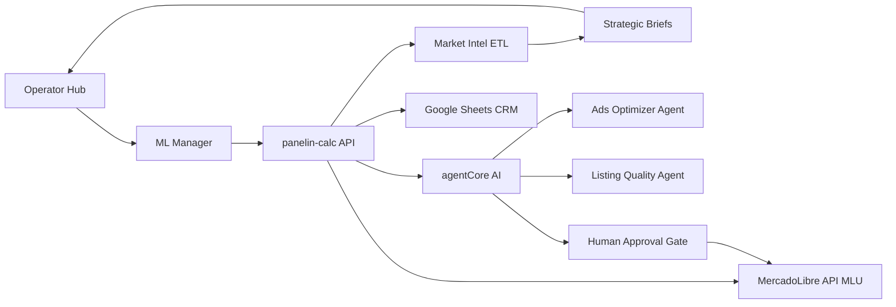

# MATPROMT — RUN 2026-07-18 / ML-SDD (MercadoLibre Optimization System)

**Tipo:** Prompt dedicado (no full-team run).  
**Rol activo:** `sdd-architect` (skill `~/.claude/skills/sdd-architect/SKILL.md`).  
**Salida esperada del architect:** [`docs/team/ml-optimization/SDD-ML-OPTIMIZATION-SYSTEM.md`](../ml-optimization/SDD-ML-OPTIMIZATION-SYSTEM.md)

---

## Power prompt

> Diseñá el SDD de **BMC MercadoLibre Optimization & Management System (MLOMS)**: plataforma unificada (hub + API + AI + ETL) para operar y optimizar la cuenta vendedor **MLU** — ads (crear/mejorar), campañas, listings (crear/mejorar calidad), discovery de productos, análisis competitivo y movimientos estratégicos — **reusando** el stack BMC actual y **expandiendo** capacidades faltantes, con **human gates** en escrituras críticas.

---

## Run Scope Matrix

| Rol §2 | Modo | Justificación |
|--------|------|---------------|
| **sdd-architect** | **Profundo** | Único ejecutor: SDD completo fases 0–6 |
| Orchestrator, MATPROMT, Mapping, Design, Integrations, Security, Calc, Judge, etc. | **N/A** | No es full-team run; handoff post-SDD a roles de implementación |
| Networks | Ligero | Solo si el SDD necesita validar Cloud Run / connector topology (lectura de docs existentes) |
| Integrations | Ligero | Inventario de APIs ML y gaps vs código actual |

**Roles sin herramientas pesadas este run:** todos excepto sdd-architect (solo lectura + escritura del SDD).

---

## Resumen ejecutivo (3–5 líneas)

1. BMC ya tiene **ML Manager** (`/hub/ml-manager`, `/hub/ml`, embed en `/hub/canales`), conector OAuth `/auth/ml/*` + `/ml/*`, **Market Intel** (`server/lib/marketIntel/`, `/hub/marketing`), corpus/training Panelin-Gym y AI vía `agentCore`.
2. Faltan o están parciales: **Product Ads end-to-end**, optimización de campañas con acciones aprobadas, **listing builder** completo, discovery sistemático, playbooks estratégicos accionables desde el hub, y unificación inteligencia de mercado ↔ operación ML.
3. El SDD debe ser **evolutivo** (extender lo existente), no greenfield paralelo.
4. Site: **MLU** (Uruguay). Escrituras ML = **human-in-the-loop** obligatorio.

---

## Objetivos del usuario / agenda

- Documento de arquitectura production-grade para el sistema integral de optimización y gestión MercadoLibre.
- Cubrir **8 dominios de capacidad** (ads, campañas, listings, competencia, estrategia, discovery, calidad, expansión).
- Matriz **Built / Partial / Gap** contra código y docs actuales.
- Roadmap implementable **P0–P3** con ADRs y diagramas C4.

---

## Preguntas para Matias / Orquestador (pre-resueltas en este bundle)

| Pregunta | Respuesta fijada |
|----------|------------------|
| ¿Site ML? | **MLU** (Uruguay) |
| ¿Greenfield o extensión? | **Extensión** de hub + API + marketIntel existentes |
| ¿Profundidad SDD? | **Completo** (fases 0–6 sdd-architect) |
| ¿Dónde guardar SDD? | `docs/team/ml-optimization/SDD-ML-OPTIMIZATION-SYSTEM.md` |
| ¿Autonomía de escritura ML? | **No** — aprobación operador antes de mutaciones en vivo |

---

## Grounding obligatorio (leer antes de diseñar)

| Área | Rutas |
|------|-------|
| Estado vivo | [`docs/team/PROJECT-STATE.md`](../PROJECT-STATE.md) — buscar entradas ML / ml-manager / marketIntel |
| ML Manager UI | [`src/components/hub/ml/MlManagerModule.jsx`](../../src/components/hub/ml/MlManagerModule.jsx), tabs bajo `src/components/hub/ml/tabs/`, hooks `useMlConnector.js` |
| Roadmap aprobado | [`docs/team/ML-MANAGER-ROADMAP.md`](../ML-MANAGER-ROADMAP.md) |
| OAuth + conector | [`.cursor/skills/bmc-mercadolibre-api/SKILL.md`](../../.cursor/skills/bmc-mercadolibre-api/SKILL.md), [`docs/ML-OAUTH-SETUP.md`](../../docs/ML-OAUTH-SETUP.md), human gate **cm-1** en [`HUMAN-GATES-ONE-BY-ONE.md`](../HUMAN-GATES-ONE-BY-ONE.md) |
| Market Intel | [`server/lib/marketIntel/`](../../server/lib/marketIntel/) — ETL, `priceGap.js`, `productIntelligence.js`, `strategicBrief.js`, alerts |
| Marketing hub | [`src/components/hub/marketing/`](../../src/components/hub/marketing/) (tab Inteligencia, product matrix) |
| ML search / ETL API | [`server/routes/mlSearch.js`](../../server/routes/mlSearch.js), [`server/routes/mlEtlRun.js`](../../server/routes/mlEtlRun.js) |
| AI core | [`server/lib/agentCore.js`](../../server/lib/agentCore.js), suggest-response, [`server/lib/brainKB.js`](../../server/lib/brainKB.js) |
| KB respuestas ML | [`docs/team/panelsim/knowledge/ML-RESPUESTAS-KB-BMC.md`](../panelsim/knowledge/ML-RESPUESTAS-KB-BMC.md), [`ML-TRAINING-SYSTEM.md`](../panelsim/knowledge/ML-TRAINING-SYSTEM.md) |
| Calidad listings | [`docs/team/ML-ISOFRIG-LISTING-CHECKLIST.md`](../ML-ISOFRIG-LISTING-CHECKLIST.md) |
| Scripts operativos | `npm run ml:verify`, `ml:corpus-export`, `ml:ai-audit`, `ml:pending-workup`, `etl:run` |
| Config / secrets | [`server/config.js`](../../server/config.js), `.env.example` — **nunca** hardcodear tokens |

---

## Matriz de capacidades (el SDD debe tener una fila por dominio)

| # | Dominio | Built (evidencia) | Gap típico | Prioridad sugerida |
|---|---------|-------------------|------------|-------------------|
| 1 | **Ads creation & creative optimization** | Roadmap AdsTab + hooks `useCampaigns` planificados | Creación de anuncios, creative IA, Product Ads API wiring | P1 |
| 2 | **Campaign optimization** | Endpoints planificados `/ml/ads/*` en roadmap | Reglas ACOS/ROAS, acciones aprobadas, reportes históricos | P1 |
| 3 | **Listing builder & quality** | ListingsTab pause/activate, PATCH items, checklist Isofrig | Alta de ítems, fotos, atributos bulk, remediation `moderation_penalty` | P0 |
| 4 | **Competition analysis** | marketIntel ETL, `/api/ml/search`, `/hub/marketing` matrix | Unificar competencia → acciones en ML Manager | P1 |
| 5 | **Strategic moves** | `strategicBrief.js`, alerts | Playbooks accionables en UI, priorización automática | P2 |
| 6 | **Product discovery** | keywordMonitor, productIntelligence, Bromyros gap audits | Pipeline discovery → draft listing | P2 |
| 7 | **Product quality improve** | item quality analytics planificados, AI audit buttons | Score rubric unificado, visitas ↔ calidad ↔ conversión | P0 |
| 8 | **Capability expansion** | Omni ML shadow, orders/questions, Panelin-Gym loop | Inventario APIs ML no usadas; envíos; training feedback loop | P2–P3 |

---

## Diagrama de contexto (referencia para C4 Level 1)

---

### sdd-architect — Prompt orientador

- **Objetivo del rol en este run:**  
  Producir el **System Design Document** completo de **MLOMS** (BMC MercadoLibre Optimization & Management System) siguiendo las fases 0→6 de la skill sdd-architect (arc42 + C4 + Well-Architected + AI patterns).

- **Leer antes de actuar:**  
  - Skill: `~/.claude/skills/sdd-architect/SKILL.md` (+ `references/TEMPLATE.md` si hace falta ejemplo)  
  - Grounding table de este bundle (sección «Grounding obligatorio»)  
  - Para pipelines durables / agentes nuevos: docs oficiales **Vercel Workflow** (https://vercel.com/docs/workflow) y **AI SDK** (https://sdk.vercel.ai/docs) — **no asumir APIs de memoria**

- **Hacer (máx. 5 bullets):**
  1. **Phase 0 — Discovery:** Confirmar stakeholders (operador BMC, Matias, dev team), tipo de sistema (hub operativo + API + AI agents + ETL), maturity = **re-architecting/extending existing**.
  2. **Phases 1–2 — Context + C4:** System Context + Container + Component views; incluir secuencias para: (a) optimizar campaña con aprobación humana, (b) auditar y mejorar listing, (c) detectar gap competitivo → propuesta estratégica.
  3. **Phase 3 — AI Architecture:** Agentes propuestos (Ads Optimizer, Listing Quality, Strategic Analyst, Discovery Scout); RAG sources (ML-RESPUESTAS-KB, marketIntel snapshots, catalog BMC); tool contracts hacia `/ml/*` y marketIntel; cost model estimado.
  4. **Phase 4 — Quality:** Security (OAuth cm-1, RBAC `canales`, prompt injection), reliability (ML API rate limits, fallback), observability (pino + cost telemetry existente), human gates en **toda** mutación ML.
  5. **Phases 5–6 — ADRs + delivery:** Mínimo 5 ADRs (ej. extend hub vs microservice connector, RAG vs fine-tune, Workflow for long ETL, human-in-the-loop default, unify marketIntel with ML Manager); roadmap P0–P3; riesgos; glosario.

- **Restricciones (formato / tono / fuentes obligatorias):**
  - **Formato:** Markdown único; Mermaid para C4 y sequence; tablas para matriz Built/Partial/Gap y roadmap; ADRs en formato Y-statements.
  - **Tono:** técnico, memo de arquitectura; español para narrativa de negocio, inglés para nombres de componentes/APIs.
  - **Fuentes:** solo rutas del repo listadas en grounding + docs ML oficiales (developers.mercadolibre.com.uy) para APIs no implementadas — marcar como «external spec».
  - **No inventar** sheet IDs, tokens, URLs prod; usar `config.*` / `process.env.*` / placeholders.
  - **Site:** MLU. **Moneda listas BMC:** USD sin IVA (referencia interna; ML publica en UYU — documentar conversión si aplica).
  - **Preferir** extender `/hub/ml-manager` + `server/lib/marketIntel/` + `agentCore` sobre sistema paralelo.
  - **Workflow / AI SDK:** proponer solo donde aporte durabilidad (ETL largo, pipelines multi-step con pause/resume) o tool-calling estandarizado; citar patrón, no implementar código.

- **Entregables:**
  - Archivo principal: `docs/team/ml-optimization/SDD-ML-OPTIMIZATION-SYSTEM.md`
  - Secciones obligatorias además del template arc42:
    - **Capability Matrix** (8 dominios × Built/Partial/Gap × file paths)
    - **API Surface Map** (existente `/ml/*`, `/api/ml/*`, `/api/marketing/*`, planificado connector)
    - **AI Agent Catalog** (rol, tools, human gate points)
    - **Implementation Roadmap** P0–P3 con dependencias (OAuth cm-1, connector deploy, etc.)
  - Crear carpeta `docs/team/ml-optimization/` si no existe.

- **No hacer (anti-patrones):**
  - No escribir código de producción ni tocar `.env` / tokens OAuth.
  - No asumir que Product Ads o connector Cloud Run están live — verificar contra PROJECT-STATE y marcar estado real.
  - No proponer escritura autónoma a MercadoLibre sin paso de aprobación explícito.
  - No duplicar Market Intel en un segundo ETL; unificar diseño.
  - No omitir Phase 3 AI solo porque «ya hay agentCore» — detallar integración y gaps.

- **Handoff a:**
  - **Integrations** — contratos API ML + connector topology post-SDD  
  - **Networks** — Cloud Run connector, rate limits, webhooks ML  
  - **Design** — UX de tabs Ads/Listings/Analytics unificados con BMC Liquid Glass  
  - **Security** — RBAC, OAuth cm-1, mutadores `/ml/*` con auth  
  - **Calc / bmc-calc-specialist** — coherencia precios catálogo ↔ listings ML  
  - **Matias** — decisión P0 y human gate cm-1 si bloquea P0

---

### MATPROMT — Prompt orientador (autoprompt)

- **Objetivo:** Mantener este bundle como fuente canónica; emitir DELTA solo si cambia prioridad P0–P3 o scope (ej. multi-site MLA además de MLU).
- **Entregables:** Puntero en `MATPROMT-FULL-RUN-PROMPTS.md`; DELTA subsection si aplica.

---

## Criterios de aceptación del SDD (checklist para Judge / Matias)

- [ ] Cubre las **8 capacidades** con fila en Capability Matrix
- [ ] C4 Context + Container + al menos 1 Component (AI Service) + 3 sequence diagrams
- [ ] ≥ **5 ADRs** con alternativas rechazadas explícitas
- [ ] Roadmap **P0–P3** con dependencias y human gates marcados
- [ ] Cero placeholders `TODO` / `{fill}` sin marcar N/A
- [ ] Referencias a archivos reales del repo (no rutas inventadas)
- [ ] Cost model AI con orden de magnitud (tokens/día estimados por agente)

---

## DELTA — (solo si aplica)

- **Disparador:** _(vacío — añadir si cambia prioridad mid-run)_
- **Roles afectados:** —
- **Instrucciones ajustadas:** —
