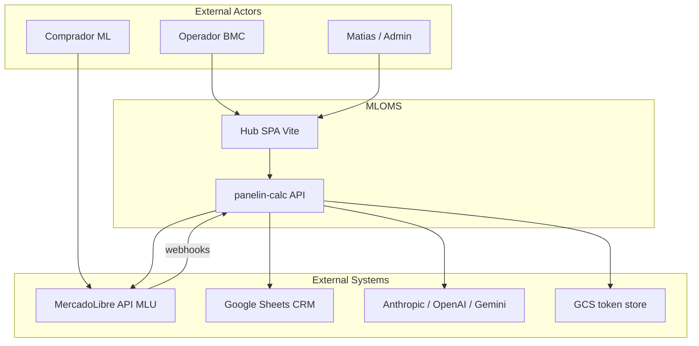
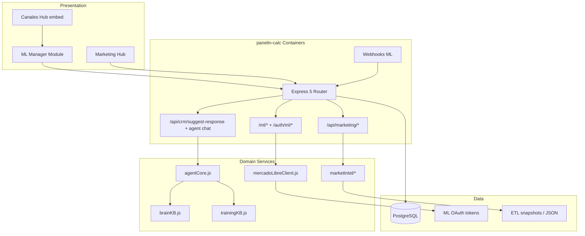
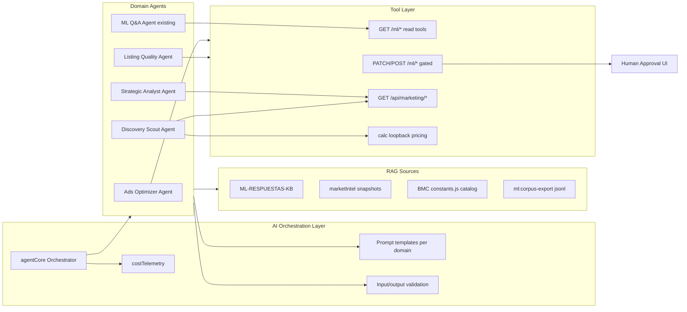
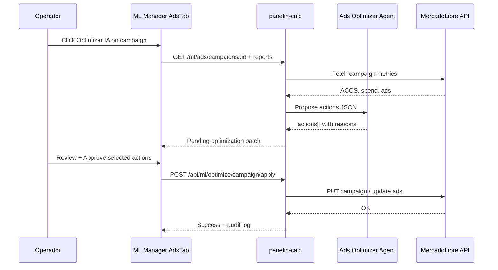
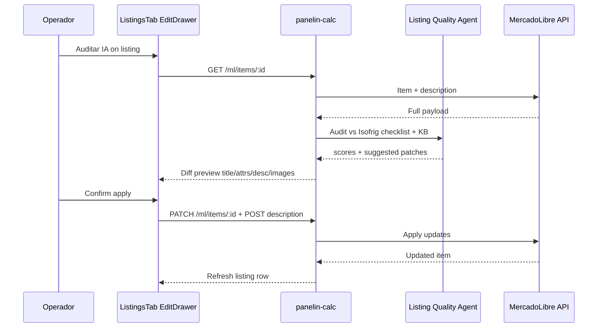
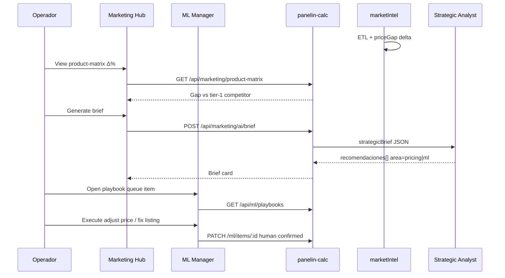

# System Design Document: MLOMS

**BMC MercadoLibre Optimization & Management System** — plataforma unificada para operar y optimizar la cuenta vendedor **MLU** (Uruguay) desde el hub BMC, extendiendo ML Manager, Market Intel y `agentCore` con capacidades de ads, campañas, listings, competencia, estrategia, discovery y calidad.

---

## 1. Introduction & Goals

### 1.1 Problem Statement

BMC Uruguay vende paneles aislantes en MercadoLibre (MLU) con un catálogo grande (~200 publicaciones), preguntas frecuentes, órdenes y presión competitiva en precio/calidad. Hoy el equipo opera entre:

- **ML Manager** (`/hub/ml-manager`, embed en `/hub/canales`) — listings, preguntas, pedidos, OAuth.
- **Market Intel** (`/hub/marketing`, `server/lib/marketIntel/`) — competencia, matriz de precios, briefs estratégicos.
- **Panelin-Gym** — corpus de preguntas, KB de respuestas, auditorías offline.

Estas piezas **no forman un solo loop operativo**: la inteligencia de mercado no dispara acciones en ML Manager; Product Ads no está cableado end-to-end; la calidad de listing y remediation de penalizaciones es manual y fragmentada.

### 1.2 Goals

| # | Goal | Priority | Measure |
|---|------|----------|---------|
| G1 | Unificar operación ML + inteligencia de mercado en un hub accionable | P0 | Operador completa acción sugerida (listing/ads/precio) desde ML Manager sin cambiar de módulo |
| G2 | Human-in-the-loop en **toda** mutación ML en vivo | P0 | 100% writes pasan por confirmación explícita en UI |
| G3 | Extender stack existente (no greenfield) | P0 | ≥80% nuevas features reusan `panelin-calc`, `agentCore`, `marketIntel` |
| G4 | Product Ads + optimización de campañas con IA asistida | P1 | CRUD campañas + propuestas ACOS/ROAS aprobadas |
| G5 | Discovery → draft listing pipeline | P2 | Gap catálogo detectado → borrador listing en ≤3 pasos operador |
| G6 | Observabilidad de costo AI por agente ML | P1 | Telemetría en `costTelemetry` por dominio (ads, listing, strategy) |

### 1.3 Stakeholders

| Role | Interest |
|------|----------|
| **Matias / titular BMC** | ROI ads, catálogo sano, OAuth cm-1, priorización P0–P3 |
| **Operador comercial** | Responder preguntas, pausar/activar, editar listings, ejecutar playbooks |
| **Dev team (Calculadora BMC)** | Contratos API, RBAC, deploy Cloud Run + Vercel |
| **Integrations / Networks** | ML API limits, webhooks, connector topology |
| **Calc specialist** | Coherencia precios lista BMC (USD s/IVA) ↔ precio ML (UYU) |

### 1.4 Constraints

| Constraint | Detail |
|------------|--------|
| Site | **MLU** only (Uruguay) |
| Auth ML | OAuth cm-1 — [`HUMAN-GATES-ONE-BY-ONE.md`](../HUMAN-GATES-ONE-BY-ONE.md) |
| Secrets | `config.*` / `process.env.*` — never hardcode |
| Pricing reference | Catálogo BMC en USD sin IVA; ML publica UYU — conversión documentada en Calc handoff |
| Writes | No autonomía: operador confirma antes de PATCH/POST a ML |
| Sheets | CRM_Operativo sync opcional; 503 = Sheets down (never 500) |

### 1.5 Solution Strategy

- **Architecture style:** Modular monolith (`panelin-calc` Express 5) + Vite SPA hub; optional **ML connector microservice** only for ads-heavy routes if rate limits warrant split (ADR-001).
- **AI integration:** Extend `agentCore` with domain-specific tools; RAG from ML-RESPUESTAS-KB + marketIntel snapshots + BMC catalog (`constants.js`).
- **Durability:** Long ETL / multi-step optimization pipelines → Vercel Workflow pattern (external spec) or existing `marketIntel/scheduler.js` + job queue in Postgres.
- **Key trade-off:** Speed of unification (extend hub) vs clean ads API isolation (connector service).

---

## 2. System Context (C4 Level 1)

### External Interfaces

| Interface | Direction | Protocol | Description |
|-----------|-----------|----------|-------------|
| MercadoLibre REST | API → ML | HTTPS OAuth2 | Items, questions, orders, ads (planned) |
| ML Webhooks | ML → API | HTTPS POST | `POST /webhooks/ml` — questions, messages |
| Google Sheets | API ↔ Sheets | HTTPS | CRM_Operativo, cotizaciones |
| LLM providers | API → LLM | HTTPS | `agentCore`, suggest-response, strategic brief |
| Vercel SPA | Browser → CDN | HTTPS | `calculadora-bmc.vercel.app` |

---

## 3. Container View (C4 Level 2)

### Container Responsibilities

| Container | Technology | Responsibility |
|-----------|------------|----------------|
| ML Manager SPA | React 18, TanStack Query | Operador UI: listings, Q&A, orders; future ads/analytics tabs |
| Marketing Hub SPA | React 18 | Competencia, matriz precios, chat intel |
| Express API | Node 24, ES modules | Auth, ML proxy, marketing intel, AI |
| mercadoLibreClient | Node | Token refresh, ML HTTP, error propagation |
| marketIntel | Node | ETL scrape, price gap, strategic brief, alerts |
| agentCore | Node | Unified LLM chain, tools, cost telemetry |

---

## 4. Component View — AI Service (C4 Level 3)

### AI Agent Catalog

| Agent | Role | Tools | Human gate |
|-------|------|-------|------------|
| **ML Q&A Agent** (existing) | Draft answers to buyer questions | `suggest-response`, read item | Operator sends answer |
| **Listing Quality Agent** | Audit title, attrs, images, description; score /10 rubric | `GET /ml/items/:id`, read checklist Isofrig | Operator applies PATCH/POST description |
| **Ads Optimizer Agent** | Propose campaign/bid/creative changes as structured JSON actions | `GET /ml/ads/*` (planned), read reports | Operator approves each action batch |
| **Strategic Analyst Agent** | Turn intel + price gap → prioritized recommendations | `strategicBrief`, product-matrix, intel | Operator picks playbook step |
| **Discovery Scout Agent** | Find catalog gaps, keyword opportunities, competitor listings | `/api/ml/search`, keywordMonitor, Bromyros gap data | Operator creates draft listing |

**Coordination pattern:** Sequential per workflow; Strategic Analyst may enqueue tasks for Listing/Ads agents. **Max iterations:** 3 tool rounds per agent call; escalate to operator on failure.

**Prompt registry:** Extend `server/lib/` domain prompts (mirror `strategicBrief.js` pattern); version in git; no DB until P2.

---

## 5. Capability Matrix

| # | Domain | Status | Evidence (repo paths) | Gap |
|---|--------|--------|----------------------|-----|
| 1 | Ads creation & creative optimization | **Partial** | [`ML-MANAGER-ROADMAP.md`](../ML-MANAGER-ROADMAP.md) AdsTab plan; hooks absent in [`useMlConnector.js`](../../src/components/hub/ml/hooks/useMlConnector.js) | No `/ml/ads/*` on backend; no Product Ads UI |
| 2 | Campaign optimization | **Gap** | Roadmap `useCampaigns`, `useUpdateCampaign` | ACOS rules, historical reports, approve-and-apply |
| 3 | Listing builder & quality | **Partial** | [`ListingsTab.jsx`](../../src/components/hub/ml/tabs/ListingsTab.jsx), PATCH items, POST description, [`ML-ISOFRIG-LISTING-CHECKLIST.md`](../ML-ISOFRIG-LISTING-CHECKLIST.md) | No item create; bulk attrs; penalty remediation workflow |
| 4 | Competition analysis | **Built** | [`marketIntel/`](../../server/lib/marketIntel/), [`marketing.js`](../../server/routes/marketing.js) `/intel`, `/product-matrix` | Not linked from ML Manager actions |
| 5 | Strategic moves | **Partial** | [`strategicBrief.js`](../../server/lib/marketIntel/strategicBrief.js), alerts | No playbook UI in ML Manager; no auto-prioritization queue |
| 6 | Product discovery | **Partial** | `keywordMonitor.js`, `productIntelligence.js`, Bromyros audits in PROJECT-STATE | No discovery → draft listing pipeline |
| 7 | Product quality improve | **Partial** | Listings edit drawer; roadmap AnalyticsTab | Unified quality score; visits ↔ conversion; AI audit button |
| 8 | Capability expansion | **Partial** | Omni ML shadow, webhooks, Panelin-Gym `ml:*` scripts | Ads API inventory; shipments tab; feedback loop to KB |

---

## 6. API Surface Map

### 6.1 Implemented — ML OAuth & data (`server/index.js`)

| Method | Route | Auth | Purpose |
|--------|-------|------|---------|
| GET | `/auth/ml/start` | public | OAuth start |
| GET | `/auth/ml/callback` | public | OAuth callback |
| GET | `/auth/ml/status` | mlFetch | Connection status |
| GET | `/ml/users/me` | requireMlAuth | Seller profile |
| GET | `/ml/listings` | requireMlAuth | Paginated listings |
| GET | `/ml/items/:id` | requireMlAuth | Item detail |
| PATCH | `/ml/items/:id` | requireMlAuth | Update item (price, qty, status, attrs, pictures) |
| POST | `/ml/items/:id/description` | requireMlAuth | Update description |
| GET | `/ml/questions` | requireMlAuth | Questions search |
| POST | `/ml/questions/:id/answer` | requireMlAuth | Answer question |
| GET | `/ml/orders` | requireMlAuth | Orders list |
| GET | `/ml/orders/:id` | requireMlAuth | Order detail |
| POST | `/webhooks/ml` | webhook | ML notifications |

### 6.2 Implemented — Marketing / Intel

| Method | Route | Auth | Purpose |
|--------|-------|------|---------|
| GET | `/api/marketing/intel` | requireMarketing | Competitors, ads intel, ML pulse |
| GET | `/api/marketing/product-matrix` | requireMarketing | BMC vs competitor price matrix |
| POST | `/api/marketing/ai/brief` | requireMarketing | Strategic brief generation |
| POST | `/api/marketing/ai/chat` | requireMarketing | SSE market chat |
| GET | `/api/marketing/keywords` | requireMarketing | Keyword monitor |
| POST | `/api/marketing/etl/run` | requireMarketing | Trigger ETL |

### 6.3 Implemented — Search & ETL

| Method | Route | Purpose |
|--------|-------|---------|
| GET | `/api/ml/search` | Competitor listing search |
| POST | `/api/ml/etl-run` | Price monitor ETL trigger |

### 6.4 Planned — MLOMS Phase 1+ (external spec: ML Developers Product Ads)

| Method | Route | Purpose |
|--------|-------|---------|
| GET | `/ml/ads/campaigns` | List campaigns |
| GET | `/ml/ads/campaigns/:id/ads` | Ads in campaign |
| GET | `/ml/ads/reports/summary` | Spend, ACOS, impressions |
| PUT | `/ml/ads/campaigns/:id` | Update budget/status |
| POST | `/ml/ads/campaigns` | Create campaign |
| GET | `/ml/analytics/items/quality` | Item health scores |
| GET | `/ml/listings/:id/visits` | Visit metrics |
| POST | `/api/ml/optimize/campaign` | AI proposal → pending approval record |
| POST | `/api/ml/optimize/listing` | AI audit → pending patches |
| POST | `/api/ml/discovery/draft` | Draft listing from gap |
| GET | `/api/ml/playbooks` | Strategic actions queue |

**Note:** [`useMlConnector.js`](../../src/components/hub/ml/hooks/useMlConnector.js) explicitly omits unimplemented routes to avoid 404 noise — new hooks added only when backend exists.

---

## 7. Sequence Diagrams

### 7.1 Campaign optimization with human approval

### 7.2 Listing quality audit and improve

### 7.3 Competitive gap → strategic action

---

## 8. AI Architecture Deep Dive

### 8.1 LLM Strategy

| Decision | Choice |
|----------|--------|
| Primary | Existing `agentCore` chain (Claude → OpenAI → Gemini fallback) |
| Routing | Domain tag on request (`origen: mercadolibre`, `domain: ads|listing|strategy`) |
| Structured output | JSON schema for ads actions, listing audit scores (Zod validate server-side) |
| Fallback | Degraded text brief if JSON parse fails; never auto-apply |

### 8.2 RAG Architecture

| Source | Chunk strategy | Use |
|--------|----------------|-----|
| `ML-RESPUESTAS-KB-BMC.md` | Section per product family | Q&A, listing copy tone |
| marketIntel ETL JSON | Product + competitor rows | Pricing, strategy |
| `src/data/constants.js` | Panel SKU + USD price | Discovery, price coherence |
| ml corpus export | Q/A pairs anonymized | Training eval, few-shot |

**Vector store:** Existing pgvector + `trainingKB` for Panelin; marketIntel remains file/loader-based until P2 index.

### 8.3 Cost Model (estimate)

Assumptions: ~50 operator actions/day, ~20 AI-assisted flows/day.

| Agent | Model tier | Est. tokens/request | Requests/day | Est. daily cost |
|-------|------------|---------------------|--------------|-----------------|
| ML Q&A | Gemini flash | 2K in / 500 out | 30 | ~$0.05 |
| Listing Quality | Claude/Gemini | 8K in / 2K out | 10 | ~$0.40 |
| Ads Optimizer | Claude/Gemini | 6K in / 1.5K out | 5 | ~$0.25 |
| Strategic Analyst | Gemini | 12K in / 2K out | 3 | ~$0.15 |
| Discovery Scout | Gemini | 5K in / 1K out | 2 | ~$0.05 |

**Total order of magnitude:** **$0.50–$1.50 USD/day** at current volumes; scale linearly with catalog audits.

**Optimizations:** Cache intel snapshots in prompt (avoid re-fetch); semantic cache for repeated item audits; batch ETL briefs nightly.

### 8.4 Workflow / AI SDK (patterns only)

| Use case | Pattern | Rationale |
|----------|---------|-----------|
| Nightly ETL + brief | Existing `marketIntel/scheduler.js`; optional **Vercel Workflow** for step retry | Long-running scrape; crash-safe steps |
| Multi-step listing remediation | Workflow: audit → human wait → apply → verify | Pause/resume across days |
| Agent tool calling | **AI SDK** `generateText` + tools when refactoring `agentCore` | Standardized tool schema; not required for P0 |

Implement Workflow/AI SDK only in refactor phases — P0 uses existing `callAgentOnce` + Express routes.

---

## 9. Quality & Crosscutting

### 9.1 Security

- **OAuth cm-1:** ML tokens in configured store (GCS/local); never log tokens.
- **RBAC:** ML Manager requires `canales:read`; mutations require authenticated operator (`requireMlAuth` + Bearer from `mlFetch`).
- **Prompt injection:** Sanitize buyer question text before LLM; output validation on JSON actions.
- **Rate limits:** Respect ML API quotas; exponential backoff in `mercadoLibreClient`.

### 9.2 Reliability

- **Target:** Hub available when SPA + API up; ML down → graceful degradation (read-only intel).
- **Webhooks:** Idempotent processing (existing Omni shadow pattern).
- **LLM outage:** Fallback chain in `agentCore`; UI shows provider + last error.

### 9.3 Observability

| Concern | Tool | Tracks |
|---------|------|--------|
| API logs | pino | ML errors, latency |
| AI cost | costTelemetry | tokens per domain/agent |
| ETL | marketIntel logs | scrape success, delta counts |
| Operator audit | Postgres table `ml_action_log` (planned P1) | who approved what write |

### 9.4 Human gates (non-negotiable)

All routes that mutate ML state require:

1. Authenticated operator session
2. Explicit UI confirmation (two-step for bulk/batch)
3. Audit log entry before ML HTTP write

Auto-answer mode (`/api/ml/auto-mode`) remains **off by default**; if enabled, limited to Q&A text only — never listings/ads.

---

## 10. Architecture Decision Records

### ADR-001: Extend panelin-calc vs separate ML connector microservice

**Status:** Accepted (phased)  
**Context:** Roadmap mentions `panelin-ml-connector` Cloud Run; today ML routes live in `server/index.js`.  
**Decision:** **Phase 1–2:** extend monolith. **Phase 3:** split ads-only routes to connector if ML rate limits or deploy cadence block team.  
**Consequences:** + Faster P0 delivery; − Possible future split migration cost.  
**Alternatives rejected:** Greenfield connector now (slow, duplicates OAuth).

### ADR-002: RAG + prompts over fine-tuning

**Status:** Accepted  
**Context:** Catalog and competitor data change weekly; 520+ Q corpus.  
**Decision:** RAG from KB + intel snapshots + prompt rubrics.  
**Consequences:** + Instant updates; − Retrieval quality depends on chunking.  
**Alternatives rejected:** Fine-tune ML-specific model (stale, costly).

### ADR-003: Human-in-the-loop default for all ML writes

**Status:** Accepted  
**Context:** Brand risk on wrong price/listing; moderation penalties.  
**Decision:** AI proposes; operator approves; no autonomous PATCH/POST.  
**Consequences:** + Safety; − Lower automation ceiling.  
**Alternatives rejected:** Full auto-optimize (rejected for ads/listings).

### ADR-004: Unify Market Intel with ML Manager via playbooks API

**Status:** Accepted  
**Context:** Operators context-switch between `/hub/marketing` and `/hub/ml-manager`.  
**Decision:** New `/api/ml/playbooks` queue fed by `strategicBrief` + priceGap deltas; surfaced in ML Manager Overview.  
**Consequences:** + Single operational surface; − New API + UI work P1.  
**Alternatives rejected:** Duplicate intel widgets inside ML Manager (ETL duplication).

### ADR-005: Durable jobs — extend scheduler before Vercel Workflow

**Status:** Accepted  
**Context:** ETL already in `marketIntel/scheduler.js`; team on Cloud Run not Vercel Functions for API.  
**Decision:** P0–P1 use Node scheduler + Postgres job table; evaluate Workflow for greenfield long pipelines P3.  
**Consequences:** + Reuse; − Less elegant pause/resume until Workflow adopt.  
**Alternatives rejected:** Immediate Workflow migration (platform split).

---

## 11. Risks

| Risk | Impact | Likelihood | Mitigation |
|------|--------|------------|------------|
| OAuth cm-1 not complete | High | Medium | Block P0 writes; show setup wizard |
| ML Product Ads API change | Medium | Medium | Abstract ads client; feature flag |
| moderation_penalty reactivation | High | Medium | Quality agent + Isofrig checklist gate |
| LLM hallucinated prices | High | Low | Human confirm; calc loopback verify vs `constants.js` |
| Intel ETL stale | Medium | Medium | Show `last_refresh_at`; alert thresholds |

---

## 12. Implementation Roadmap

### P0 — Operable quality loop (4–6 weeks)

| Item | Depends on | Human gate |
|------|------------|------------|
| OAuth cm-1 verified (`npm run ml:verify`) | Matias | cm-1 |
| Listing Quality Agent + audit UI in EditDrawer | agentCore | Approve PATCH |
| Playbook queue read-only in OverviewTab (from existing brief) | marketing API | N/A read |
| Unified quality rubric doc in UI | ML-ISOFRIG checklist | — |
| `ml_action_log` audit table | Postgres migrate | — |

### P1 — Ads + intel unification (6–10 weeks)

| Item | Depends on | Human gate |
|------|------------|------------|
| `/ml/ads/*` backend routes | ML Product Ads API spec | — |
| AdsTab + AnalyticsTab in ML Manager | Backend routes | Approve campaign changes |
| `/api/ml/playbooks` write path | strategicBrief | Approve each action |
| Link product-matrix Δ% → playbook items | P0 queue | — |
| costTelemetry tags per ML domain | agentCore | — |

### P2 — Discovery & expansion (10–14 weeks)

| Item | Depends on |
|------|------------|
| Discovery Scout + `/api/ml/discovery/draft` | keywordMonitor, calc |
| Item create flow (new listing) | ML publish API |
| Bulk attribute editor | ListingsTab |
| Panelin-Gym feedback → KB auto-learn | trainingKB |

### P3 — Platform maturity (14+ weeks)

| Item | Depends on |
|------|------------|
| Optional connector split for ads | ADR-001 trigger |
| Vercel Workflow for remediation pipelines | ADR-005 review |
| Shipments tab + full envíos | ML shipping API |
| pgvector index for marketIntel | Ops capacity |

---

## 13. Glossary

| Term | Definition |
|------|------------|
| **MLOMS** | MercadoLibre Optimization & Management System |
| **MLU** | MercadoLibre Uruguay site ID |
| **ML Manager** | Hub module at `/hub/ml-manager` |
| **Market Intel** | Competitor ETL + pricing matrix + briefs |
| **cm-1** | Human gate: ML OAuth setup in production |
| **ACOS** | Advertising Cost of Sale (ads metric) |
| **moderation_penalty** | ML listing restriction requiring quality fix before reactivation |
| **Playbook** | Actionable queue item derived from intel/strategy |
| **Human gate** | Operator confirmation before live ML write |

---

## 14. Handoff Checklist

- [ ] **Integrations:** Implement `/ml/ads/*` against ML Developers docs (external spec)
- [ ] **Networks:** Confirm Cloud Run capacity for ETL + webhook load
- [ ] **Design:** AdsTab/AnalyticsTab + playbook cards — BMC Liquid Glass
- [ ] **Security:** Review `requireMlAuth` on all new mutators
- [ ] **Calc:** USD ↔ UYU price sync policy for listing edits
- [ ] **Matias:** Execute cm-1 if not green; approve P0 sprint

---

## 15. References

- MATPROMT bundle: [`MATPROMT-RUN-2026-07-18-ml-sdd.md`](../matprompt/MATPROMT-RUN-2026-07-18-ml-sdd.md)
- ML Manager roadmap: [`ML-MANAGER-ROADMAP.md`](../ML-MANAGER-ROADMAP.md)
- ML OAuth: [`ML-OAUTH-SETUP.md`](../../ML-OAUTH-SETUP.md)
- Market Intel loaders: [`server/lib/marketIntel/productIntelligence.js`](../../server/lib/marketIntel/productIntelligence.js)
- sdd-architect skill: `~/.claude/skills/sdd-architect/SKILL.md`
