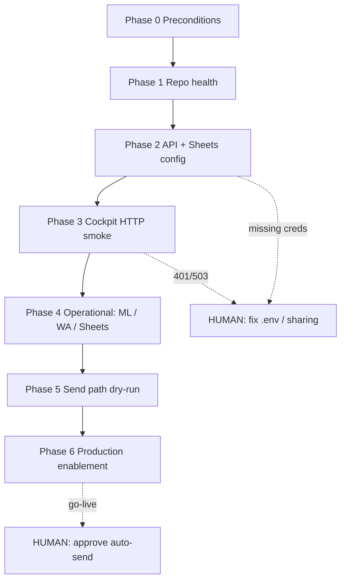

# CRM cockpit — Autonomous runbook (traversable plan)

**Purpose:** A **step order** an agent or scheduler can follow **without the operator** until a step explicitly says **`HUMAN_REQUIRED`**. **Templates** (columns, routes, env names) stay fixed; **context** is row-level only at execution time.

**Global bootstrap (all channels):** [`../orientation/ASYNC-RUNBOOK-UNATTENDED.md`](../orientation/ASYNC-RUNBOOK-UNATTENDED.md) — smoke, WA, ML, correo, cierre JSON. **Este doc** se centra en **cockpit AG–AK** y **`/api/crm/cockpit/*`**.

**Canonical refs:** [`CRM-OPERATIVO-COCKPIT.md`](./CRM-OPERATIVO-COCKPIT.md), [`AGENTS.md`](../../AGENTS.md), `server/lib/crmOperativoLayout.js`, `server/routes/bmcDashboard.js` (`/api/crm/cockpit/*`).

---

## Legend

| Tag | Meaning |
|-----|---------|
| **AUTO** | Script / agent can run end-to-end locally or in CI |
| **AUTO*** | Runs if secrets present in `.env` / env; else **SKIP** with reason |
| **HUMAN** | Stop — only Matias (or delegate with secrets) |

---

## Flow (high level)

---

## Phase 0 — Preconditions (documentation only)

| Step | Tag | Action | Done when |
|------|-----|--------|-----------|
| 0.1 | AUTO | Read this runbook + `CRM-OPERATIVO-COCKPIT.md` | Agent confirms column letters AG–AK and routes exist in doc |
| 0.2 | HUMAN | Google Sheet **CRM_Operativo** row 3: headers for **AG–AK** match cockpit doc | Headers visible; no stray columns shifted |

---

## Phase 1 — Repo health (local / CI)

| Step | Tag | Command | Done when |
|------|-----|---------|-----------|
| 1.1 | AUTO | `npm run gate:local` (or `gate:local:full` if `src/` changed) | Exit 0 |
| 1.2 | AUTO | `npm test` | Exit 0 |

**HUMAN:** only if lint/test fails — fix code or waive with ticket.

---

## Phase 2 — API + Sheets configuration

| Step | Tag | Action | Done when |
|------|-----|--------|-----------|
| 2.1 | AUTO*** | `test -f .env` or `npm run env:ensure` | `.env` exists |
| 2.2 | AUTO*** | `npm run panelsim:env` | IDs + `GOOGLE_APPLICATION_CREDENTIALS` resolve (script output OK) |
| 2.3 | HUMAN | `.env`: `BMC_SHEET_ID`, `API_AUTH_TOKEN`, `PUBLIC_BASE_URL` (Cloud Run) | Values set **only** in env stores, never in chat logs |

**HUMAN:** if service account cannot open the workbook — share sheet with SA email from script output.

---

## Phase 3 — Cockpit HTTP (smoke)

**Requires:** API running (`npm run start:api`) and `API_AUTH_TOKEN` in environment.

| Step | Tag | Action | Done when |
|------|-----|--------|-----------|
| 3.1 | AUTO | `curl -s -o /dev/null -w "%{http_code}" -H "Authorization: Bearer $API_AUTH_TOKEN" http://localhost:3001/api/crm/cockpit/row/4` | **200** (row may be empty — OK) |
| 3.2 | AUTO | Same against `PUBLIC_BASE_URL` when testing prod | **200** |

**HUMAN:** **401** → token mismatch; **503** → token not set on server; **500** → sheet range / permissions.

---

## Phase 4 — Operational pipelines (async / background)

| Step | Tag | Action | Done when |
|------|-----|--------|-----------|
| 4.1 | AUTO*** | Webhook ML + `syncMLCRM` path (already deployed) or `node scripts/panelsim-ml-crm-sync.js` per `AGENTS.md` | New ML rows appear with **B:AK** |
| 4.2 | AUTO*** | WA: message to test number → wait inactivity → row + **AF** + **AH:AK** | Row created as per `processWaConversation` |
| 4.3 | HUMAN | Spot-check **J**, **W** (`Q:id`), **AF**, **AI**, **AK** | No duplicate threads / obvious garbage |

**HUMAN:** business judgment on copy, price mismatch rows, spam.

---

## Phase 5 — Send path (controlled)

| Step | Tag | Action | Done when |
|------|-----|--------|-----------|
| 5.1 | AUTO*** | `POST /api/crm/cockpit/quote-link` with test URL on a **test row** | **AH** updated |
| 5.2 | AUTO*** | `POST /api/crm/cockpit/approval` `approved: true` | **AI** = Sí |
| 5.3 | HUMAN | First **`send-approved`** on **non-customer** or test question | **AJ** filled; ML or WA response OK |
| 5.4 | HUMAN | Repeat on real row only after 5.3 | Operator trusts automation |

**HUMAN:** always before first production **`send-approved`** on real customers.

---

## Phase 6 — Production enablement

| Step | Tag | Action | Done when |
|------|-----|--------|-----------|
| 6.1 | HUMAN | Cloud Run: `API_AUTH_TOKEN`, `PUBLIC_BASE_URL`, WhatsApp vars, ML tokens | Deploy env matches `.env.example` comments |
| 6.2 | AUTO*** | `npm run smoke:prod` (per `AGENTS.md`) | Health / capabilities OK |
| 6.3 | HUMAN | Document “who owns” **`send-approved`** rotation and **AK** escalation | Runbook acknowledged |

---

## What runs fully without Matias (typical agent session)

1. Clone / pull repo  
2. `npm run env:ensure`  
3. `npm run gate:local`  
4. (If API up + token in env) cockpit GET smoke  
5. Update `docs/team/PROJECT-STATE.md` **Cambios recientes** if code/docs changed  

**Never without explicit HUMAN:** creating `API_AUTH_TOKEN`, sharing Sheets, approving first prod send, OAuth in browser.

---

## Compression rule (context vs templates)

- **Templates:** this runbook + cockpit doc — **do not shorten**; **link** them.  
- **Context:** per ticket, carry **row id + channel + one-line issue** only.

---

## Changelog

| Date | Change |
|------|--------|
| 2026-03-24 | Initial runbook for traversable autonomous execution |
