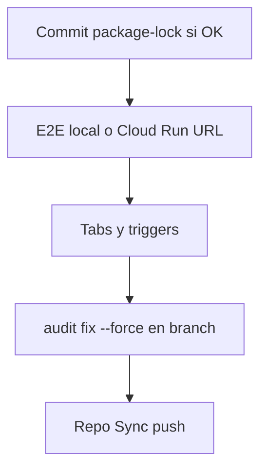

# Plan y ejecución — Next steps (Run 23) — 2026-03-20

**Objetivo:** Concretar la agenda post–[run22](../PROMPT-FOR-EQUIPO-COMPLETO.md) (propagate & sync): qué se ejecutó en repo, qué queda bloqueado por humano/infra, y orden recomendado.

---

## 1. Ejecutado en esta sesión (automatizable)

| Paso | Acción | Resultado |
|------|--------|-----------|
| A1 | `npm run lint` | **0 errores**, 10 warnings (hooks en `PanelinCalculadoraV3.jsx`, `calculatorConfig.js` `_` no usado). |
| A2 | `npm test` (`tests/validation.js`) | **115 passed**, 0 failed. |
| A3 | `npm audit fix` (sin `--force`) | Ajustó dependencias transitivas (**4 packages** cambiados). **Quedan 7 vulnerabilidades** (5 low, 2 moderate); el resto requiere `npm audit fix --force` (vite@8, @google-cloud/storage — **breaking**, aprobación Matias). |
| A4 | `npm test` post–audit fix | **115 passed** (regresión no detectada). |

**Conclusión:** Rama lista para commit de `package-lock.json` si se acepta el bump menor de dependencias.

---

## 2. Pendiente — requiere Matias / entorno

| # | Ítem (PROMPT agenda) | Bloqueo |
|---|----------------------|---------|
| 1 | Tabs + triggers Sheets | Manual en Google Sheets / Apps Script. |
| 5 | E2E checklist | Service account + servidor + browser; ver [E2E-VALIDATION-CHECKLIST.md](../E2E-VALIDATION-CHECKLIST.md) (incl. URLs producción añadidas 2026-03-20). |
| 6 | `npm audit fix --force` | Breaking; branch aparte; aprobación explícita. |
| 7 | Billing cierre mensual | Workbook Pagos Pendientes. |
| 8 | Repo Sync remoto | `git push` / copia a bmc-dashboard-2.0 y bmc-development-team. |
| 9 | OAuth Vercel | Consola Google Cloud — origen JS. |
| 10 | SKUs MATRIZ col.D | Validación negocio vs `matrizPreciosMapping.js`. |

---

## 3. Orden recomendado (próximas 2 semanas)

1. **Revisar diff** de `package-lock.json` → commit con mensaje claro (`chore: npm audit fix (non-force), 7 vulns remain`).
2. **E2E:** completar checklist (mínimo D1.2–D1.4 en local con API + `.env`).
3. **Sheets:** desbloquear automations (agenda histórica).
4. **Solo con aprobación:** branch `chore/audit-fix-force`, `npm audit fix --force`, tests+lint+build.
5. **Repo Sync:** según [REPO-SYNC-REPORT-2026-03-20-run22.md](../reports/REPO-SYNC-REPORT-2026-03-20-run22.md).

---

## 4. Referencias

- [PROJECT-STATE.md](../PROJECT-STATE.md) — Pendientes de sincronización.
- [PROMPT-FOR-EQUIPO-COMPLETO.md](../PROMPT-FOR-EQUIPO-COMPLETO.md) — Agenda post–run22.
- [AGENTS.md](../../AGENTS.md) — `npm run lint` / `npm test` tras cambios en `src/`.
