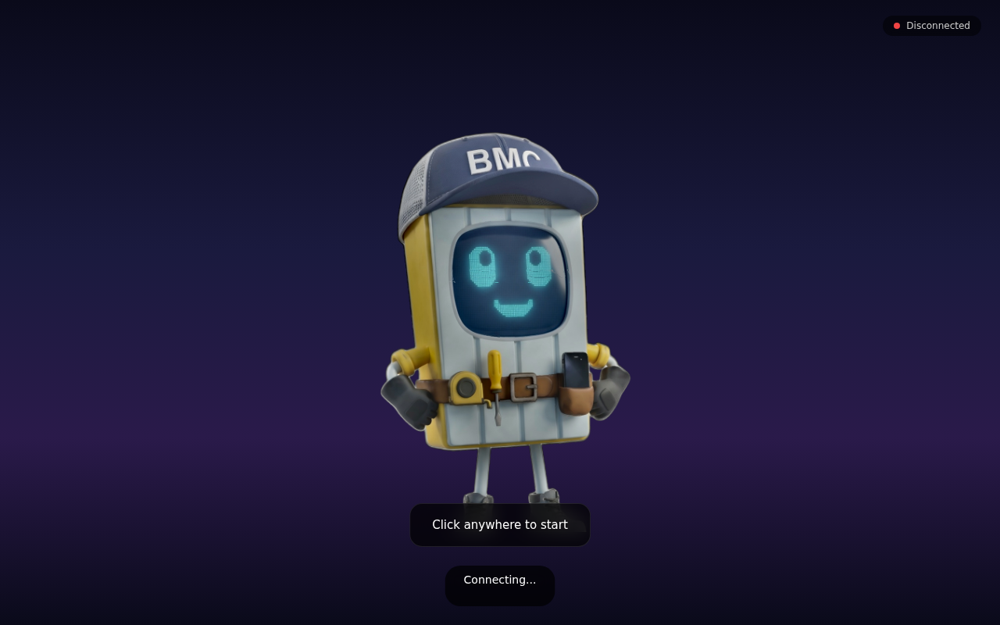
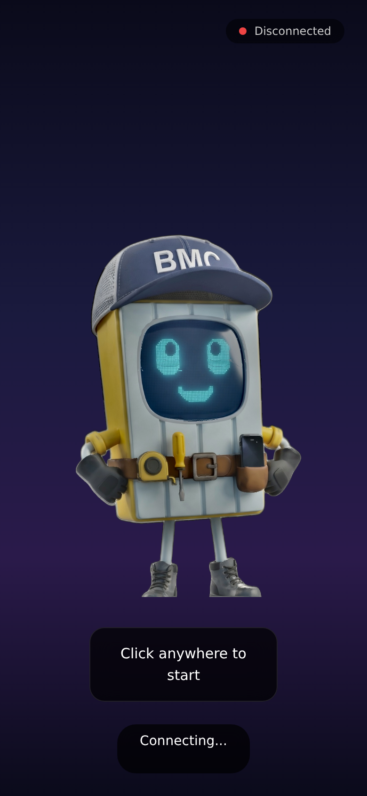

# Live-App Review — Panelin "Interactive Character"

**Target:** `https://panelin-q74zutv7dq-ue.a.run.app` (Google Cloud Run, region `us-east1`)
**Date:** 2026-06-30
**Type:** Live behavioral + security + UX review (black-box; source not inspected)
**Reviewer:** Claude Code (branch `claude/panelin-app-review-95ff2f`)

> **Scope note.** This is **not** the Express `calculadora-bmc` API described in `CLAUDE.md`. It is a
> separate **FastAPI** service that serves a React voice-avatar SPA ("Panelin, the Interactive
> Character") and **proxies into the production BMC API**. Its source appears to live in
> `matiasportugau-ui/GPT-PANELIN-Final` (traced via the Vercel FastAPI project `gpt-panelin-v3-3`),
> but per request this review is **live-only** — findings are evidenced from observed behavior, not code.
> No production data was mutated and no conversation turns were driven against the agent.

---

## 1. What the app is

A real-time **voice avatar** of "Panelin", the BMC mascot — a robot shaped like an insulation panel,
wearing a BMC cap, with a pixel-screen face used for emotion + lip-sync.

| Layer | Detail |
|------|--------|
| **Frontend** | React SPA, Vite build (`/assets/index-*.js`, ~649 KB). Canvas-rendered layered 2D puppet from `/models/parts/*.png` (`body_base`, `eye_L/R`, `mouth`, `cap`, `glove_L/R`, `boot_L/R`, `belt`, `screen_bg`). |
| **Voice in** | In-browser mic capture + **Voice Activity Detection** (`@ricky0123/vad-web` + `onnxruntime-web`, WebGPU/WASM). Runs locally in the browser. |
| **Realtime** | WebSocket `wss://<host>/ws?session_id=<client-generated>` — drives the conversation and returns `{type, text, audio}` frames (TTS audio + viseme/emotion state). |
| **Backend** | FastAPI on Cloud Run. Public routes (from `/openapi.json`): `GET /`, `GET /health`, `GET /api/kb`, `GET /api/proxy/{path}`. The `/ws` route is not listed in OpenAPI (FastAPI WS routes never are). |
| **States** | Emotion/animation states observed in the bundle: `idle`, `listening`, `speaking`, `thinking`, `neutral`, `happy`, `sad`, `angry`, `surprised`. |

### What works well
- **High-quality mascot** that renders crisply and is **responsive** (clean desktop + mobile layouts — see screenshots).
- **Graceful degradation** when the backend is unreachable: a "Disconnected" pill, a "Connecting…" status, and a "Click anywhere to start" gesture gate (correctly defers mic/audio until a user gesture, satisfying browser autoplay policy).
- **VAD runs client-side**, so raw mic audio isn't streamed continuously — only detected speech segments matter. Good for privacy and bandwidth.
- `GET /health` is fast (~0.5 s) and returns `200 {"status":"ok"}`.




---

## 2. Findings (severity-ranked)

### 🔴 HIGH-1 — Unauthenticated realtime voice channel (`/ws`)
**Evidence.** A single WebSocket handshake with **no auth header** and a client-chosen `session_id`
returns `101 Switching Protocols` and immediately pushes a greeting frame with synthesized audio:
```
GET wss://panelin-q74zutv7dq-ue.a.run.app/ws?session_id=review-probe-0001
→ 101 Switching Protocols
→ {"type":"greeting","text":"¡Hola bo! ¡Tamos en el aire! ¿Qué me contás?","audio":"//Nkx…"}
```
- The `session_id` is generated **client-side** (`wss://${host}/ws?session_id=${Eg()}`), so it is not a
  capability/secret — anyone can open a session.
- The greeting audio is **identical across connections** (verified: same payload for two different
  `session_id`s), so the greeting TTS is cached/static — the connect itself is cheap. **The exposure is
  that any anonymous client can then send conversation turns**, each of which incurs LLM + (likely)
  ASR/TTS provider cost. No authentication, no visible per-session/per-IP rate limiting.

**Impact.** Unbounded third-party cost (LLM/TTS), denial-of-wallet, and abuse of the agent as a free
LLM relay. Reproducible by anyone with the URL.

**Recommendation.** Require a short-lived signed token to open `/ws` (issued by the page after a
human/turnstile check); enforce per-session, per-IP, and global rate/quotas; cap turns and audio
seconds per session; add an idle timeout and concurrent-session ceiling.

---

### 🔴 HIGH-2 — Open, unauthenticated proxy into the production BMC API (`/api/proxy/{path}`)
**Evidence.** The endpoint is described as "Proxy **select** calculadora-bmc endpoints", but it is
**not an allowlist** — it forwards a wide range of paths, unauthenticated, and returns live production
internals:
```
GET /api/proxy/health          → 200  {"ok":true,"appEnv":"production","hasTokens":true,
                                        "mlTokenStoreOk":true,"hasSheets":true,
                                        "sheets_diagnostics":{"tabs":["CRM_Operativo",
                                        "Base de datos cotis de clientes", …]}}
GET /api/proxy/capabilities     → 200
GET /api/proxy/calc/catalogo    → 200
GET /api/proxy/version          → 200
GET /api/proxy/admin            → 200
GET /api/proxy/robots.txt       → 200
GET /api/proxy/openapi.json     → 200
```
Every path tested returned `200` — i.e. the proxy passes the path straight through to the BMC origin
with no path restriction.

**Impact.**
- **Information disclosure**: production operational state (token presence, Sheets connectivity, CRM
  tab names) is exposed to anonymous internet users.
- **Auth-boundary risk (to verify in code)**: if the proxy injects a BMC service credential when
  forwarding, it could expose BMC endpoints that are otherwise auth-gated (e.g. `/calc/cotizaciones`,
  CRM data). **This was deliberately not exercised** to avoid touching customer data — it must be
  checked against the proxy source.

**Recommendation.** Replace pass-through with a **strict allowlist** of exact paths the avatar needs;
never forward arbitrary `{path}`; require auth on the proxy; ensure the proxy forwards **without**
elevated BMC credentials (or only to explicitly public endpoints); strip internal diagnostics from any
response the avatar doesn't need.

---

### 🟠 MEDIUM-1 — Information disclosure via `/api/kb`
**Evidence.** `GET /api/kb` (no auth) returns a knowledge-base document that embeds the **live BMC
system-state dump**: `appEnv:"production"`, `hasTokens`, `hasSheets`, the full list of Google Sheets
tab names (`CRM_Operativo`, `Base de datos cotis de clientes`, `BUG_REPORTS`, …), and the capabilities
manifest.

**Impact.** Leaks internal architecture and operational status to anonymous users; useful
reconnaissance for an attacker. Sheet/tab naming reveals CRM structure.

**Recommendation.** Serve the avatar only the KB text it actually needs for conversation; strip the
embedded system-state/diagnostics block, or gate `/api/kb` behind the same token as `/ws`.

---

### 🟠 MEDIUM-2 — No cross-origin enforcement on the WebSocket (CSWSH)
**Evidence.** The handshake succeeds even with a foreign `Origin`:
```
GET /ws?session_id=origin-check-0001   (Origin: https://evil.example.com)
→ 101 Switching Protocols   + greeting frame
```
**Impact.** Any third-party web page can open a cross-site WebSocket to this service and drive the
agent on the operator's budget (compounds HIGH-1). HTTP responses carry **no `Access-Control-Allow-Origin`**
header, so browser `fetch()` cross-origin reads are blocked — but WebSockets are exempt from that
protection, so origin must be checked server-side.

**Recommendation.** Validate the `Origin` header on the WS upgrade against an allowlist of the app's
own origins; reject others.

---

### 🟡 LOW-1 — `/health` doesn't reflect dependency health
**Evidence.** `GET /health → {"status":"ok"}` regardless of whether the BMC proxy target, LLM, or TTS
providers are reachable.

**Impact.** A degraded service (e.g. broken upstream BMC API or TTS provider) still reports healthy, so
Cloud Run / uptime checks won't catch partial outages.

**Recommendation.** Add a lightweight readiness check (upstream BMC reachability, provider config
present) and surface it in `/health` (without leaking secrets).

---

### 🟡 LOW-2 — Operational / hygiene notes
- **Active redeploys observed**: the JS bundle hash changed (`index-De8b0baW.js` → `index-CrBNnApt.js`)
  within minutes during this review — confirm a stable release/versioning story and cache-busting.
- **No favicon** (`/favicon.ico` 404) — minor.
- The service is HTTP/2 on Cloud Run; WS requires the HTTP/1.1 upgrade path (works) — fine, just noted.

---

## 3. Priority recommendations

| # | Action | Addresses |
|---|--------|-----------|
| 1 | Token-gate `/ws` (short-lived signed token + bot check) and add per-IP/session/global rate + turn/second caps | HIGH-1, MEDIUM-2 |
| 2 | Validate WS `Origin` against an app-origin allowlist | MEDIUM-2 |
| 3 | Replace `/api/proxy/{path}` pass-through with a strict path allowlist; confirm it carries no elevated BMC credentials; require auth | HIGH-2 |
| 4 | Strip live system-state/diagnostics from `/api/kb` (and proxied responses) | MEDIUM-1, HIGH-2 |
| 5 | Make `/health` a real readiness probe | LOW-1 |

The HIGH items are the priority: together they let any anonymous visitor (or any third-party site)
drive a paid voice agent and read production operational internals. None require a redesign — they are
auth + allowlist + rate-limit additions on the FastAPI layer.

---

## 4. Method & evidence

- **Endpoint/security probes:** `curl` against the live host — `/health`, `/openapi.json`, `/api/kb`,
  `/api/proxy/*` (legitimate BMC paths + benign non-BMC paths to test allowlisting), and **single**
  WebSocket handshakes (default origin + foreign origin) to check auth/origin enforcement. No
  conversation turns were sent; no path-traversal/SSRF/metadata probing was attempted.
- **UX walkthrough:** the live frontend was mirrored locally (`index.html` + JS bundle + `/models/parts/*.png`)
  and rendered in headless Chromium (puppeteer-core) at desktop (1280×800) and mobile (390×844)
  viewports. Loopback serving was used because the session's egress proxy does not tunnel the
  in-browser WebSocket; backend calls therefore failed locally, which also documented the app's
  offline/degraded state ("Disconnected" / "Connecting…" / "Click anywhere to start").
- **Source location** was identified via the Vercel MCP (`gpt-panelin-v3-3` → GitHub
  `matiasportugau-ui/GPT-PANELIN-Final`) but, per request, the repo was **not** cloned or read.

## 5. Suggested follow-up
If desired, a follow-up pass can add the source repo (`GPT-PANELIN-Final`) and implement the fixes in
§3 as a PR on that repo (WS token auth + rate limiting, proxy allowlist, `/api/kb` gating, `/health`
readiness). This live review intentionally stops at recommendations.
