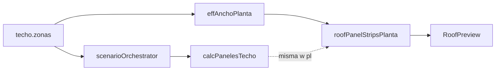

# Investigación: cotización visual precisa (entregable)

Este documento cierra el plan de investigación: criterios de éxito, inventario de fuentes de verdad, hallazgos sobre **drift** número↔dibujo, matriz de reproducción, evaluación de herramientas y estrategia de tests. **No modificar** el archivo de plan en `.cursor/plans/`.

---

## 1. Criterios de éxito (definición operativa)

| Criterio | Definición | Verificación |
|----------|------------|--------------|
| Conteo / m² vs rejilla 2D | Para cada **corrida** `calcPanelesTecho` con ancho `w`, `cantPaneles === ceil(w/au)` y coincide con `panelCountAcrossAnchoPlanta(w, au)` y con `buildAnchoStripsPlanta(w, au).length` (con `w > 0`, `au > 0`). | Tests en [`tests/roofVisualQuoteConsistency.js`](../../../tests/roofVisualQuoteConsistency.js) |
| Dos aguas | En planta, el ancho dibujado por zona es `ancho/2` (`effAnchoPlanta`). El presupuesto ejecuta **dos** corridas con `ancho/2` y fusiona con `mergeZonaResults` → `cantPaneles` total = **2 ×** columnas de un faldón (geometría simétrica). | Mismo archivo de tests + [`src/utils/scenarioOrchestrator.js`](../../../src/utils/scenarioOrchestrator.js) líneas 105–125 |
| Geometría encuentros | `preview.x` / `preview.y`, anexos y `findEncounters` gobiernan bordes compartidos; no se exige igualdad píxel a píxel con PDF salvo que el PDF use el mismo pipeline. | Manual + futuros tests geométricos |
| 2D vs 3D | La vista R3F es **referencia visual** (textura catálogo, portal en [`QuoteVisualVisor.jsx`](../../../src/components/QuoteVisualVisor.jsx)); la cotización contractual sigue al motor `calcTechoCompleto` / `executeScenario`. | Decisión de producto explícita en esta tabla |
| PDF / cliente | Si el PDF captura DOM, puede diferir por escala/CSS; el total monetario debe salir de `groups`/`results`, no del raster. | [`PanelinCalculadoraV3_backup.jsx`](../../../src/components/PanelinCalculadoraV3_backup.jsx) `handlePdfEnriquecido` |

---

## 2. Inventario: quién manda (fuentes de verdad)

| Capa | Archivo(s) | Rol |
|------|----------------|-----|
| Estado obra / paso 7 | [`src/components/PanelinCalculadoraV3_backup.jsx`](../../../src/components/PanelinCalculadoraV3_backup.jsx) | `techo.zonas`, `updateZona`, `updateZonaPreview`, UI `dimensiones`, `<RoofPreview />` |
| Orquestación escenarios | [`src/utils/scenarioOrchestrator.js`](../../../src/utils/scenarioOrchestrator.js) | `executeScenario`, `computeTechoZonas` (dos aguas = 2× `calcTechoCompleto` con mitad de ancho) |
| Motor paneles techo | [`src/utils/calculations.js`](../../../src/utils/calculations.js) | `calcPanelesTecho`, `calcTechoCompleto`, `mergeZonaResults` |
| Ancho en planta | [`src/utils/roofPlanGeometry.js`](../../../src/utils/roofPlanGeometry.js) | `effAnchoPlanta`, `buildRoofPlanEdges`, `layoutZonasEnPlanta` |
| Franjas / columnas visuales | [`src/utils/roofPanelStripsPlanta.js`](../../../src/utils/roofPanelStripsPlanta.js) | `panelCountAcrossAnchoPlanta`, `buildAnchoStripsPlanta` |
| Contrato unificado (spike) | [`src/utils/roofVisualQuoteModel.js`](../../../src/utils/roofVisualQuoteModel.js) | `resolveRoofZoneVisualModel`, helpers de verificación **sin** duplicar `ceil` de negocio |
| Preview SVG | [`src/components/RoofPreview.jsx`](../../../src/components/RoofPreview.jsx) | Dibuja franjas con `buildAnchoStripsPlanta` sobre `r.w` |
| Visor / 3D | [`src/components/QuoteVisualVisor.jsx`](../../../src/components/QuoteVisualVisor.jsx) + R3F en backup | Carrusel + host portal 3D |
| Producto paso 7 | [`ROOF-ZONAS-PRINCIPAL-Y-ENCUENTROS-TAXONOMY.md`](./ROOF-ZONAS-PRINCIPAL-Y-ENCUENTROS-TAXONOMY.md) | Lenguaje zonas / `preview` |

---

## 3. Hallazgos: drift número ↔ dibujo (Fase B)

- **Una agua:** Para `w > 0`, el conteo de franjas y `cantPaneles` de una corrida **coinciden** con la misma `au` que entrega `getPricing()` (no usar `PANELS_TECHO` de `constants.js` en tests de igualdad numérica: puede divergir de `pricing.js`).
- **Dos aguas:** El dibujo usa **un** rectángulo por zona con `w = ancho/2`. La etiqueta “N paneles” en ese rectángulo refleja **columnas por faldón**. El **total** cotizado es la suma de **dos** corridas (`mergeZonaResults`): los KPI deben interpretarse así para evitar confusiones “dibujo vs total”.
- **Epsilon en `panelCountAcrossAnchoPlanta`:** `Math.ceil(w/au - 1e-9)` puede diferir teóricamente de `Math.ceil(w/au)` en bordes flotantes; en casos comerciales normales los tests actuales pasan. Si aparece un caso borde, unificar en un solo helper exportado desde el módulo canónico.

---

## 4. Spike: módulo canónico

[`src/utils/roofVisualQuoteModel.js`](../../../src/utils/roofVisualQuoteModel.js) centraliza:

- Resolución de **ancho en planta** por zona (`resolveZonaPlantaAnchoM` → `effAnchoPlanta`).
- `resolveRoofZoneVisualModel(zona, tipoAguas, au)` para tests, informes y futura UI (sin acoplar a React).

**Próximo paso de implementación (fuera de este entregable):** opcionalmente importar este módulo desde `RoofPreview.jsx` solo para métricas/labels, manteniendo el SVG actual.

---

## 5. Matriz de reproducción (Fase A)

Casos JSON: [`fixtures/roof-visual-quote-cases.json`](./fixtures/roof-visual-quote-cases.json).

| ID | Qué validar |
|----|-------------|
| `single_zone_una_agua` | 1 zona, `w = ancho` en planta |
| `single_zone_dos_aguas` | `w = ancho/2`; total paneles = 2× por faldón |
| `two_root_zones_una_agua` | Multizona; encuentros tras posicionar |
| `lateral_annex_same_body` | `attachParentGi` + layout sin hueco |
| `stacked_tramo_preview_y` | Encuentro horizontal (coordenadas orientativas) |

---

## 6. Evaluación de herramientas (Fase C)

Decisión **condicionada al cuello de botella**:

| Cuello observado | Acción recomendada | Cuándo diferir |
|------------------|--------------------|----------------|
| Drift número / rejilla | **Módulo canónico + tests** (este entregable); ampliar tests por zona multi-anexo | — |
| Gestos táctiles / scroll | [@use-gesture/react](https://github.com/pmndrs/use-gesture) | Si no hay quejas de interacción |
| Pan/zoom planta | [d3-zoom](https://github.com/d3/d3-zoom) en `<g>` externo | Si el roadmap pide mapas grandes |
| Editor 2D tipo CAD | [react-konva](https://github.com/konvajs/react-konva) | Alto coste migración; solo si el equipo agrega herramientas complejas |
| Re-renders | [zustand](https://github.com/pmndrs/zustand) slice preview | Si React Profiler muestra cuello en paso 7 |
| Debug 3D | [leva](https://github.com/pmndrs/leva) | Si se prioriza ajuste de cámara/material |

**Criterio de descarte:** librerías que no reduzcan drift o exijan reescribir encuentros/BOM sin ROI.

---

## 7. Estrategia de tests y CI (Fase D)

- **Obligatorio:** `node tests/roofVisualQuoteConsistency.js` (puro Node, sin browser).
- **Integración:** encadenado en `npm test` junto a [`tests/validation.js`](../../../tests/validation.js).
- **Opcional posterior:** golden screenshots (Playwright) solo si hay regresiones de render SVG no capturables por números.

---

## 8. Riesgos explícitos

- Afirmar **precisión 3D = cotización** sin malla paramétrica completa.
- Mezclar `constants.js` y `getPricing()` al comparar `au` en tests o UI.
- Migrar a canvas/Konva sin suite de regresión numérica.

---

## 9. Recomendación única (resumen)

1. Mantener SVG + geometría actual; **asegurar alineación** con el módulo [`roofVisualQuoteModel.js`](../../../src/utils/roofVisualQuoteModel.js) y tests.
2. Documentar en UX que **dos aguas** muestra columnas **por faldón** y el total es **suma de dos corridas**.
3. Solo después, si el perfilado lo exige, añadir `@use-gesture/react` o `d3-zoom` sin tocar reglas de `calcPanelesTecho`.
