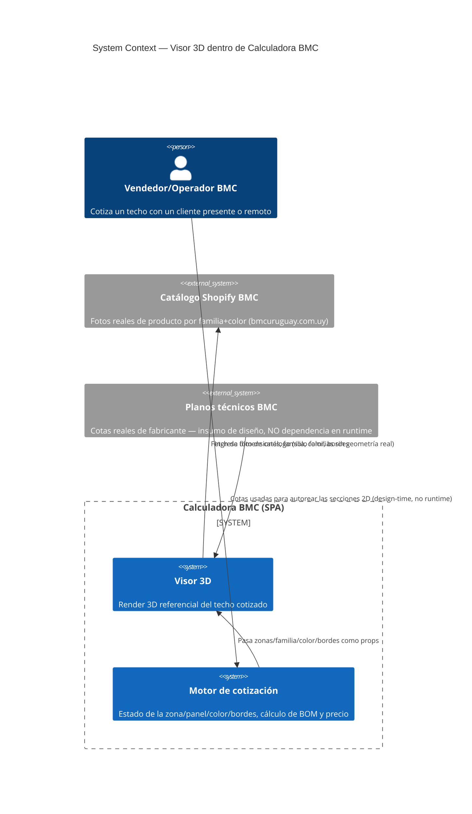
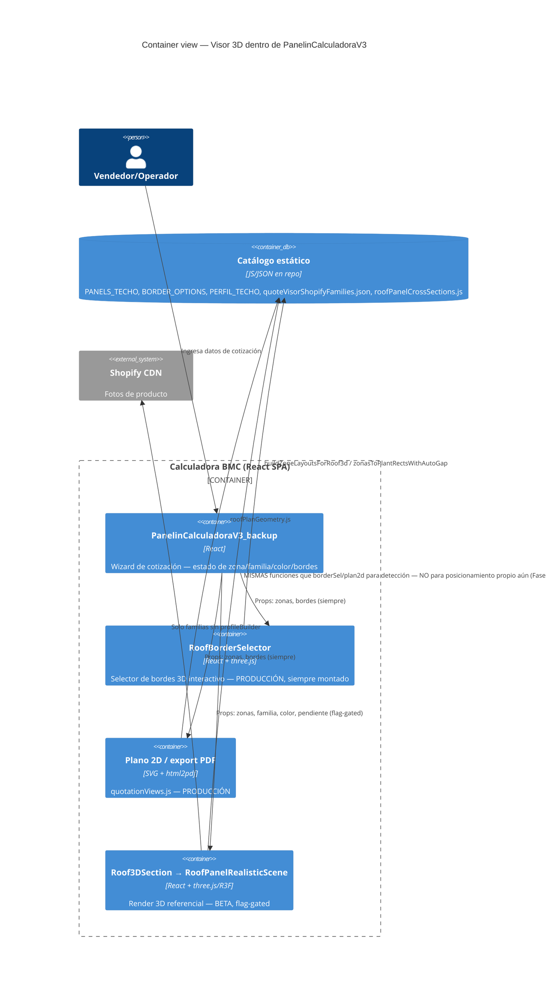
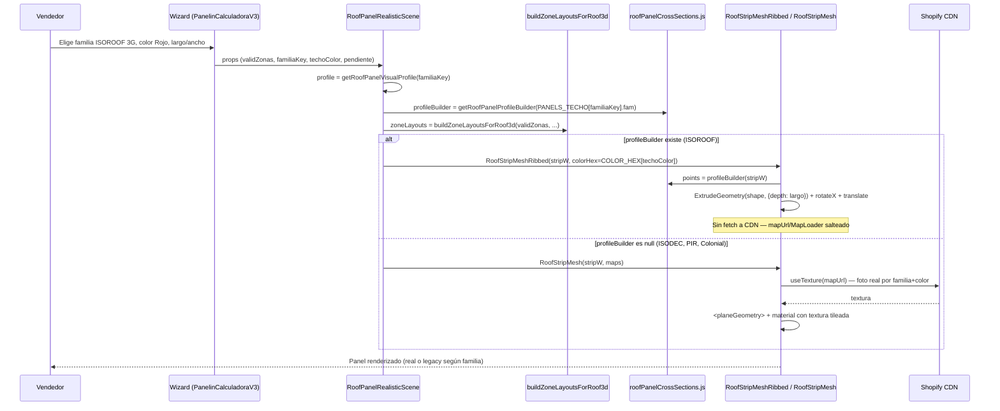

# System Design Document: Visor 3D — Calculadora BMC

> **Alcance de este documento:** este SDD cubre el **subsistema Visor 3D** dentro de la app
> mayor Calculadora BMC (cotizador de paneles aislantes, BMC Uruguay / METALOG SAS). No es una
> re-especificación de toda la calculadora — es la capa arquitectónica/de decisiones para el
> render 3D referencial de techo y su rework de calidad en curso.
>
> **Relación con otros documentos:**
> - [`VISOR-3D-QUALITY-REWORK-SPEC.md`](./VISOR-3D-QUALITY-REWORK-SPEC.md) — backlog de
>   ejecución: qué archivo tocar, qué línea, qué fase. Este SDD es la capa de arriba: por qué,
>   qué decisiones se tomaron y qué alternativas se descartaron. No duplican contenido — este
>   documento referencia al otro para el detalle línea-por-línea.
> - `docs/team/visual/roof-panel-3d-refs/` — evidencia visual primaria (planos técnicos BMC,
>   renders reales) usada para las decisiones de este SDD.
> - PR [#669](https://github.com/matiasportugau-ui/Calculadora-BMC/pull/669) — implementación.
>
> **Nota sobre el template usado:** este documento sigue la estructura arc42 + C4 Model del
> skill `sdd-architect`. La **Fase 3 del skill (arquitectura de IA — LLM/RAG/agentes) se omite
> explícitamente**: el Visor 3D es un subsistema de renderizado 3D procedural del lado del
> cliente, sin componentes de IA. Donde el skill pide pilares "Well-Architected" orientados a
> cloud/costo de LLM, se adaptaron a lo que realmente aplica acá (fidelidad geométrica,
> performance de render, mantenibilidad) — ver Sección 6.

---

## 1. Introducción y objetivos

### 1.1 Problema

Calculadora BMC ya tenía un render 3D referencial del techo cotizado ("Visor 3D"), pero:
funcionaba solo bajo `?designPreview=1` (mezclado con un sistema no relacionado de temas
visuales), y el render en sí era de baja fidelidad: paneles chatos con una foto de catálogo
pegada encima ("fotos cuadradas"), sin geometría de bordes/perfiles (gotero, babeta, canalón),
y zonas de techo conectadas (ej. Cumbrera) que se dibujaban como cuerpos flotantes separados en
vez de tocarse. Una revisión de producto encontró estos 3 problemas concretos y pidió una spec
de rework con evidencia real, no estimaciones.

### 1.2 Objetivos

- **G1 — Independencia del gate**: el Visor 3D debe poder mostrarse/ocultarse sin depender del
  sistema de design-preview (que además está bloqueado en producción). *(✅ cumplido, Fase 0)*
- **G2 — Volumen real de panel**: reemplazar el plano+foto por geometría 3D real derivada de
  cotas publicadas por el fabricante, no de una textura. *(✅ cumplido para ISOROOF; ISODEC/PIR/
  Colonial pendientes — Fase 2)*
- **G3 — Bordes/perfiles reales**: gotero, babeta, canalón, cumbrera deben tener geometría 3D,
  no solo existir como dato de cotización. *(pendiente — Fase 3)*
- **G4 — Continuidad geométrica entre zonas**: zonas de techo con un encuentro real configurado
  (Pretil/Cumbrera/Desnivel) deben tocarse en el render, no flotar separadas. *(pendiente —
  Fase 3a/3b)*
- **G5 — Cero dependencia externa bloqueante**: ninguna de las mejoras de fidelidad visual debe
  depender de conseguir un archivo 3D de un tercero antes de poder shippear valor. *(✅ cumplido
  — ver ADR-002)*
- **G6 — Sin riesgo a superficies de producción**: el rework no debe poder romper
  `RoofBorderSelector` (selector de bordes 3D, siempre activo en producción) ni el plano 2D/PDF,
  que comparten utilidades de layout con el Visor 3D. *(constraint de diseño, ver Sección 3 y
  ADR-004)*

### 1.3 Stakeholders

| Rol | Interés |
|---|---|
| Equipo comercial / vendedores BMC | Mostrar un render creíble al cliente durante la cotización |
| Matias Portugau (producto) | Definir qué "fidelidad real" significa; validar contra planos BMC reales |
| Futuro desarrollador que retome Fases 2-4 | Entender las decisiones ya tomadas sin releer todo el historial de commits |
| `RoofBorderSelector` / plano 2D-PDF (sistemas vecinos) | No deben verse afectados por este rework — son "stakeholders silenciosos" que solo importan como restricción |

---

## 2. Contexto y alcance (C4 Nivel 1)

### Interfaces externas

| Interfaz | Dirección | Protocolo | Descripción |
|---|---|---|---|
| Shopify CDN (`cdn.shopify.com`) | → HTTPS (fetch de imagen) | `getRoofPanelMapUrl()` resuelve una foto real por familia+color; **solo se usa para familias sin `profileBuilder`** (ISODEC, PIR, Colonial hoy) | |
| Planos técnicos BMC | *ninguna, es design-time* | Las cotas se leen a mano de una imagen descargada y se codifican en `roofPanelCrossSections.js` — no hay integración en runtime con ningún sistema de planos | |
| `RoofBorderSelector` (producción, siempre activo) | ← comparte código | Import directo | Consume `buildZoneLayoutsForRoof3d`/`zonasToPlantRectsWithAutoGap` — **no una API, un acoplamiento de código que hay que respetar** (ver Sección 3) |
| Plano 2D / export PDF | ← comparte código | Import directo | Mismo acoplamiento que arriba, vía `roofPlanGeometry.js`/`quotationViews.js` |

---

## 3. Restricciones

- **Stack fijo**: React 18 + Vite 7, three.js `^0.185.1` + `@react-three/fiber` `^8.17.10` +
  `@react-three/drei` `^9.114.3`. Node 24.x. No se agregan dependencias nuevas para geometría
  (se evaluó y descartó `useGLTF`/`DRACOLoader`/`three-stdlib` — ver ADR-002).
- **Flag-gated, off por defecto en producción**: todo el subsistema vive detrás de
  `isVisor3dEnabled()` (`VITE_FEATURE_VISOR_3D` env **o** `?visor3d=1` en cualquier entorno
  **o** design-preview activo — aditivo, no reemplaza el gate viejo). Producción sin el flag
  seteado se comporta byte-a-byte igual que antes de este rework.
- **Blast radius — restricción de diseño más importante del proyecto**: `buildZoneLayoutsForRoof3d`
  y `zonasToPlantRectsWithAutoGap` (`src/utils/roofZoneLayouts3d.js`,
  `src/utils/roofLateralAnnexLayout.js`) **no son exclusivas del Visor 3D** — las consume también
  `RoofBorderSelector` (producción, siempre montado, no gateado) y el plano 2D/export PDF
  (`quotationViews.js`). Verificado en código (`PanelinCalculadoraV3_backup.jsx:1301`).
  **Ninguna fase de este rework puede modificar esas funciones in-place.** Cualquier cambio de
  posicionamiento debe vivir en una función nueva y paralela (ver ADR-004).
- **PRs >500 LOC → draft obligatorio** (convención del repo, ya aplicada — PR #669 es draft).
- **No secretos/tokens nuevos**: el subsistema no requiere credenciales — las fotos de Shopify ya
  se sirven desde un JSON estático versionado en el repo (`quoteVisorShopifyFamilies.json`).
- **Cero costo de licencia/sourcing como bloqueante de v1**: se investigó activamente conseguir
  modelos 3D reales del fabricante (Kingspan/ex-Bromyros) — ver ADR-002 — pero se decidió que
  eso **no puede ser una dependencia bloqueante** para entregar valor incremental.

---

## 4. Estrategia de solución

- **Estilo arquitectónico**: renderizado 3D procedural del lado del cliente, capa aditiva sobre
  el modelo de datos de cotización 2D ya existente (`techo.zonas`, `techo.borders`,
  `encounterByPair`) — el Visor 3D no introduce un modelo de datos propio, lee el mismo estado
  que ya alimenta el plano 2D y el BOM.
- **Decisión técnica central**: en vez de depender de un asset 3D externo (glTF/OBJ) para
  paneles con volumen real, se construye la geometría con `THREE.ExtrudeGeometry` a partir de
  **cotas reales publicadas por el fabricante** (planos técnicos BMC, no estimaciones) — ver
  ADR-002. Esto elimina toda una categoría de riesgo/dependencia (sourcing externo, licencias,
  tiempos de espera de terceros) al precio de un esfuerzo de lectura/interpretación cuidadosa del
  plano técnico (ver Sección 8, riesgo materializado y corregido durante este mismo proyecto).
- **Entrega incremental, gateada**: cada fase es un commit/PR independiente, verificable end-to-end
  (`gate:local` + verificación visual en navegador) antes de pasar a la siguiente. Nada se
  "termina de golpe" — el flag permite tener trabajo a medio terminar en `main` sin exponerlo.
- **Verificación en 3 capas, no negociable para geometría nueva**: (1) sanity-check numérico en
  Node de la función generadora de puntos, (2) confirmación en navegador vía trace de consola
  temporal mostrando qué datos realmente recibió el componente, (3) captura de pantalla /
  inspección visual del resultado. Estas 3 capas nacieron de un error real (ver ADR-002 y Sección
  8) y quedan como práctica estándar para las fases futuras.

---

## 5. Vista de bloques (C4 Nivel 2 y 3)

### 5.1 Vista de contenedores — dónde vive el Visor 3D

**Lectura clave de este diagrama**: `RoofBorderSelector` y el plano 2D son cajas de
**producción**, siempre presentes, no relacionadas con el flag. `Roof3DSection`/
`RoofPanelRealisticScene` es la caja **beta**. Las tres comparten el mismo catálogo estático de
datos — ese acoplamiento compartido es la restricción de diseño de la Sección 3.

### 5.2 Vista de componentes — dentro de `RoofPanelRealisticScene.jsx`

| Componente | Responsabilidad | Estado |
|---|---|---|
| `RoofPanelRealisticScene` (default export) | Orquesta: calcula `zoneLayouts`, `bounds`, `encounters3d`; decide `profileBuilder`/`colorHex` por familia; monta el `Canvas` | ✅ estable |
| `SlopeZoneStripedMeshes` | Por zona: parte el ancho en franjas de `au` (`buildAnchoStripsPlanta`), decide franja-por-franja si usa geometría real o plano+foto | ✅ estable |
| `RoofStripMesh` | Franja **legacy**: `<planeGeometry>` + foto de catálogo tileada (`useTexture`) | ✅ fallback activo para familias sin `profileBuilder` |
| `RoofStripMeshRibbed` | Franja **nueva**: `ExtrudeGeometry` desde el perfil real 2D, material sólido de color | ✅ activo solo para `fam === "ISOROOF"` |
| `getRoofPanelProfileBuilder(fam)` (`roofPanelCrossSections.js`) | Registro familia→generador de sección 2D — hoy solo `ISOROOF`, resto retorna `null` (fallback a legacy) | ✅ extensible, Fase 2 agrega entradas |
| `buildZoneLayoutsForRoof3d` | Posición 3D por zona — **compartida con producción, no tocar** | ⚠️ ver restricción §3 |
| `encounters3d` (useMemo interno) | Línea de color del tipo de encuentro entre zonas | ✅ fix de detección shippeado (Fase 0); sin geometría de trim real aún |
| `RoofLateralStepInfills` → `buildLateralStepInfillGeometries` | Debería tapar el escalón entre zonas a distinta altura | ❌ stub permanente, devuelve `[]` — pendiente revivir (Fase 3b) |
| `MapLoader` | Carga textura de catálogo vía `useTexture` — **se saltea por completo** si hay `profileBuilder` | ✅ optimización activa |
| `CameraRig` | Encuadre automático de cámara según bounds de la escena | ✅ sin cambios este rework |

### 5.3 Flujo de datos — de "ingresar dimensiones" a "panel renderizado"

---

## 6. Atributos de calidad (pilares adaptados — sin Fase 3 de IA)

> El skill `sdd-architect` pide evaluar seguridad, confiabilidad, performance, observabilidad,
> costo y sostenibilidad al estilo AWS Well-Architected/Google Cloud, pensado para sistemas con
> componentes LLM/cloud. Acá se adaptan a lo que efectivamente importa en un subsistema de
> render 3D client-side; los pilares que no aplican se marcan explícitamente como N/A en vez de
> omitirse en silencio.

### 6.1 Fidelidad / Corrección geométrica (reemplaza "AI accuracy")

Este es el atributo de calidad **más importante** de este subsistema — el objetivo entero del
rework es que el render se parezca al producto real, no una foto genérica.

- **Política "cota real primero"**: toda función generadora de perfil debe citar su fuente
  (archivo de imagen del plano técnico) en un comentario, y cualquier dimensión que no esté
  explícitamente acotada en el plano debe marcarse como estimación en el código, no presentarse
  como dato real. Ya establecido como convención en `roofPanelCrossSections.js`.
- **Verificación de 3 capas obligatoria** (ver Sección 4) antes de mergear geometría nueva —
  nace de un incidente real: la primera lectura del plano de ISOROOF interpretó mal una cota
  ("72mm" leído como paso de repetición en vez de ancho de base de nervadura), lo que generó
  ~13 nervios por metro en vez de los 3 reales. Se detectó por revisión de producto, no por la
  verificación automática — la lección incorporada es que la verificación de 3 capas confirma
  que el código hace lo que el autor *cree* que el plano dice, no que esa lectura sea correcta;
  falta una capa de revisión humana contra el plano original antes de dar por cerrada una fase
  de geometría (ver Sección 8, riesgo abierto).

### 6.2 Performance

- Presupuesto informal: sin `InstancedMesh`, una `ExtrudeGeometry` por franja de `au` extruida a
  lo largo de `largo` completo (no tileada) — decisión deliberada, ver ADR-005. Con perfiles de
  10 puntos (ISOROOF corregido) el conteo de triángulos por franja es bajo (decenas), muy por
  debajo de cualquier presupuesto que hubiera hecho falta definir formalmente.
- Optimización activa: familias con geometría real **no** disparan `useTexture`/fetch de
  Shopify CDN — un ahorro de red real, no solo teórico (confirmado: `MapLoader` se saltea vía
  early-return en `RoofRealisticSceneContent`).
- **No medido formalmente** con un profiler — pendiente si se agregan zonas con muchas franjas
  simultáneas (Fase 2 rollout a más familias). Riesgo bajo dado el conteo de triángulos actual.

### 6.3 Seguridad

**Mayormente N/A** — subsistema 100% client-side, sin inputs de usuario no confiables más allá
de los que ya el wizard de cotización maneja, sin credenciales nuevas, sin superficie de ataque
nueva. Única nota: el fetch a Shopify CDN usa URLs ya existentes en un JSON versionado en el
repo (no user-controlled), sin riesgo de SSRF/inyección.

### 6.4 Confiabilidad / degradación

- **Fallback explícito por diseño**: `getRoofPanelProfileBuilder(fam)` devuelve `null` para
  cualquier familia sin generador registrado, y el componente cae automáticamente al camino
  legacy (plano+foto) — nunca un crash, nunca una pantalla en blanco. Este es el patrón que hizo
  posible entregar Fase 1 (solo ISOROOF) sin bloquear ni romper el resto de las familias.
- **Flag como red de seguridad de despliegue**: si algo sale mal en cualquier fase, apagar
  `VITE_FEATURE_VISOR_3D` (y no pasar `?visor3d=1`) vuelve el comportamiento a exactamente lo que
  era antes de este proyecto — no hay estado migrado, no hay rollback de datos.

### 6.5 Mantenibilidad

- **Principio de aislamiento (blast radius)** ya aplicado y a repetir: todo el trabajo de Fase 3
  (bordes/perfiles) y 3b (layout de zonas soldadas) debe vivir en archivos/funciones **nuevos**
  (`roofBorderTrimGeometry3d.js`, `resolveRoofZoneLayout3d`), nunca modificando in-place las
  funciones compartidas con `RoofBorderSelector`/plano 2D. Esto acepta cierta duplicación de
  lógica como precio consciente de no arriesgar producción — documentado como deuda técnica
  aceptada, no como descuido (ver ADR-004).
- **Extensibilidad del registro de perfiles**: agregar una familia nueva (Fase 2: ISODEC, PIR,
  Colonial) es un entry nuevo en `PROFILE_BUILDERS_BY_FAM`, sin tocar `RoofPanelRealisticScene.jsx`
  más que para el caso ya generalizado.

### 6.6 Observabilidad

**Gap real, sin resolver.** Hoy no hay ningún log/métrica estructurada de este subsistema en
producción — la única instrumentación usada fue un `console.debug` temporal insertado durante
el desarrollo y removido antes de cada commit. Si en producción un usuario reporta "el render se
ve mal", no hay forma de saber qué familia/color/dimensiones causaron el problema sin
reproducirlo manualmente. **Recomendación explícita para Fase 4 (integración)**: agregar
telemetría mínima (qué familia/perfil se renderizó, si cayó al fallback legacy, tiempo de
construcción de geometría) antes de sacar el flag de beta.

### 6.7 Costo

No aplica en el sentido cloud/LLM del framework original. Sí aplica en el sentido de **costo de
desarrollo/sourcing**: la decisión de geometría procedural desde cotas reales (ADR-002) evitó por
completo un costo que sí hubiera existido con cualquiera de las alternativas (compra de asset
stock, encargo a freelancer, o esperar un archivo de Kingspan/BMC) — ROI capturado como decisión
arquitectónica, no como línea de presupuesto.

### 6.8 Sostenibilidad

N/A — no hay cómputo en la nube asociado a este subsistema (todo el renderizado ocurre en el
navegador del usuario).

---

## 7. Decisiones de arquitectura (ADRs)

### ADR-001: Flag dedicado, aditivo al design-preview, no un reemplazo

**Estado**: Aceptado, shippeado (Fase 0).
**Contexto**: El Visor 3D estaba gateado solo por `isDesignPreviewEnabled()`, que está
hard-bloqueado en producción de Vercel — no había forma de mostrarlo en la URL de prod real sin
activar todo el chrome de design-preview (selector de temas, banner, etc., no relacionado).
**Decisión**: Nuevo helper `isVisor3dEnabled()` — `VITE_FEATURE_VISOR_3D` env, **o**
`?visor3d=1` en cualquier entorno incl. producción, **o** design-preview activo (aditivo).
**Consecuencias**:
  + Nada de lo que ya funcionaba (`?designPreview=1`) se rompe.
  + Ahora existe un camino a producción real sin pasar por design-preview.
  − Dos flags controlan la misma feature (design-preview y el nuevo) — superficie de
    configuración levemente mayor.
**Alternativas consideradas**: reemplazar el gate viejo por el nuevo (rechazado: hubiera roto el
flujo de quienes ya usan `?designPreview=1` para revisar temas visuales, sin relación con el
Visor 3D).

### ADR-002: Geometría procedural desde cotas reales publicadas, no asset 3D externo

**Estado**: Aceptado, shippeado (Fase 1, con una corrección posterior — ver Sección 8).
**Contexto**: El panel se renderizaba como un plano chato con una foto — se necesitaba volumen
3D real. La opción "obvia" era conseguir un modelo glTF/OBJ real (de BMC, de un freelancer, o de
un marketplace de assets stock).
**Decisión**: Investigar primero si ya existían cotas reales publicadas por el fabricante antes
de asumir que hacía falta un archivo 3D externo. Se encontró un plano técnico BMC
(`isoroof-cross-section-dimensioned.png`) con dimensiones exactas en mm del perfil ISOROOF.
Se construyó la geometría con `THREE.ExtrudeGeometry` directamente desde esas cotas — sin
loader nuevo, sin Draco, sin hosting de binarios, sin dependencia de terceros.
**Consecuencias**:
  + Cero costo de sourcing externo, cero tiempo de espera de terceros, cero riesgo de licencia.
  + Fidelidad real (no aproximada) para las cotas que sí están en el plano.
  + **Riesgo materializado**: una primera lectura del plano interpretó mal una cota ("72mm" como
    paso de repetición en vez de ancho de base de nervadura) — corregido tras zoom cuidadoso
    sobre la imagen y feedback directo de producto. Este riesgo es inherente al método (depende
    de que un humano/agente lea bien un dibujo técnico) y no desaparece agregando más
    automatización — la mitigación es la verificación de 3 capas de la Sección 4/6.1.
  − No cubre familias sin plano técnico disponible con cotas de sección completas (ISODEC tiene
    cotas parciales — la costura queda como estimación de bajo riesgo).
**Alternativas consideradas**:
  - Modelo stock de marketplace (CGTrader/TurboSquid): rechazado como camino principal, quedó
    como plan de contingencia si no se encontraban cotas reales.
  - Encargo a freelancer 3D: mismo tratamiento — contingencia, no bloqueante.
  - Pedir el archivo 3D fuente a BMC/Kingspan Uruguay (ex-Bromyros, dueño real del fabricante —
    hallazgo de este mismo proyecto): sigue abierto como **mejora incremental no bloqueante**,
    reemplazaría la geometría paramétrica sin cambiar la arquitectura (mismo punto de inyección).

### ADR-003: Material sólido de color en vez de foto tileada, para familias con geometría real

**Estado**: Aceptado, shippeado (Fase 1).
**Contexto**: El pipeline de textura de foto (`getRoofPanelMapUrl`) ya existía y funcionaba —
la pregunta era si seguir usándolo sobre la geometría nueva.
**Decisión**: No. Con geometría real, el relieve/sombra ya viene del 3D — pegar la foto encima
generaría doble sombreado (la foto ya tiene su propia luz/sombra "horneada", en conflicto con la
iluminación de la escena). Se usa `MeshStandardMaterial` de color sólido vía `COLOR_HEX`
(Blanco/Gris/Rojo, ya existente en `constants.js`).
**Consecuencias**:
  + Coincide visualmente con cómo se ven los renders 3D reales de BMC (confirmado revisando sus
    propias imágenes de marketing — usan color sólido, no foto tileada, para sus renders 3D).
  + Ahorro de red: no hay fetch de textura para familias con geometría real.
  − Pierde detalles de textura fina (ej. relieve superficial del acero) que la foto sí mostraba
    — aceptado como trade-off, no se consideró crítico.

### ADR-004: Contención de blast radius — nunca modificar las utilidades de layout compartidas in-place

**Estado**: Aceptado como restricción de diseño para todo el proyecto (aplica retroactivamente
a Fase 0 y prospectivamente a Fases 3/3a/3b).
**Contexto**: `buildZoneLayoutsForRoof3d`/`zonasToPlantRectsWithAutoGap` resultaron estar en uso
por `RoofBorderSelector` (producción, siempre montado) y el plano 2D/PDF — hallazgo verificado
en código, no asumido.
**Decisión**: cualquier cambio de posicionamiento/layout para el Visor 3D vive en una función
**nueva y paralela** (ej. `resolveRoofZoneLayout3d`, planeada para Fase 3b), nunca en las
funciones compartidas.
**Consecuencias**:
  + Cero riesgo de regresión en superficies de producción no relacionadas con este proyecto.
  − Duplicación de lógica aceptada conscientemente como deuda técnica, con un ticket de
    seguimiento sugerido para evaluar unificación una vez validado en producción.
**Alternativas consideradas**: modificar las funciones compartidas con un parámetro opcional que
cambie el comportamiento solo para el Visor 3D — rechazado por el riesgo de que un cambio futuro
en el default rompa producción sin que quien lo cambie sepa que `RoofBorderSelector` depende de
ese código.

### ADR-005: Una extrusión continua por franja de `au`, no `InstancedMesh` tileado

**Estado**: Aceptado, shippeado (Fase 1).
**Contexto**: La spec original (antes de implementar) asumía que iba a hacer falta
`InstancedMesh` para tilear un tile corto repetido a lo largo del panel, por analogía con cómo
otros motores de render manejan corrugación repetida.
**Decisión**: no hace falta. La corrugación de un panel real corre a lo LARGO del panel (misma
dirección que "caída de agua") — un panel real se extruye una sola vez en fábrica, no se tilea.
Se extruye la sección transversal directamente a `depth: largo` completo, una `ExtrudeGeometry`
por franja — mismo patrón "una malla por franja" que ya usaba el código legacy.
**Consecuencias**:
  + Simplificación real de la spec original — menos código, sin lógica de instancing/repetición.
  + Más preciso físicamente, no solo más simple.
**Alternativas consideradas**: `InstancedMesh` con tiles cortos — descartado al confirmar
(revisando la dirección de "caída de agua" en el plano) que la premisa de partida era incorrecta.

---

## 8. Riesgos y deuda técnica

| Riesgo | Impacto | Probabilidad | Mitigación |
|---|---|---|---|
| Lectura incorrecta de un plano técnico (ya materializado una vez, corregido) | Alto — geometría visualmente incorrecta que puede pasar desapercibida si nadie la compara contra el plano real | Media — depende de la claridad del plano y de que haya revisión humana | Verificación de 3 capas (Sección 4/6.1) + comentario en código citando la fuente exacta + este SDD documentando el incidente para que no se repita sin control |
| Trigonometría de Cumbrera (Fase 3a) sin resolver | Medio-alto — es el ítem más incierto del roadmap completo (ver spec de ejecución §3.4) | Alta si no se hace un spike aislado antes de generalizar | Spike empírico dedicado, iterativo, con verificación visual — ya planeado, no iniciado |
| Sin observabilidad en producción (Sección 6.6) | Medio — dificulta diagnosticar reportes de usuarios | Cierta si se expande a más familias sin agregar telemetría | Agregar instrumentación mínima antes de sacar el flag de beta (recomendación Fase 4) |
| Deuda de duplicación entre `buildZoneLayoutsForRoof3d` y el futuro `resolveRoofZoneLayout3d` (ADR-004) | Bajo-medio — dos implementaciones del mismo concepto pueden divergir con el tiempo | Media a largo plazo | Ticket de seguimiento post-Fase 4 para evaluar unificación una vez validado en producción |
| Dimensiones estimadas (no acotadas en plano) presentadas junto a dimensiones reales sin distinción visual en el código | Bajo | Media | Ya mitigado parcialmente por comentarios explícitos "estimado, no acotado en el plano" — falta una convención más fuerte (ej. un flag `isEstimated` en los datos) si se agregan más familias con datos mixtos |

---

## 9. Estado de entrega / roadmap

| Fase | Contenido | Estado |
|---|---|---|
| 0 | Flag dedicado + fix de detección de encuentros | ✅ Shippeado |
| 1 | Badge Beta + geometría real ISOROOF (3 nervios, corregido) | ✅ Shippeado |
| 1b | Pedir archivo 3D fuente real a BMC/Kingspan (mejora incremental, no bloqueante) | ⏳ No iniciado |
| 2 | Rollout a ISODEC / ISODEC PIR / ISOROOF Colonial | ⏳ No iniciado |
| 3 | Geometría de bordes/perfiles (gotero/babeta/canalón/cumbrera) | ⏳ No iniciado |
| 3a | Spike de trigonometría Cumbrera Y-stacking | ⏳ No iniciado — mayor riesgo del roadmap |
| 3b | `resolveRoofZoneLayout3d` + revive step-infill para desnivel | ⏳ Depende de 3a |
| 4 | Integración completa + QA visual + observabilidad mínima | ⏳ No iniciado |

Detalle línea-por-línea de cada fase: [`VISOR-3D-QUALITY-REWORK-SPEC.md`](./VISOR-3D-QUALITY-REWORK-SPEC.md) Sección 4.

---

## 10. Glosario

| Término | Significado |
|---|---|
| **Visor 3D** | El subsistema de este documento — render 3D referencial del techo cotizado |
| **Visor visual** | Panel *distinto*, no relacionado con este SDD — muestra fotos/plano 2D del producto |
| **au (ancho útil)** | Ancho de cobertura real de un panel individual (ej. 1.0m para ISOROOF, 1.12m para ISODEC) |
| **esp** | Espesor del panel en mm (opciones por familia, ej. 30/40/50/80mm) |
| **fam** | Campo en `PANELS_TECHO` que agrupa familias comerciales por perfil físico real (ej. ISOROOF_3G/PLUS/FOIL comparten `fam:"ISOROOF"`) |
| **familiaKey** | Identificador de la familia comercial elegida por el usuario (ej. `"ISOROOF_3G"`) |
| **modo (encuentro)** | Tipo de unión entre dos zonas de techo: `continuo`, `pretil`, `cumbrera`, `desnivel` |
| **Cumbrera** | Encuentro tipo cresta/ridge — dos faldones de techo que se juntan en un pico |
| **Pretil** | Encuentro tipo parapeto/escalón entre dos zonas al mismo nivel |
| **Desnivel** | Encuentro entre dos techos a distinta altura |
| **Gotero, babeta, canalón, caballete** | Perfiles de borde/remate metálico — accesorios de instalación con SKU y precio real (`PERFIL_TECHO`) |
| **Referencial** | Etiqueta que la propia UI le pone al render — "no sustituye medidas ni aspectos constructivos" — nunca se presenta como plano de obra |

---

## Apéndice: documentos relacionados

- [`VISOR-3D-QUALITY-REWORK-SPEC.md`](./VISOR-3D-QUALITY-REWORK-SPEC.md) — backlog de ejecución
- [`docs/team/visual/roof-panel-3d-refs/`](../visual/roof-panel-3d-refs/README.md) — evidencia visual primaria
- [`docs/team/PROJECT-STATE.md`](../PROJECT-STATE.md) — changelog cronológico del proyecto completo
- PR [#669](https://github.com/matiasportugau-ui/Calculadora-BMC/pull/669) — implementación (draft)
