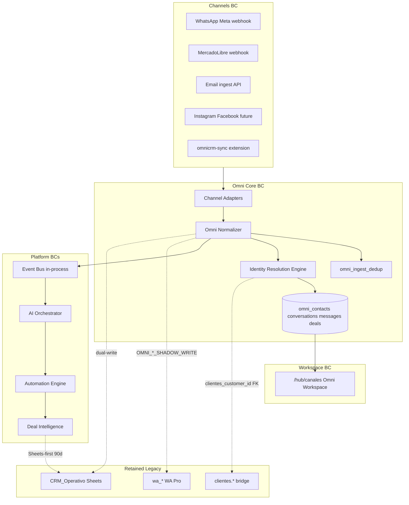

# 02 — Target State Architecture

**Program:** EXPORT_SEAL::OMNICRM_AUTONOMOUS_TRANSFORMATION_PROGRAM_V2  
**Date:** 2026-06-22  
**Status:** Target design (not implemented)  
**ADRs:** [ADR-001](adrs/ADR-001-omni-core.md) through [ADR-010](adrs/ADR-010-workspace-strategy.md)

---

## 1. Vision

Evolve calculadora-bmc from a **multi-model channel CRM** (wa_* + Sheets + clientes.*) into an **AI-Native OmniCRM** where:

- All channels normalize into one message graph (`omni_*`)
- Identity resolves to a single Contact across WA, ML, Email, IG, FB
- AI orchestration, automation, and deal intelligence run on domain events
- Operators work from one workspace (`/hub/canales` evolution)
- Legacy systems remain authoritative where proven (Sheets money, WA Pro ops)

**Evidence:**
- Source: `docs/discovery/08-omni-gap-analysis.md`
- Section: Target architecture diagram
- Reasoning: Current vs target shows normalizer, IRE, omni_* as P0 gaps

---

## 2. System topology



---

## 3. Bounded contexts

### 3.1 Channels

| Attribute | Value |
|-----------|-------|
| **Purpose** | Receive and send messages per external surface |
| **Responsibilities** | Webhook verification, payload parsing, outbound dispatch, rate limits |
| **Owned data** | Channel credentials (env/secrets), transient raw payloads |
| **Public APIs** | `POST /webhooks/whatsapp`, `POST /webhooks/ml`, `POST /api/crm/ingest-email`, `POST /api/unified-crm-ingest` |
| **Events produced** | Raw payloads to normalizer (not domain events directly) |
| **Events consumed** | Outbound send requests from Omni Core reply API |
| **Dependencies** | Meta Graph, ML API, IMAP bridge (external), HMAC secrets |
| **Failure modes** | Webhook flood, token expiry, channel API 5xx |
| **Recovery** | Retry with backoff; idempotent ingest; Meta/ML webhook replay |

### 3.2 Omni Core

| Attribute | Value |
|-----------|-------|
| **Purpose** | Single ingress contract and persistent message graph |
| **Responsibilities** | Normalize, idempotent persist, query API, legacy dual-write |
| **Owned data** | `omni_*`, `omni_ingest_dedup`, `omni_outbox` (optional) |
| **Public APIs** | `/api/omni/*`, `/api/unified-crm-ingest`, `/api/omni/health` |
| **Events produced** | `contact.*`, `conversation.*`, `message.ingested`, `message.sent` |
| **Events consumed** | None (origin of graph) |
| **Dependencies** | Postgres, Identity Resolution, channel adapters |
| **Failure modes** | DB pool exhaustion, duplicate key races, adapter validation errors |
| **Recovery** | Transaction rollback; dedup table prevents double insert; health check fails load balancer |

### 3.3 Identity Resolution

| Attribute | Value |
|-----------|-------|
| **Purpose** | Map channel identifiers → single `omni_contacts` row |
| **Responsibilities** | Lookup sparse keys, confidence scoring, merge, bridge to clientes |
| **Owned data** | Merge audit, confidence records (in `omni_audit_log` + contact properties) |
| **Public APIs** | Internal; admin `POST /api/omni/contacts/:id/merge` (future) |
| **Events produced** | `contact.created`, `contact.merged` |
| **Events consumed** | Contact hints from normalizer |
| **Dependencies** | omni_contacts schema, clientes.customer_identities |
| **Failure modes** | False merge, ambiguous match, race on concurrent creates |
| **Recovery** | Soft-merge rollback from audit; manual review queue |

### 3.4 AI

| Attribute | Value |
|-----------|-------|
| **Purpose** | Classify, suggest, extract structured data from messages |
| **Responsibilities** | Job queue, agentCore invocation, registries, HITL |
| **Owned data** | `omni_ai_jobs`, `omni_suggestions`, prompt/model registries |
| **Public APIs** | `POST /api/internal/omni/ai/run` (service token) |
| **Events produced** | `ai.suggestion.generated`, `ai.suggestion.accepted`, `ai.suggestion.rejected` |
| **Events consumed** | `message.ingested` |
| **Dependencies** | agentCore, provider API keys, training KB |
| **Failure modes** | Provider outage, cost spike, prompt injection, latency SLO breach |
| **Recovery** | Provider chain fallback; job retry; rate limits |

### 3.5 Automation

| Attribute | Value |
|-----------|-------|
| **Purpose** | Execute cross-channel rules on domain events |
| **Responsibilities** | Trigger evaluation, condition DSL, action execution, simulation |
| **Owned data** | `omni_automation_rules`, `omni_automation_runs` |
| **Public APIs** | Admin CRUD, `POST /api/omni/automation/simulate` |
| **Events produced** | `automation.executed` |
| **Events consumed** | `message.ingested`, `conversation.*`, `deal.*` |
| **Dependencies** | Omni Core, AI (enqueue jobs), Sheets helpers, outbound webhooks |
| **Failure modes** | Rule loop, bad condition, Sheets sync failure |
| **Recovery** | Circuit breaker; DLQ on runs; disable rule |

### 3.6 Deals

| Attribute | Value |
|-----------|-------|
| **Purpose** | Operational sales pipeline and intelligence |
| **Responsibilities** | Stage machine, AI extract, Sheets sync, forecasting, NBA |
| **Owned data** | `omni_deals` |
| **Public APIs** | `/api/omni/deals` |
| **Events produced** | `deal.created`, `deal.updated`, `deal.won`, `deal.lost` |
| **Events consumed** | `message.ingested` (cotización), automation actions |
| **Dependencies** | Sheets CRM, AI extract jobs |
| **Failure modes** | Monto conflict, missing CRM row link |
| **Recovery** | Sheets authority policy; reconcile job |

### 3.7 Workspace

| Attribute | Value |
|-----------|-------|
| **Purpose** | Operator UX for inbox, contacts, deals |
| **Responsibilities** | List/thread/reply UI, legacy deep links, RBAC display |
| **Owned data** | UI state only (localStorage preferences) |
| **Public APIs** | Consumes `/api/omni/*` via TanStack Query |
| **Events consumed** | SSE `conversation.updated` (optional) |
| **Dependencies** | Omni Core API, BmcAuthProvider, RequireGrant |
| **Failure modes** | API 503, stale cache, flag misconfiguration |
| **Recovery** | Fallback to Sheets queue when `VITE_OMNI_INBOX=0` |

### 3.8 Security

| Attribute | Value |
|-----------|-------|
| **Purpose** | Authentication, authorization, webhook integrity, secrets |
| **Responsibilities** | JWT/RBAC, HMAC, rate limits, SSRF allowlist, audit |
| **Owned data** | identity.* grants, audit events |
| **Public APIs** | `/auth/*`, middleware on all protected routes |
| **Dependencies** | Doppler/env, Google OAuth, MFA |
| **Failure modes** | Token expiry, grant misconfiguration, replay attack |
| **Recovery** | Refresh rotation; deny-by-default on new routes |

### 3.9 Observability

| Attribute | Value |
|-----------|-------|
| **Purpose** | Trace, measure, alert on omni pipeline health |
| **Responsibilities** | OTel export, structured logs, metrics, dashboards |
| **Owned data** | Metric time series, trace spans (external backend) |
| **Public APIs** | `/api/omni/metrics`, `/health` |
| **Dependencies** | GCP Cloud Trace **ASSUMPTION_REQUIRED**, pino |
| **Failure modes** | Export failure, cardinality explosion, PII leak in traces |
| **Recovery** | Degrade to pino-only; sampling |

---

## 4. Module layout (server)

```
server/lib/omni/
  types.js              # OmniInboundEvent, enums, Zod schemas
  normalizer.js         # normalizeAndPersist(event)
  omniDb.js             # SQL helpers, pool
  outbox.js             # optional async dispatch
  adapters/
    waWebhook.js
    waExtension.js
    mlWebhook.js
    mlCrmRow.js
    emailIngest.js
    unifiedCrmIngest.js
  identity/
    resolveContact.js
    resolveConversation.js
  orchestrator/
    aiWorker.js         # omni_ai_jobs processor
    automationEngine.js
    dealExtractor.js
server/routes/omni.js    # /api/omni/* mount
server/migrations/omni/
  001_core.sql
  002_ai_automation.sql
  003_dedup_outbox.sql
```

**Evidence:**
- Source: `docs/discovery/10-architecture-review.md` §1.3
- Section: Module layout
- Reasoning: Proposed structure not yet in repo (NOT_FOUND)

---

## 5. Canonical inbound envelope

```typescript
type OmniInboundEvent = {
  source: "wa_webhook" | "wa_extension" | "ml_webhook" | "ml_sync" | "email_ingest" | "unified_crm_ingest" | "manual" | "wa_backfill";
  channel: "wa" | "ml" | "email" | "instagram" | "facebook" | "omnicrm";
  idempotency_key: string;
  occurred_at: string;
  contact_hint: { wa_phone?, ml_user_id?, email?, name?, chrome_ext_contact_id? };
  conversation_hint: { channel_conversation_id: string; subject? };
  message: { sender: "customer" | "agent" | "bot"; sender_id?; body: string; attachments?; metadata: object };
  side_effects?: { crm_sheet_row?, wa_chat_id? };
};
```

---

## 6. Feature flags

| Flag | Default | Purpose |
|------|---------|---------|
| `OMNI_WA_SHADOW_WRITE` | 0 | Dual-write WA → omni |
| `OMNI_ML_SHADOW_WRITE` | 0 | Dual-write ML → omni |
| `OMNI_EMAIL_SHADOW_WRITE` | 0 | Dual-write email → omni |
| `OMNI_EVENT_BUS_ENABLED` | 0 | Emit domain events post-persist |
| `OMNI_AI_ORCHESTRATOR_ENABLED` | 0 | Process omni_ai_jobs |
| `OMNI_DEALS_SHEETS_AUTHORITY` | 1 | Sheets wins on money conflicts |
| `VITE_OMNI_INBOX` | 0 | Frontend reads omni vs Sheets |
| `VITE_OMNI_DEALS` | 0 | Deals kanban tab |
| `OTEL_ENABLED` | 0 | OpenTelemetry export |

---

## 7. What stays in legacy (explicit non-goals)

| System | Retained capability | Not migrated to omni |
|--------|---------------------|----------------------|
| `wa_*` | Quotes, SLA, operators, consent, followups, settings | WA Pro operational tables |
| Sheets | Monto, Estado, finanzas, col AH quote link | Commercial ledger authority (90d) |
| `agentChat` | Calculator chat + tools | Unchanged surface |
| ML OAuth | Token store, Answers API | Stays in mercadoLibreClient.js |

---

## 8. Target vs current score projection

| Area | Current | Target | Primary enabler |
|------|---------|--------|-----------------|
| Omni platform | 25 | 95 | Tracks A–D |
| Channels (Email/IG/FB) | 25 | 80 | Phase 4 + cm-0 gate |
| AI | 50 | 95 | Track E + governance |
| Security | 50 | 95 | Track H1 + ADR-007 |
| Observability | 50 | 95 | Track H3 + ADR-008 |
| Frontend | 50 | 95 | Track G + ADR-010 |

See [15-success-metrics.md](15-success-metrics.md) for full quality gate.

---

## References

- [OMNI-HUB-ARCHITECTURE.md](../team/OMNI-HUB-ARCHITECTURE.md)
- [omni-hub-schema.sql](../team/omni-hub-schema.sql)
- [10-architecture-review.md](../discovery/10-architecture-review.md)
