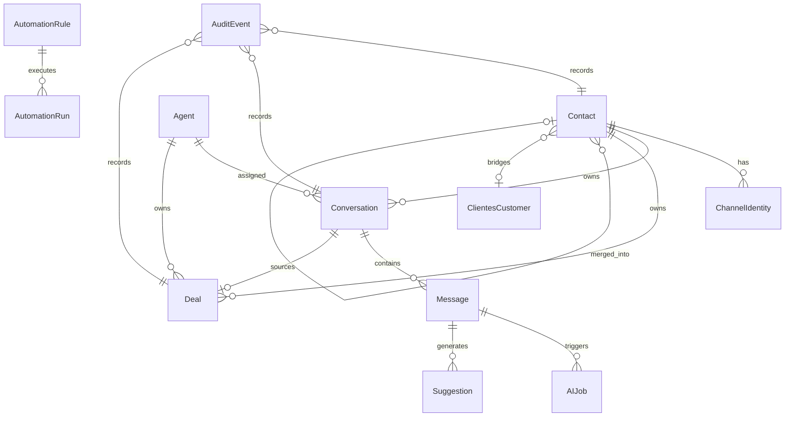

# 03 — Domain Model

**Program:** EXPORT_SEAL::OMNICRM_AUTONOMOUS_TRANSFORMATION_PROGRAM_V2  
**Date:** 2026-06-22  
**Schema baseline:** [omni-hub-schema.sql](../team/omni-hub-schema.sql) + extensions below  
**ADR:** [ADR-001](adrs/ADR-001-omni-core.md), [ADR-002](adrs/ADR-002-identity-resolution.md)

---

## 1. Entity relationship overview



---

## 2. Contact (`omni_contacts`)

### Purpose

Operational contact node for inbox threading — one row per resolved person/business in the omni graph.

### Lifecycle

```
created → active → merged (soft) → archived
```

- **created:** First channel event with new identity keys
- **active:** Normal operation; receives messages
- **merged:** `merged_into_contact_id` set; row read-only
- **archived:** Manual admin; no new conversations

### Ownership

**Omni Core / Identity Resolution** context.

### Relationships

- 1:N `omni_conversations`
- 1:N `omni_deals`
- N:1 optional `clientes.customers` via `clientes_customer_id`
- N:1 optional survivor via `merged_into_contact_id`

### Invariants

- `integration_uuid` NOT NULL, unique, immutable after create
- At least one sparse key OR `integration_uuid` pattern `omni:uuid` for anonymous
- `merged_into_contact_id != id`
- Survivor row holds union of all channel sparse keys post-merge

### Constraints

```sql
-- Extensions beyond omni-hub-schema.sql
merged_into_contact_id UUID REFERENCES omni_contacts(id) ON DELETE SET NULL,
clientes_customer_id UUID REFERENCES clientes.customers(id) ON DELETE SET NULL,
email_normalized VARCHAR(255),  -- for sparse unique WHERE NOT NULL
meta_psid VARCHAR(255) UNIQUE WHERE meta_psid IS NOT NULL  -- future
```

### Deletion policy

**Soft-delete only** via merge or archive. Hard delete prohibited if messages exist (ON DELETE RESTRICT via conversations).

### Audit requirements

`contact.created`, `contact.updated`, `contact.merged` → `omni_audit_log` with `old_values`/`new_values`.

---

## 3. ChannelIdentity (value object)

### Purpose

External identifier binding a Contact to a channel surface. Not a separate table in v1 — encoded as sparse columns on `omni_contacts`.

### Lifecycle

```
discovered → verified → merged_away
```

### Ownership

Identity Resolution context.

### Relationships

Embedded in Contact row: `wa_phone`, `ml_user_id`, `email_normalized`, `chrome_ext_contact_id`, `meta_psid`.

### Invariants

- Each non-null sparse key unique across active (non-merged) contacts
- `integration_uuid` derivable from primary key: `wa:+E164`, `ml:{id}`, etc.

### Deletion policy

Keys transfer to survivor on merge; never deleted independently.

### Audit requirements

Logged in merge audit with provenance source channel.

---

## 4. Conversation (`omni_conversations`)

### Purpose

One native thread per contact per channel (WA chat, ML question, email thread).

### Lifecycle

```
open → pending_response → resolved → archived
```

### Ownership

Omni Core context.

### Relationships

- N:1 Contact
- 1:N Message
- 0:1 Deal (source_conversation_id)

### Invariants

- UNIQUE `(contact_id, channel, channel_conversation_id)`
- `channel` ∈ {`wa`, `ml`, `email`, `instagram`, `facebook`, `omnicrm`}
- `status` ∈ {`open`, `resolved`, `archived`, `pending_response`}

### Constraints

- `properties.legacy` JSONB stores wa_chat_id, crm_sheet_row, ml_question_id for transition deep-links

### Deletion policy

**Archive, not delete.** CASCADE from contact only on admin purge (prohibited in prod).

### Audit requirements

`conversation.created`, `conversation.assigned`, `conversation.closed`, status changes.

---

## 5. Message (`omni_messages`)

### Purpose

Immutable record of inbound/outbound communication in a conversation.

### Lifecycle

```
ingested → classified → read (optional) → immutable forever
```

### Ownership

Omni Core context.

### Relationships

- N:1 Conversation
- 1:N AIJob (async)
- 0:N Suggestion

### Invariants

- `sender` ∈ {`customer`, `agent`, `bot`}
- Idempotent via `omni_ingest_dedup.idempotency_key` → message_id
- Body may be empty if attachments present (relax `body ~ '\S'` constraint)

### Constraints

- `body_ai_category` set by AI orchestrator only
- `metadata` holds raw channel payload reference

### Deletion policy

**Immutable — no DELETE.** WA TTL pattern (`wa:purge-old`) does NOT apply to omni_messages. Retention policy TBD legal review **ASSUMPTION_REQUIRED**.

### Audit requirements

Insert-only audit; no update except `read_at`, `body_ai_category`.

---

## 6. Deal (`omni_deals`)

### Purpose

Cross-channel sales opportunity with pipeline stage and revenue attribution.

### Lifecycle

```
lead → qualified → proposal → negotiation → closed_won | closed_lost
```

### Ownership

Deals / Deal Intelligence context.

### Relationships

- N:1 Contact
- 0:1 source Conversation
- N:1 owner Agent (operator user_id)

### Invariants

- `stage` valid enum; terminal states `closed_won`, `closed_lost` have `closed_at`
- `value_usd` ≥ 0
- When `OMNI_DEALS_SHEETS_AUTHORITY=1`, Sheets monto overrides on sync conflict

### Constraints

- `properties.crm` = { sheet_id, row, last_sync_at }

### Deletion policy

Soft-close only. Historical deals retained for forecasting.

### Audit requirements

All stage transitions, value changes → `omni_audit_log` + optional Sheets AUDIT_LOG tab sync.

---

## 7. Agent (operator identity)

### Purpose

Human operator or bot identity that sends messages, owns deals, triggers automations.

### Lifecycle

Managed by identity module — not omni-owned.

### Ownership

Security / identity context (`identity.users`).

### Relationships

Referenced by `owner_agent_id`, `sender_id`, automation audit `changed_by`.

### Invariants

- Must exist in identity.users before assignment
- RBAC grant required for channel module

### Deletion policy

Deactivate user; reassign open conversations/deals.

### Audit requirements

Assignment changes logged on conversation/deal entities.

**Evidence:**
- Source: `docs/discovery/07-security-map.md` §RBAC
- Reasoning: JWT sub maps to operator; module grants include `canales`, `wa`, `ml`

---

## 8. AutomationRule (`omni_automation_rules`)

### Purpose

Versioned cross-channel rule: trigger + conditions + actions.

### Lifecycle

```
draft → enabled → disabled → superseded (new version)
```

### Ownership

Automation context.

### Relationships

- 1:N AutomationRun

### Invariants

- `priority` lower number = higher precedence
- `conditions` and `actions` valid JSON DSL schema
- `trigger_event` must match subscribed bus events

### Deletion policy

Disable, never hard delete (audit trail).

### Audit requirements

CRUD on rules; each execution → AutomationRun.

---

## 9. AIJob (`omni_ai_jobs`)

### Purpose

Async AI work unit tied to a message.

### Lifecycle

```
pending → running → completed | failed | dead
```

### Ownership

AI context.

### Relationships

- N:1 Message
- 0:1 Suggestion (output)

### Invariants

- `job_type` ∈ {`classify`, `suggest`, `extract_deal`, `embed`}
- Max 3 retries before `dead`
- Stores `prompt_version`, `model_version`, `latency_ms`, `cost_usd`

### Deletion policy

Archive completed after 90d **ASSUMPTION_REQUIRED** retention job.

### Audit requirements

Full job record immutable after completion.

---

## 10. AuditEvent (`omni_audit_log`)

### Purpose

Unified change capture across omni entities.

### Lifecycle

Append-only.

### Ownership

Observability + Security shared.

### Relationships

Polymorphic: `entity_type` + `entity_id`

### Invariants

- `entity_type` ∈ {`contact`, `conversation`, `message`, `deal`, `automation_rule`, `ai_job`}
- `operation` ∈ {`insert`, `update`, `delete`, `merge`, `execute`}

### Deletion policy

No delete. Partition by month for performance (Phase 2).

### Audit requirements

Self-describing — this entity IS the audit trail.

**Evidence:**
- Source: `docs/team/omni-hub-schema.sql` L225–255
- Section: omni_audit_log DDL

---

## 11. Schema extension summary

| Change | Rationale |
|--------|-----------|
| `merged_into_contact_id` | Soft-merge rollback |
| `clientes_customer_id` FK | 360 bridge |
| `email` in channel CHECK | Email channel PARTIAL today |
| `omni_ingest_dedup` | Idempotency |
| `omni_ai_jobs`, `omni_suggestions` | AI orchestrator |
| `omni_automation_rules`, `omni_automation_runs` | Automation engine |
| Relax body NOT NULL regex | Attachment-only messages |

---

## References

- [05-identity-resolution.md](05-identity-resolution.md)
- [04-event-model.md](04-event-model.md)
- [10-architecture-review.md](../discovery/10-architecture-review.md) §2.5
