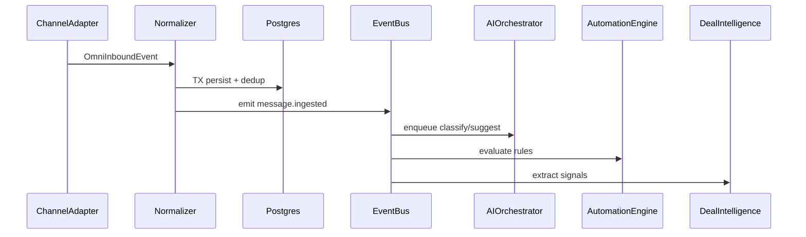

# 04 — Event Model

**Program:** EXPORT_SEAL::OMNICRM_AUTONOMOUS_TRANSFORMATION_PROGRAM_V2  
**Date:** 2026-06-22  
**ADR:** [ADR-003](adrs/ADR-003-event-model.md)

---

## 1. Event bus architecture



**Phase 1:** Synchronous in-process dispatch after DB commit.  
**Phase 2:** `omni_outbox` poller for horizontal scale (**ASSUMPTION_REQUIRED** >500 msg/min).

---

## 2. Event catalog

### 2.1 Contact events

#### `contact.created`

| Field | Value |
|-------|-------|
| **Producer** | Identity Resolution (`resolveContact.js`) |
| **Consumers** | Automation, Observability, optional clientes sync job |
| **Payload** | `{ contact_id, integration_uuid, channel_keys, source, trace_id }` |
| **Idempotency** | contact_id unique |
| **Retry** | N/A (sync in normalizer TX) |
| **Dead letter** | N/A |
| **Observability** | Log contact_id, trace_id; metric `omni_contacts_created_total` |

#### `contact.merged`

| Field | Value |
|-------|-------|
| **Producer** | Identity Resolution (merge flow) |
| **Consumers** | Automation, Workspace cache invalidation, Audit |
| **Payload** | `{ survivor_id, merged_id, channel_keys_moved, confidence, actor_id?, trace_id }` |
| **Idempotency** | `(survivor_id, merged_id)` pair once |
| **Retry** | Re-emit safe if subscribers idempotent |
| **Dead letter** | Admin replay queue if clientes sync fails |
| **Observability** | Alert on merge rate spike (possible bad rules) |

---

### 2.2 Conversation events

#### `conversation.created`

| Producer | Normalizer after resolveConversation |
| Consumers | Automation, Observability |
| Payload | `{ conversation_id, contact_id, channel, channel_conversation_id, subject?, trace_id }` |
| Idempotency | UNIQUE constraint on (contact_id, channel, channel_conversation_id) |
| Retry | N/A |
| Dead letter | N/A |
| Observability | `omni_conversations_created_total{channel}` |

#### `conversation.assigned`

| Producer | Reply API, Automation action `assign_owner`, Workspace UI |
| Consumers | Notifications (future), Audit |
| Payload | `{ conversation_id, owner_agent_id, previous_owner_id?, trace_id }` |
| Idempotency | Last-write-wins with audit |
| Retry | 3x on notification failure |
| Dead letter | Log only v1 |
| Observability | assignment latency histogram |

#### `conversation.closed`

| Producer | Workspace UI, Automation, channel status sync |
| Consumers | Automation (close triggers), Metrics |
| Payload | `{ conversation_id, status, reason?, trace_id }` |
| Idempotency | Status enum guard — ignore duplicate close |
| Retry | N/A |
| Dead letter | N/A |
| Observability | `omni_conversations_closed_total{channel,status}` |

#### `conversation.updated`

| Producer | Any metadata change (tags, priority) |
| Consumers | SSE to Workspace, Automation |
| Payload | `{ conversation_id, changed_fields, trace_id }` |
| Idempotency | Version counter optional |
| Retry | SSE best-effort |
| Dead letter | N/A |
| Observability | coalesced updates metric |

---

### 2.3 Message events

#### `message.ingested`

| Producer | Normalizer (primary bus trigger) |
| Consumers | AI Orchestrator, Automation Engine, Deal Intelligence |
| Payload | `{ message_id, conversation_id, contact_id, channel, sender, body_preview, body_ai_category?, idempotency_key, trace_id }` |
| Idempotency | `omni_ingest_dedup.idempotency_key` — duplicate returns early, no re-emit |
| Retry | Webhook adapter retries; normalizer idempotent |
| Dead letter | Failed persist → 500 to webhook (Meta/ML retry) |
| Observability | **Critical path** — ingest latency histogram, duplicate counter |

#### `message.sent`

| Producer | Reply API after outbound success |
| Consumers | Automation, Deal stage hints, Audit |
| Payload | `{ message_id, conversation_id, channel, sender: agent, outbound_channel_id?, trace_id }` |
| Idempotency | Outbound channel message id in metadata |
| Retry | Outbound adapter 3x exponential |
| Dead letter | Failed send → operator toast + `omni_outbound_failures` |
| Observability | send latency by channel |

---

### 2.4 Deal events

#### `deal.created`

| Producer | Deal Intelligence, Automation `create_deal` |
| Consumers | Automation, Sheets sync job, Workspace |
| Payload | `{ deal_id, contact_id, source_conversation_id?, stage, value_usd?, trace_id }` |
| Idempotency | Optional idempotency_key per conversation |
| Retry | Sheets sync async 5x |
| Dead letter | `omni_sync_dlq` for CRM row failures |
| Observability | deals_created_total{source_channel} |

#### `deal.updated`

| Producer | API PATCH, AI extract, Sheets reconcile |
| Consumers | Automation, Forecasting cache |
| Payload | `{ deal_id, changed_fields, authority: omni|sheets, trace_id }` |
| Idempotency | Audit diff |
| Retry | Same as created |
| Dead letter | Same |
| Observability | deal value histogram |

#### `deal.won` / `deal.lost`

| Producer | Stage transition to terminal |
| Consumers | Automation, Revenue reporting, Sheets sync |
| Payload | `{ deal_id, stage, closed_at, value_usd, trace_id }` |
| Idempotency | Terminal state immutable |
| Retry | Sheets sync |
| Dead letter | Finance alert on DLQ |
| Observability | win rate metrics |

---

### 2.5 Automation events

#### `automation.executed`

| Producer | Automation Engine |
| Consumers | Observability, Audit dashboard |
| Payload | `{ run_id, rule_id, rule_version, trigger_event, actions_executed[], duration_ms, trace_id }` |
| Idempotency | `omni_automation_runs(action_id)` per action |
| Retry | Per-action retry inside engine |
| Dead letter | Failed runs → `status=dead`, admin replay |
| Observability | rule execution counter, failure rate by rule_id |

#### `automation.simulated` (dry-run)

| Producer | `POST /api/omni/automation/simulate` |
| Consumers | Admin UI only |
| Payload | `{ rule_id, sample_event, would_execute: boolean, matched_conditions }` |
| Idempotency | Read-only |
| Retry | N/A |
| Dead letter | N/A |
| Observability | simulate request count |

---

### 2.6 AI events

#### `ai.suggestion.generated`

| Producer | AI Orchestrator after suggest job |
| Consumers | Workspace UI, Automation (conditional auto-actions blocked without HITL) |
| Payload | `{ suggestion_id, message_id, text, confidence, prompt_version, model_version, ai_run_id, trace_id }` |
| Idempotency | One active suggestion per message per type optional |
| Retry | Job-level retry |
| Dead letter | omni_ai_jobs status=dead |
| Observability | suggestion latency, cost_usd, confidence histogram |

#### `ai.suggestion.accepted` / `ai.suggestion.rejected`

| Producer | Operator UI action |
| Consumers | Feedback loop (registry eval), Training KB auto-learn (opt-in) |
| Payload | `{ suggestion_id, actor_id, feedback_text?, trace_id }` |
| Idempotency | Once per suggestion |
| Retry | Feedback persist sync |
| Dead letter | Log loss acceptable |
| Observability | accept rate by channel, model_version |

---

## 3. Payload envelope (standard)

All events wrap:

```json
{
  "event_type": "message.ingested",
  "event_id": "uuid",
  "occurred_at": "ISO8601",
  "trace_id": "string",
  "schema_version": 1,
  "payload": { }
}
```

---

## 4. Idempotency strategy (global)

| Layer | Mechanism |
|-------|-----------|
| Ingest | `omni_ingest_dedup` PRIMARY KEY |
| Automation actions | `omni_automation_runs.idempotency_key` |
| AI jobs | `(message_id, job_type)` unique pending |
| Outbound send | Channel-native message id stored in metadata |
| Event emit | Skip emit if dedup hit (duplicate ingest) |

---

## 5. Retry strategy

| Component | Policy |
|-----------|--------|
| Webhook handlers | Return 500 → channel retries; must be idempotent |
| AI jobs | 3 retries, exponential 1s/4s/16s |
| Automation Sheets sync | 5 retries, then DLQ |
| Outbound send | 3 retries per channel adapter |
| Event subscribers | In-process: try/catch log; don't rollback DB |

---

## 6. Dead letter strategy

| Queue | Table | Replay |
|-------|-------|--------|
| AI jobs | `omni_ai_jobs WHERE status=dead` | Admin POST replay |
| Automation | `omni_automation_runs WHERE status=failed` | Admin replay |
| Sheets sync | `omni_sync_dlq` (new) | Cron retry + alert |
| Outbox (Phase 2) | `omni_outbox WHERE published_at IS NULL AND attempts > 5` | Worker replay |

---

## 7. Observability requirements (all events)

Mandatory log fields: `trace_id`, `event_type`, `event_id`, entity IDs per type.

Metrics:
- `omni_events_emitted_total{event_type}`
- `omni_event_handler_duration_seconds{handler}`
- `omni_event_handler_errors_total{handler}`

Traces: one span per event emit + child spans per subscriber.

---

## References

- [07-automation-engine.md](07-automation-engine.md)
- [06-ai-governance.md](06-ai-governance.md)
- [10-architecture-review.md](../discovery/10-architecture-review.md) §1.4, §6.2
