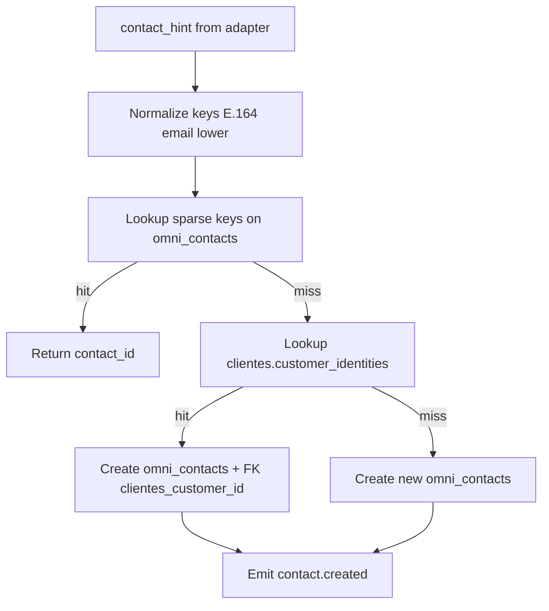

# 05 — Identity Resolution

**Program:** EXPORT_SEAL::OMNICRM_AUTONOMOUS_TRANSFORMATION_PROGRAM_V2  
**Date:** 2026-06-22  
**ADR:** [ADR-002](adrs/ADR-002-identity-resolution.md)

---

## 1. Objective

Resolve identifiers from **WhatsApp, MercadoLibre, Email, Instagram, Facebook** (and omnicrm-sync extension) into a **single Contact** (`omni_contacts`) suitable for unified inbox threading and deal attribution.

**Evidence:**
- Source: `docs/discovery/08-omni-gap-analysis.md` §Layer 3
- Section: PARTIAL — clientes schema exists; engine missing
- Reasoning: WA uses phone/chat_id; ML uses user id in Sheets; no cross-link at runtime

---

## 2. Resolution flow



---

## 3. Channel matching strategy

### 3.1 WhatsApp

| Input | Normalization | Lookup column |
|-------|---------------|---------------|
| `wa_phone`, `chat_id` | E.164 via libphonenumber-style strip | `wa_phone` |
| `chat_id` only | Extract phone from `@s.whatsapp.net` | `wa_phone` |

**integration_uuid:** `wa:+59899123456`

**Evidence:**
- Source: `server/index.js` L812–962 (WA webhook)
- Reasoning: Phone/chat_id primary WA identifiers today

### 3.2 MercadoLibre

| Input | Normalization | Lookup column |
|-------|---------------|---------------|
| `ml_user_id`, buyer id from webhook | Integer | `ml_user_id` |
| Nickname only | No auto-match — create with name hint | — |

**integration_uuid:** `ml:123456789`

**Evidence:**
- Source: `server/ml-crm-sync.js`, architecture review §5.3
- Reasoning: ML buyer id stable; nickname not unique

### 3.3 Email

| Input | Normalization | Lookup column |
|-------|---------------|---------------|
| `email` from ingest | lower(trim) | `email_normalized` UNIQUE sparse |
| `Message-ID` | Thread only — not contact key | conversation_hint |

**integration_uuid:** `email:sha256(lower(email))`

**Evidence:**
- Source: `docs/discovery/02-channel-map.md` §Email
- Section: ingest API only — PARTIAL

### 3.4 Instagram / Facebook

| Input | Normalization | Lookup column |
|-------|---------------|---------------|
| Meta PSID (future) | as-is | `meta_psid` |
| CRM row tag only (today) | Manual link — no auto | — |

**Status:** **ASSUMPTION_REQUIRED** — blocked on human gate cm-0 (Meta OAuth/webhooks).

**Evidence:**
- Source: `docs/discovery/02-channel-map.md` §Instagram/Facebook
- Section: surface.js filter only — 25/100

### 3.5 omnicrm-sync extension

| Input | Lookup column |
|-------|---------------|
| `chrome_ext_contact_id` | `chrome_ext_contact_id` |

**integration_uuid:** `ext:{id}`

---

## 4. Confidence model

Score 0.0–1.0 per match candidate:

| Signal | Weight |
|--------|--------|
| Exact sparse key match | 1.0 |
| clientes.customer_identities match | 0.95 |
| Email domain + name fuzzy match | 0.7 **ASSUMPTION_REQUIRED** |
| Same CRM sheet row link in properties | 0.85 |
| Name-only match | 0.3 — never auto-merge |

**Thresholds:**

| Confidence | Action |
|------------|--------|
| ≥ 0.95 | Auto-link or auto-merge |
| 0.70 – 0.94 | Link conversation; flag for review |
| < 0.70 | Create new contact |

---

## 5. Merge policy

When two contact records must unify (same phone + different ML id discovered later):

| Field | Winner |
|-------|--------|
| `name` | Non-empty; prefer most recent `updated_at` |
| `email` | Verified > unverified; log provenance |
| `ml_user_id` / `wa_phone` | Union onto **survivor** row |
| Loser row | `merged_into_contact_id = survivor.id`; read-only |

**Survivor selection:** Oldest `created_at` with most channel keys, unless admin override.

**Evidence:**
- Source: `docs/discovery/10-architecture-review.md` §2.4
- Section: Merge policy table

---

## 6. Conflict resolution

| Conflict | Resolution |
|----------|------------|
| Same email, different names | Keep both names in `properties.aliases`; display name = most recent |
| Same phone, different ML buyers | **Do not auto-merge** — review queue (likely shared phone) |
| Sheets row linked to two omni contacts | Sheets row wins single link; merge contacts first |
| clientes FK on both | Survivor retains FK; async merge in clientes module |

Use `clientes.customer_field_provenance` pattern for field-level audit.

---

## 7. Bridge to clientes.*

**Do not merge schemas.**

```sql
ALTER TABLE omni_contacts ADD COLUMN clientes_customer_id UUID
  REFERENCES clientes.customers(id) ON DELETE SET NULL;
```

**Resolution order:**

1. Sparse omni key lookup
2. `clientes.customer_identities (channel, external_id)`
3. Create omni_contacts; optional async job → create clientes.customers

---

## 8. Audit strategy

Every merge and create logs to:

- `omni_audit_log` (entity_type=contact, operation=merge|insert)
- Optional mirror to Sheets AUDIT_LOG tab for commercial visibility

Fields: `old_values`, `new_values`, `changed_by`, `change_reason`, `confidence`.

Event: `contact.merged` for downstream cache invalidation.

---

## 9. Rollback strategy

### Un-merge (admin)

1. Read audit `old_values` for loser contact
2. Set `merged_into_contact_id = NULL` on loser
3. Re-assign conversations if moved (audit trail guides)
4. Emit compensating event (internal — no public `contact.unmerged` v1)

### Prevent bad auto-merge

1. Disable auto-merge globally `OMNI_AUTO_MERGE=0`
2. Review queue UI at `/hub/admin/omni-merge-review` (Phase 3)

---

## 10. Current → target gap

| Capability | Current | Target |
|------------|---------|--------|
| WA phone lookup | wa_* only | omni_contacts.wa_phone |
| ML user lookup | Sheets embed | omni_contacts.ml_user_id |
| Cross-channel link | NOT_FOUND | IRE engine |
| Merge | NOT_FOUND | Soft-merge + audit |
| clientes bridge | Schema only | FK + async sync |

---

## References

- [03-domain-model.md](03-domain-model.md)
- [20260508000001_clientes_360_init.sql](../../supabase/migrations/) (clientes provenance)
- [10-architecture-review.md](../discovery/10-architecture-review.md) §2
