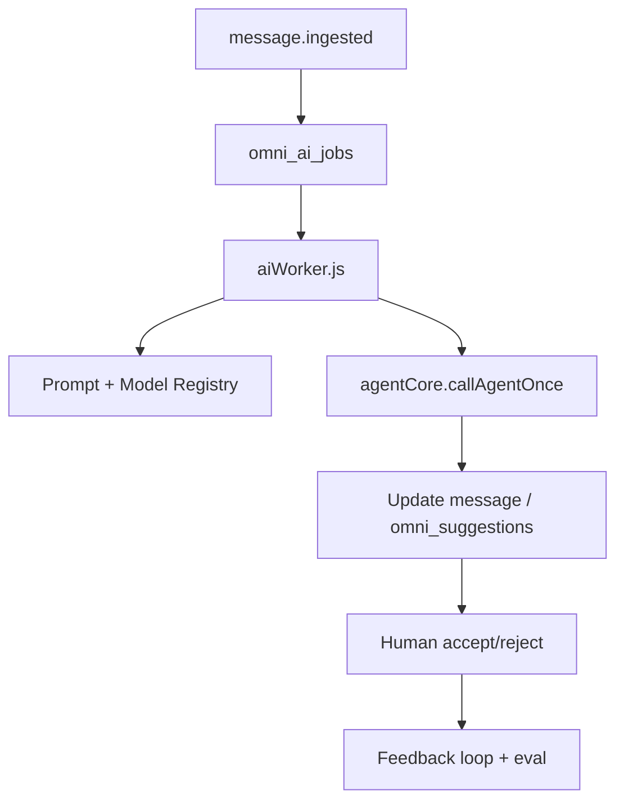

# 06 — AI Governance

**Program:** EXPORT_SEAL::OMNICRM_AUTONOMOUS_TRANSFORMATION_PROGRAM_V2  
**Date:** 2026-06-22  
**ADR:** [ADR-004](adrs/ADR-004-ai-governance.md)

---

## 1. Current state

| Component | Status | Gap |
|-----------|--------|-----|
| `agentCore.js` | IMPLEMENTED | Not omni-aware |
| RAG pgvector | PARTIAL (opt-in) | RAG_ENABLED=false default |
| suggest-response | IMPLEMENTED | Unauthenticated |
| waEnricher | IMPLEMENTED | WA-only taxonomy |
| mlAutoAnswer | IMPLEMENTED | Separate pipeline |

**Evidence:**
- Source: `docs/discovery/06-ai-map.md`
- Section: Architecture overview
- Reasoning: Shared brain exists; no central omni orchestrator

---

## 2. Target architecture



**Non-negotiable:** Reuse agentCore — no second provider chain.

---

## 3. Prompt Registry

### Schema (conceptual)

```sql
CREATE TABLE omni_prompt_registry (
  id UUID PRIMARY KEY,
  task_key VARCHAR(50) NOT NULL,  -- classify | suggest | extract_deal
  channel VARCHAR(20),            -- null = all channels
  version INT NOT NULL,
  system_prompt TEXT NOT NULL,
  user_template TEXT,
  enabled BOOLEAN DEFAULT false,
  created_at TIMESTAMPTZ DEFAULT now(),
  UNIQUE (task_key, channel, version)
);
```

### Versioning rules

- Only one `enabled=true` per (task_key, channel) at a time
- New version → shadow eval → flip enabled flag
- Immutable prompts — edit = new version row

### Channel-specific rules (from agentCore)

| Channel | Max length | Tone |
|---------|------------|------|
| ml | 350 chars | Professional, no markdown |
| wa | 800 chars | Friendly, light emoji |
| email | 2000 chars | Formal business Spanish |
| omnicrm | 800 chars | Default operator |

---

## 4. Model Registry

```sql
CREATE TABLE omni_model_registry (
  id UUID PRIMARY KEY,
  task_key VARCHAR(50) NOT NULL,
  provider VARCHAR(20) NOT NULL,  -- anthropic | openai | xai | google
  model_id VARCHAR(100) NOT NULL,
  version INT NOT NULL,
  max_tokens INT,
  temperature NUMERIC(3,2),
  enabled BOOLEAN DEFAULT false,
  cost_per_1k_input_usd NUMERIC(10,6),
  cost_per_1k_output_usd NUMERIC(10,6),
  UNIQUE (task_key, version)
);
```

Default chain preserved from agentCore: Claude → OpenAI → Grok → Gemini fallback.

---

## 5. AI Runs (`omni_ai_jobs` + run metadata)

Each job stores:

| Field | Purpose |
|-------|---------|
| `prompt_version` | Registry FK / version int |
| `model_version` | Registry FK / version int |
| `confidence` | 0–1 for classify/suggest |
| `latency_ms` | SLO tracking |
| `cost_usd` | FinOps attribution |
| `approval_state` | pending \| approved \| rejected \| auto_skipped |
| `human_feedback` | Operator correction text |
| `input_hash` | Replay detection |
| `output_json` | Structured extract_deal results |

---

## 6. Evaluation framework

### Offline eval (CI/nightly)

1. Golden set per channel: 50+ labeled messages **ASSUMPTION_REQUIRED** curated from ML corpus + WA samples
2. Metrics: classification accuracy, suggest BLEU/ROUGE-lite, extract_deal field F1
3. Compare prompt_version N vs N+1 — block flip if regression >5%

### Online eval

- Accept/reject rate by `model_version`
- Latency p95/p99 by channel
- Cost per accepted suggestion

### Tools

- Extend `npm run ml:ai-audit` pattern for omni golden set
- Promptfoo skill available: `.cursor/skills/promptfoo/`

---

## 7. Feedback loop

```
ai.suggestion.generated → operator UI
  → accept → ai.suggestion.accepted → optional trainingKB auto-learn
  → reject + feedback → ai.suggestion.rejected → prompt registry review queue
```

**Auto-learn:** Opt-in only (`autoLearnExtractor.js` pattern); never auto-publish to prod prompt without review.

---

## 8. Human-in-the-loop (HITL)

| Action | HITL required |
|--------|---------------|
| Display AI suggestion | No |
| Send suggestion as outbound | **Yes** — explicit click |
| Auto-send ML answer | **Yes** — existing approval + omni gate |
| Deal stage → closed_won | **Yes** |
| Classify-only | No |
| Create deal from extract | Review if confidence < 0.8 |

Aligns with CRM cockpit approval workflow (`mark-sent`, `send-approved`).

---

## 9. Safety gates

| Gate | Implementation |
|------|----------------|
| Prompt injection | Customer content in user role only; sanitize HTML; no tools on ingest |
| PII in logs | Redact phone/email in debug logs |
| Cost cap | Daily budget env `OMNI_AI_DAILY_BUDGET_USD`; pause jobs when exceeded |
| Rate limit | Per-channel jobs/min matching agentChat limits |
| Content policy | Block suggest for known spam category |
| Provider failover | agentCore chain — log which provider served |

---

## 10. Auditability and replay

- Every job immutable after `completed`
- Replay: admin re-queue job with same `input_hash` → compare outputs (eval mode)
- Audit export: JSON lines by date for compliance **ASSUMPTION_REQUIRED**

Internal endpoint:

```
POST /api/internal/omni/ai/run
Authorization: Bearer API_AUTH_TOKEN
{ job_type, message_id, channel, context, prompt_version?, model_version? }
```

Connector/extension must use this — never instantiate provider SDK directly.

---

## 11. Classification taxonomy (unified)

```
product | order | issue | inquiry | complaint | feedback | spam |
cotizacion | consulta_tecnica | objecion | follow_up | cierre | other
```

Map WA intents (`waEnricher.js` L12–17) → superset on `body_ai_category`.

---

## 12. Migration from current AI paths

| Current | Target |
|---------|--------|
| waEnricher classify | omni classify job |
| suggestResponse | omni suggest job |
| mlAutoAnswer | omni suggest + ML outbound adapter |
| agentChat | Unchanged (calculator surface) |

Feature flag `OMNI_AI_ORCHESTRATOR_ENABLED` gates new path; legacy runs in parallel until parity.

---

## References

- [06-ai-map.md](../discovery/06-ai-map.md)
- [agentCore.js](../../server/lib/agentCore.js)
- [04-event-model.md](04-event-model.md)
