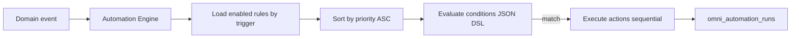

# 07 — Automation Engine

**Program:** EXPORT_SEAL::OMNICRM_AUTONOMOUS_TRANSFORMATION_PROGRAM_V2  
**Date:** 2026-06-22  
**ADR:** [ADR-005](adrs/ADR-005-automation-engine.md)

---

## 1. Current state

| System | Scope | Limitation |
|--------|-------|------------|
| `wa_rules` | WA Postgres | Channel silo |
| CRM cockpit approval | Sheets | Manual queue |
| ML auto-mode | `.ml-automode.json` | File-based, no audit |
| `clientes.automation_rules` | Schema | Not wired |

**Evidence:**
- Source: `docs/discovery/08-omni-gap-analysis.md` §Layer 6
- Reasoning: No cross-channel triggers

---

## 2. Target model: Trigger → Condition → Action



---

## 3. Schema

```sql
CREATE TABLE omni_automation_rules (
  id UUID PRIMARY KEY DEFAULT gen_random_uuid(),
  name TEXT NOT NULL,
  version INT NOT NULL DEFAULT 1,
  enabled BOOLEAN NOT NULL DEFAULT true,
  priority INT NOT NULL DEFAULT 100,
  trigger_event VARCHAR(50) NOT NULL,
  conditions JSONB NOT NULL DEFAULT '{}',
  actions JSONB NOT NULL DEFAULT '[]',
  requires_approval BOOLEAN DEFAULT false,
  created_by VARCHAR(255),
  created_at TIMESTAMPTZ NOT NULL DEFAULT now(),
  updated_at TIMESTAMPTZ NOT NULL DEFAULT now()
);

CREATE TABLE omni_automation_runs (
  id UUID PRIMARY KEY DEFAULT gen_random_uuid(),
  rule_id UUID NOT NULL REFERENCES omni_automation_rules(id),
  trigger_event_id UUID,
  idempotency_key VARCHAR(512) UNIQUE,
  status VARCHAR(20) NOT NULL DEFAULT 'running',
  actions_result JSONB,
  error TEXT,
  started_at TIMESTAMPTZ DEFAULT now(),
  completed_at TIMESTAMPTZ
);
```

---

## 4. Triggers (v1)

| trigger_event | Source events |
|---------------|---------------|
| `message.ingested` | New customer message |
| `conversation.status_changed` | Open/close/archive |
| `conversation.assigned` | Owner change |
| `deal.stage_changed` | Pipeline movement |
| `deal.created` | New opportunity |
| `ai.suggestion.accepted` | Operator accepted AI |

---

## 5. Conditions DSL (JSON)

```json
{
  "all": [
    { "field": "channel", "op": "eq", "value": "wa" },
    { "field": "body_ai_category", "op": "in", "value": ["cotizacion", "product"] },
    { "field": "conversation.priority", "op": "gte", "value": 2 },
    { "field": "contact.properties.vip", "op": "eq", "value": true }
  ],
  "any": [],
  "none": [
    { "field": "body_ai_category", "op": "eq", "value": "spam" }
  ]
}
```

**Operators:** eq, ne, in, nin, gte, lte, contains, matches (regex, admin-only)

Same spirit as `waRoutingRules` — reuse evaluator patterns from WA module.

---

## 6. Actions (v1)

| Action type | Params | Side effects |
|-------------|--------|--------------|
| `tag_conversation` | `{ tags: string[] }` | PATCH conversation.tags |
| `set_priority` | `{ priority: 0-3 }` | PATCH conversation |
| `assign_owner` | `{ owner_agent_id }` | Emit conversation.assigned |
| `enqueue_ai_job` | `{ job_type }` | Insert omni_ai_jobs |
| `create_deal` | `{ stage, title_template? }` | Insert omni_deals |
| `sync_crm_row` | `{ patch: { estado, monto } }` | Sheets via bmcDashboard helper |
| `webhook_outbound` | `{ url, payload_template }` | HMAC signed POST |
| `set_conversation_status` | `{ status }` | PATCH conversation |

**High-risk actions** (`sync_crm_row` with estado=Cerrado, auto outbound): set `requires_approval=true` → pending run until operator approves.

---

## 7. Versioning

- Edit rule → increment `version`; old version row retained with `enabled=false`
- Runs reference `rule_id` + `version` at execution time
- Rollback = re-enable previous version row

---

## 8. Simulation

```
POST /api/omni/automation/simulate
{
  "rule_id": "uuid",
  "sample_event": { "event_type": "message.ingested", "payload": { ... } }
}
→ { matched: true, actions_would_run: [...], no side effects }
```

Uses historical message snapshot from omni_messages for regression testing.

---

## 9. Rollback (execution)

- Failed action mid-sequence: log partial in `actions_result`; do not rollback DB changes from prior actions (compensating actions Phase 2)
- Disable rule immediately on error rate >10% / 1h

---

## 10. Approval workflow

1. Rule with `requires_approval=true` → run status `pending_approval`
2. Operator sees queue in `/hub/canales` or `/hub/admin/automation`
3. Approve → execute actions; Reject → status `rejected` + audit

---

## 11. Audit trail

- Every execution → `omni_automation_runs` + `automation.executed` event
- Admin CRUD on rules → `omni_audit_log`
- Sheets sync actions → CRM AUDIT_LOG tab mirror

---

## 12. Rule examples

### R1: Cotización on any channel → create deal

```json
{
  "name": "Cotización → deal lead",
  "trigger_event": "message.ingested",
  "conditions": {
    "all": [
      { "field": "sender", "op": "eq", "value": "customer" },
      { "field": "body_ai_category", "op": "eq", "value": "cotizacion" }
    ]
  },
  "actions": [
    { "type": "create_deal", "params": { "stage": "lead" } },
    { "type": "enqueue_ai_job", "params": { "job_type": "extract_deal" } },
    { "type": "set_priority", "params": { "priority": 2 } }
  ]
}
```

### R2: WA VIP tag from Sheets row

```json
{
  "name": "CRM VIP → tag conversation",
  "trigger_event": "message.ingested",
  "conditions": {
    "all": [
      { "field": "channel", "op": "eq", "value": "wa" },
      { "field": "side_effects.crm_sheet_row", "op": "exists" }
    ]
  },
  "actions": [
    { "type": "tag_conversation", "params": { "tags": ["crm_linked"] } }
  ]
}
```

### R3: ML unanswered 24h → priority bump

```json
{
  "trigger_event": "conversation.status_changed",
  "conditions": {
    "all": [
      { "field": "channel", "op": "eq", "value": "ml" },
      { "field": "status", "op": "eq", "value": "open" },
      { "field": "conversation.age_hours", "op": "gte", "value": 24 }
    ]
  },
  "actions": [
    { "type": "set_priority", "params": { "priority": 3 } }
  ]
}
```

---

## 13. Migration from wa_rules

One-time SQL:

```sql
INSERT INTO omni_automation_rules (name, trigger_event, conditions, actions, priority)
SELECT name, 'message.ingested',
  jsonb_build_object('all', jsonb_build_array(
    jsonb_build_object('field','channel','op','eq','value','wa')
  )) || conditions,
  actions, priority
FROM wa_rules WHERE enabled = true;
```

Parity test: same WA message triggers same outcome on wa_rules vs omni rules.

---

## References

- [04-event-model.md](04-event-model.md)
- [wa-package/migrations/015_wa_rules.sql](../../wa-package/migrations/)
- [10-architecture-review.md](../discovery/10-architecture-review.md) §7
