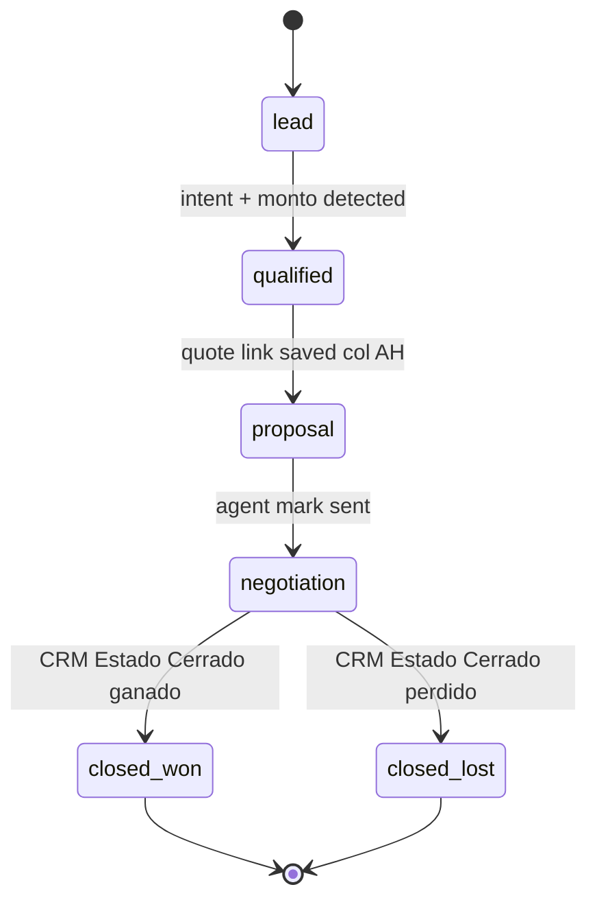
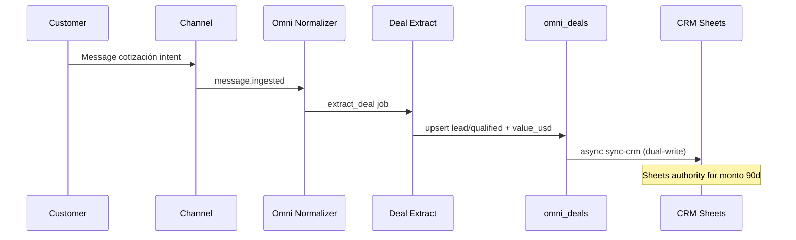

# 08 — Deal Intelligence

**Program:** EXPORT_SEAL::OMNICRM_AUTONOMOUS_TRANSFORMATION_PROGRAM_V2  
**Date:** 2026-06-22  
**ADR:** [ADR-006](adrs/ADR-006-deal-intelligence.md)

---

## 1. Current state

Deal data lives in **CRM_Operativo** Google Sheets:

| Column (conceptual) | Purpose |
|-------------------|---------|
| Monto estimado USD | Pipeline value |
| Estado | Commercial stage |
| Fecha próxima acción | Follow-up |
| Col AH | Quote link (calculadora URL) |
| Origen | Channel source (ML/WA/Email) |

No Postgres `omni_deals` at runtime.

**Evidence:**
- Source: `docs/discovery/08-omni-gap-analysis.md` §Layer 7
- Section: PARTIAL — Sheets columns only
- Reasoning: omni_deals NOT_FOUND

---

## 2. Target: omni_deals operational pipeline



---

## 3. Opportunity detection

### Signals (message.ingested)

| Signal | Detection | Confidence |
|--------|-----------|------------|
| Category `cotizacion` | AI classify | High |
| Keywords: presupuesto, cotizar, m2, panel | Heuristic fallback | Medium |
| Quote link in thread | Metadata | High |
| ML item question on priced listing | ML metadata | Medium |

### Actions

1. If no open deal on conversation → `create_deal` stage=lead
2. Enqueue `extract_deal` AI job
3. Automation may tag conversation `sales_intent`

---

## 4. Deal creation

**Automatic (AI + automation):**

```json
{
  "title": "Cotización techo — {contact.name}",
  "value_usd": null,
  "stage": "lead",
  "source_channel": "wa",
  "source_conversation_id": "uuid",
  "owner_agent_id": null
}
```

**Manual:** Operator creates from thread sidebar → POST `/api/omni/deals`

**Link to Sheets:** Async `sync_crm_row` creates/updates CRM row; store `properties.crm.row`.

---

## 5. Pipeline management

### API

```
GET  /api/omni/deals?stage=&owner=&channel=&cursor=
GET  /api/omni/deals/:id
PATCH /api/omni/deals/:id  { stage, value_usd, owner_agent_id, expected_close_date }
POST /api/omni/deals/:id/sync-crm
```

### UI

Kanban at `/hub/canales/deals` (Phase 4, flag `VITE_OMNI_DEALS=1`).

Columns map to stages; cards show contact, value, channel badge, legacy CRM link.

### RBAC

`requireGrant('canales', 'read')` list; `write` for PATCH; `admin` for delete/force sync.

---

## 6. Forecasting

**v1 (rule-based):**

- Weighted pipeline: `sum(value_usd * stage_probability)` 
- Stage probabilities **ASSUMPTION_REQUIRED**: lead 10%, qualified 25%, proposal 50%, negotiation 75%

**v2 (ML on history):**

- Train on closed_won time-series when ≥100 deals in omni_deals

### Metrics exported

- Pipeline value by stage
- Win rate by source_channel
- Average days in stage

---

## 7. Next Best Action (NBA)

Generated on deal card + conversation sidebar:

| Context | NBA |
|---------|-----|
| lead + cotización message | "Generar cotización en calculadora" |
| proposal + no send 48h | "Enviar presupuesto al cliente" |
| negotiation + ML | "Responder pregunta ML pendiente" |
| any + Fecha próxima acción past | "Follow-up vencido" |

Implementation: agentCore structured output job `nba` (Phase 2) or rule table v1.

---

## 8. Revenue attribution

Every deal records:

- `source_channel` — originating channel
- `source_conversation_id` — thread that created intent
- `properties.attribution` — UTM, ML item_id, WA campaign **optional**

Multi-touch: **ASSUMPTION_REQUIRED** Phase 3 — first-touch only in v1.

Closed_won syncs monto to Sheets → finance reporting unchanged.

---

## 9. Conversation → Deal lifecycle



---

## 10. Sheets bridge and conflict policy

```json
// omni_deals.properties
{
  "crm": {
    "sheet_id": "env:BMC_SHEET_ID",
    "row": 142,
    "last_sync_at": "2026-06-22T12:00:00Z",
    "last_sync_direction": "omni_to_sheets | sheets_to_omni"
  }
}
```

**Rule:** When `OMNI_DEALS_SHEETS_AUTHORITY=1` (default 90 days):

- Sheets `Monto estimado USD` wins on reconcile
- omni stage may lead Sheets `Estado` but finance confirm for closed_won

**Nightly reconcile:** `npm run omni:reconcile-deals` → JSON report in `.runtime/`

---

## 11. Integration with calculator

Col AH quote link already connects CRM row → calculadora state.

Deal Intelligence adds:

- Detect when quote saved → transition to `proposal`
- Read quote total from link metadata **ASSUMPTION_REQUIRED** via calc API

**Evidence:**
- Source: `docs/team/panelsim/CRM-OPERATIVO-COCKPIT.md`
- Reasoning: col AH quote-link is existing integration point

---

## References

- [omni-hub-schema.sql](../team/omni-hub-schema.sql) §omni_deals
- [07-automation-engine.md](07-automation-engine.md)
- [10-architecture-review.md](../discovery/10-architecture-review.md) §8
