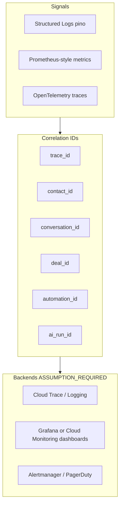

# 10 — Observability Model

**Program:** EXPORT_SEAL::OMNICRM_AUTONOMOUS_TRANSFORMATION_PROGRAM_V2  
**Date:** 2026-06-22  
**ADR:** [ADR-008](adrs/ADR-008-observability.md)

---

## 1. Current state

| Capability | Status |
|------------|--------|
| pino structured logs | IMPLEMENTED |
| pino-http request logging | IMPLEMENTED |
| WA metrics endpoint | IMPLEMENTED |
| PDF metrics | IMPLEMENTED |
| Centralized APM/tracing | NOT_FOUND |
| Omni dashboards | NOT_FOUND |
| Vercel cron reconcile | NOT_FOUND |

**Evidence:**
- Source: `docs/discovery/09-scorecard.md` §Observability
- Reasoning: 50/100 — functional logging without distributed trace

---

## 2. Target pillars



Apply **OpenTelemetry** semantic conventions for messaging systems.

---

## 3. Mandatory identifiers

Every omni code path MUST propagate:

| ID | Where set | Propagation |
|----|-----------|-------------|
| `trace_id` | HTTP middleware / webhook ingress | `X-Trace-Id` header, all log lines |
| `contact_id` | After identity resolution | Logs, spans, metrics labels (low cardinality avoid) |
| `conversation_id` | After resolveConversation | Same |
| `deal_id` | Deal operations | Same |
| `automation_id` | Rule execution (run_id) | Same |
| `ai_run_id` | omni_ai_jobs.id | Same |

**Implementation:**

```javascript
// Conceptual — pino child logger
req.log = logger.child({
  trace_id: req.headers['x-trace-id'] || generateTraceId(),
  ...(contact_id && { contact_id }),
});
```

---

## 4. Logging

### Log levels

| Level | Use |
|-------|-----|
| error | Failed ingest, dead AI jobs, automation DLQ |
| warn | Dedup duplicate, reconcile drift, SSRF block |
| info | Successful ingest, deal stage change, send |
| debug | Condition eval details (staging only) |

### Redaction

- Redact: `body` full text in prod logs (use `body_preview` 80 chars)
- Redact: phone, email in trace attributes
- Never log: JWT, API keys, webhook secrets

### Existing integration

Extend pino in `server/index.js` — no replacement.

---

## 5. Metrics

### Endpoint

`GET /api/omni/metrics` — Prometheus text format or JSON

Require: service token or admin grant.

### Core metrics

| Metric | Type | Labels |
|--------|------|--------|
| `omni_ingest_total` | counter | channel, source, duplicate |
| `omni_ingest_duration_seconds` | histogram | channel |
| `omni_ai_jobs_pending` | gauge | job_type |
| `omni_ai_jobs_completed_total` | counter | job_type, status |
| `omni_ai_cost_usd_total` | counter | channel, model |
| `omni_automation_executions_total` | counter | rule_id, status |
| `omni_deals_by_stage` | gauge | stage |
| `omni_reconcile_drift_total` | counter | entity_type |
| `omni_suggestions_accept_rate` | gauge | channel |

Reuse pattern from `GET /api/wa/metrics`.

---

## 6. Tracing

### Spans (OTel)

| Span name | Parent |
|-----------|--------|
| `omni.webhook.receive` | HTTP root |
| `omni.normalize` | webhook |
| `omni.identity.resolve` | normalize |
| `omni.db.persist` | normalize |
| `omni.event.emit` | normalize |
| `omni.ai.job` | event |
| `omni.automation.run` | event |
| `omni.outbound.send` | reply API |

### Sampling

- Production: 10% head-based sampling **ASSUMPTION_REQUIRED**
- Staging: 100%
- Always sample errors

### Export

`OTEL_ENABLED=1` → GCP Cloud Trace exporter on Cloud Run.

Fallback: pino trace_id only when OTel disabled.

---

## 7. Alerts

| Alert | Condition | Severity |
|-------|-----------|----------|
| Ingest error rate | >1% over 5m | critical |
| AI job backlog | pending > 500 for 10m | warning |
| AI daily cost | > budget 90% | warning |
| Reconcile drift | >10 rows nightly | warning |
| Automation failure rate | >10% per rule 1h | warning |
| Duplicate ingest spike | >3x baseline | info |
| omni health down | `/api/omni/health` fail 3x | critical |

Delivery: **ASSUMPTION_REQUIRED** email/Telegram existing BMC ops channels.

---

## 8. Dashboards

### Dashboard 1: Omni Ingest Health

- Ingest rate by channel
- Duplicate rate
- p95 ingest latency
- Error log tail

### Dashboard 2: AI Operations

- Jobs pending/completed
- Cost USD/day
- Accept rate
- Latency by model_version

### Dashboard 3: Pipeline

- Deals by stage
- Win rate trend
- Sheets sync failures

### Dashboard 4: Automation

- Executions by rule
- Failure heatmap
- Pending approvals

---

## 9. Incident detection

1. **Automated:** Alert rules above + `npm run smoke:prod` extension for omni health
2. **Synthetic:** Cron POST test ingest with HMAC every 15m **ASSUMPTION_REQUIRED**
3. **Manual:** Operator reports via existing bug report flow

### Incident response runbook

See [20-operational-readiness.md](20-operational-readiness.md) §Incident.

---

## 10. SLO targets (target state)

| SLO | Target |
|-----|--------|
| Ingest availability | 99.9% |
| Ingest p95 latency | <500ms (excl. AI) |
| Suggest job p95 | <8s |
| Data parity WA omni | >99.99% message count |

Error budget policy: freeze feature flags flip if ingest SLO breached 7d.

---

## 11. Rollout

| Phase | Deliverable |
|-------|-------------|
| H3 PR | `/api/omni/metrics` + structured IDs in normalizer |
| +2 weeks | OTel SDK + Cloud Trace |
| +4 weeks | Dashboards + alerts |

---

## References

- [10-architecture-review.md](../discovery/10-architecture-review.md) Track H3
- [server/routes/wa.js](../../server/routes/wa.js) metrics pattern
- OpenTelemetry docs: messaging semantic conventions
