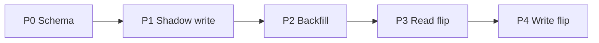

# 12 — Migration Strategy

**Program:** EXPORT_SEAL::OMNICRM_AUTONOMOUS_TRANSFORMATION_PROGRAM_V2  
**Date:** 2026-06-22  
**ADR:** [ADR-009](adrs/ADR-009-migration-strategy.md)

---

## 1. Universal migration pattern

Every channel follows **shadow → backfill → read flip → write flip** with feature flags and explicit validation gates. **Zero downtime** — legacy paths remain until parity proven.

---

## 2. Global feature flags

| Flag | Phase | Rollback |
|------|-------|----------|
| `OMNI_WA_SHADOW_WRITE` | P1 | Set 0 |
| `OMNI_ML_SHADOW_WRITE` | P1 | Set 0 |
| `OMNI_EMAIL_SHADOW_WRITE` | P1 | Set 0 |
| `VITE_OMNI_INBOX` | P3 | Set 0 |
| `VITE_OMNI_DEALS` | P3+ | Set 0 |
| `OMNI_WA_WRITE_FLIP` | P4 | Re-enable wa_messages insert |
| `OMNI_DEALS_SHEETS_AUTHORITY` | Always until flip | Keep 1 |

---

## 3. Phase 0 — Schema foundation

| Attribute | Value |
|-----------|-------|
| **Goal** | DDL live; omniDb health; no traffic |
| **Changes** | `server/migrations/omni/001_core.sql`; `npm run omni:migrate`; `omniDb.js`; `GET /api/omni/health` |
| **Dependencies** | DATABASE_URL; DBA review |
| **Validation** | Migration idempotent; health 200; gate:local green |
| **Rollback** | Drop schema (no prod data) |
| **Success** | Tables exist; zero runtime writes |
| **Failure** | Migration error → block P1 |

**Evidence:** Track A1 in [13-pr-roadmap.md](13-pr-roadmap.md)

---

## 4. WhatsApp migration (P0–P4)

### What migrates vs stays

| Data | → omni | Stays wa_* |
|------|--------|------------|
| Messages | Yes | Mirror optional P1–P3 |
| Conversations | Yes | wa_conversations until P4 |
| AI suggestions | No | wa_suggestions |
| Quotes | No | wa_quotes |
| Operators/SLA/settings | No | WA Pro |

### P1 — Shadow write

| Attribute | Value |
|-----------|-------|
| **Goal** | Every new WA message also in omni |
| **Changes** | `adapters/waWebhook.js`; hook `index.js` webhook; `OMNI_WA_SHADOW_WRITE=1` |
| **Dependencies** | A4 normalizer |
| **Validation** | Staging 24h: omni count tracks wa count |
| **Rollback** | Flag off |
| **Success** | No webhook errors; dedup works |
| **Failure** | Error rate >0.1% → rollback P1 |

### P2 — Backfill

| Attribute | Value |
|-----------|-------|
| **Goal** | Historical wa_messages in omni |
| **Changes** | `scripts/omni-backfill-wa.mjs` `--dry-run` then execute |
| **Dependencies** | P1 stable |
| **Validation** | B4 parity test; sample 50 chats |
| **Rollback** | Delete `source=wa_backfill` rows |
| **Success** | Count ±0 duplicates |
| **Failure** | Hash mismatch >1% → fix adapter before P3 |

### P3 — Read flip

| Attribute | Value |
|-----------|-------|
| **Goal** | Omni inbox UI reads omni for WA channel |
| **Dependencies** | D1/D2 APIs; G1 UI; B4 pass |
| **Validation** | Admin users `VITE_OMNI_INBOX=1`; operator UAT |
| **Rollback** | Flag off → Sheets/wa API |
| **Success** | Thread view matches WA cockpit content |
| **Failure** | Missing messages → rollback read |

### P4 — Write flip

| Attribute | Value |
|-----------|-------|
| **Goal** | Stop inserting wa_messages (archive read-only) |
| **Dependencies** | 30d parity; P3 stable |
| **Validation** | wa_messages insert count = 0; omni authoritative |
| **Rollback** | Re-enable dual insert |
| **Success** | WA Pro still works via omni read + wa ops tables |
| **Failure** | Quote runner broken → immediate rollback |

---

## 5. MercadoLibre migration (M1–M4)

**Asymmetry:** No Postgres message store — primary queue is Sheets via `ml-crm-sync.js`.

### M1 — Shadow on sync/webhook

| Attribute | Value |
|-----------|-------|
| **Goal** | New ML questions emit OmniInboundEvent |
| **Changes** | Hook post-`syncMLCRM`; `OMNI_ML_SHADOW_WRITE=1` |
| **Validation** | New unanswered questions appear in omni |
| **Rollback** | Flag off |

### M2 — Backfill CRM rows

| Attribute | Value |
|-----------|-------|
| **Goal** | Historical ML rows from CRM_Operativo |
| **Changes** | `scripts/omni-backfill-ml-crm.mjs` |
| **Validation** | Open ML queue count ≈ omni ml conversations open |
| **Rollback** | Delete backfill-tagged rows |

### M3 — Read flip ML inbox

| Attribute | Value |
|-----------|-------|
| **Goal** | Omni list replaces ml-queue for UI |
| **Dependencies** | D1, G1 |
| **Rollback** | VITE_OMNI_INBOX off |

### M4 — Dual-write maintained

| Attribute | Value |
|-----------|-------|
| **Goal** | Sheets sync continues; omni is read-optimized |
| **Note** | Do NOT stop ml-crm-sync — Sheets stays commercial queue backup |

**Outbound:** Keep send-approved → ML Answers API; mirror agent message to omni on success (C3).

---

## 6. Email migration (E1–E3)

| Phase | Action |
|-------|--------|
| E1 | Hook `POST /api/crm/ingest-email` → emailIngest adapter |
| E2 | Backfill from Sheets rows origen=Email |
| E3 | Show in omni inbox (no dedicated `/hub/email` v1) |

**Evidence:** Email 25/100 — ingest only today.

---

## 7. CRM_Operativo (Sheets) migration

**Sheets is NOT replaced** in 12-week program.

| Phase | Omni ↔ Sheets behavior |
|-------|------------------------|
| Now | Sheets authoritative unified queue at `/hub/canales` |
| P1–P2 | Dual-write CRM row refs in `conversation.properties.legacy` |
| P3 | Omni read primary; Sheets sync on deal/status changes |
| 90d+ | Optional `OMNI_DEALS_SHEETS_AUTHORITY=0` after finance sign-off |

Column mapping: [google-sheets-module/MAPPER-PRECISO](../../google-sheets-module/MAPPER-PRECISO-PLANILLAS-CODIGO.md)

---

## 8. Instagram / Facebook (conditional)

**Blocked:** Human gate cm-0 (Meta OAuth).

When unblocked:
1. Meta Graph webhooks → normalizer adapters
2. Shadow write IG/FB channel
3. No migration until Meta E2E doc exists

**Evidence:** sync-all skips IG/FB — `bmcDashboard.js` L3535–3545

---

## 9. Validation gates (summary)

Before any **read flip**:

- [ ] Parity test pass (B4 / ML equivalent)
- [ ] 24h shadow write error rate <0.1%
- [ ] Reconcile job drift <10 rows
- [ ] Operator UAT sign-off
- [ ] Rollback runbook tested in staging
- [ ] gate:local + test:contracts green

Before **write flip**:

- [ ] 30d read flip stable
- [ ] No P0 bugs in omni inbox
- [ ] WA Pro quotes/SLA verified unchanged

---

## 10. Zero-downtime guarantees

1. Webhook handlers always return 200 after legacy write succeeds (omni failure must not block Meta/ML)
2. Feature flags default OFF in production
3. Read flip per operator cohort before global
4. Database migrations additive only (no DROP COLUMN in P0–P4)

---

## 11. Timeline (12 weeks)

| Week | Milestone |
|------|-----------|
| 1 | P0 complete — schema + normalizer dev |
| 2 | WA P1 shadow + H1 security |
| 3 | WA backfill + D1 list API |
| 4 | ML M1–M2 + D2 messages API |
| 5 | E1 AI classify + G1 inbox list |
| 6 | D3 reply WA E2E |
| 7 | ML mirror + E3 automation |
| 8 | F1 deals CRUD |
| 9 | F3 Sheets deal sync + G3 sidebar |
| 10 | D4 extension ingest |
| 11 | G4 kanban |
| 12 | H2–H3 + WA P3 read flip (admin cohort) |

See [18-evolution-roadmap.md](18-evolution-roadmap.md) for Phase 5+.

---

## References

- [10-architecture-review.md](../discovery/10-architecture-review.md) §4–5, §11
- [13-pr-roadmap.md](13-pr-roadmap.md)
