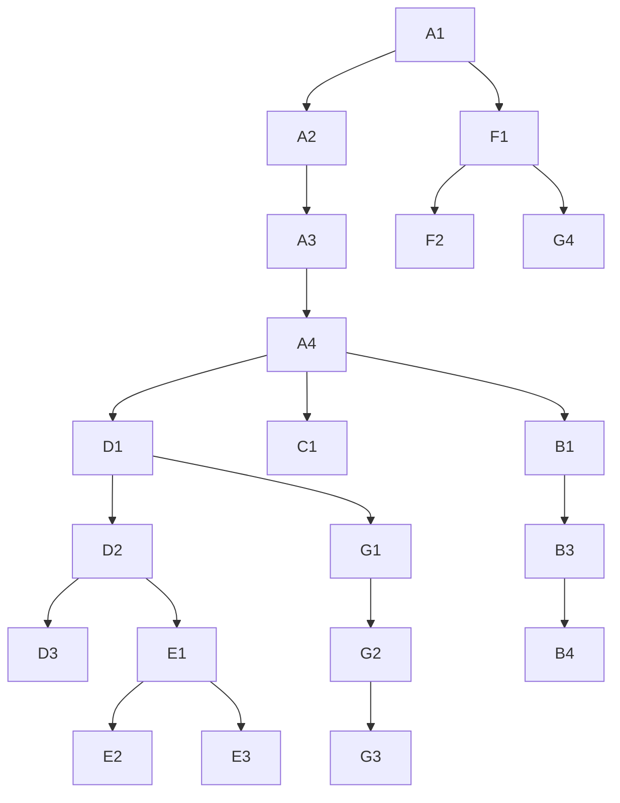

# 13 — PR Roadmap

**Program:** EXPORT_SEAL::OMNICRM_AUTONOMOUS_TRANSFORMATION_PROGRAM_V2  
**Date:** 2026-06-22  
**Constraint:** ≤500 LOC per PR; feature-flagged; `npm run gate:local` green

---

## Track overview

| Track | Focus | PRs |
|-------|-------|-----|
| A | Foundation | A1–A4 |
| B | WhatsApp | B1–B4 |
| C | MercadoLibre | C1–C3 |
| D | Omni API | D1–D4 |
| E | AI + Automation | E1–E4 |
| F | Deals | F1–F3 |
| G | Workspace UI | G1–G4 |
| H | Hardening | H1–H3 |

**Suggested order:** See [12-migration-strategy.md](12-migration-strategy.md) §11

---

## Track A — Foundation (P0)

### A1: `feat(omni): postgres migrations package`

| Field | Value |
|-------|-------|
| **Objective** | Apply omni DDL to Postgres |
| **Files** | `server/migrations/omni/001_core.sql`, `002_ai_automation.sql`, `003_dedup_outbox.sql`; `scripts/omni-migrate.mjs`; `package.json` script `omni:migrate`; `server/lib/omni/omniDb.js` |
| **Dependencies** | — |
| **Tests** | Migration idempotent; `node tests/omniDb.test.js` |
| **Rollback** | Drop schema migration down |
| **Risk** | Medium — DDL on shared DATABASE_URL |

### A2: `feat(omni): inbound event types + validator`

| Field | Value |
|-------|-------|
| **Objective** | Zod-validated OmniInboundEvent |
| **Files** | `server/lib/omni/types.js`, `tests/omniTypes.test.js` |
| **Dependencies** | A1 |
| **Tests** | Unit: valid/invalid payloads per channel |
| **Rollback** | Remove module; no runtime wired |
| **Risk** | Low |

### A3: `feat(omni): identity resolution engine`

| Field | Value |
|-------|-------|
| **Objective** | resolveContact + resolveConversation + soft-merge |
| **Files** | `server/lib/omni/identity/resolveContact.js`, `resolveConversation.js`, `tests/omniIdentity.test.js` |
| **Dependencies** | A1, A2 |
| **Tests** | Unit + integration with test DB |
| **Rollback** | Feature not called |
| **Risk** | High — merge logic |

### A4: `feat(omni): normalizer core`

| Field | Value |
|-------|-------|
| **Objective** | `normalizeAndPersist()` + dedup + health route |
| **Files** | `server/lib/omni/normalizer.js`, `server/routes/omni.js`, mount in `server/index.js`, `GET /api/omni/health` |
| **Dependencies** | A3 |
| **Tests** | Integration ingest; duplicate returns same id |
| **Rollback** | Unmount route |
| **Risk** | High — core path |

---

## Track B — WhatsApp

### B1: `feat(omni): wa webhook adapter shadow write`

| Field | Value |
|-------|-------|
| **Objective** | Dual-write WA webhook to omni |
| **Files** | `server/lib/omni/adapters/waWebhook.js`, hook `server/index.js` L812+, `server/config.js` flag |
| **Dependencies** | A4 |
| **Tests** | Fixture replay; shadow off = no omni rows |
| **Rollback** | `OMNI_WA_SHADOW_WRITE=0` |
| **Risk** | High — production webhook |

### B2: `feat(omni): wa extension ingest adapter`

| Field | Value |
|-------|-------|
| **Objective** | Extension batch ingest → omni |
| **Files** | `server/lib/omni/adapters/waExtension.js`, hook `server/routes/wa.js` ingest |
| **Dependencies** | B1 |
| **Tests** | Extension payload fixture |
| **Rollback** | Flag off |
| **Risk** | Medium |

### B3: `chore(omni): backfill wa_messages → omni`

| Field | Value |
|-------|-------|
| **Objective** | Historical WA data in omni |
| **Files** | `scripts/omni-backfill-wa.mjs`, `.runtime/omni-backfill-wa-report.json` |
| **Dependencies** | B1 |
| **Tests** | Dry-run mode; count report |
| **Rollback** | Delete backfill source tag rows |
| **Risk** | Medium — batch load |

### B4: `test(omni): wa parity verification`

| Field | Value |
|-------|-------|
| **Objective** | Automated parity gate before read flip |
| **Files** | `tests/omniWaParity.test.js`, `npm run test:omni:parity` |
| **Dependencies** | B3 |
| **Tests** | Self — count + hash sample |
| **Rollback** | N/A |
| **Risk** | Low |

---

## Track C — MercadoLibre

### C1: `feat(omni): ml webhook + sync adapter`

| Field | Value |
|-------|-------|
| **Objective** | ML events → omni after syncMLCRM |
| **Files** | `server/lib/omni/adapters/mlWebhook.js`, `mlCrmRow.js`, hooks in `server/ml-crm-sync.js` / `index.js` |
| **Dependencies** | A4 |
| **Tests** | ML notification fixture |
| **Rollback** | `OMNI_ML_SHADOW_WRITE=0` |
| **Risk** | High |

### C2: `chore(omni): backfill CRM ML rows`

| Field | Value |
|-------|-------|
| **Objective** | Sheets ML history → omni |
| **Files** | `scripts/omni-backfill-ml-crm.mjs` |
| **Dependencies** | C1 |
| **Tests** | Dry-run; requires Sheets creds staging |
| **Rollback** | Delete backfill rows |
| **Risk** | Medium |

### C3: `feat(omni): ml outbound message mirror`

| Field | Value |
|-------|-------|
| **Objective** | send-approved → omni_messages agent row |
| **Files** | Hook `server/routes/bmcDashboard.js` send-approved L3191–3228 |
| **Dependencies** | C1 |
| **Tests** | Mock send success → omni row |
| **Rollback** | Remove hook |
| **Risk** | Low |

---

## Track D — Omni API

### D1: `feat(omni): conversations list API`

| Field | Value |
|-------|-------|
| **Objective** | Paginated inbox list |
| **Files** | `server/routes/omni.js` GET conversations, `requireGrant canales:read` |
| **Dependencies** | A4 |
| **Tests** | test:api route test; contract validator |
| **Rollback** | Route 404 |
| **Risk** | Medium |

### D2: `feat(omni): messages + mark read API`

| Field | Value |
|-------|-------|
| **Objective** | Thread fetch + read receipts |
| **Files** | `server/routes/omni.js` GET messages, PATCH read |
| **Dependencies** | D1 |
| **Tests** | API tests |
| **Rollback** | Remove routes |
| **Risk** | Low |

### D3: `feat(omni): reply API`

| Field | Value |
|-------|-------|
| **Objective** | Unified reply → WA/ML outbound adapters |
| **Files** | `server/routes/omni.js` POST reply, `server/lib/omni/outbound/` |
| **Dependencies** | D2, B1, C1 |
| **Tests** | Mock outbound; integration staging |
| **Rollback** | Disable route |
| **Risk** | High — customer-facing send |

### D4: `feat(omni): unified-crm-ingest webhook`

| Field | Value |
|-------|-------|
| **Objective** | Chrome extension ingest endpoint |
| **Files** | `server/lib/omni/adapters/unifiedCrmIngest.js`, route + HMAC, docs |
| **Dependencies** | A4 |
| **Tests** | HMAC fixture |
| **Rollback** | Unmount route |
| **Risk** | Medium |

---

## Track E — AI + Automation

### E1: `feat(omni): ai job queue + worker`

| Field | Value |
|-------|-------|
| **Objective** | omni_ai_jobs + classify worker |
| **Files** | Migration 002, `server/lib/omni/orchestrator/aiWorker.js`, hook `index.js` worker |
| **Dependencies** | D2 |
| **Tests** | Job lifecycle unit |
| **Rollback** | `OMNI_AI_ORCHESTRATOR_ENABLED=0` |
| **Risk** | Medium — cost |

### E2: `feat(omni): suggest job on ingest`

| Field | Value |
|-------|-------|
| **Objective** | agentCore suggest → omni_suggestions |
| **Files** | `aiWorker.js` extend, suggestion store |
| **Dependencies** | E1 |
| **Tests** | Mock agentCore |
| **Rollback** | Disable suggest job type |
| **Risk** | Medium |

### E3: `feat(omni): automation rules engine v1`

| Field | Value |
|-------|-------|
| **Objective** | Rules CRUD + evaluator + wa_rules migration script |
| **Files** | `server/lib/omni/orchestrator/automationEngine.js`, admin routes |
| **Dependencies** | E1 |
| **Tests** | Condition DSL tests |
| **Rollback** | Disable engine flag |
| **Risk** | High |

### E4: `feat(omni): internal ai endpoint`

| Field | Value |
|-------|-------|
| **Objective** | IP-3 connector endpoint |
| **Files** | `POST /api/internal/omni/ai/run`, auth middleware |
| **Dependencies** | E1 |
| **Tests** | Token auth test |
| **Rollback** | Remove route |
| **Risk** | Medium |

---

## Track F — Deals

### F1: `feat(omni): deals CRUD API`

| Field | Value |
|-------|-------|
| **Objective** | Pipeline CRUD + stage validation |
| **Files** | `server/routes/omni.js` deals routes |
| **Dependencies** | A1 |
| **Tests** | Stage machine unit |
| **Rollback** | Remove routes |
| **Risk** | Low |

### F2: `feat(omni): deal extract job`

| Field | Value |
|-------|-------|
| **Objective** | AI extract cotización → omni_deals |
| **Files** | `dealExtractor.js`, aiWorker job type |
| **Dependencies** | E1, F1 |
| **Tests** | Structured output fixture |
| **Rollback** | Disable job type |
| **Risk** | Medium |

### F3: `feat(omni): deals ↔ Sheets sync`

| Field | Value |
|-------|-------|
| **Objective** | sync-crm dual-write monto/estado |
| **Files** | `server/lib/omni/deals/syncCrm.js`, `scripts/omni-reconcile-deals.mjs` |
| **Dependencies** | F1 |
| **Tests** | Mock Sheets; reconcile dry-run |
| **Rollback** | Disable sync |
| **Risk** | High — money |

---

## Track G — Workspace UI

### G1: `feat(ui): omni conversation list panel`

| Field | Value |
|-------|-------|
| **Objective** | Inbox list when VITE_OMNI_INBOX=1 |
| **Files** | `src/components/hub/canales/panels/OmniInboxPanel.jsx`, `useOmniConversations.js` |
| **Dependencies** | D1 |
| **Tests** | lint; manual QA |
| **Rollback** | Flag off |
| **Risk** | Medium |

### G2: `feat(ui): omni thread view + reply`

| Field | Value |
|-------|-------|
| **Objective** | Thread + composer |
| **Files** | `OmniThreadPanel.jsx`, `useOmniMessages.js`, reply wired D3 |
| **Dependencies** | G1, D2, D3 |
| **Tests** | lint; E2E manual |
| **Rollback** | Flag off |
| **Risk** | High |

### G3: `feat(ui): contact sidebar + legacy links`

| Field | Value |
|-------|-------|
| **Objective** | Contact 360 + links to /hub/wa + CRM row |
| **Files** | `OmniContactSidebar.jsx` |
| **Dependencies** | G2 |
| **Tests** | lint |
| **Rollback** | Hide sidebar |
| **Risk** | Low |

### G4: `feat(ui): deals pipeline kanban`

| Field | Value |
|-------|-------|
| **Objective** | `/hub/canales/deals` tab |
| **Files** | `OmniDealsKanban.jsx`, route in App.jsx |
| **Dependencies** | F1, G1 |
| **Tests** | lint |
| **Rollback** | VITE_OMNI_DEALS=0 |
| **Risk** | Medium |

---

## Track H — Hardening

### H1: `fix(security): auth on suggest-response`

| Field | Value |
|-------|-------|
| **Objective** | Close open AI endpoint |
| **Files** | `server/routes/bmcDashboard.js` L2311+, middleware |
| **Dependencies** | — (parallel week 1) |
| **Tests** | test:api 401 without token |
| **Rollback** | Emergency flag |
| **Risk** | Medium — breaking integrators |

### H2: `feat(omni): audit log triggers`

| Field | Value |
|-------|-------|
| **Objective** | DB triggers → omni_audit_log |
| **Files** | `server/migrations/omni/004_audit_triggers.sql` |
| **Dependencies** | A1 |
| **Tests** | Insert/update fires audit |
| **Rollback** | Drop triggers |
| **Risk** | Low |

### H3: `feat(omni): metrics + smoke`

| Field | Value |
|-------|-------|
| **Objective** | Observability endpoint + smoke script |
| **Files** | `GET /api/omni/metrics`, `scripts/smoke-omni.mjs`, trace_id in normalizer |
| **Dependencies** | D1 |
| **Tests** | smoke script in CI staging |
| **Rollback** | Remove endpoint |
| **Risk** | Low |

---

## Cross-track dependencies (critical path)

**WAVE model:** After WAVE 1 (A1+A2+A3 with `normalizeAndPersist`), WAVE 2 opens four parallel squads (WA B1–B4, ML C1–C3, Email E1–E3, Omni API D1–D3). See [21-wave-execution.md](21-wave-execution.md).

---

## References

- [10-architecture-review.md](../discovery/10-architecture-review.md) §10
- [11-testing-strategy.md](11-testing-strategy.md)
