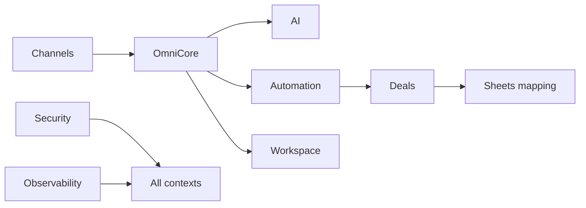

# 16 — Domain Ownership

**Program:** EXPORT_SEAL::OMNICRM_AUTONOMOUS_TRANSFORMATION_PROGRAM_V2  
**Date:** 2026-06-22

---

## 1. RACI legend

| Role | Meaning |
|------|---------|
| **R** | Responsible — does the work |
| **A** | Accountable — final decision |
| **C** | Consulted |
| **I** | Informed |

---

## 2. Bounded context ownership

| Context | Accountable | Responsible (agent/role) | Consulted | Informed |
|---------|-------------|--------------------------|-----------|----------|
| **Channels** | Platform Architect | bmc-mercadolibre-api, WA module owner | Security, Networks | All operators |
| **Omni Core** | Platform Architect | bmc-orchestrator, Platform eng | CRM Architect, Sheets mapping | Docs sync |
| **Identity Resolution** | CRM Architect | bmc-sheets-mapping, calc specialist | clientes 360 owner | Workspace |
| **AI** | AI Systems Architect | bmc-panelin-chat, bmc-calc-specialist | Security, Fiscal (cost) | Operators |
| **Automation** | CRM Architect | bmc-orchestrator | AI, Deals | Admin |
| **Deals** | CRM Architect | bmc-sheets-mapping, bmc-calc-specialist | Finance/Matias | Operators |
| **Workspace** | Frontend lead | bmc-dashboard-ia-reviewer, calc specialist | Omni Core API owner | Operators |
| **Security** | Security Architect | bmc-security | All track leads | Leadership |
| **Observability** | Platform Architect | bmc-deployment, cloudrun-diagnostics | All track leads | On-call |

**Evidence:**
- Source: `docs/team/PROJECT-TEAM-FULL-COVERAGE.md` §2
- Reasoning: Map existing BMC agent roles to omni bounded contexts

---

## 3. Track ownership (PR roadmap)

| Track | Accountable | Primary R |
|-------|-------------|-----------|
| A Foundation | Platform Architect | Platform eng |
| B WhatsApp | Channels lead | WA specialist + Platform |
| C MercadoLibre | Channels lead | bmc-mercadolibre-api |
| D Omni API | Platform Architect | bmc-api-contract owner |
| E AI + Automation | AI Systems Architect | bmc-panelin-chat |
| F Deals | CRM Architect | bmc-sheets-mapping |
| G Workspace UI | Frontend lead | calculo-especialist / hub dev |
| H Hardening | Security Architect | bmc-security |

---

## 4. Escalation matrix

| Issue type | L1 | L2 | L3 |
|------------|----|----|-----|
| Production webhook failure | Channels on-call | Platform Architect | Matias |
| PII / security incident | bmc-security | Security Architect | Matias |
| Sheets/money mismatch | bmc-sheets-mapping | CRM Architect + Finance | Matias |
| AI cost anomaly | bmc-panelin-chat | AI Architect | Matias |
| Migration rollback | Track owner | TPM + Platform Architect | Matias |
| Human gate cm-0 Meta | Matias | — | — |

---

## 5. Decision rights

| Decision | Accountable |
|----------|-------------|
| ADR approval | Platform Architect + Matias |
| Read/write flip flags | TPM + Track owner |
| Sheets authority flip | Matias + Finance |
| wacrm fork (deferred) | Platform Architect per ADR-010 gate |
| Build vs buy change | Matias |

---

## 6. Cross-team interfaces

**Interface contracts:**
- Channels → Omni: `OmniInboundEvent` schema ([03-domain-model.md](03-domain-model.md))
- Omni → Sheets: MAPPER-PRECISO column mapping
- AI → Workspace: `omni_suggestions` DTO
- All → Security: requireGrant matrix ([09-security-model.md](09-security-model.md))

---

## 7. Meeting cadence **ASSUMPTION_REQUIRED**

| Cadence | Participants | Purpose |
|---------|--------------|---------|
| Daily standup | Track R owners | Blockers |
| Weekly omni sync | A owners + TPM | Phase gate |
| Biweekly | Matias | ADR/flip decisions |
| Post-PR | docs-sync agent | PROJECT-STATE update |

---

## References

- [PROJECT-TEAM-FULL-COVERAGE.md](../team/PROJECT-TEAM-FULL-COVERAGE.md)
- [13-pr-roadmap.md](13-pr-roadmap.md)
- [02-target-state.md](02-target-state.md) §3
