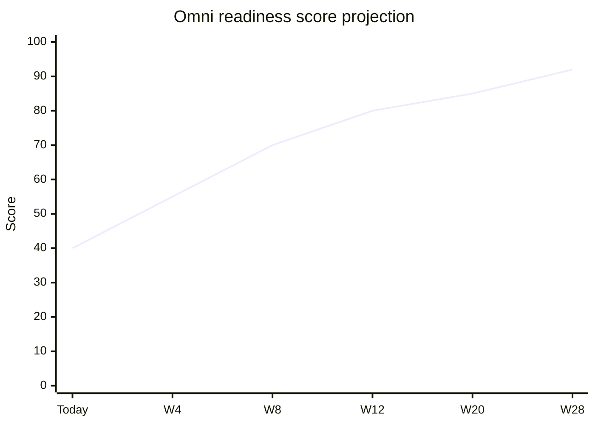

# 18 — Evolution Roadmap

**Program:** EXPORT_SEAL::OMNICRM_AUTONOMOUS_TRANSFORMATION_PROGRAM_V2  
**Date:** 2026-06-22

---

## 1. Horizon overview

| Horizon | Duration | Focus |
|---------|----------|-------|
| **H1 Core** | Weeks 1–12 | Foundation, WA/ML omni, inbox UI, deals v1 |
| **H2 Channels** | Weeks 13–20 | Email full stack, ML Manager completion |
| **H3 Intelligence** | Weeks 21–28 | Advanced AI, forecasting, NBA |
| **H4 Platform** | Weeks 29–40 | Meta IG/FB, scale, optional wacrm UX borrow |
| **H5 Maturity** | Ongoing | Sheets authority flip, multi-tenant **N/A** |

Core 12-week plan: [12-migration-strategy.md](12-migration-strategy.md), [13-pr-roadmap.md](13-pr-roadmap.md)

---

## 2. Phase 1 — Foundation (Weeks 1–4)

**Goal:** Schema live; normalizer accepts events; WA shadow write in staging.

| Deliverable | Exit criteria |
|-------------|---------------|
| Tracks A complete | Health 200; ingest in dev |
| H1 security | suggest-response authenticated |
| B1 WA shadow | 24h staging dual-write |

**Evidence baseline:** OmniHub 25/100 → target 45/100

---

## 3. Phase 2 — Channels in Omni (Weeks 5–8)

**Goal:** ML in omni; reply E2E WA; list/messages API production.

| Deliverable | Exit criteria |
|-------------|---------------|
| C1–C3 ML | ML conversations in omni |
| D1–D3 API | Contract tests pass |
| G1 inbox list | Admin cohort UAT |

**Channel scores target:** ML stays 75+ integrated; Email 25→50

---

## 4. Phase 3 — Intelligence (Weeks 9–12)

**Goal:** AI orchestrator, automation v1, deals pipeline, kanban.

| Deliverable | Exit criteria |
|-------------|---------------|
| E1–E3 | Classify + suggest on ingest |
| F1–F3 | Deals + Sheets sync |
| G2–G4 | Thread reply + kanban |
| H2–H3 | Audit + metrics |

**AI score target:** 50 → 75

---

## 5. Phase 4 — Email & ML Manager (Weeks 13–20)

| Initiative | Description |
|------------|-------------|
| Email E1–E3 | Full omni email channel |
| SMTP outbound | Operator reply via email adapter **ASSUMPTION_REQUIRED** |
| ML Manager backend | Missing APIs from ML-MANAGER-ROADMAP |
| IMAP in-repo | Optional — evaluate vs sibling repo bridge |

**Dependency:** Email infrastructure decision (Gmail API vs IMAP)

---

## 6. Phase 5 — Meta channels (Weeks 21–28, conditional)

**Gate:** Human cm-0 complete per [HUMAN-GATES-ONE-BY-ONE.md](../team/HUMAN-GATES-ONE-BY-ONE.md)

| Initiative | Description |
|------------|-------------|
| Meta Graph webhooks | IG/FB ingest adapters |
| Send path | Messenger API outbound |
| omni channel CHECK | instagram, facebook active |

**Until gate:** Keep surface.js filter-only; document as PARTIAL in scorecard

---

## 7. Phase 6 — Scale & maturity (Weeks 29–40)

| Initiative | Description |
|------------|-------------|
| omni_outbox | Async bus if >500 msg/min **ASSUMPTION_REQUIRED** |
| Read replicas | Postgres read scaling **ASSUMPTION_REQUIRED** |
| OTel full | Dashboards + alerting production |
| Sheets authority flip | `OMNI_DEALS_SHEETS_AUTHORITY=0` after finance sign-off |
| WA write flip P4 | wa_messages read-only archive |
| wacrm UX borrow | Only if G2 parity fails — ADR-010 gate |

---

## 8. Capability maturity curve

Scores align with [15-success-metrics.md](15-success-metrics.md).

---

## 9. Decision gates

| Gate | Week | Decision |
|------|------|----------|
| G1 | 4 | Proceed WA backfill? |
| G2 | 8 | Admin read flip WA? |
| G3 | 12 | Enable AI suggest for all operators? |
| G4 | 16 | Email outbound provider |
| G5 | 20 | Meta investment (cm-0) |
| G6 | 28 | Sheets authority flip |
| G7 | 6 | wacrm fork vs omni thread (ADR-010) |

---

## 10. Out of scope (explicit)

- Multi-tenant SaaS omni for external customers
- Replace Google Sheets finanzas module
- Replace calculator / agentChat
- HubSpot/Salesforce migration (see [19-build-vs-buy.md](19-build-vs-buy.md))

---

## References

- [OMNI-HUB-ARCHITECTURE.md](../team/OMNI-HUB-ARCHITECTURE.md) §5 Phased Roadmap
- [ML-MANAGER-ROADMAP.md](../team/ML-MANAGER-ROADMAP.md)
- [18-evolution-roadmap.md](18-evolution-roadmap.md)
