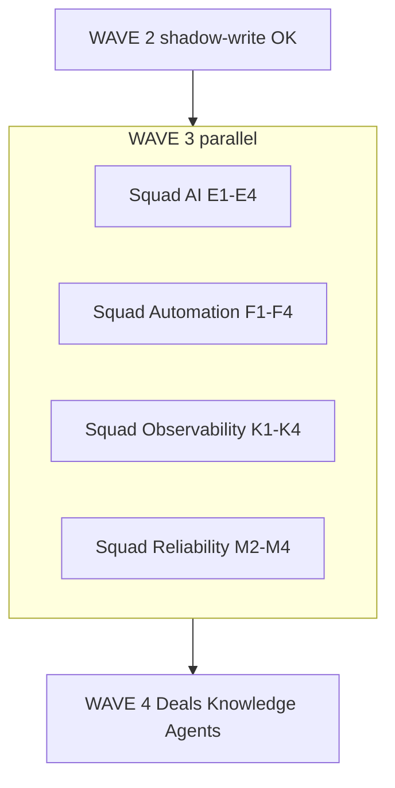

# WAVE 3 — Intelligence + Platform

**Program:** EXPORT_SEAL::OMNICRM_AUTONOMOUS_TRANSFORMATION_PROGRAM_V2  
**Date:** 2026-06-22  
**Risk:** Green — four squads parallel after channel shadow-write

---

## Entry gate (from WAVE 2)

| Channel | Flag | Evidence |
|---------|------|----------|
| WA | `OMNI_WA_SHADOW_WRITE=true` (or `=1`) | B1 staging 24h, error &lt;0.1% |
| ML | `OMNI_ML_SHADOW_WRITE=true` (or `=1`) | C1 live (migration M1) |
| Email | `OMNI_EMAIL_SHADOW_WRITE=true` (or `=1`) | D1 hook on `/api/crm/ingest-email` |

Also required: WAVE 1 foundation (`normalizeAndPersist`, identity, dedup), `npm run gate:local` green.

---

## Parallel squads

| Squad | Items | Doc |
|-------|-------|-----|
| **AI** | E1–E4 | [squad-ai.md](squad-ai.md) |
| **Automation** | F1–F4 | [squad-automation.md](squad-automation.md) |
| **Observability** | K1–K4 | [squad-observability.md](squad-observability.md) |
| **Reliability** | M2–M4 | [squad-reliability.md](squad-reliability.md) |

---

## PR roadmap mapping

| WAVE 3 | PR roadmap | ADR |
|--------|------------|-----|
| E1–E4 | Track E | ADR-004 |
| F1–F4 | Track E3 + 07-automation-engine | ADR-005 |
| K1–K4 | Track H2–H3 | ADR-008 |
| M2–M4 | C2–C3 + migration M2–M4 | ADR-009 |

Note: PR roadmap Track **F** (Deals) maps to **WAVE 4 Squad Deals G**.

---

## Coordination points

1. **Migration 002** — single PR: `002_ai_automation.sql` before parallel workers.
2. **normalizer.js** — K1 trace_id + event emit: one integrator PR or ordered merge.
3. **Feature flags** — all default OFF in production.

---

## Exit gate → WAVE 4

Run: `npm run wave3:exit-gate` (staging, flags on)

- [ ] E1 + E2: classify + suggest on ingest (staging)
- [ ] K2: `GET /api/omni/metrics` → 200
- [ ] M3: `npm run test:omni:ml-parity` green
- [ ] F2: automation eval without &gt;10% error rate
- [ ] Runbooks RB-OMNI-001/003 exercised in staging

Then open WAVE 4: Squad Deals (G), Knowledge (H), Agents (I).

---

## Commands

| Command | Purpose |
|---------|---------|
| `npm run omni:migrate` | Apply 001 + 002 DDL |
| `npm run smoke:omni` | K4 health + metrics smoke |
| `npm run wave3:exit-gate` | Exit checklist JSON |
| `npm run omni:reconcile-channels` | M4 drift report |
| `npm run omni:backfill-ml-crm` | M2 ML backfill |

---

## References

- [21-wave-execution.md](../21-wave-execution.md)
- [12-migration-strategy.md](../12-migration-strategy.md)
- [13-pr-roadmap.md](../13-pr-roadmap.md)
