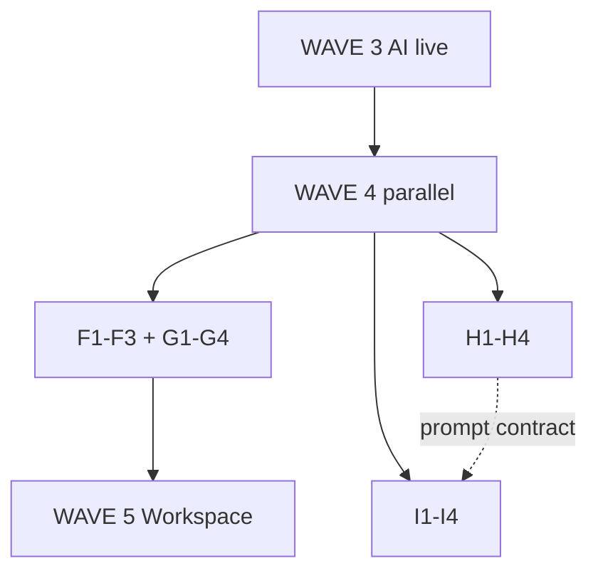

# WAVE 4 — Deals + Knowledge + Agents (paralelo)

**Program:** EXPORT_SEAL::OMNICRM_AUTONOMOUS_TRANSFORMATION_PROGRAM_V2  
**Date:** 2026-06-22  
**Risk:** Yellow — Knowledge and Agents share AI stack

---

## Entry gate (from WAVE 3)

| Check | Evidence |
|-------|----------|
| E1 live | `OMNI_AI_ORCHESTRATOR_ENABLED=1`, `omni_ai_jobs` with completed rows |
| D1–D3 | `/api/omni/conversations`, messages, reply green |
| `npm run wave3:exit-gate` | `ready_for_wave4: true` |

```bash
npm run omni:migrate   # applies 001 + 002 + 003
npm run wave3:exit-gate
```

---

## Parallel squads

| Squad | Items | Doc |
|-------|-------|-----|
| **Deals** | F1–F3 + G1–G4 | [squad-deals.md](./squad-deals.md) |
| **Knowledge** | H1–H4 | [squad-knowledge.md](./squad-knowledge.md) |
| **Agents** | I1–I4 | [squad-agents.md](./squad-agents.md) |



---

## AI coordination (yellow risk)

| job_type | Owner | Consumer |
|----------|-------|----------|
| `classify` | Agents I2 | G2 badge |
| `suggest` | Agents I2 | G2 composer |
| `extract_deal` | Deals F2 | aiWorker |
| `embed` | Knowledge H2 | RAG |

**Merge serial rule:** one PR at a time on `agentCore.js` / `aiWorker.js`.

---

## Exit gate → WAVE 5

```bash
npm run wave4:exit-gate
```

Manual staging: HITL E2E, deals reconcile drift &lt; 10, eval report.

Then open **WAVE 5** — Workspace J1–J7.

---

## Commands

| Command | Purpose |
|---------|---------|
| `npm run omni:migrate` | Apply 001–003 DDL |
| `npm run omni:reconcile-deals` | F3 drift report |
| `npm run wave4:exit-gate` | Exit checklist JSON |
